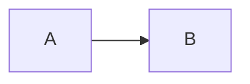

# AI Engineering Handbook

**Python → ML → LLMs → RAG → Agents → Agentic AI → Production**

A free, open, interactive learning platform: **82 lessons across 29 phases**, taking a reader
from zero Python to building and operating production-grade agentic AI systems.

Every lesson has runnable code, real architecture diagrams, exercises with worked solutions,
and measured results rather than hand-waving. No sign-up wall, no ads, no paid tier.

Runs locally with one command, and deploys free — see [DEPLOY.md](DEPLOY.md).

---

## Quick start

```bash
npm install
npm run dev
```

Open <http://localhost:3000>.

Progress tracking works immediately (stored in the browser). Google sign-in is optional and
needs five minutes of setup — see below.

---

## What is in it

| Track | Phases | Lessons |
| --- | --- | --- |
| Getting started | 0 | 5 |
| Python | 1–2 | 21 |
| Data | 3–5 | 7 |
| Machine learning | 6–7 | 5 |
| AI & deep learning | 8–9 | 4 |
| LLM engineering | 10–11 | 5 |
| RAG | 12–13 | 4 |
| Agents | 14–15 | 3 |
| Frameworks | 16–18 | 5 |
| Production | 19–25 | 8 |
| Capstone projects | 26 | 5 |
| Multi-agent labs | 28 | 6 |
| Reference & maps | 27 | 4 |

Every lesson follows the same structure: why it matters, a mental model, core concepts,
syntax, minimal example, real-world example, common mistakes, debugging, best practices,
security and performance notes, a hands-on exercise with a worked solution, a challenge,
interview questions, a quiz, a cheat sheet, and a summary.

Framework code is written against **LangChain 1.4**, **LangGraph 1.2** and **CrewAI 1.15**,
with the Anthropic Python SDK for direct model calls. Versions are stated in the lessons
because these APIs change often.

---

## Features

- **Sidebar navigation** grouped by track, with per-phase progress rings and completion
  checkboxes
- **Progress tracking** in `localStorage`, synced to disk per account when signed in
- **Search** across every lesson (`⌘K` / `Ctrl+K`, or `/`)
- **Mermaid diagrams** rendered inline, re-themed on dark/light switch
- **Interactive quizzes** with explanations
- **Copy buttons** on every code block
- **Collapsible solutions** so exercises are not spoiled
- **On-this-page** table of contents with scroll-spy
- **Prerequisites, key concepts and next lesson** in a context panel
- **Dark and light themes**, remembered per browser
- **Reading time and difficulty** per lesson
- **Bookmarks** and a progress dashboard

---

## Google (Gmail) sign-in

Sign-in is **optional**. Without it, progress is stored in the browser only. With it,
progress is stored per account in `.data/progress/` on this machine, so it survives across
browsers and profiles.

### 1. Create an OAuth client

1. Open the [Google Cloud Console](https://console.cloud.google.com/) and select or create a
   project.
2. **APIs & Services → OAuth consent screen**
   - User type: **External** (or **Internal** for a Workspace-only app)
   - Fill in the app name and support email
   - Scopes: the defaults (`openid`, `email`, `profile`) are enough
   - Add your own Google account under **Test users** while the app is in testing
3. **APIs & Services → Credentials → Create credentials → OAuth client ID**
   - Application type: **Web application**
   - Authorised JavaScript origin: `http://localhost:3000`
   - Authorised redirect URI: `http://localhost:3000/api/auth/callback/google`
4. Copy the **Client ID** and **Client secret**.

### 2. Configure the app

`.env.local` was generated on first setup with a random `AUTH_SECRET`. Add the two Google
values to it:

```bash
AUTH_SECRET=<already generated - leave it>
NEXTAUTH_URL=http://localhost:3000

GOOGLE_CLIENT_ID=<your client id>.apps.googleusercontent.com
GOOGLE_CLIENT_SECRET=<your client secret>

# optional: restrict sign-in to one Workspace domain
ALLOWED_EMAIL_DOMAIN=

PROGRESS_DIR=.data/progress
```

Restart the dev server. The **Sign in with Google** button will now complete the OAuth flow;
before you add credentials it shows setup instructions instead of failing.

To generate a fresh secret:

```bash
node -e "console.log(require('crypto').randomBytes(32).toString('base64'))"
```

### What is stored

| Data | Where | Notes |
| --- | --- | --- |
| Completed lessons, bookmarks | `.data/progress/<sha256 of email>.json` | filenames are hashed |
| Session | an encrypted JWT cookie | signed with `AUTH_SECRET` |
| Name, email, avatar | the session cookie only | never written to disk |

`.data/` and `.env.local` are gitignored. Nothing leaves the machine except the OAuth
handshake with Google.

---

## Commands

```bash
npm run dev              # development server (port 3000)
npm run build            # production build
npm start                # serve the production build
npm run typecheck        # tsc --noEmit
npm run check:content    # lint the markdown: frontmatter, quizzes, fences, callouts
npm run verify           # content + types + build
```

---

## Adding or editing lessons

Lessons are markdown files in `content/<phase-id>/<slug>.md`. Adding a file is all that is
needed — it is picked up automatically, ordered by its `order` field.

```markdown
---
title: Your Lesson Title
order: 3
difficulty: Intermediate        # Beginner | Intermediate | Advanced | Expert | Production | Architect
duration: 15                    # minutes
badges: ["Hands-on"]            # Start here | Hands-on | Read once, refer often | Project | Reference | Deep dive | Theory | Security
summary: "One sentence for the lesson card and search results."
prereqs: ["A previous lesson title"]
keyConcepts: ["concept", "another"]
---

## Why this matters
...
```

:::warning A frontmatter value containing `": "` must be quoted, or YAML drops the whole
block. `npm run check:content` catches this.
:::

### Authoring features

````markdown
```python title="src/app/main.py"     ← filename chip above the code block
def main(): ...
```



```quiz                                ← rendered as an interactive quiz
[
  {
    "question": "Which is correct?",
    "options": ["A", "B"],
    "answer": 1,
    "explanation": "Why B is correct."
  }
]
```

:::note Optional title                 ← callout
Body text, rendered as markdown.
:::

:::solution Show solution              ← collapsed by default
The worked answer.
:::
````

Callout kinds: `note` `tip` `info` `warning` `danger` `mistake` `exercise` `challenge`
`interview` `production` `security` `performance`. Collapsible kinds: `solution` `details`
`answer`.

Run `npm run check:content` after editing — it validates frontmatter, quiz JSON, code fences
and callout balance.

### Adding a phase

Add an entry to `PHASES` in [`lib/curriculum.ts`](lib/curriculum.ts) and create the matching
folder under `content/`. Phases with no lessons are hidden automatically.

---

## Project layout

```text
.
├── app/
│   ├── layout.tsx                  shell, theme bootstrap, providers
│   ├── page.tsx                    home
│   ├── roadmap/                    dependency map and phase timeline
│   ├── progress/                   progress dashboard
│   ├── signin/                     Google sign-in (and setup help)
│   ├── learn/[phaseId]/            phase index
│   ├── learn/[phaseId]/[slug]/     lesson page
│   └── api/
│       ├── auth/[...nextauth]/     Auth.js handlers
│       ├── progress/               per-account progress read/write
│       └── search/                 lazy-loaded search index
├── components/                     sidebar, top bar, search, quizzes, article body
├── content/                        82 markdown lessons across 29 phase folders
├── lib/
│   ├── curriculum.ts               phases, groups, difficulty styles
│   ├── content.ts                  markdown discovery, nav tree, search index
│   ├── markdown.ts                 renderer: highlighting, callouts, mermaid, quizzes
│   └── progress-store.ts           server-side progress files
├── scripts/check-content.mjs       content linter
└── auth.ts                         Auth.js configuration
```

---

## Stack

Next.js 15 (App Router) · React 19 · TypeScript · Tailwind 3 · Auth.js (next-auth 5) ·
markdown-it · highlight.js · Mermaid 12 · Zod.

No database. Content is markdown on disk; progress is JSON files per account.

---

## Notes

- Progress is per browser until you sign in; signing in merges the local progress with the
  stored copy.
- The search index is fetched once, the first time the palette is opened.
- Diagrams re-render when the theme changes.
- `.data/` holds progress files and can be deleted safely — it only resets progress.

---

## Deploying

See **[DEPLOY.md](DEPLOY.md)** for a step-by-step guide to putting this online for free on
Vercel + Neon Postgres, including publishing the Google OAuth consent screen so anyone can
sign in.

In production the app stores progress in Postgres (`DATABASE_URL`); with that variable unset
it falls back to JSON files on disk, which is what makes local development need no setup.
User identities are never stored — the database key is a SHA-256 hash of the email address.

---

## Contributing

Lessons are plain markdown in [`content/`](content/). To add or fix one:

1. Edit or create `content/<phase-id>/<slug>.md` (frontmatter format above).
2. Run `npm run verify` — content linter, typecheck and a production build.
3. Open a pull request.

Corrections to code that no longer matches a framework's current API are especially welcome;
lessons state the version they were written against.

---

## Licence

Dual-licensed, because code and prose want different terms:

| What | Licence |
| --- | --- |
| Application code (everything outside `content/`) | [MIT](LICENSE) |
| Lesson content (`content/`) | [CC BY-SA 4.0](LICENSE-CONTENT) |

You may use, adapt and redistribute both — including commercially — provided you give credit
and share adapted lesson content under the same licence.
