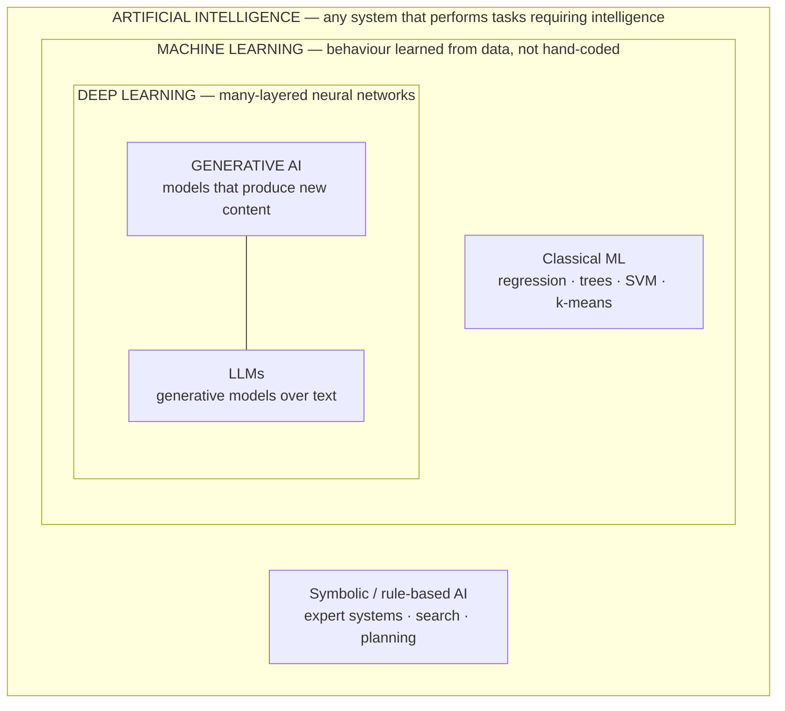
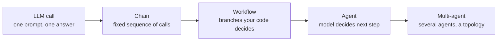

## Why this matters

These terms are nested, not synonymous. Using them loosely leads to real engineering
mistakes: reaching for a language model when logistic regression is the correct tool,
calling a two-step chain an "agent" and then wondering why it needs a supervisor, or
promising a stakeholder "AI" when what you will deliver is a rules engine.

## Mental Model

They are concentric, with generative AI as a *capability* that cuts across the inner rings.



## Core Concepts

### Artificial Intelligence

The broadest term: any technique that makes a machine do something we would call
intelligent. A chess engine doing minimax search is AI. A 1980s expert system of
`if`-rules for diagnosing infections is AI. No learning is required.

### Machine Learning

A subset of AI in which behaviour is **learned from examples** rather than programmed.
You supply data and a loss function; the algorithm finds parameters that minimise the loss.

- **Supervised**: learn a mapping from inputs to known labels (spam / not spam, house price).
- **Unsupervised**: find structure with no labels (customer segments, anomalies).
- **Reinforcement**: learn a policy from rewards received by acting in an environment.

Classical ML — linear and logistic regression, decision trees, random forests, gradient
boosting, SVMs, k-means — is still the correct answer for most tabular business problems.
It is fast, cheap, interpretable and deterministic. Phases 6–7 cover it properly.

### Deep Learning

A subset of ML using neural networks with many layers. Its superpower is **representation
learning**: instead of you engineering features ("length of the email", "number of
capitals"), the network learns useful features itself from raw-ish input — pixels,
waveforms, tokens. This is what unlocked vision, speech and language. It costs data and
compute, and gives up interpretability. Phase 9.

### Generative AI

Models that produce new content rather than a label or a number. Instead of learning
`P(label | input)`, a generative model learns the distribution of the data itself and can
sample from it: text, images, audio, video, code.

| | Discriminative (classical ML, classifiers) | Generative |
| --- | --- | --- |
| Learns | boundary between classes | the data distribution |
| Outputs | label, score, number | new content |
| Example | "is this email spam?" | "write a reply to this email" |
| Evaluation | accuracy, F1, AUC | faithfulness, helpfulness, human/LLM judgement |

### Large Language Models

Generative models over sequences of tokens, built on the transformer architecture, trained
on enormous text corpora to predict the next token, then aligned to follow instructions.
Their surprising property is **generality**: one model does translation, summarisation,
extraction, classification and code generation with no task-specific training — you just
describe the task. Phase 10.

### RAG — Retrieval-Augmented Generation

A model only knows what was in its training data and what you put in the prompt. RAG is
the pattern of **searching your own data at query time and inserting the results into the
prompt**, so answers are grounded in current, private, verifiable sources.

```text
question → search your documents → put the best chunks in the prompt → answer + citations
```

It is the single highest-value pattern in applied AI. Phases 12–13.

### Agents and Agentic AI

An **agent** is a loop in which the model chooses actions ("tools") and sees their results,
repeating until a goal is satisfied. The defining feature is that *the model decides the
control flow* — which step comes next is not fixed in your code.

**Agentic AI** describes systems built from that primitive: planning, memory, reflection,
self-correction, and several specialised agents collaborating.



Move right only when the problem forces you to. Each step right adds capability and
subtracts predictability, speed and budget control. Phases 14–15, 23.

## Real-World Example

One business question, four legitimate solutions at four levels:

> "Which of last month's 20,000 support tickets should we escalate?"

| Approach | Technique | When it's right |
| --- | --- | --- |
| Rules | `if "outage" in text or priority == "P1"` | Criteria are known, stable, auditable |
| Classical ML | TF-IDF + logistic regression on 5,000 labelled tickets | You have labels; you need fast, cheap, explainable scoring |
| Deep learning | Fine-tuned transformer classifier | Labels exist, language is subtle, volume justifies the effort |
| Generative AI | LLM with a rubric in the prompt, returning structured JSON | Few or no labels, criteria change often, you need a rationale |

A strong AI engineer can argue for any of these — and will often ship the rules-plus-LLM
hybrid: rules catch the obvious 70%, the model handles the ambiguous remainder, and the
model's decisions are sampled and reviewed to build the labelled set that lets you train
the cheap classifier later.

## Common Mistakes

:::mistake Vocabulary errors that cost real money
- **"We need AI" when you need a query.** If a SQL `GROUP BY` answers it, use SQL.
- **Calling every LLM call an agent.** If your code decides every step, it is a workflow.
  Say so — it sets correct expectations about latency, cost and reliability.
- **Assuming an LLM "knows" your data.** It does not. Without retrieval it is guessing
  from training data with a cut-off date.
- **Assuming fine-tuning is the fix for wrong facts.** Fine-tuning teaches *form and
  behaviour*; retrieval supplies *facts*. Reaching for fine-tuning to fix hallucinated
  policy details is the classic expensive mistake.
:::

## Best Practices

1. Choose the least powerful technique that solves the problem. Predictability is a feature.
2. Name the pattern honestly in design docs: *prompt*, *chain*, *workflow*, *agent*,
   *multi-agent*.
3. When someone says "the AI got it wrong", ask which box failed: retrieval, prompt, model,
   validation, or the tool the model called. They have wildly different fixes.

## Hands-on Exercise

:::exercise Classify five systems
For each, name the innermost ring that applies (AI / ML / DL / GenAI) and say whether it is
a prompt, chain, workflow, agent or multi-agent system:

1. A spam filter trained on 100k labelled emails.
2. A chatbot that answers HR questions from a policy PDF with citations.
3. A thermostat schedule with `if temp < 19: heat_on`.
4. A system that reads a bug report, searches the codebase, writes a patch, runs the tests,
   and opens a pull request if they pass.
5. Autocomplete in your IDE.
:::

:::solution Answers
1. **ML** (probably classical: TF-IDF + Naive Bayes/logreg). A single model call, not even a
   prompt — no generation involved.
2. **GenAI/LLM**, and architecturally a **workflow**: retrieve → prompt → validate
   citations. Your code decides each step; nothing is agentic about it.
3. **AI** in the loosest sense — a rule. No learning at all.
4. **GenAI/LLM** as an **agent**: the model chooses search, edit and test actions in a loop
   whose length is not known in advance, with a hard gate (tests must pass) before the
   irreversible action (opening the PR).
5. **DL/GenAI** — a code LLM — used as a single completion call per keystroke batch.
:::

## Challenge

:::challenge Draw your own boundary
Take the last feature request you heard at work. Write two one-paragraph designs: one that
uses no model at all, and one that uses an LLM. For each, state the failure mode, the cost
per 1,000 requests and how you would test it. Most engineers discover the honest answer is
a hybrid, and that writing it down makes the trade-off obvious to stakeholders.
:::

## Interview Questions

:::interview
1. Is all machine learning AI? Is all AI machine learning?
2. What exactly makes a model "generative"?
3. When is fine-tuning the right tool, and when is retrieval?
4. Define an agent in one sentence, without using the word "autonomous".
5. Give an example where classical ML beats an LLM in production and explain why.
:::

## Cheat Sheet

```text
AI          any machine doing intelligent-seeming work (rules count)
 └ ML       behaviour learned from data
    ├ Classical   regression, trees, boosting, SVM, k-means  → tabular, cheap, explainable
    └ Deep        neural nets, learned features               → text, vision, audio
       └ GenAI    produces new content
          └ LLM   generative over tokens → the substrate of this handbook

RAG         retrieve your data at query time → ground the answer → cite the source
Agent       loop: model chooses tool → tool runs → model sees result → repeat → answer
Agentic AI  planning + memory + reflection + multiple agents on top of that loop
```

```quiz
[
  {
    "question": "Which of these is NOT machine learning?",
    "options": [
      "A random forest predicting churn",
      "An expert system of hand-written diagnostic rules",
      "A fine-tuned BERT classifier",
      "A k-means customer segmentation"
    ],
    "answer": 1,
    "explanation": "Hand-written rules are AI but involve no learning from data. Everything else derives its behaviour from a training set."
  },
  {
    "question": "Your assistant gives a confidently wrong answer about your company's 2026 refund policy. What is the most likely fix?",
    "options": [
      "Fine-tune the model on general customer-service transcripts",
      "Raise the temperature so it explores more",
      "Add retrieval over the current policy documents and require citations",
      "Switch to a larger model"
    ],
    "answer": 2,
    "explanation": "Missing facts are a context problem, not a weights problem. Retrieval supplies facts; fine-tuning mostly shapes behaviour and style."
  },
  {
    "question": "What distinguishes an agent from a workflow?",
    "options": [
      "Agents use bigger models",
      "In an agent, the model chooses the next step; in a workflow, your code does",
      "Workflows cannot call tools",
      "Agents always require multiple models"
    ],
    "answer": 1,
    "explanation": "Control flow ownership is the distinction, and it is what drives the differences in latency, cost and predictability."
  }
]
```

## Summary

- AI ⊃ ML ⊃ deep learning; generative AI is a capability of (mostly) deep models; LLMs are
  generative models over text.
- Classical ML remains the right answer for a large share of business problems.
- RAG supplies facts; fine-tuning shapes behaviour; prompts shape a single interaction.
- Prompt → chain → workflow → agent → multi-agent is a ladder of increasing capability and
  decreasing predictability. Climb it only when forced.

## Next Step

Now that the vocabulary is precise, let's see how the pieces connect into an actual running
system — the architecture you will keep rebuilding for the rest of the handbook.
