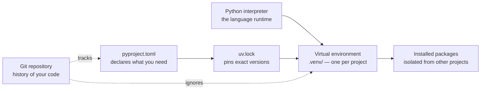

## Why this matters

Almost every "Python is broken" problem a beginner hits is really an environment problem:
the wrong interpreter, a package installed globally, two projects fighting over one version
of a library. Thirty minutes here saves you weeks of confusion — and the workflow below is
what professional Python teams actually use in 2026.

## Mental Model



Three separate ideas, often confused:

1. **The interpreter** — the `python` program itself. You may have several versions.
2. **The virtual environment** — a folder holding a link to one interpreter plus that
   project's packages. Disposable; never committed.
3. **The project declaration** — `pyproject.toml` lists dependencies; `uv.lock` records
   exact resolved versions so a colleague gets byte-identical packages.

## Prerequisites

A terminal. On Windows use **PowerShell** (or Git Bash after installing Git); on macOS the
Terminal app; on Linux whatever you already use. Commands below are shown for both where
they differ.

## Step 1 — Install uv

`uv` is a single fast binary that installs Python versions, creates virtual environments,
resolves dependencies and runs tools. It replaces the `pyenv` + `virtualenv` + `pip` +
`pip-tools` stack.

```bash title="install uv"
# macOS / Linux
curl -LsSf https://astral.sh/uv/install.sh | sh

# Windows (PowerShell)
powershell -ExecutionPolicy ByPass -c "irm https://astral.sh/uv/install.ps1 | iex"
```

Close and reopen the terminal, then verify:

```bash
uv --version
```

:::note You do not need to install Python first
`uv` downloads and manages interpreters for you: `uv python install 3.12` gets you a clean
3.12 without touching your system Python. On macOS and Linux, never install project
packages into the system interpreter — that is how you break OS tooling.
:::

## Step 2 — Create your first project

```bash title="terminal"
uv init ai-handbook-practice
cd ai-handbook-practice
uv python pin 3.12
```

`uv init` creates:

```text
ai-handbook-practice/
├── .git/                 a git repository, already initialised
├── .gitignore
├── .python-version       "3.12" — the interpreter this project uses
├── main.py               a hello-world entry point
├── pyproject.toml        project metadata and dependencies
└── README.md
```

Open `pyproject.toml`:

```toml title="pyproject.toml"
[project]
name = "ai-handbook-practice"
version = "0.1.0"
description = "Practice project for the AI Engineering Handbook"
readme = "README.md"
requires-python = ">=3.12"
dependencies = []

[dependency-groups]
dev = [
    "pytest>=8.0",
    "ruff>=0.6",
]
```

This single file replaces `requirements.txt`, `setup.py` and `setup.cfg`. It is the
standard, and every tool in the modern ecosystem reads it.

## Step 3 — Add dependencies

```bash
uv add requests python-dotenv
uv add --dev pytest ruff
```

Each `uv add`:

1. resolves a compatible version set,
2. writes it into `pyproject.toml`,
3. updates `uv.lock` with exact versions and hashes,
4. installs into `.venv/` (creating it on first use).

Run something in that environment without activating anything:

```bash
uv run python main.py
uv run pytest
```

:::tip `uv run` is the habit to build
It guarantees the command uses *this project's* environment. Forgetting to activate a venv
is the single most common cause of "but I installed it!" — `uv run` makes that impossible.
:::

If you prefer an activated shell:

```bash
# macOS / Linux
source .venv/bin/activate

# Windows PowerShell
.venv\Scripts\Activate.ps1

deactivate   # when you are done
```

## Step 4 — Understand what pip is doing

You will still meet `pip` constantly in tutorials and older repos. The translation table:

| Task | pip + venv | uv |
| --- | --- | --- |
| Create environment | `python -m venv .venv` | automatic |
| Activate | `source .venv/bin/activate` | not needed with `uv run` |
| Install a package | `pip install requests` | `uv add requests` |
| Record dependencies | `pip freeze > requirements.txt` | automatic in `uv.lock` |
| Reproduce elsewhere | `pip install -r requirements.txt` | `uv sync` |
| Install from a lock | not really supported | `uv sync --frozen` |

`pip freeze > requirements.txt` is *not* a lock file: it captures whatever happens to be
installed, including packages you no longer use, and gives no hashes.

## Step 5 — Git and GitHub

```bash title="first commit"
git config --global user.name "Your Name"
git config --global user.email "you@example.com"

git status
git add .
git commit -m "Initial project setup"
```

Create an empty repository on GitHub, then:

```bash
git remote add origin https://github.com/<you>/ai-handbook-practice.git
git branch -M main
git push -u origin main
```

The daily loop you will repeat for the rest of your career:

```bash
git switch -c feature/rag-retriever   # branch
# ... edit files ...
git add -p                            # stage hunks, reviewing as you go
git commit -m "Add hybrid retriever"
git push -u origin feature/rag-retriever
# open a pull request, get review, merge
```

:::danger Never commit secrets
`.env`, API keys, tokens and customer data must not enter Git history. Once pushed, assume
they are compromised — rotate the key; deleting the file does not remove it from history.
Your `.gitignore` must contain at minimum:

```text
.venv/
.env
.env.local
__pycache__/
*.ipynb_checkpoints
.data/
```
:::

## Step 6 — VS Code

Install VS Code, then these extensions: **Python**, **Pylance**, **Jupyter**, **Ruff**.

Create `.vscode/settings.json` in the project:

```json title=".vscode/settings.json"
{
  "python.defaultInterpreterPath": ".venv/bin/python",
  "python.terminal.activateEnvironment": true,
  "editor.formatOnSave": true,
  "editor.codeActionsOnSave": { "source.organizeImports": "explicit" },
  "[python]": { "editor.defaultFormatter": "charliermarsh.ruff" },
  "files.exclude": { "**/__pycache__": true, "**/.pytest_cache": true }
}
```

On Windows the interpreter path is `.venv\\Scripts\\python.exe`. Then press
`Ctrl/Cmd+Shift+P` → *Python: Select Interpreter* → choose the one inside `.venv`. If the
bottom-right of VS Code does not show your project's venv, nothing else will work properly.

## Step 7 — Jupyter, used well

```bash
uv add --dev jupyterlab ipykernel
uv run jupyter lab
```

Notebooks are excellent for exploring data and terrible for shipping software. The rule
professionals follow:

| Use a notebook for | Use a `.py` module for |
| --- | --- |
| exploring a dataset, plotting | anything imported by something else |
| trying a prompt or an API | anything with tests |
| explaining an analysis | anything that runs in production |

:::mistake The notebook trap
Notebook cells can be run out of order, so a notebook that "works" may be unreproducible —
variables exist that no longer appear in any cell. Before trusting a result, use
*Kernel → Restart and Run All*. If it fails, your result was an illusion.
:::

## Debugging

| Symptom | Cause | Fix |
| --- | --- | --- |
| `ModuleNotFoundError` for something you installed | wrong interpreter | `uv run python -c "import sys; print(sys.executable)"` — is it the project `.venv`? |
| `python` opens the Microsoft Store (Windows) | app-execution alias | disable in Settings → Apps → App execution aliases, or just use `uv run` |
| `command not found: uv` after install | PATH not reloaded | open a new terminal |
| VS Code marks imports unresolved | interpreter not selected | `Ctrl+Shift+P` → Python: Select Interpreter |
| `.venv` committed by accident | missing gitignore rule | `git rm -r --cached .venv` then commit |
| Two projects break each other | packages installed globally | one `.venv` per project — always |

## Hands-on Exercise

:::exercise Build the project you will use all handbook long
1. `uv init ai-handbook-practice && cd ai-handbook-practice && uv python pin 3.12`
2. Add `requests` and `python-dotenv`, plus `pytest` and `ruff` as dev dependencies.
3. Create this structure:

```text
ai-handbook-practice/
├── src/practice/__init__.py
├── src/practice/greet.py
├── tests/test_greet.py
├── .env.example
├── .gitignore
└── pyproject.toml
```

4. `greet.py` defines `greet(name: str) -> str` returning `"Hello, {name}!"`.
5. `test_greet.py` asserts `greet("Ada") == "Hello, Ada!"`.
6. Make `uv run pytest` pass, commit, and push to GitHub.
:::

:::solution Solution
```python title="src/practice/greet.py"
def greet(name: str) -> str:
    """Return a friendly greeting for `name`."""
    if not name.strip():
        raise ValueError("name must not be empty")
    return f"Hello, {name}!"
```

```python title="tests/test_greet.py"
import pytest

from practice.greet import greet


def test_greet_uses_the_name() -> None:
    assert greet("Ada") == "Hello, Ada!"


def test_greet_rejects_empty_names() -> None:
    with pytest.raises(ValueError):
        greet("   ")
```

For `from practice.greet import greet` to resolve, tell the build system where the package
lives:

```toml title="pyproject.toml (add these sections)"
[build-system]
requires = ["hatchling"]
build-backend = "hatchling.build"

[tool.hatch.build.targets.wheel]
packages = ["src/practice"]
```

Then `uv sync` and `uv run pytest`. Expected output:

```text
===================== test session starts ======================
collected 2 items

tests/test_greet.py ..                                    [100%]

====================== 2 passed in 0.03s =======================
```
:::

## Challenge

:::challenge Reproducible from scratch
Delete `.venv` entirely, then restore the exact environment with one command
(`uv sync --frozen`) and prove the tests still pass. Then clone your repo into a different
folder and do the same. If both work, your project is reproducible — the property that
makes onboarding a colleague a five-minute task instead of an afternoon.
:::

## Interview Questions

:::interview
1. What is a virtual environment, and what problem does it solve?
2. Why is `pip freeze > requirements.txt` not a lock file?
3. What goes in `pyproject.toml` versus `uv.lock`?
4. Why should notebooks not be imported by production code?
5. You accidentally committed an API key. What do you do, in order?
:::

## Cheat Sheet

```bash
uv init <name>            # new project (+ git repo)
uv python install 3.12    # install an interpreter
uv python pin 3.12        # pin this project to it
uv add <pkg>              # add a dependency
uv add --dev <pkg>        # add a dev-only dependency
uv remove <pkg>           # drop a dependency
uv sync                   # make .venv match the lock file
uv sync --frozen          # ...without re-resolving (CI)
uv run <cmd>              # run inside the project environment
uv tree                   # show the dependency tree
uv lock --upgrade         # refresh pinned versions deliberately

git switch -c <branch>    # create and switch
git add -p                # stage interactively
git commit -m "msg"
git push -u origin <branch>
git log --oneline --graph # history at a glance
```

```quiz
[
  {
    "question": "Which file should NEVER be committed to Git?",
    "options": ["pyproject.toml", "uv.lock", ".env", ".python-version"],
    "answer": 2,
    "explanation": ".env holds secrets. Commit .env.example with empty placeholder keys instead; lock files and project metadata should be committed."
  },
  {
    "question": "You run a script and get ModuleNotFoundError for a package you just installed. What is the most likely cause?",
    "options": [
      "The package is broken",
      "The script is running under a different interpreter than the one you installed into",
      "Python needs a restart",
      "You need administrator rights"
    ],
    "answer": 1,
    "explanation": "Nearly always an interpreter mismatch. Print sys.executable to see which Python is running, and prefer `uv run` so it cannot happen."
  }
]
```

## Summary

- One virtual environment per project; never install project packages globally.
- `pyproject.toml` declares intent, `uv.lock` pins reality, `uv sync` reproduces it.
- `uv run` makes "wrong environment" bugs impossible.
- Git from day one; secrets never enter history.
- Notebooks explore, modules ship.

## Next Step

With a working project, let's make your first real API call — including the correct way to
handle API keys with environment variables and `.env` files.
