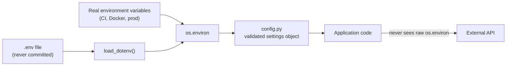

## Why this matters

Every AI application you build will call an API with a secret key. Doing this correctly on
day one — keys in the environment, config in one module, timeouts and retries on every
call — means none of the later phases have to unlearn a bad habit. Leaked API keys are the
single most common security incident in AI projects, and they are entirely preventable.

## Mental Model



The key idea: **application code never reads `os.environ` directly**. It imports a settings
object that has already validated everything. Then a missing key fails loudly at startup
instead of mysteriously three minutes into a batch job.

## Core Concepts

### Environment variables

Values the operating system hands to your process. They are the standard way to configure
software because they work identically on your laptop, in CI, in Docker and in production —
and because they keep secrets out of source code.

```bash
# set one for a single command (macOS/Linux)
WEATHER_API_KEY=abc123 uv run python main.py

# PowerShell
$env:WEATHER_API_KEY = "abc123"; uv run python main.py
```

### `.env` files

Typing exports constantly is painful, so during development we keep a `.env` file and load
it. Two rules, no exceptions:

1. `.env` is in `.gitignore`.
2. `.env.example` **is** committed, with every key present and every value blank. It is the
   documentation of what the project needs.

```bash title=".env.example"
# Copy to .env and fill in. Never commit .env.
OPENWEATHER_API_KEY=
LOG_LEVEL=INFO
REQUEST_TIMEOUT_SECONDS=10
```

## Syntax

```python
import os

os.environ["KEY"]                 # raises KeyError if missing  (good for required values)
os.getenv("KEY")                  # returns None if missing
os.getenv("KEY", "default")       # returns a default
```

## Minimal Example

```python title="scratch.py"
import os

from dotenv import load_dotenv

load_dotenv()  # reads .env into the process environment

api_key = os.getenv("OPENWEATHER_API_KEY")
print("key loaded:", bool(api_key))   # never print the key itself
```

```bash
uv add requests python-dotenv
uv run python scratch.py
```

Expected output:

```text
key loaded: True
```

:::danger Never print, log or commit a key
`print(api_key)` puts the secret into your terminal history, your CI logs and any
screenshot you share. Print `bool(api_key)` or the last four characters at most.
:::

## Real-World Example

A complete, runnable project. Get a free key at
[openweathermap.org](https://openweathermap.org/api) (any HTTP API works — the structure is
the point).

```text
weather-cli/
├── src/weather/
│   ├── __init__.py
│   ├── config.py        settings, validated at import
│   ├── client.py        HTTP calls with timeout + retries
│   └── cli.py           entry point
├── tests/
│   └── test_client.py
├── .env.example
├── .gitignore
└── pyproject.toml
```

```python title="src/weather/config.py"
"""Application settings.

Everything the app needs from the environment is read *here*, once, and validated.
Import `settings` from this module; never call os.getenv elsewhere.
"""
from __future__ import annotations

import os
from dataclasses import dataclass

from dotenv import load_dotenv

load_dotenv()


class ConfigError(RuntimeError):
    """Raised when required configuration is missing or malformed."""


def _required(name: str) -> str:
    value = os.getenv(name)
    if not value:
        raise ConfigError(
            f"Missing required environment variable: {name}. "
            f"Copy .env.example to .env and fill it in."
        )
    return value


@dataclass(frozen=True, slots=True)
class Settings:
    api_key: str
    base_url: str = "https://api.openweathermap.org/data/2.5"
    timeout_seconds: float = 10.0
    log_level: str = "INFO"

    @classmethod
    def from_env(cls) -> "Settings":
        return cls(
            api_key=_required("OPENWEATHER_API_KEY"),
            timeout_seconds=float(os.getenv("REQUEST_TIMEOUT_SECONDS", "10")),
            log_level=os.getenv("LOG_LEVEL", "INFO"),
        )

    def __repr__(self) -> str:  # keeps the key out of tracebacks and logs
        return f"Settings(base_url={self.base_url!r}, timeout={self.timeout_seconds})"


settings = Settings.from_env()
```

```python title="src/weather/client.py"
"""HTTP client for the weather API.

Demonstrates the four things every outbound call in production needs:
a timeout, bounded retries, explicit error types, and no secrets in logs.
"""
from __future__ import annotations

import logging
import time
from dataclasses import dataclass

import requests

from .config import settings

logger = logging.getLogger(__name__)

RETRYABLE_STATUS = {429, 500, 502, 503, 504}


class WeatherError(RuntimeError):
    """Any failure talking to the weather service."""


@dataclass(frozen=True, slots=True)
class Weather:
    city: str
    description: str
    temperature_c: float
    feels_like_c: float


def get_weather(city: str, *, max_attempts: int = 3) -> Weather:
    """Fetch current weather for `city`.

    Raises:
        WeatherError: on a non-retryable status, or after `max_attempts` failures.
    """
    url = f"{settings.base_url}/weather"
    params = {"q": city, "appid": settings.api_key, "units": "metric"}

    last_error: Exception | None = None
    for attempt in range(1, max_attempts + 1):
        try:
            response = requests.get(url, params=params, timeout=settings.timeout_seconds)
        except requests.Timeout as exc:
            last_error = exc
            logger.warning("timeout calling weather api (attempt %s/%s)", attempt, max_attempts)
        else:
            if response.status_code == 200:
                return _parse(city, response.json())
            if response.status_code == 401:
                raise WeatherError("API key rejected - check OPENWEATHER_API_KEY")
            if response.status_code == 404:
                raise WeatherError(f"Unknown city: {city!r}")
            if response.status_code not in RETRYABLE_STATUS:
                raise WeatherError(f"Unexpected status {response.status_code}: {response.text[:200]}")
            last_error = WeatherError(f"status {response.status_code}")
            logger.warning("retryable status %s (attempt %s/%s)", response.status_code, attempt, max_attempts)

        if attempt < max_attempts:
            time.sleep(2 ** (attempt - 1))  # 1s, 2s, 4s - exponential backoff

    raise WeatherError(f"Failed after {max_attempts} attempts") from last_error


def _parse(city: str, payload: dict) -> Weather:
    try:
        return Weather(
            city=payload["name"],
            description=payload["weather"][0]["description"],
            temperature_c=payload["main"]["temp"],
            feels_like_c=payload["main"]["feels_like"],
        )
    except (KeyError, IndexError, TypeError) as exc:
        raise WeatherError(f"Unexpected response shape for {city!r}") from exc
```

```python title="src/weather/cli.py"
"""Command-line entry point: uv run python -m weather.cli London"""
from __future__ import annotations

import logging
import sys

from .client import WeatherError, get_weather
from .config import settings


def main(argv: list[str] | None = None) -> int:
    logging.basicConfig(level=settings.log_level, format="%(levelname)s %(name)s: %(message)s")
    args = argv if argv is not None else sys.argv[1:]

    if not args:
        print("usage: python -m weather.cli <city>", file=sys.stderr)
        return 2

    city = " ".join(args)
    try:
        weather = get_weather(city)
    except WeatherError as exc:
        print(f"error: {exc}", file=sys.stderr)
        return 1

    print(f"{weather.city}: {weather.description}")
    print(f"  {weather.temperature_c:.1f}°C (feels like {weather.feels_like_c:.1f}°C)")
    return 0


if __name__ == "__main__":
    raise SystemExit(main())
```

### How to run it

```bash
cp .env.example .env        # then paste your key into .env
uv add requests python-dotenv
uv run python -m weather.cli London
```

Expected output:

```text
London: light rain
  11.3°C (feels like 10.1°C)
```

### Testing it without network access

```python title="tests/test_client.py"
from unittest.mock import patch

import pytest

from weather.client import WeatherError, get_weather


class FakeResponse:
    def __init__(self, status_code: int, payload: dict | None = None):
        self.status_code = status_code
        self._payload = payload or {}
        self.text = str(self._payload)

    def json(self) -> dict:
        return self._payload


SAMPLE = {
    "name": "London",
    "weather": [{"description": "light rain"}],
    "main": {"temp": 11.3, "feels_like": 10.1},
}


def test_parses_a_successful_response():
    with patch("weather.client.requests.get", return_value=FakeResponse(200, SAMPLE)):
        weather = get_weather("London")
    assert weather.city == "London"
    assert weather.temperature_c == pytest.approx(11.3)


def test_raises_on_unknown_city():
    with patch("weather.client.requests.get", return_value=FakeResponse(404)):
        with pytest.raises(WeatherError, match="Unknown city"):
            get_weather("Atlantis")


def test_retries_then_fails_on_server_errors():
    with patch("weather.client.requests.get", return_value=FakeResponse(503)) as mock_get:
        with patch("weather.client.time.sleep"):  # do not actually wait in tests
            with pytest.raises(WeatherError, match="Failed after 3 attempts"):
                get_weather("London")
    assert mock_get.call_count == 3
```

```bash
uv run pytest -q
```

```text
...                                                          [100%]
3 passed in 0.06s
```

## Production Example

Three upgrades you will make in Phase 2 and Phase 25:

1. **Pydantic Settings** instead of the hand-rolled dataclass — type coercion, nested
   config and validation for free.
2. **`httpx` with a shared client** instead of `requests.get` per call — connection pooling
   and native async.
3. **`tenacity`** for retry policy instead of a hand-written loop — jitter, per-exception
   rules, and retry logging.

The *shape* stays exactly the same, which is why learning it by hand first is worth the
twenty extra lines.

## Common Mistakes

:::mistake
- **No timeout.** `requests.get(url)` with no `timeout` can hang forever and take your
  worker with it. Always pass one.
- **Retrying non-retryable errors.** Retrying a 401 or 404 just wastes time; retry 429 and
  5xx only.
- **Catching bare `Exception`.** You will swallow bugs. Catch the specific error type.
- **Keys in the code "just for now".** `git log` is forever.
- **Reading `os.getenv` in twenty modules.** Nobody can then tell what the app requires.
:::

## Security Considerations

1. Rotate a key the moment it appears anywhere public — repo, log, screenshot, Slack.
2. Give each environment its own key (dev, staging, prod) so you can revoke one safely.
3. In production, use the platform's secret manager, not a `.env` file on disk.
4. Never send a key in a URL query string if a header is available; URLs end up in logs.
5. Add a pre-commit secret scanner (`gitleaks`, `detect-secrets`) — it catches the mistake
   before it becomes an incident.

## Hands-on Exercise

:::exercise Wire up a different API
Pick any free JSON API that needs a key (exchangerates, news, airquality). Reproduce the
structure: `config.py` with validation, a client with timeout, retries and specific error
types, a CLI, and three tests using a fake response object. Then deliberately break things:
remove the key from `.env`, and pass a nonsense city. Confirm both failures produce a clear
message and a non-zero exit code.
:::

:::solution What "done" looks like
- `uv run python -m yourapp.cli` with no `.env` exits with a message naming the missing
  variable — not a `KeyError` traceback.
- An unknown resource returns exit code 1 and a one-line human-readable error.
- `uv run pytest` passes with no network access.
- `git status` shows no `.env`, and `.env.example` lists every variable with blank values.
:::

## Challenge

:::challenge Add a cache and a budget
Extend the client so that (a) repeated requests for the same city within 60 seconds are
served from an in-memory cache, and (b) the process refuses to make more than N calls per
run, raising a clear error when the budget is exhausted. These two ideas — caching and
budget caps — reappear in Phase 19 as the standard defence against runaway agent costs.
:::

## Interview Questions

:::interview
1. Why keep configuration in environment variables rather than a config file in the repo?
2. Which HTTP status codes are worth retrying, and why not the others?
3. What is exponential backoff and what problem does jitter solve on top of it?
4. How do you test code that calls an external API, without calling it?
5. A key leaked into a public repo two weeks ago. What are your first three actions?
:::

## Cheat Sheet

```python
# config.py pattern
load_dotenv()
settings = Settings.from_env()        # validate once, at import

# every outbound call
requests.get(url, params=..., timeout=10)       # never without a timeout
retry only on {429, 500, 502, 503, 504}
sleep 2 ** (attempt - 1)                        # exponential backoff

# secrets
.env            -> .gitignore
.env.example    -> committed, blank values
print(api_key)  -> never
```

```quiz
[
  {
    "question": "Which call is production-safe?",
    "options": [
      "requests.get(url)",
      "requests.get(url, timeout=10)",
      "requests.get(url + '?key=' + api_key)",
      "requests.get(url, verify=False)"
    ],
    "answer": 1,
    "explanation": "A timeout is mandatory; keys belong in headers or params handled by the library, and disabling TLS verification is never acceptable."
  },
  {
    "question": "Why commit .env.example?",
    "options": [
      "It is required by Python",
      "It documents every variable the project needs, without exposing values",
      "It makes the app start faster",
      "So secrets are backed up"
    ],
    "answer": 1,
    "explanation": "It is executable documentation of the app's configuration surface; values stay blank so nothing secret is committed."
  }
]
```

## Summary

- Secrets come from the environment; `.env` for local development, a secret manager in
  production, `.env.example` committed as documentation.
- One validated settings object; application code never touches `os.environ`.
- Every outbound call gets a timeout, bounded retries on retryable statuses only, and
  specific exception types.
- Tests replace the network with a fake response, so they are fast and offline.

## Next Step

You now have a working project and a safe way to call APIs. Phase 1 starts the language
itself, from the very beginning — variables and types.
