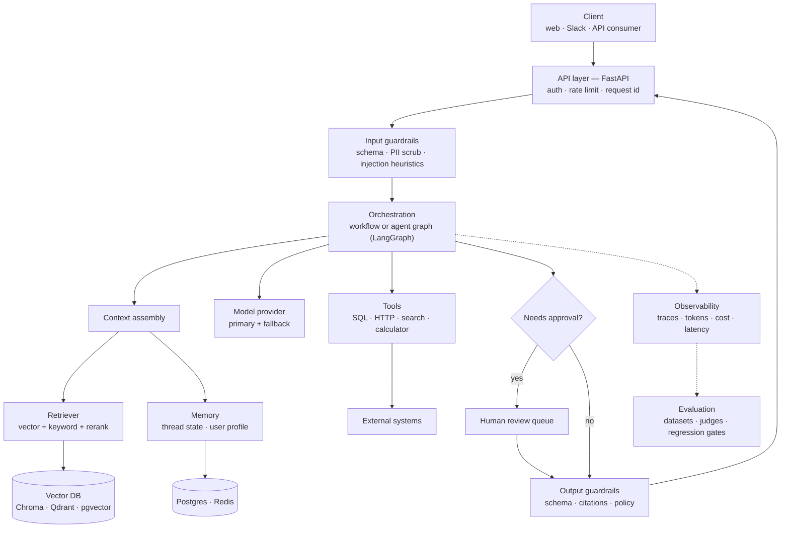

## Why this matters

Every serious AI product converges on roughly the same shape. Learning that shape now means
each later phase slots into a place you already understand, instead of arriving as an
unrelated tool. It also gives you the vocabulary to review someone else's design and ask
the three questions that matter: *where does context come from, what can it do, and how do
we know it works?*

## Mental Model



Keep this diagram. Every phase from 10 onwards builds one of these boxes.

## Core Concepts

### Layer 1 — API and transport (Phase 25)

An HTTP service with authentication, per-user rate limits, request ids and timeouts.
Nothing AI-specific, and that is the point: an AI feature is a feature, and it needs the
same operational discipline as any other endpoint. Streaming matters here — a 12-second
answer that streams feels faster than a 4-second answer that doesn't.

### Layer 2 — Guardrails, in and out (Phase 19)

**Input**: validate shape and size, strip or mask PII before it reaches a third party,
detect obvious injection attempts, enforce a per-user budget.
**Output**: parse into a schema, verify citations exist, apply policy rules (no legal or
medical advice, no competitor comparisons), decide whether to escalate.

Guardrails are deterministic code around the probabilistic core. If a rule is important,
it must live here — *not* in the prompt, which the model may ignore.

### Layer 3 — Orchestration (Phases 14–18)

The control flow: a chain, a workflow, a state graph or an agent loop. This is where you
decide how much autonomy the model gets. In production, most of this layer is a graph with
explicit nodes and edges (LangGraph), because explicit control flow is debuggable, can be
paused for human approval, and can be resumed after a crash.

### Layer 4 — Context assembly (Phases 11–13, 21)

The highest-leverage layer. Retrieval selects which of your documents the model sees;
memory decides what it remembers about this user and this conversation. Quality here
dominates output quality far more than model choice does.

:::tip The context budget
Treat the context window as a budget with line items: system prompt, tool definitions,
conversation history, retrieved chunks, output reserve. Write the numbers down. Systems
degrade when history silently grows until retrieval gets squeezed out.
:::

### Layer 5 — Model provider (Phase 10)

A model behind an API, plus a **fallback**: a second provider or smaller model for when the
first is rate-limited, down, or too expensive for this request class. Model choice is a
runtime routing decision, not a hard-coded constant.

### Layer 6 — Tools (Phase 22)

Functions the model may request: query the warehouse, call an internal API, search the web,
run a calculation. Each needs a schema, argument validation, a timeout, a retry policy,
permissions and an audit log. A tool is the only place a language model touches the real
world — treat each one as a public endpoint.

### Layer 7 — Human in the loop (Phase 20)

For irreversible or high-value actions the graph pauses, persists its state, and waits for
a person. This is a first-class architectural pattern, not a failure mode.

### Layer 8 — Observability and evaluation (Phase 24)

Every request emits a trace: the prompts, the retrieved chunks, the tool calls, the token
counts, the latencies, the cost. On top of traces sit evaluations: fixed datasets scored
for faithfulness, relevance and correctness, run in CI so a prompt change cannot silently
regress quality.

## Real-World Example

The same architecture, three different products:

| Layer | Support assistant | Document intelligence | Research agent |
| --- | --- | --- | --- |
| Orchestration | router → RAG → tools → escalate | linear ingest + query workflow | ReAct agent with planner |
| Context | product docs + ticket history + user profile | uploaded PDFs, per-tenant index | live web search results |
| Tools | order lookup, refund (gated) | none at query time | search, fetch page, calculator |
| HITL | refunds over $50 | none | final report sign-off |
| Guardrails | PII scrub, no policy invention | citation required per claim | source allowlist, claim verification |
| Evals | 50 golden tickets, escalation precision | faithfulness + citation accuracy | factuality of claims, source coverage |

Notice how the boxes stay the same and only the contents change. That reuse is what makes
an AI engineer productive.

## Production Example

The dependency direction that keeps this maintainable:

```text
app/
├── api/           HTTP layer          → depends on services
├── graph/         orchestration       → depends on adapters, never on api
├── adapters/      llm.py, vectordb.py, tools/  → depends on nothing internal
├── guardrails/    pure functions      → depends on nothing
├── memory/        state repositories  → depends on db
└── observability/ tracing decorators  → wraps everything
```

One rule: **adapters are the only modules that import a vendor SDK.** When you swap Chroma
for Qdrant, or add a second model provider, you edit one file. Systems that sprinkle
`from langchain_openai import ChatOpenAI` across twenty modules cannot be migrated, and
migration in this field happens every few months.

## Common Mistakes

:::mistake
- **Prompt-as-architecture.** Encoding critical rules only in the system prompt. Models
  drop instructions under long contexts; guardrail code does not.
- **No request id.** Without one id threaded through API → graph → tools → trace, debugging
  a user complaint is archaeology.
- **Retrieval and generation in one function.** You can never test them separately, so you
  can never tell which one is wrong.
- **Evaluation added "later".** Later means never, and by then every prompt change is a
  coin flip.
:::

## Performance Considerations

| Symptom | Usual cause | Where to fix |
| --- | --- | --- |
| High p95 latency | serial tool calls, oversized context | orchestration (parallelise), context budget |
| Cost spike | agent looping, full history resent | loop caps, prompt caching, summarised memory |
| Wrong answers, right documents | prompt or generation | generation node, output guardrail |
| Right answer format, wrong facts | retrieval | chunking, query rewriting, reranking |
| Random intermittent failures | provider limits | retries with jitter, fallback model |

## Hands-on Exercise

:::exercise Draw the architecture for a real request
Take this requirement:

> "Employees ask questions in Slack about IT policy. The bot answers from our Confluence
> space with links. If it is a password reset it should create a ServiceNow ticket instead,
> and anything touching security exceptions must be approved by a human."

Sketch the boxes and arrows. Mark: where retrieval happens, which tool needs permissions,
where the human gate sits, what the output schema contains, and which three metrics you
would put on a dashboard.
:::

:::solution Reference answer
- **API**: Slack events endpoint, verifies Slack signature, replies in-thread, streams
  nothing (Slack posts whole messages) but must ack within 3 seconds → enqueue and reply
  asynchronously.
- **Router node**: classify {policy question, password reset, security exception}. A cheap
  model or even a keyword rule with LLM fallback.
- **Retrieval**: Confluence space → chunked, embedded, filtered by `space=IT` and the
  user's group permissions. Top-k with rerank; answer must cite page ids that exist.
- **Tool**: `create_servicenow_ticket(user, category)` — write scope, so it validates
  arguments, requires the caller's identity from Slack (never from the model), and is
  idempotent by request id.
- **HITL**: security-exception branch pauses the graph, posts to a reviewer channel with
  approve/reject buttons, and resumes from the checkpoint on approval.
- **Output schema**: `{answer, citations[], action_taken, confidence, escalated}`.
- **Dashboard**: answer-with-citation rate, escalation precision, p95 latency and cost per
  conversation.
:::

## Challenge

:::challenge Failure injection
For each layer in the diagram, write one sentence describing what the user experiences when
that layer fails, and what your system should do instead. Example: "Vector DB unavailable →
the answer must say it cannot access documents right now, not answer from memory."
This exercise is how you decide where to put fallbacks before an incident decides for you.
:::

## Interview Questions

:::interview
1. Walk me through the architecture of a RAG-based assistant, end to end.
2. Where do you enforce a rule like "never quote a price"? Why not in the prompt?
3. How do you find out whether a bad answer was a retrieval or a generation failure?
4. What do you store in a trace, and what must you never store?
5. How would you add a second model provider without touching business logic?
:::

## Cheat Sheet

```text
Request path:  client → API → input guardrails → orchestration
                     → context (retrieval + memory) → model (+ tools)
                     → [human gate] → output guardrails → client
Cross-cutting: config · secrets · tracing · cost accounting · evals in CI
Golden rules:  adapters isolate vendors · rules live in code, not prompts
               every request carries one id · retrieval and generation are separate units
```

```quiz
[
  {
    "question": "Where should the rule 'never give medical advice' be enforced?",
    "options": [
      "Only in the system prompt",
      "In deterministic output guardrail code, with the prompt as a first line of defence",
      "In the vector database filter",
      "In the model's temperature setting"
    ],
    "answer": 1,
    "explanation": "Prompts are guidance a model can drift from. Anything that must hold, holds in code that inspects the output before it reaches the user."
  },
  {
    "question": "Answers are well-written but cite the wrong policy. Which layer do you investigate first?",
    "options": ["Model provider", "API layer", "Retrieval / context assembly", "Rate limiting"],
    "answer": 2,
    "explanation": "Fluent-but-wrong usually means the model faithfully used bad context. Inspect what the retriever returned before touching the prompt."
  }
]
```

## Summary

- Production AI systems share one reference architecture: API, guardrails, orchestration,
  context, model, tools, human gates, observability.
- Context assembly determines quality more than model choice.
- Rules that must hold belong in code; prompts are advisory.
- Vendor SDKs belong in adapters so the system survives the next framework migration.

## Next Step

Time to build the environment you will use for the rest of the handbook: Python, uv,
virtual environments, Git, VS Code and Jupyter — set up once, properly.
