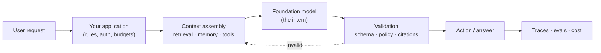

## Why this matters

Most people arriving at "AI" think the hard part is the model. It isn't. The model is a
service you call. The hard part is everything around it: getting the right context into it,
constraining what it is allowed to do, checking whether its answer was any good, making it
fast and cheap enough, and making it fail safely when it is wrong — because it *will* be
wrong.

That surrounding work is **AI engineering**, and it is a software engineering discipline.
If you can write clear Python, model a problem, test your code, and reason about latency,
cost and failure, you can do this job. This handbook teaches the Python first, then the
data, then the models, then the systems — in that order, because that is the order in which
the ideas actually depend on each other.

## Mental Model

Think of a large language model as a **brilliant, fast, confident intern with no memory,
no access to your systems, and no accountability**.



Everything you will learn in this handbook sits in one of those boxes:

| Box | What you build | Phases |
| --- | --- | --- |
| Your application | Python services, APIs, config, auth | 1–2, 25 |
| Context assembly | retrieval, embeddings, RAG, memory, tools | 11–13, 21–22 |
| The model | prompting, sampling, structured output, model choice | 8–10 |
| Validation | guardrails, schemas, human approval | 19–20 |
| Action | agents, workflows, multi-agent systems | 14–18, 23 |
| Observability | tracing, evaluation, cost control | 24–25 |

## Core Concepts

### 1. You are programming with a non-deterministic component

A function you write returns the same output for the same input. A model does not. The
same prompt can produce different words, a different JSON shape, or a confidently wrong
fact. This single property changes your engineering practice:

- **Tests become evaluations.** `assert result == expected` becomes "does this output
  satisfy these properties, on this dataset, at least this often?" (Phase 24)
- **Types become runtime contracts.** You validate model output with Pydantic at runtime,
  because the model is not bound by your type hints. (Phase 19)
- **Retries and fallbacks are normal.** A malformed response is an expected event, not an
  exception you forgot to handle. (Phase 10, 25)

### 2. Context is the product

Models do not know your documents, your database, your customer, or today's date. Almost
all of the quality in a serious AI product comes from *what you put in the context window*
and *what you leave out*. Retrieval-augmented generation (Phase 12) is the systematic
answer to that problem; memory (Phase 21) and tools (Phase 22) are the others.

### 3. Capability is bounded by permission

An agent that can call `refund_customer()` can refund the wrong customer. The engineering
question is never "can the model do it?" but "what is the blast radius when it does the
wrong thing?" Permissions, sandboxing, budget caps, loop limits and human approval gates
(Phases 19–20) are the answer, and they are not optional in production.

### 4. Cost and latency are design constraints, not afterthoughts

A single agent run can make thirty model calls. At scale that is a real bill and a real
p95 latency. Model selection, caching, streaming, batching, and deciding *not* to use an
agent when a deterministic workflow would do (Phase 15) are core skills.

## Real-World Example

Here is the anatomy of a real internal tool — "answer support questions from our docs" —
and where each phase of this handbook shows up.

```text
support-assistant/
├── app/
│   ├── main.py          FastAPI endpoint, auth, rate limits      → Phase 25
│   ├── config.py        settings from env vars, no secrets in code → Phase 0, 19
│   ├── retrieval.py     chunking, embeddings, vector search       → Phase 11-13
│   ├── graph.py         router → RAG → tools → human escalation   → Phase 17
│   ├── tools.py         order lookup, refund (permission-gated)   → Phase 22
│   ├── guardrails.py    PII scrub, injection checks, output schema → Phase 19
│   └── memory.py        conversation state, per-user profile      → Phase 21
├── evals/
│   ├── dataset.jsonl    50 real questions + expected behaviour    → Phase 24
│   └── run_eval.py      faithfulness, relevance, regression gate  → Phase 24
├── tests/               unit tests for the deterministic parts    → Phase 2
├── Dockerfile                                                     → Phase 25
└── pyproject.toml                                                 → Phase 0, 2
```

Notice the ratio: exactly one file is "the AI part". The rest is software engineering.

## The three adjacent job titles

:::note Titles vary by company — the boundaries below are the common ones
Do not over-index on titles. Read the responsibilities and find the overlap you want.
:::

| | Data Scientist | ML Engineer | AI Engineer |
| --- | --- | --- | --- |
| Core question | "What does the data say?" | "How do we train and serve this model reliably?" | "How do we build a product on top of models we did not train?" |
| Typical output | Analysis, experiment, model prototype | Training pipeline, feature store, deployed model | API, agent, RAG system, evaluation suite |
| Trains models? | Often | Almost always | Rarely — usually fine-tunes at most |
| Key tools | Pandas, scikit-learn, notebooks | PyTorch, MLflow, Kubernetes, Spark | LLM APIs, vector DBs, LangGraph, FastAPI, tracing |
| Hardest part | Statistical validity | Scale, reproducibility, drift | Non-determinism, context, safety, evaluation |

The tracks overlap heavily. This handbook deliberately teaches the data-science and ML
foundations (Phases 3–9) before the LLM material, because you cannot evaluate an AI system
properly without understanding precision, recall, overfitting and data leakage — and
because "just use an LLM" is frequently the wrong answer to a problem a 40-line
scikit-learn model solves better, cheaper and more predictably.

## Common Mistakes

:::mistake Four mistakes that define the beginner phase
1. **Starting with a framework.** Writing LangChain before you can write the same thing in
   50 lines of plain Python means you cannot debug it. This handbook always builds by hand
   first.
2. **Treating prompt tweaking as engineering.** Without an evaluation set you have no idea
   whether your "improvement" improved anything. Phase 24 exists for this reason.
3. **Reaching for an agent immediately.** Most production "AI features" are a fixed
   sequence of two or three model calls. Agents add latency, cost and failure modes; use
   them when the control flow genuinely cannot be decided in advance (Phase 15).
4. **Ignoring cost until the bill arrives.** Learn to count tokens early (Phase 10).
:::

## Security Considerations

Three rules to internalise now, before you write a single line:

1. **API keys live in environment variables, never in code, never in a notebook cell, never
   in a screenshot.** You will set this up properly in the next lesson.
2. **Any text that reaches the model can try to instruct it.** A PDF, a web page, a support
   ticket — all of it is untrusted input. This is prompt injection, and the defence is
   architectural (Phase 19), not a magic prompt.
3. **Log what the system did, not what the user typed.** Traces will otherwise become the
   largest PII store in your company (Phases 21, 24).

## Hands-on Exercise

:::exercise Map a product you already use
Pick an AI feature you have used recently — an email writing assistant, a "chat with your
PDF" tool, a coding assistant, a support bot. On paper, sketch the six boxes from the
mental model above and fill each one in with your best guess:

- What context does it need at request time, and where would that come from?
- What could it do that would be dangerous, and what gate would you put in front of that?
- How would you tell, automatically, that a release made it worse?
:::

:::solution Worked answer for "chat with your PDF"
- **Context assembly:** the PDF is split into ~800-token chunks, embedded, stored in a
  vector index scoped to *this user's* documents. At query time the top 5 chunks by
  similarity, plus the last few turns of conversation, go into the prompt.
- **Danger:** answering from another tenant's document (access control on the vector
  filter), or inventing a citation. Gate: every claim must carry a chunk id that is
  verified to exist in the retrieved set before the answer is returned.
- **Regression detection:** a fixed set of 40 question/document pairs with known answers,
  scored for faithfulness and answer relevance on every deploy; the build fails if the mean
  score drops more than 5% below the previous release.

If your answer named retrieval, access control and an eval set, you already have the
instincts this handbook is going to formalise.
:::

## Challenge

:::challenge Cost estimate from first principles
An internal assistant serves 500 employees. Each asks ~8 questions a day. Each question
retrieves 5 chunks of ~800 tokens, adds a ~400-token system prompt and conversation
history, and produces ~300 output tokens.

Estimate the daily token volume. Then, using any current model's published per-million
token pricing, estimate the monthly bill — and calculate how much you would save by
caching the system prompt and by routing the 60% of questions that are simple lookups to a
smaller model. You will do this calculation for real in Phase 10.
:::

## Interview Questions

:::interview Commonly asked at the AI-engineering screen
1. What changes about testing when part of your system is non-deterministic?
2. When would you *not* use an LLM for a task?
3. What is the difference between a workflow and an agent, and why does it matter for
   latency and cost?
4. How would you stop an agent from making an irreversible mistake?
5. Your RAG system returns a plausible but wrong answer. Walk me through how you debug it.
:::

## Cheat Sheet

| Term | One-line definition |
| --- | --- |
| Foundation model | A large model pre-trained on broad data, used as a base for many tasks |
| LLM | A foundation model specialised in text (and often images/audio) generation |
| Prompt | The full input given to a model: instructions + context + question |
| Context window | The maximum number of tokens a model can consider at once |
| RAG | Retrieving relevant documents at query time and putting them in the prompt |
| Tool / function calling | The model emits a structured request; *your code* executes it |
| Agent | A loop where a model repeatedly chooses tools until a goal is met |
| Agentic AI | Systems of one or more agents with planning, memory and autonomy |
| Guardrail | A deterministic check on input or output that the model cannot bypass |
| Eval | A repeatable, scored test of system quality on a fixed dataset |

```quiz
[
  {
    "question": "Which statement best captures the core engineering difference when building with LLMs?",
    "options": [
      "You must train your own model for each task",
      "A component of your system is non-deterministic, so tests become scored evaluations",
      "Python is no longer suitable, so you need a specialised language",
      "Latency stops mattering because models are fast"
    ],
    "answer": 1,
    "explanation": "The model can return different output for identical input, which is why assertion-style tests give way to evaluation datasets with scored properties (Phase 24)."
  },
  {
    "question": "You need to extract the invoice number from 10,000 well-structured PDFs with a fixed layout. What should you try first?",
    "options": [
      "A multi-agent system with a supervisor",
      "A deterministic parser or regex, falling back to an LLM only for failures",
      "Fine-tune a foundation model on the PDFs",
      "A RAG pipeline over all 10,000 documents"
    ],
    "answer": 1,
    "explanation": "Deterministic beats probabilistic whenever the structure is fixed: it is cheaper, faster, testable and auditable. Use the model for the long tail it cannot handle."
  }
]
```

## Summary

- AI engineering is building reliable software around models you did not train.
- The model is one box in a system whose other boxes — context, validation, permissions,
  observability — determine whether the product works.
- Non-determinism forces a change in practice: evaluations instead of assertions, runtime
  schemas instead of trust, blast-radius thinking instead of feature thinking.
- The classical data and ML foundations are not optional detours; they are the vocabulary
  you need to judge whether an AI system is any good.

## Next Step

Next we pin down the words people use interchangeably and wrongly — AI, ML, deep learning,
generative AI, LLM, RAG, agent — so that the rest of the handbook has a precise vocabulary.
