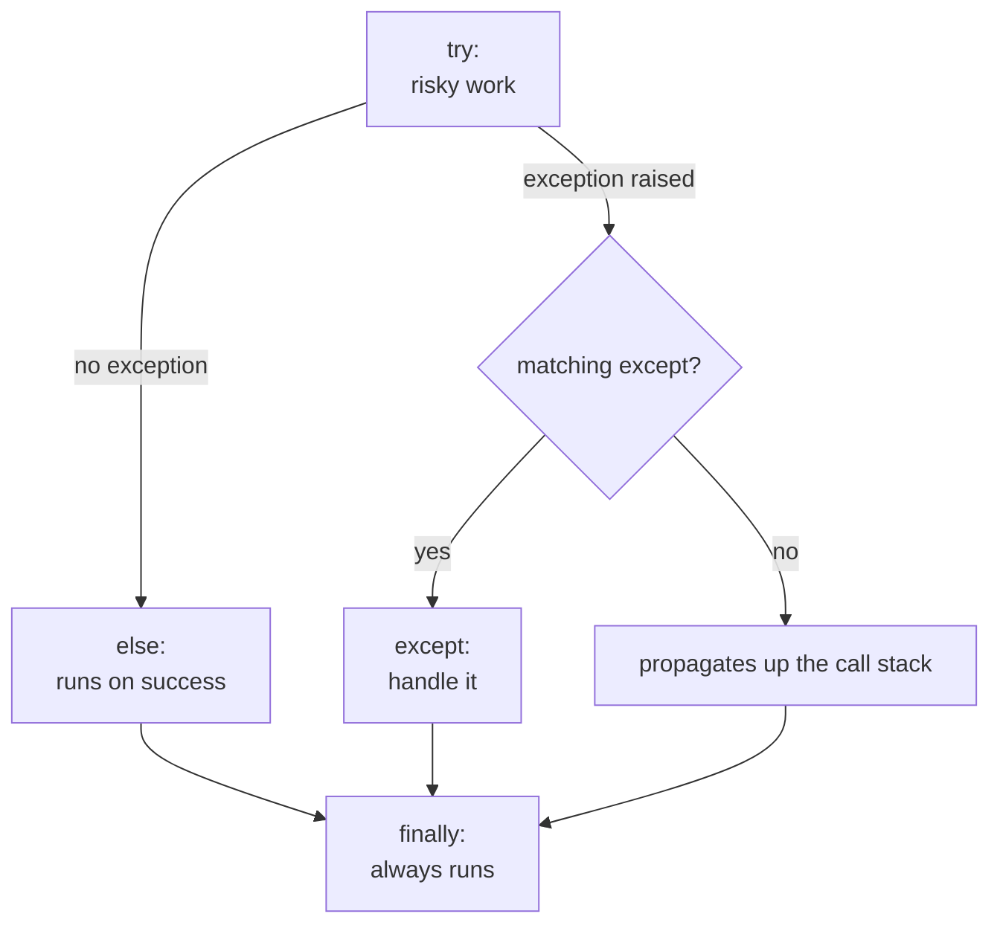

:::note In one line
**Errors are messages, not disasters.** Read the last line of the traceback first, catch only the specific error you can actually handle, and never silence one you did not expect.
:::

## Why this matters

AI systems fail constantly and normally: rate limits, timeouts, malformed JSON from a
model, an empty retrieval, a tool that returns nonsense. The difference between a prototype
and a production system is almost entirely in how those failures are named, caught,
retried, surfaced and logged.

## Mental Model



Three questions to ask at every `except`:

1. **Can I fix it here?** If not, do not catch it.
2. **Is this expected?** Expected failures (a 429, a missing file) get handled; unexpected
   ones (a `TypeError` in your own code) should crash loudly so you fix the bug.
3. **Does the caller need to know?** If yes, re-raise — possibly as your own exception type.

## Core Concepts

### The basic form

```python
try:
    data = json.loads(raw)
except json.JSONDecodeError as exc:
    logger.warning("model returned invalid JSON: %s", exc)
    data = None
else:
    logger.info("parsed %d keys", len(data))     # only if no exception
finally:
    duration = time.monotonic() - start          # always, even on exception/return
    metrics.observe(duration)
```

### Catching specific exceptions

```python
try:
    value = config["model"]
except KeyError:
    value = "small"

# several types, one handler
except (TimeoutError, ConnectionError) as exc:
    ...

# different handlers, most specific first
except json.JSONDecodeError:
    ...
except ValueError:        # JSONDecodeError is a subclass of ValueError - order matters
    ...
```

:::danger Never do this
```python
try:
    result = risky()
except:                # bare except: catches KeyboardInterrupt and SystemExit too
    pass               # and now the failure is invisible forever
```
`except Exception: pass` is only marginally better. If you truly want to ignore a specific
failure, say which one and why:
```python
except FileNotFoundError:
    pass  # cache file absent on first run - expected
```
:::

### Raising

```python
def get_chunk(chunk_id: str) -> dict:
    chunk = INDEX.get(chunk_id)
    if chunk is None:
        raise KeyError(f"unknown chunk: {chunk_id!r}")
    return chunk

raise ValueError("k must be positive")
raise                                  # re-raise the exception being handled
raise RetrievalError("index unavailable") from exc   # preserve the cause
```

`raise X from exc` sets `__cause__`, so the traceback shows *both* errors:
`... the above exception was the direct cause of the following exception ...`. Always use it
when wrapping.

### Custom exception hierarchies

```python title="src/errors.py"
class AppError(Exception):
    """Base class for every error this application raises deliberately."""


class ConfigError(AppError):
    """Configuration missing or invalid - fatal at startup."""


class RetrievalError(AppError):
    """The retrieval layer could not produce candidates."""


class ModelError(AppError):
    """The model provider failed."""


class RateLimitError(ModelError):
    """429 - retryable after a delay."""
    def __init__(self, message: str, *, retry_after: float = 1.0):
        super().__init__(message)
        self.retry_after = retry_after


class OutputValidationError(AppError):
    """The model's output did not satisfy the required schema or policy."""
```

A hierarchy lets callers choose their precision: `except RateLimitError` to back off,
`except ModelError` for any provider problem, `except AppError` at the API boundary to turn
anything deliberate into a clean 4xx/5xx response.

### The most common built-ins

| Exception | Raised when |
| --- | --- |
| `ValueError` | right type, wrong value (`int("abc")`) |
| `TypeError` | wrong type (`"3" + 5`) |
| `KeyError` | dict key missing |
| `IndexError` | list index out of range |
| `AttributeError` | no such attribute (often: it's `None`) |
| `FileNotFoundError` | path does not exist |
| `TimeoutError` | operation exceeded its deadline |
| `ZeroDivisionError` | division by zero |
| `NotImplementedError` | abstract method not overridden |

## Minimal Example

```python title="parse_output.py"
import json


class OutputValidationError(ValueError):
    """Model output did not match the contract."""


def parse_model_json(raw: str) -> dict:
    """Parse model output that is supposed to be JSON.

    Models sometimes wrap JSON in markdown fences or add a preamble, so we
    repair the common cases before giving up.
    """
    text = raw.strip()

    if text.startswith("```"):
        text = text.split("```")[1]
        text = text.removeprefix("json").strip()

    try:
        data = json.loads(text)
    except json.JSONDecodeError as exc:
        start, end = text.find("{"), text.rfind("}")
        if start == -1 or end <= start:
            raise OutputValidationError(f"no JSON object found in output: {raw[:120]!r}") from exc
        try:
            data = json.loads(text[start : end + 1])
        except json.JSONDecodeError as exc2:
            raise OutputValidationError(f"unparseable JSON: {raw[:120]!r}") from exc2

    if not isinstance(data, dict):
        raise OutputValidationError(f"expected an object, got {type(data).__name__}")
    return data


for sample in ['{"answer": "yes"}', '```json\n{"answer": "no"}\n```', "Sure! {\"a\": 1}", "nope"]:
    try:
        print(parse_model_json(sample))
    except OutputValidationError as exc:
        print("failed:", exc)
```

```text
{'answer': 'yes'}
{'answer': 'no'}
{'a': 1}
failed: no JSON object found in output: 'nope'
```

## Real-World Example

Retry with exponential backoff, distinguishing retryable from permanent failures — the
single most reused piece of code in AI engineering.

```python title="src/resilience.py"
"""Retry helper for calls to flaky external services.

Design rules:
  - only retry errors that can succeed later (429, 5xx, timeouts)
  - never retry a validation or auth error: it will fail identically forever
  - always cap the attempts and the total wait
  - log every retry, because silent retries hide real degradation
"""
from __future__ import annotations

import logging
import random
import time
from collections.abc import Callable
from typing import TypeVar

logger = logging.getLogger(__name__)
T = TypeVar("T")


class TransientError(RuntimeError):
    """Failure that may succeed on a later attempt."""


class PermanentError(RuntimeError):
    """Failure that will not succeed by retrying."""


def retry(
    fn: Callable[[], T],
    *,
    attempts: int = 4,
    base_delay: float = 0.5,
    max_delay: float = 8.0,
    jitter: float = 0.25,
) -> T:
    """Call `fn`, retrying transient failures with exponential backoff.

    Raises:
        PermanentError: immediately, without retrying.
        TransientError: after the final attempt fails.
    """
    last_error: Exception | None = None

    for attempt in range(1, attempts + 1):
        try:
            return fn()
        except PermanentError:
            raise                                   # never retry these
        except TransientError as exc:
            last_error = exc
            if attempt == attempts:
                break
            delay = min(base_delay * 2 ** (attempt - 1), max_delay)
            delay += random.uniform(0, delay * jitter)
            logger.warning(
                "attempt %d/%d failed (%s); retrying in %.2fs", attempt, attempts, exc, delay
            )
            time.sleep(delay)

    raise TransientError(f"all {attempts} attempts failed") from last_error


if __name__ == "__main__":
    logging.basicConfig(level="INFO", format="%(levelname)s %(message)s")
    calls = {"n": 0}

    def flaky() -> str:
        calls["n"] += 1
        if calls["n"] < 3:
            raise TransientError("503 service unavailable")
        return "ok"

    print(retry(flaky, base_delay=0.01))
    print("calls made:", calls["n"])
```

```text
WARNING attempt 1/4 failed (503 service unavailable); retrying in 0.01s
WARNING attempt 2/4 failed (503 service unavailable); retrying in 0.02s
ok
calls made: 3
```

In production you would use `tenacity` rather than hand-rolling this, but the decision table
— what is retryable — is yours to define either way.

## Common Mistakes

:::mistake
```python
# 1. Catching too broadly
except Exception:                # hides TypeError in your own code
except (TimeoutError, ConnectionError):   # say what you mean

# 2. Losing the original error
except ValueError as exc:
    raise AppError("bad input")           # traceback loses the cause
    raise AppError("bad input") from exc  # correct

# 3. Using exceptions for normal control flow
try:
    value = d[key]
except KeyError:
    value = default
value = d.get(key, default)               # clearer and faster

# 4. Logging and re-raising at every level
except Exception as exc:
    logger.exception("failed")            # produces N copies of the same traceback
    raise                                 # log once, at the boundary

# 5. finally that swallows the exception
finally:
    return cleanup()                      # a return in finally discards the exception!
```
:::

## Debugging

```python
import traceback

try:
    risky()
except AppError:
    logger.exception("request failed")      # logs message + full traceback
    traceback.print_exc()                   # when you need it on stderr
```

Read tracebacks **bottom-up**: the last line is the actual error; the line above it is
where it happened; higher lines are how you got there. The most common beginner mistake is
reading only the top.

```text
Traceback (most recent call last):
  File "app.py", line 42, in main          ← how we got here
    answer = generate(question)
  File "rag.py", line 18, in generate
    return chunks[0]["text"]               ← where it broke
IndexError: list index out of range        ← what broke
```

## Security Considerations

:::security Error messages leak
```python
except Exception as exc:
    return {"error": str(exc)}     # may expose file paths, SQL, keys, prompts
```
Return a generic message plus a correlation id to the user; log the detail server-side.

```python
except AppError as exc:
    request_id = ctx.request_id
    logger.exception("request %s failed", request_id)
    return {"error": "Something went wrong.", "request_id": request_id}
```
Also: never put an API key in an exception message — it will end up in a trace, a log
aggregator and a screenshot.
:::

## Hands-on Exercise

:::exercise Robust chunk loader
Write `load_chunks(path)` that reads a JSONL file where each line should be
`{"id": str, "text": str, "score": float}`, and:

1. skips blank lines,
2. raises `ConfigError` if the file does not exist (with a helpful message),
3. collects per-line problems (invalid JSON, missing keys, wrong types) instead of stopping
   at the first one,
4. returns `(chunks, problems)` where `problems` is a list of
   `{"line": n, "reason": str}`,
5. raises `ValueError` if *every* line failed — a file where nothing parsed is a
   configuration error, not a data quirk.
:::

:::solution Solution
```python title="load_chunks.py"
from __future__ import annotations

import json
from pathlib import Path


class ConfigError(RuntimeError):
    pass


def load_chunks(path: str | Path) -> tuple[list[dict], list[dict]]:
    path = Path(path)
    if not path.exists():
        raise ConfigError(f"chunk file not found: {path}. Run the ingest step first.")

    chunks: list[dict] = []
    problems: list[dict] = []

    with path.open("r", encoding="utf-8") as handle:
        for line_number, line in enumerate(handle, start=1):
            line = line.strip()
            if not line:
                continue
            try:
                record = json.loads(line)
            except json.JSONDecodeError as exc:
                problems.append({"line": line_number, "reason": f"invalid JSON: {exc.msg}"})
                continue

            missing = [k for k in ("id", "text", "score") if k not in record]
            if missing:
                problems.append({"line": line_number, "reason": f"missing keys: {missing}"})
                continue
            if not isinstance(record["score"], (int, float)):
                problems.append({"line": line_number, "reason": "score is not numeric"})
                continue

            chunks.append(record)

    if not chunks and problems:
        raise ValueError(f"no usable records in {path} ({len(problems)} problems)")

    return chunks, problems


if __name__ == "__main__":
    sample = Path("chunks.jsonl")
    sample.write_text(
        '{"id": "c1", "text": "ok", "score": 0.9}\n'
        "\n"
        "{bad json}\n"
        '{"id": "c2", "text": "no score"}\n',
        encoding="utf-8",
    )
    chunks, problems = load_chunks(sample)
    print(f"loaded {len(chunks)} chunks, {len(problems)} problems")
    for problem in problems:
        print(f"  line {problem['line']}: {problem['reason']}")
    sample.unlink()
```

```text
loaded 1 chunks, 2 problems
  line 3: invalid JSON: Expecting property name enclosed in double quotes
  line 4: missing keys: ['score']
```

The "collect problems, do not stop" pattern matters: a 100,000-line ingest that dies on
line 3 wastes a lot of time.
:::

## Challenge

:::challenge A circuit breaker
Extend `retry` into a circuit breaker class: after N consecutive failures it "opens" and
immediately raises without calling the service for `cooldown` seconds; after the cooldown it
allows one trial call ("half-open") and closes on success. Track state transitions and
expose `state`, `failure_count` and `opened_at`.

Circuit breakers matter in agent systems: without one, a failing tool gets called by every
concurrent agent run, turning a small outage into a total one.
:::

## Interview Questions

:::interview
1. What is the difference between `except Exception` and a bare `except:`?
2. When should you catch an exception, and when should you let it propagate?
3. What does `raise X from exc` do, and why does it matter?
4. What runs in `finally`, and what is the danger of returning from it?
5. How do you decide which failures are retryable?
:::

## Cheat Sheet

```python
try: ...
except SpecificError as exc: ...        # most specific first
except (A, B): ...
else: ...                               # ran without exception
finally: ...                            # always runs

raise ValueError("message")
raise AppError("wrapped") from exc      # preserve the cause
raise                                   # re-raise current exception

class AppError(Exception): ...          # one base class per application
class RateLimitError(AppError): ...     # subclass per failure mode

logger.exception("msg")                 # message + traceback, inside an except block
never: except: pass
prefer: d.get(k, default) over try/except KeyError for normal flow
```

```quiz
[
  {
    "question": "Which retry policy is correct?",
    "options": [
      "Retry every exception 3 times",
      "Retry 429 and 5xx with backoff; never retry 400, 401 or 404",
      "Retry only timeouts",
      "Never retry; fail fast always"
    ],
    "answer": 1,
    "explanation": "Retrying a permanent error (bad request, bad key, not found) wastes latency and money and will fail identically every time."
  },
  {
    "question": "What is wrong with `except Exception: pass`?",
    "options": [
      "Nothing, it is defensive",
      "It hides bugs in your own code and makes failures invisible",
      "It is slower than specific handlers",
      "It only works in Python 2"
    ],
    "answer": 1,
    "explanation": "A TypeError caused by your own bug is swallowed exactly like a network blip. Catch the specific errors you can actually handle."
  },
  {
    "question": "You wrap a provider error in your own exception. What preserves the original traceback?",
    "options": ["raise ModelError(str(exc))", "raise ModelError(...) from exc", "logger.error(exc)", "except Exception as exc: pass"],
    "answer": 1,
    "explanation": "`from exc` sets __cause__, so the traceback shows both the original failure and your wrapper - essential for debugging production incidents."
  }
]
```

## Summary

- Catch specific exceptions you can actually handle; let bugs crash.
- Define one application exception base class and subclass per failure mode.
- Wrap with `raise ... from exc` to keep the cause; log once, at the boundary.
- Retry only what can succeed later, with backoff, a cap and a log line.
- Error messages to users are generic plus a request id; detail goes to logs.

## Next Step

Reading and writing files — text, JSON and CSV — the formats every dataset and every
evaluation set arrives in.
