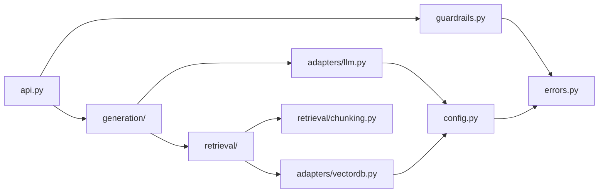

:::note In one line
**A module is one file, a package is a folder of them.** Imports feel like magic until you see how Python actually searches for files — then they become obvious.
:::

## Why this matters

Every project in this handbook from Phase 7 onwards is multi-file. Import errors are the
most demoralising beginner blocker — `ModuleNotFoundError` for a file that is *right there*
— and they all come from two facts: Python resolves imports from `sys.path`, and the
current working directory is not always what you think.

## Mental Model

- A **module** is one `.py` file.
- A **package** is a folder of them.
- An **import** makes Python go looking for one.

The confusing part is *where* it looks. It is not magic — it is a list, checked in order,
and the first match wins.

<figure class="lesson-figure">
<svg viewBox="0 0 660 250" role="img" aria-label="Diagram: when you write an import, Python checks a list of locations in order. First built-in modules, then the folder you ran the script from, then installed packages in the virtual environment. The first match wins.">
  <defs>
    <marker id="md-a" markerWidth="9" markerHeight="9" refX="8" refY="3" orient="auto">
      <path d="M0,0 L8,3 L0,6 z" fill="var(--text-muted)"/>
    </marker>
  </defs>

  <rect x="14" y="28" width="150" height="48" rx="9" fill="var(--panel-2)" stroke="var(--accent)" stroke-width="2"/>
  <text class="dg-mono" x="89" y="50" text-anchor="middle" fill="var(--accent)">import json</text>
  <text class="dg-sub"  x="89" y="68" text-anchor="middle">where is it?</text>

  <path class="dg-arrow" d="M164,52 L204,52" marker-end="url(#md-a)"/>

  <rect x="214" y="16" width="200" height="44" rx="8" class="dg-box"/>
  <text class="dg-label" x="230" y="36">1. built into Python</text>
  <text class="dg-sub"   x="230" y="52">json, os, pathlib, csv</text>

  <rect x="214" y="70" width="200" height="44" rx="8" class="dg-box"/>
  <text class="dg-label" x="230" y="90">2. your own folder</text>
  <text class="dg-sub"   x="230" y="106">where you ran the script</text>

  <rect x="214" y="124" width="200" height="44" rx="8" class="dg-box"/>
  <text class="dg-label" x="230" y="144">3. your .venv</text>
  <text class="dg-sub"   x="230" y="160">pip / uv installed things</text>

  <rect x="214" y="178" width="200" height="40" rx="8" fill="var(--panel)" stroke="var(--danger)" stroke-width="1.6"/>
  <text class="dg-sub" x="230" y="203" fill="var(--danger)">not found: ModuleNotFoundError</text>

  <path class="dg-arrow" d="M314,60 L314,66" marker-end="url(#md-a)"/>
  <path class="dg-arrow" d="M314,114 L314,120" marker-end="url(#md-a)"/>
  <path class="dg-arrow" d="M314,168 L314,174" marker-end="url(#md-a)"/>

  <rect x="450" y="60" width="196" height="60" rx="9" fill="var(--panel-2)" stroke="var(--ok)" stroke-width="1.8"/>
  <text class="dg-label" x="548" y="84" text-anchor="middle" fill="var(--ok)">first match wins</text>
  <text class="dg-sub"   x="548" y="104" text-anchor="middle">it stops looking</text>
  <path d="M414,38 Q440,38 448,74" stroke="var(--ok)" stroke-width="1.6" fill="none" marker-end="url(#md-a)"/>

  <text class="dg-sub" x="330" y="240" text-anchor="middle">You can see the real list any time with: import sys; print(sys.path)</text>
</svg>
<figcaption>
<strong>Your own folder is checked before installed packages.</strong> Which is exactly why
naming a file <code>json.py</code> breaks everything — your file is found first, and the real
<code>json</code> module becomes unreachable.
</figcaption>
</figure>

```python
import json                      # the whole module
from pathlib import Path         # one name out of a module
from . import helpers            # a sibling file in the same package
```

:::mistake Never name a file after a library
```text
my_project/
  json.py        <- you just broke every import of json in this project
  main.py
```
Your `json.py` sits in the folder Python checks *before* its own libraries, so
`import json` finds yours. The error it produces looks completely unrelated and people lose
hours to it.

Same trap: `csv.py`, `email.py`, `logging.py`, `types.py`, `test.py`.
:::

## Core Concepts

### Import forms

```python
import json                          # json.loads(...)
import numpy as np                   # alias
from pathlib import Path             # bring one name in
from .scoring import cosine_similarity   # relative: same package
from ..config import settings            # relative: parent package

from module import *                 # never do this: hides where names come from
```

### Packages and `__init__.py`

```text
src/ragkit/
├── __init__.py          marks the package; controls the public API
├── config.py
├── retrieval/
│   ├── __init__.py
│   ├── vector.py
│   └── keyword.py
└── generation/
    ├── __init__.py
    └── prompt.py
```

```python title="src/ragkit/__init__.py"
"""ragkit - a small retrieval toolkit.

Re-exporting the public API here means users write
    from ragkit import search
instead of
    from ragkit.retrieval.vector import search
and you keep the freedom to move modules around later.
"""
from .retrieval.vector import search
from .generation.prompt import build_prompt

__all__ = ["search", "build_prompt"]
__version__ = "0.1.0"
```

Keep `__init__.py` cheap: it runs on every import. Heavy work there (loading a model,
connecting to a database) makes `import ragkit` take ten seconds and breaks test collection.

### The `src` layout

```text
project/
├── src/ragkit/...        the package
├── tests/                tests import ragkit like a user does
├── pyproject.toml
└── README.md
```

```toml title="pyproject.toml"
[project]
name = "ragkit"
version = "0.1.0"
requires-python = ">=3.12"
dependencies = ["httpx>=0.27"]

[build-system]
requires = ["hatchling"]
build-backend = "hatchling.build"

[tool.hatch.build.targets.wheel]
packages = ["src/ragkit"]

[tool.pytest.ini_options]
pythonpath = ["src"]
testpaths = ["tests"]
```

Why `src/`? Because it makes it impossible to accidentally import your package from the
project root instead of from the installed copy — which is how packaging bugs reach
production undetected ("works on my machine, missing a file in the wheel").

After `uv sync`, your package is installed in editable mode: edits take effect immediately,
and `import ragkit` works from any directory.

### `if __name__ == "__main__"`

```python title="src/ragkit/cli.py"
def main() -> int:
    ...
    return 0


if __name__ == "__main__":
    raise SystemExit(main())
```

`__name__` is `"__main__"` when the file is run directly and `"ragkit.cli"` when imported.
Without this guard, importing a module executes its demo code — a surprisingly common cause
of "why did my test suite call the API?".

Run it as a module so relative imports resolve:

```bash
uv run python -m ragkit.cli --help      # correct
uv run python src/ragkit/cli.py         # relative imports will fail
```

### Circular imports

```text
config.py  imports  llm.py
llm.py     imports  config.py       ← ImportError: partially initialised module
```

Three fixes, in order of preference:

1. **Restructure**: the dependency should point one way. Config depends on nothing.
2. **Move the shared thing** into a third module both can import (`types.py`, `errors.py`).
3. **Import inside the function** that needs it (a last resort, but legitimate for breaking
   a cycle between two legitimately-coupled modules).

```python
def build_client():
    from .llm import LLMClient     # deferred import breaks the cycle at import time
    return LLMClient()
```

## Minimal Example

```text
demo/
├── src/demo/__init__.py
├── src/demo/math_utils.py
├── src/demo/cli.py
├── tests/test_math_utils.py
└── pyproject.toml
```

```python title="src/demo/math_utils.py"
"""Pure helpers - no imports from the rest of the package, so nothing can cycle."""


def mean(values: list[float]) -> float:
    if not values:
        raise ValueError("mean() requires at least one value")
    return sum(values) / len(values)


def percentile(values: list[float], p: float) -> float:
    """Nearest-rank percentile, p in [0, 100]."""
    if not 0 <= p <= 100:
        raise ValueError("p must be between 0 and 100")
    if not values:
        raise ValueError("percentile() requires at least one value")
    ordered = sorted(values)
    index = max(0, min(len(ordered) - 1, round(p / 100 * len(ordered)) - 1))
    return ordered[index]
```

```python title="src/demo/cli.py"
import sys

from .math_utils import mean, percentile


def main(argv: list[str] | None = None) -> int:
    args = argv if argv is not None else sys.argv[1:]
    try:
        values = [float(a) for a in args]
    except ValueError:
        print("usage: python -m demo.cli 12 8 30 ...", file=sys.stderr)
        return 2
    if not values:
        print("no values given", file=sys.stderr)
        return 2

    print(f"n      : {len(values)}")
    print(f"mean   : {mean(values):.2f}")
    print(f"p50    : {percentile(values, 50):.2f}")
    print(f"p95    : {percentile(values, 95):.2f}")
    return 0


if __name__ == "__main__":
    raise SystemExit(main())
```

```bash
uv run python -m demo.cli 120 340 88 910 220
```

```text
n      : 5
mean   : 335.60
p50    : 220.00
p95    : 910.00
```

Latency percentiles are exactly what you will report in Phase 24 — `p95` matters far more
than the mean when users are waiting.

## Real-World Example

The package layout used by every later project in this handbook:

```text
ai-service/
├── src/service/
│   ├── __init__.py
│   ├── config.py           settings; imports nothing internal
│   ├── errors.py           exception hierarchy; imports nothing internal
│   ├── models.py           Pydantic schemas; imports errors
│   ├── adapters/
│   │   ├── __init__.py
│   │   ├── llm.py          the ONLY file importing the provider SDK
│   │   └── vectordb.py     the ONLY file importing the vector DB client
│   ├── retrieval/
│   │   ├── __init__.py
│   │   ├── chunking.py     pure functions
│   │   └── search.py       uses adapters.vectordb
│   ├── generation/
│   │   ├── __init__.py
│   │   └── answer.py       uses adapters.llm + retrieval
│   ├── guardrails.py       pure validation functions
│   └── api.py              FastAPI app; imports everything, imported by nothing
├── tests/
│   ├── conftest.py
│   ├── test_chunking.py
│   └── test_guardrails.py
├── .env.example
├── pyproject.toml
└── README.md
```

The import graph is a directed acyclic graph pointing **inward**:



Nothing points back toward `api.py`, so there can be no cycles, and the leaves
(`chunking.py`, `guardrails.py`, `errors.py`) are pure and trivially testable.

## Common Mistakes

:::mistake
```text
1. Running a file inside a package directly
   python src/service/api.py       → relative imports fail
   python -m service.api           → correct

2. Naming a file after a standard library module
   json.py, logging.py, types.py in your project shadow the real ones - baffling errors

3. Top-level side effects
   # config.py
   client = OpenAI()               # runs at import: breaks tests, slows startup
   def get_client(): ...           # lazy, testable

4. from module import *
   Nobody can tell where a name came from, and it silently overwrites other names.

5. sys.path.append("..") to make imports work
   A sign the project is not installed. Fix pyproject.toml instead.
```
:::

## Debugging

```python
import sys, service
print(sys.executable)          # which interpreter?
print(service.__file__)        # which copy of the package is being imported?
print(sys.path[:5])            # where is Python looking?
```

Those three lines resolve most `ModuleNotFoundError`s in under a minute. If
`service.__file__` points at a directory you forgot about, you have two installs.

## Best Practices

1. One package per project, `src/` layout, installed via `uv sync`.
2. Leaf modules (`errors.py`, `config.py`, pure helpers) import nothing internal.
3. Vendor SDKs only in `adapters/` — one file per vendor.
4. `__init__.py` re-exports the public API and nothing else.
5. Every executable module gets `if __name__ == "__main__"`.
6. Keep modules under ~300 lines; when one grows past that, it is usually two modules.

## Hands-on Exercise

:::exercise Refactor a script into a package
Take the `clean_text`, `chunk_text`, `cosine_similarity` and `select_chunks` functions you
wrote in earlier lessons and organise them into a package:

```text
ragkit/
├── src/ragkit/__init__.py       re-export chunk_text and select_chunks
├── src/ragkit/text.py           clean_text, chunk_text
├── src/ragkit/scoring.py        cosine_similarity, normalise_scores
├── src/ragkit/select.py         select_chunks  (imports scoring)
├── tests/test_text.py
├── tests/test_select.py
└── pyproject.toml
```

Requirements: `uv run pytest` passes from the project root; `uv run python -c "import
ragkit; print(ragkit.__version__)"` works from *any* directory; no module imports `select`
except `__init__`.
:::

:::solution Key pieces
```toml title="pyproject.toml"
[project]
name = "ragkit"
version = "0.1.0"
requires-python = ">=3.12"
dependencies = []

[dependency-groups]
dev = ["pytest>=8.0"]

[build-system]
requires = ["hatchling"]
build-backend = "hatchling.build"

[tool.hatch.build.targets.wheel]
packages = ["src/ragkit"]

[tool.pytest.ini_options]
pythonpath = ["src"]
testpaths = ["tests"]
```

```python title="src/ragkit/__init__.py"
from .select import select_chunks
from .text import chunk_text, clean_text

__all__ = ["chunk_text", "clean_text", "select_chunks"]
__version__ = "0.1.0"
```

```python title="tests/test_select.py"
from ragkit import select_chunks          # import exactly as a user would


def test_respects_the_token_budget() -> None:
    candidates = [
        {"id": "a", "doc": "d1", "score": 0.9, "text": "x" * 400},
        {"id": "b", "doc": "d1", "score": 0.8, "text": "y" * 400},
    ]
    chosen = select_chunks(candidates, max_tokens=100)
    assert [c["id"] for c in chosen] == ["a"]
```

```bash
uv sync && uv run pytest -q
```

```text
..                                                       [100%]
2 passed in 0.04s
```

Because the tests import `ragkit` rather than a relative path, they prove the *installed*
package works — which is the thing that will run in production.
:::

## Challenge

:::challenge Find the cycle
Write a small script that walks your package with `ast.parse`, extracts every `import` and
`from ... import` statement, builds a dependency graph, and reports any cycles plus the
modules with the most dependents. Run it against a real open-source project. Understanding
that graph is how you decide where a new module belongs — and it is the same analysis that
tells you whether a codebase will be pleasant to work in.
:::

## Interview Questions

:::interview
1. What is the difference between a module and a package?
2. How does Python resolve `import x`?
3. Why is `python -m package.module` different from `python path/to/module.py`?
4. What causes a circular import, and how do you fix it properly?
5. Why do many projects use a `src/` layout?
:::

## Cheat Sheet

```python
import pkg.mod            from pkg.mod import name       import pkg.mod as m
from .sibling import f    from ..parent import g          # relative, packages only
__all__ = ["public_name"]                                 # controls `from pkg import *`
if __name__ == "__main__": raise SystemExit(main())

python -m pkg.module        # run a module inside a package
uv sync                     # install the project itself (editable)

# debugging imports
python -c "import pkg, sys; print(pkg.__file__); print(sys.executable)"
```

```quiz
[
  {
    "question": "You get ModuleNotFoundError for your own package when running pytest from the project root. What is the correct fix?",
    "options": [
      "Add sys.path.append('src') at the top of every test",
      "Configure the project (pyproject.toml + uv sync) so the package is installed in the environment",
      "Move all the code into one file",
      "Rename the package"
    ],
    "answer": 1,
    "explanation": "Installing the project makes imports work identically from any directory, in tests, in CI and in production. Path hacks only work in the one place you wrote them."
  },
  {
    "question": "Why guard demo code with `if __name__ == '__main__':`?",
    "options": [
      "It makes the module faster",
      "So the code runs only when the file is executed directly, not when it is imported",
      "It is required by PEP 8",
      "It enables relative imports"
    ],
    "answer": 1,
    "explanation": "Without the guard, importing the module executes it - so your test suite (or another module) would run the demo, hit the network, or print output."
  }
]
```

## Summary

- A module is a file, a package is a directory with `__init__.py`.
- Imports resolve via `sys.path`; installing your project makes that predictable.
- Use the `src/` layout so tests exercise the installed package.
- Keep the import graph acyclic and pointing inward; isolate vendor SDKs in adapters.
- Guard executable code with `if __name__ == "__main__"`.

## Next Step

Phase 1 is complete: you can write real Python. Phase 2 turns that into *engineering* —
classes, typing, async, testing and packaging.
