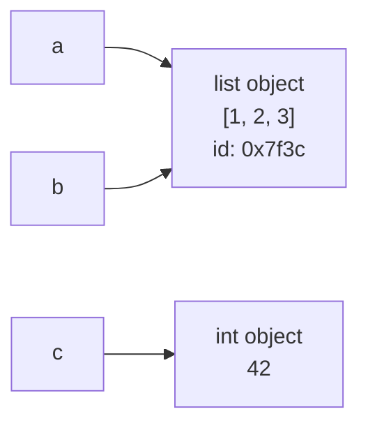

## Why this matters

Everything else in Python — every DataFrame, every model output, every agent state object —
is built out of the handful of types on this page. Getting the mental model right now
("names point at objects") prevents an entire category of bugs that otherwise bites you in
Phase 4 when a Pandas operation mysteriously changes data you thought you had copied.

## Mental Model

A variable is **not a box you put a value in**. It is a **label you stick on an object**.



If `a` and `b` label the same list and you change the list through `a`, then `b` sees the
change — because there is only one list. This is the single most important idea in this
lesson.

## Core Concepts

### Assignment binds a name to an object

```python
message = "Hello"      # the name `message` now refers to a str object
count = 3              # `count` refers to an int object
count = count + 1      # ints are immutable: this creates a NEW int (4) and rebinds `count`
```

Python is **dynamically typed** (a name can later refer to a different type) but **strongly
typed** (it will not silently convert a string into a number for you).

```python
x = 5
x = "now a string"     # allowed: dynamic typing
"3" + 5                # TypeError: strongly typed - no silent coercion
```

### The built-in types you will use daily

| Type | Example | Mutable? | Typical use |
| --- | --- | --- | --- |
| `str` | `"gpt"` | no | text, prompts, ids |
| `int` | `42` | no | counts, indices, token counts |
| `float` | `0.7` | no | probabilities, temperatures, scores |
| `bool` | `True` | no | flags, conditions |
| `NoneType` | `None` | n/a | "no value yet", missing data |
| `list` | `[1, 2, 3]` | **yes** | ordered collections, message history |
| `tuple` | `(1, 2)` | no | fixed records, dict keys, return groups |
| `dict` | `{"role": "user"}` | **yes** | structured data, JSON, config |
| `set` | `{1, 2}` | **yes** | uniqueness, membership tests |

### Checking types

```python
type(3.14)              # <class 'float'>
isinstance(3.14, float) # True  - prefer this in code
isinstance(True, int)   # True  - bool is a subclass of int, a classic surprise
```

## Syntax

```python
name = value                     # assignment
a = b = 0                        # both names point at the same 0
x, y = 1, 2                      # tuple unpacking
x, y = y, x                      # swap, no temp variable needed
first, *rest = [1, 2, 3, 4]      # first=1, rest=[2, 3, 4]
total: int = 0                   # optional type annotation (Phase 2)
MAX_RETRIES = 3                  # convention: ALL_CAPS means "constant, don't reassign"
```

Naming rules: letters, digits and underscores; cannot start with a digit; case-sensitive.
Convention (PEP 8): `snake_case` for variables and functions, `PascalCase` for classes,
`UPPER_SNAKE` for constants.

## Minimal Example

```python title="basics.py"
model = "claude-opus-5"
temperature = 0.2
max_tokens = 512
streaming = True
last_error = None

print(f"{model} @ temp={temperature}, max_tokens={max_tokens}")
print(f"streaming: {streaming}, last_error: {last_error}")
print(type(temperature), isinstance(max_tokens, int))
```

```bash
uv run python basics.py
```

```text
claude-opus-5 @ temp=0.2, max_tokens=512
streaming: True, last_error: None
<class 'float'> True
```

### f-strings, the only string formatting you need

```python
name = "Ada"
score = 0.8735
count = 7

f"Hello, {name}"                  # 'Hello, Ada'
f"{score:.2f}"                    # '0.87'          2 decimal places
f"{score:.1%}"                    # '87.4%'         percentage
f"{count:>5}"                     # '    7'         right-aligned in 5 chars
f"{count=}"                       # 'count=7'       debugging shorthand
f"{name.upper()}!"                # 'ADA!'          any expression works
```

## Real-World Example

```python title="request_summary.py"
"""Summarise one LLM API call - the kind of record you log for every request."""

request_id = "req_8f21c"
model = "claude-opus-5"
prompt_tokens = 1_847          # underscores are legal and aid readability
completion_tokens = 312
latency_ms = 2431
cost_per_1m_input = 3.00       # dollars
cost_per_1m_output = 15.00

total_tokens = prompt_tokens + completion_tokens
cost = (prompt_tokens / 1_000_000) * cost_per_1m_input + (
    completion_tokens / 1_000_000
) * cost_per_1m_output

print(f"[{request_id}] {model}")
print(f"  tokens : {prompt_tokens} in + {completion_tokens} out = {total_tokens}")
print(f"  latency: {latency_ms / 1000:.2f}s")
print(f"  cost   : ${cost:.6f}")
print(f"  tokens/second: {completion_tokens / (latency_ms / 1000):.1f}")
```

```text
[req_8f21c] claude-opus-5
  tokens : 1847 in + 312 out = 2159
  latency: 2.43s
  cost   : $0.010221
  tokens/second: 128.3
```

## Common Mistakes

:::mistake The aliasing trap — read this twice
```python
a = [1, 2, 3]
b = a              # NOT a copy: b labels the same list
b.append(4)
print(a)           # [1, 2, 3, 4]  ← a changed too!

c = a.copy()       # a real (shallow) copy
c.append(5)
print(a)           # [1, 2, 3, 4]  ← unchanged
```
Immutable types (`int`, `str`, `float`, `bool`, `tuple`) never have this problem, because
you cannot change them in place — every "change" creates a new object.
:::

:::mistake Comparing floats with ==
```python
0.1 + 0.2 == 0.3        # False! floats are binary approximations
0.1 + 0.2               # 0.30000000000000004

import math
math.isclose(0.1 + 0.2, 0.3)   # True - the correct way
```
This matters the moment you compare model scores or similarity values.
:::

:::mistake Integer division vs true division
```python
7 / 2       # 3.5   - always a float
7 // 2      # 3     - floor division
7 % 2       # 1     - remainder
-7 // 2     # -4    - floors toward negative infinity, not toward zero
```
:::

## Debugging

```python
value = [1, 2, 3]

print(f"{value=}")          # value=[1, 2, 3]        - fastest debugging tool in Python
print(type(value))          # <class 'list'>
print(id(value))            # 140234... object identity: same id == same object
print(a is b)               # identity comparison ("same object?")
print(a == b)               # equality comparison ("same contents?")
```

`is` versus `==` catches people constantly: use `is` only for `None`, `True` and `False`;
use `==` for values.

## Best Practices

1. Names should say what the value *means*: `retry_count`, not `n`; `retrieved_chunks`, not
   `data2`.
2. Prefer immutable types for anything shared or configuration-like.
3. Use `None` for "not set yet", never `""`, `0` or `-1` as a sentinel.
4. Keep constants at module top in `UPPER_SNAKE`.
5. Use `_` for values you must unpack but do not need: `_, score = pair`.

## Performance Considerations

- Small integers (-5 to 256) and short strings are cached and reused by CPython; that is why
  `a is b` is sometimes surprisingly `True` for numbers. Never rely on it.
- String concatenation in a loop (`s += x`) is O(n²); build a list and `"".join(parts)`.
- Checking membership is O(n) in a list and O(1) in a set — a real difference once you are
  deduplicating thousands of chunk ids in Phase 12.

## Hands-on Exercise

:::exercise Token budget calculator
Write `budget.py` that defines:

- `context_window = 200_000`
- `system_prompt_tokens = 1_200`
- `history_tokens = 8_450`
- `retrieved_tokens = 6_300`
- `output_reserve = 4_000`

Compute and print:
1. Tokens used so far.
2. Tokens remaining after reserving output space.
3. The percentage of the window used, to one decimal place.
4. A boolean `over_budget` that is `True` when remaining tokens are below zero.

Format the output so each number is readable (thousands separators are a nice touch:
`f"{n:,}"`).
:::

:::solution Solution
```python title="budget.py"
context_window = 200_000
system_prompt_tokens = 1_200
history_tokens = 8_450
retrieved_tokens = 6_300
output_reserve = 4_000

used = system_prompt_tokens + history_tokens + retrieved_tokens
remaining = context_window - used - output_reserve
pct_used = (used + output_reserve) / context_window * 100
over_budget = remaining < 0

print(f"used      : {used:,} tokens")
print(f"remaining : {remaining:,} tokens (after {output_reserve:,} reserved for output)")
print(f"window    : {pct_used:.1f}% consumed")
print(f"over budget: {over_budget}")
```

```text
used      : 15,950 tokens
remaining : 180,050 tokens (after 4,000 reserved for output)
window    : 10.0% consumed
over budget: False
```
:::

## Challenge

:::challenge Prove the aliasing bug to yourself
Write a script with two functions:

```python
def add_message_broken(history=[], text=""):   # mutable default argument!
    history.append(text)
    return history

def add_message_fixed(history=None, text=""):
    history = list(history or [])
    history.append(text)
    return history
```

Call each three times in a row with no `history` argument and print the result each time.
Explain in a comment why the first grows and the second does not. This exact bug — the
mutable default argument — appears in real agent code that accumulates message history.
:::

## Interview Questions

:::interview
1. What is the difference between `is` and `==`?
2. Which built-in types are immutable, and why does it matter?
3. Why does `0.1 + 0.2 != 0.3`, and what do you use instead?
4. What does `a = b` do when `b` is a list?
5. What is the mutable default argument bug?
:::

## Cheat Sheet

```python
# types
str int float bool None list tuple dict set

# assignment
x, y = y, x                 # swap
first, *rest = seq          # unpack with remainder

# f-strings
f"{v}"  f"{v:.2f}"  f"{v:.1%}"  f"{v:,}"  f"{v=}"  f"{v:>8}"

# copying
b = a           # alias - same object
b = a.copy()    # shallow copy
import copy; b = copy.deepcopy(a)   # nested copy

# comparisons
x is None       # identity: only for None/True/False
x == y          # equality: everything else
math.isclose(a, b)   # floats
```

```quiz
[
  {
    "question": "What does this print?\n\na = [1, 2]\nb = a\nb.append(3)\nprint(a)",
    "options": ["[1, 2]", "[1, 2, 3]", "[3]", "TypeError"],
    "answer": 1,
    "explanation": "`b = a` binds a second name to the same list object. Mutating through either name is visible through both. Use a.copy() for an independent list."
  },
  {
    "question": "Which comparison is correct for checking that a value is absent?",
    "options": ["if value == None:", "if value is None:", "if not value:", "if value == False:"],
    "answer": 1,
    "explanation": "`is None` tests identity against the single None object. `not value` is different - it is also true for 0, '', [] and {}."
  },
  {
    "question": "What is 7 // 2 in Python 3?",
    "options": ["3.5", "3", "4", "TypeError"],
    "answer": 1,
    "explanation": "`//` is floor division and returns 3. `/` always returns a float (3.5)."
  }
]
```

## Summary

- Variables are names bound to objects, not containers.
- Mutable objects (`list`, `dict`, `set`) can be changed through any name that refers to
  them; immutable ones cannot.
- f-strings handle all formatting; `f"{x=}"` is the fastest debugging tool you have.
- `is` for `None`, `==` for values, `math.isclose` for floats.

## Next Step

Strings deserve their own lesson: they are how you build every prompt you will ever send.
