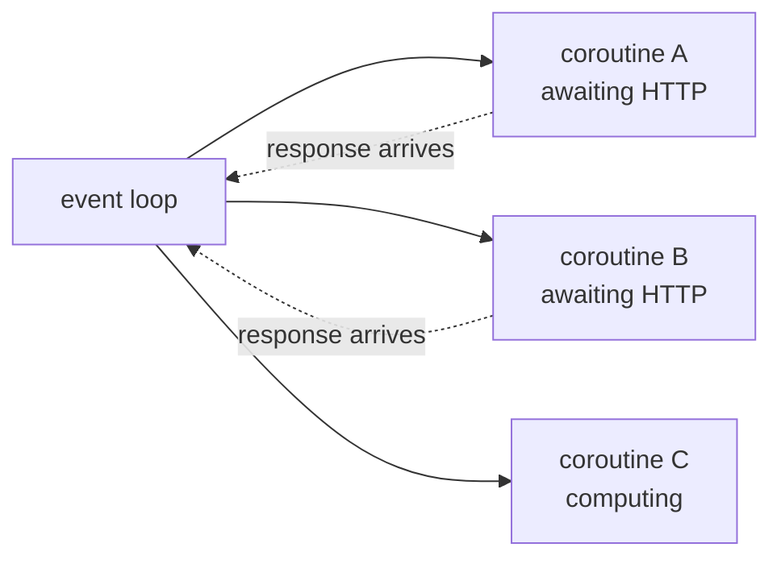

## Why this matters

AI workloads are **I/O bound**: you spend almost all your time waiting for an API. Embedding
500 chunks sequentially at 200 ms each takes 100 seconds; with 20 concurrent requests it
takes 5. Every serious ingestion pipeline, every agent that calls several tools, and every
streaming endpoint is async. FastAPI, httpx, LangChain and LangGraph are all async-first.

## Mental Model

```text
SYNC                                   ASYNC
call API ──wait 200ms── result         call API ─┐
call API ──wait 200ms── result         call API ─┼─ all waiting together ── results
call API ──wait 200ms── result         call API ─┘
total: 600ms                           total: ~200ms
```

One thread, one event loop. When a coroutine hits `await`, it yields control back to the
loop, which runs another ready coroutine. Nothing runs in parallel — but waiting happens
concurrently, and waiting is 99% of what your code does.



:::danger The one rule that matters
**A blocking call inside a coroutine freezes the entire event loop.** `time.sleep`,
`requests.get`, a CPU-heavy loop, a synchronous database driver — any of these stops every
other task. Use `asyncio.sleep`, `httpx.AsyncClient`, and `asyncio.to_thread` for
unavoidable blocking calls.
:::

## Core Concepts

### Coroutines

```python
import asyncio


async def fetch(url: str) -> str:          # defines a coroutine function
    await asyncio.sleep(0.2)               # non-blocking wait
    return f"content of {url}"


coro = fetch("a")            # nothing has run yet - this is a coroutine object
result = asyncio.run(fetch("a"))           # runs the loop until it completes
```

`asyncio.run()` is the single entry point at the top of your program. Never call it inside
a coroutine.

### Running things concurrently

```python
async def main() -> None:
    # sequential: 0.6s
    a = await fetch("a")
    b = await fetch("b")
    c = await fetch("c")

    # concurrent: 0.2s
    a, b, c = await asyncio.gather(fetch("a"), fetch("b"), fetch("c"))

    # concurrent, keeping failures instead of cancelling everything
    results = await asyncio.gather(*(fetch(u) for u in urls), return_exceptions=True)
    for result in results:
        if isinstance(result, Exception):
            logger.warning("one call failed: %s", result)
```

`await` on its own means "wait here"; `gather` means "start all of these, then wait".
Mixing them up is why some "async" code is no faster than sync code.

### TaskGroup — the modern structured form

```python
async def main() -> None:
    async with asyncio.TaskGroup() as group:       # Python 3.11+
        task_a = group.create_task(fetch("a"))
        task_b = group.create_task(fetch("b"))
    # both are complete here; if either raised, the group cancels the rest and re-raises
    print(task_a.result(), task_b.result())
```

TaskGroup gives structured concurrency: no task outlives the block, and errors are not
silently dropped.

### Limiting concurrency

Unbounded `gather` over 10,000 items opens 10,000 sockets and gets you rate-limited or
banned. A semaphore is the fix:

```python
async def embed_all(texts: list[str], *, concurrency: int = 20) -> list[list[float]]:
    semaphore = asyncio.Semaphore(concurrency)

    async def one(text: str) -> list[float]:
        async with semaphore:                    # at most `concurrency` inside at a time
            return await embed(text)

    return await asyncio.gather(*(one(t) for t in texts))
```

### Timeouts and cancellation

```python
async with asyncio.timeout(5.0):                  # 3.11+; raises TimeoutError
    result = await slow_call()

try:
    result = await asyncio.wait_for(slow_call(), timeout=5.0)
except TimeoutError:
    result = None
```

Cancellation propagates as `asyncio.CancelledError`. Never swallow it — clean up and
re-raise, or your tasks become unkillable.

### Async iterators and context managers

```python
async def stream_tokens(prompt: str):
    async for chunk in client.stream(prompt):     # async generator
        yield chunk.text


async with httpx.AsyncClient(timeout=10.0) as client:
    response = await client.get(url)
```

### Blocking calls: `to_thread`

```python
text = await asyncio.to_thread(extract_pdf_text, path)     # runs in a thread pool
```

This is how you use a synchronous library (PDF parsing, a sync SDK, a CPU-light blocking
call) without freezing the loop.

### asyncio vs threads vs processes

| Workload | Tool | Why |
| --- | --- | --- |
| Many API calls, DB queries | `asyncio` | thousands of concurrent waits, one thread |
| One blocking library call | `asyncio.to_thread` | keeps the loop free |
| CPU-heavy work (parsing, numeric) | `ProcessPoolExecutor` | the GIL blocks threads from using multiple cores |
| Mixed | async loop + process pool | offload the CPU part |

The **GIL** allows only one thread to execute Python bytecode at a time, so threads do not
speed up CPU-bound Python. They do help with blocking I/O in libraries that release the GIL
— but async does that better with far less memory.

## Minimal Example

```python title="async_demo.py"
import asyncio
import time


async def embed(text: str) -> list[float]:
    await asyncio.sleep(0.2)                      # pretend: an API call
    return [float(len(text))]


async def main() -> None:
    texts = [f"chunk {i}" for i in range(10)]

    start = time.perf_counter()
    sequential = [await embed(t) for t in texts]
    print(f"sequential: {time.perf_counter() - start:.2f}s")

    start = time.perf_counter()
    concurrent = await asyncio.gather(*(embed(t) for t in texts))
    print(f"concurrent: {time.perf_counter() - start:.2f}s")

    assert sequential == concurrent


asyncio.run(main())
```

```text
sequential: 2.01s
concurrent: 0.20s
```

Ten times faster, identical results, one thread.

## Real-World Example

A production-shaped async embedding client: bounded concurrency, retries, timeouts, batching
and progress.

```python title="src/service/adapters/embeddings.py"
"""Async embedding client.

The four properties that separate this from a toy:
  - bounded concurrency (never melt the provider or your own file descriptors)
  - per-request timeout and bounded retries with jittered backoff
  - batching, because embedding APIs charge and rate-limit per request
  - failures isolated per batch, so one bad batch does not lose the run
"""
from __future__ import annotations

import asyncio
import logging
import random
from collections.abc import Sequence
from dataclasses import dataclass, field

import httpx

logger = logging.getLogger(__name__)


class EmbeddingError(RuntimeError):
    pass


@dataclass(slots=True)
class EmbedStats:
    requests: int = 0
    retries: int = 0
    failures: int = 0
    texts: int = 0
    failed_batches: list[int] = field(default_factory=list)


class AsyncEmbedder:
    def __init__(
        self,
        client: httpx.AsyncClient,
        *,
        model: str = "text-embedding-3-small",
        batch_size: int = 64,
        concurrency: int = 8,
        timeout_s: float = 30.0,
        max_attempts: int = 4,
    ) -> None:
        self._client = client
        self.model = model
        self.batch_size = batch_size
        self.timeout_s = timeout_s
        self.max_attempts = max_attempts
        self._semaphore = asyncio.Semaphore(concurrency)
        self.stats = EmbedStats()

    async def embed(self, texts: Sequence[str]) -> list[list[float]]:
        """Embed every text, preserving input order."""
        batches = [
            list(texts[i : i + self.batch_size]) for i in range(0, len(texts), self.batch_size)
        ]
        logger.info("embedding %d texts in %d batches", len(texts), len(batches))

        async with asyncio.TaskGroup() as group:
            tasks = [group.create_task(self._embed_batch(b, i)) for i, b in enumerate(batches)]

        vectors: list[list[float]] = []
        for task in tasks:
            vectors.extend(task.result())
        self.stats.texts += len(texts)
        return vectors

    async def _embed_batch(self, batch: list[str], index: int) -> list[list[float]]:
        async with self._semaphore:
            last_error: Exception | None = None

            for attempt in range(1, self.max_attempts + 1):
                try:
                    async with asyncio.timeout(self.timeout_s):
                        response = await self._client.post(
                            "/embeddings", json={"model": self.model, "input": batch}
                        )
                    self.stats.requests += 1

                    if response.status_code == 429 or response.status_code >= 500:
                        raise EmbeddingError(f"retryable status {response.status_code}")
                    if response.status_code != 200:
                        raise EmbeddingError(
                            f"permanent status {response.status_code}: {response.text[:200]}"
                        )

                    payload = response.json()
                    return [item["embedding"] for item in payload["data"]]

                except (EmbeddingError, httpx.TransportError, TimeoutError) as exc:
                    last_error = exc
                    if "permanent" in str(exc) or attempt == self.max_attempts:
                        break
                    delay = min(0.5 * 2 ** (attempt - 1), 8.0)
                    delay += random.uniform(0, delay * 0.25)
                    self.stats.retries += 1
                    logger.warning(
                        "batch %d attempt %d/%d failed (%s); retrying in %.2fs",
                        index, attempt, self.max_attempts, exc, delay,
                    )
                    await asyncio.sleep(delay)

            self.stats.failures += 1
            self.stats.failed_batches.append(index)
            raise EmbeddingError(f"batch {index} failed after {self.max_attempts} attempts") from last_error


async def embed_corpus(texts: list[str], *, base_url: str, api_key: str) -> list[list[float]]:
    """One client for the whole run: connection pooling matters more than it looks."""
    async with httpx.AsyncClient(
        base_url=base_url,
        headers={"authorization": f"Bearer {api_key}"},
        timeout=httpx.Timeout(30.0, connect=5.0),
        limits=httpx.Limits(max_connections=20, max_keepalive_connections=10),
    ) as client:
        embedder = AsyncEmbedder(client, batch_size=64, concurrency=8)
        vectors = await embedder.embed(texts)
        logger.info("done: %s", embedder.stats)
        return vectors


# --- runnable demo with a fake transport, no network needed -----------------
async def _demo() -> None:
    logging.basicConfig(level="INFO", format="%(levelname)s %(message)s")

    async def handler(request: httpx.Request) -> httpx.Response:
        payload = request.read()
        count = payload.decode().count('"') // 2 - 2      # crude count of inputs
        await asyncio.sleep(0.05)
        return httpx.Response(
            200, json={"data": [{"embedding": [0.1, 0.2, 0.3]} for _ in range(max(count, 1))]}
        )

    transport = httpx.MockTransport(handler)
    async with httpx.AsyncClient(transport=transport, base_url="https://fake") as client:
        embedder = AsyncEmbedder(client, batch_size=4, concurrency=3)
        vectors = await embedder.embed([f"text {i}" for i in range(12)])
        print(f"vectors: {len(vectors)}, stats: {embedder.stats}")


if __name__ == "__main__":
    asyncio.run(_demo())
```

```text
INFO embedding 12 texts in 3 batches
vectors: 12, stats: EmbedStats(requests=3, retries=0, failures=0, texts=12, failed_batches=[])
```

## Common Mistakes

:::mistake
```python
# 1. Blocking the loop
async def bad():
    time.sleep(1)                 # freezes EVERYTHING
    requests.get(url)             # same
    await asyncio.sleep(1)        # correct
    await client.get(url)         # correct (httpx.AsyncClient)

# 2. Awaiting in a loop when you meant concurrency
results = [await fetch(u) for u in urls]                   # sequential
results = await asyncio.gather(*(fetch(u) for u in urls))   # concurrent

# 3. Forgetting to await
result = fetch(url)               # a coroutine object; RuntimeWarning: never awaited

# 4. Unbounded concurrency
await asyncio.gather(*(fetch(u) for u in ten_thousand_urls))   # use a Semaphore

# 5. Fire-and-forget tasks
asyncio.create_task(background())  # if nothing holds a reference it may be GC'd mid-flight
                                    # keep the reference, or use a TaskGroup

# 6. Swallowing CancelledError
except Exception:                  # CancelledError is BaseException in 3.8+, but be careful
    pass                           # never suppress cancellation

# 7. Creating a client per request
async with httpx.AsyncClient() as c:   # inside a hot path: no connection reuse
    ...                                 # create once, reuse for the process
```
:::

## Debugging

```python
asyncio.run(main(), debug=True)        # warns about slow callbacks blocking the loop
```

```python
import asyncio
for task in asyncio.all_tasks():
    print(task.get_name(), task.get_coro())     # what is still running?
```

Symptoms and causes:

| Symptom | Cause |
| --- | --- |
| Async code no faster than sync | awaiting in a loop instead of `gather` |
| Everything stalls periodically | a blocking call inside a coroutine |
| `RuntimeWarning: coroutine was never awaited` | missing `await` |
| `RuntimeError: Event loop is closed` | `asyncio.run` called twice, or a task outliving it |
| Provider 429s under load | no semaphore |

## Performance Considerations

- Concurrency is not parallelism. For CPU work use `ProcessPoolExecutor`; async will not
  help.
- Optimal concurrency is usually 5–20 for LLM/embedding APIs — beyond that you hit rate
  limits and add latency, not throughput. Measure.
- Batch first, then parallelise: one request with 64 inputs beats 64 concurrent requests on
  both cost and rate limits.
- Reuse one `AsyncClient` per process for connection pooling; creating one per call throws
  away the TCP/TLS handshake savings.

## Hands-on Exercise

:::exercise A concurrent tool runner
An agent wants to call several tools at once. Write
`run_tools(calls, *, concurrency=4, timeout_s=5.0)` where each call is
`{"id", "name", "args"}`, and:

1. runs them concurrently with bounded concurrency,
2. applies a per-tool timeout,
3. never lets one failure cancel the others,
4. returns results **in the original order** with
   `{"id", "status": "ok"|"error"|"timeout", "result"|"error", "duration_ms"}`,
5. logs a summary line: `ok=3 error=1 timeout=1 wall_ms=…`.

Simulate tools with `asyncio.sleep` and deliberately make one raise and one hang.
:::

:::solution Solution
```python title="tool_runner.py"
from __future__ import annotations

import asyncio
import logging
import time
from typing import Any

logger = logging.getLogger(__name__)


async def fake_tool(name: str, **kwargs: Any) -> dict[str, Any]:
    if name == "slow_tool":
        await asyncio.sleep(10)
    if name == "broken_tool":
        raise ValueError("upstream returned 500")
    await asyncio.sleep(0.1)
    return {"tool": name, "args": kwargs}


async def run_tools(
    calls: list[dict[str, Any]], *, concurrency: int = 4, timeout_s: float = 5.0
) -> list[dict[str, Any]]:
    semaphore = asyncio.Semaphore(concurrency)

    async def run_one(call: dict[str, Any]) -> dict[str, Any]:
        started = time.perf_counter()
        async with semaphore:
            try:
                async with asyncio.timeout(timeout_s):
                    result = await fake_tool(call["name"], **call.get("args", {}))
                status, payload = "ok", {"result": result}
            except TimeoutError:
                status, payload = "timeout", {"error": f"exceeded {timeout_s}s"}
            except Exception as exc:
                status, payload = "error", {"error": f"{type(exc).__name__}: {exc}"}
        return {
            "id": call["id"],
            "name": call["name"],
            "status": status,
            **payload,
            "duration_ms": int((time.perf_counter() - started) * 1000),
        }

    wall_start = time.perf_counter()
    # gather preserves input order, which matters: the model expects results per call id
    results = await asyncio.gather(*(run_one(c) for c in calls))
    wall_ms = int((time.perf_counter() - wall_start) * 1000)

    counts = {"ok": 0, "error": 0, "timeout": 0}
    for result in results:
        counts[result["status"]] += 1
    logger.info(
        "ok=%d error=%d timeout=%d wall_ms=%d", counts["ok"], counts["error"], counts["timeout"], wall_ms
    )
    return results


if __name__ == "__main__":
    logging.basicConfig(level="INFO", format="%(levelname)s %(message)s")
    calls = [
        {"id": "1", "name": "search", "args": {"q": "rag"}},
        {"id": "2", "name": "broken_tool", "args": {}},
        {"id": "3", "name": "calculator", "args": {"expr": "2+2"}},
        {"id": "4", "name": "slow_tool", "args": {}},
        {"id": "5", "name": "lookup", "args": {"id": "A-1"}},
    ]
    for row in asyncio.run(run_tools(calls, concurrency=3, timeout_s=1.0)):
        print(f"{row['id']} {row['name']:<12} {row['status']:<8} {row['duration_ms']:>5}ms")
```

```text
INFO ok=3 error=1 timeout=1 wall_ms=1104
1 search       ok         100ms
2 broken_tool  error        0ms
3 calculator   ok         100ms
4 slow_tool    timeout   1001ms
5 lookup       ok         100ms
```

Five tools, one hanging for a second, total wall time just over a second — and every result
returned in order with a status the agent can reason about. This is the parallel tool
execution you will wire into LangGraph in Phase 17.
:::

## Challenge

:::challenge Streaming fan-in
Write `merge_streams(*streams)` — an async generator that consumes several async generators
concurrently and yields `(stream_name, item)` as items arrive from any of them, finishing
when all are exhausted. Then use it to interleave three simulated token streams and print
them with their source.

You will need `asyncio.Queue` plus one task per stream. This is how a multi-agent UI shows
several agents thinking at once.
:::

## Interview Questions

:::interview
1. What is the difference between concurrency and parallelism?
2. Why does `time.sleep()` break an async application?
3. What does `asyncio.gather` do that a loop of `await`s does not?
4. How do you limit how many requests are in flight?
5. When is `asyncio` the wrong tool?
:::

## Cheat Sheet

```python
import asyncio

async def f(): await asyncio.sleep(1)
asyncio.run(main())                         # entry point, once

await coro                                  # wait for one
await asyncio.gather(*coros)                # run many concurrently (ordered results)
await asyncio.gather(*coros, return_exceptions=True)

async with asyncio.TaskGroup() as tg:       # structured concurrency (3.11+)
    t = tg.create_task(coro())

sem = asyncio.Semaphore(10)
async with sem: ...                         # bound concurrency

async with asyncio.timeout(5): ...          # deadline (3.11+)
await asyncio.wait_for(coro, timeout=5)

await asyncio.to_thread(blocking_fn, arg)   # blocking call off the loop
async for item in agen(): ...
async with httpx.AsyncClient() as client: ...

# CPU-bound instead:
from concurrent.futures import ProcessPoolExecutor
```

```quiz
[
  {
    "question": "Why is `results = [await fetch(u) for u in urls]` no faster than sync code?",
    "options": [
      "await is slow",
      "Each await completes before the next starts, so the calls are sequential",
      "List comprehensions cannot be async",
      "The event loop is single-threaded"
    ],
    "answer": 1,
    "explanation": "You need to create all the coroutines first and await them together with gather or a TaskGroup."
  },
  {
    "question": "You must call a synchronous PDF parser inside an async pipeline. What do you use?",
    "options": [
      "Call it directly; it is fine",
      "await asyncio.to_thread(parse, path)",
      "asyncio.sleep before calling it",
      "Wrap it in async def"
    ],
    "answer": 1,
    "explanation": "Wrapping a blocking function in `async def` changes nothing - it still blocks the loop. to_thread moves it to a worker thread."
  },
  {
    "question": "Embedding 10,000 texts, the provider starts returning 429s. What is the fix?",
    "options": [
      "Retry immediately in a tight loop",
      "Batch the inputs and bound concurrency with a Semaphore, with jittered backoff on 429",
      "Switch to threads",
      "Remove the timeout"
    ],
    "answer": 1,
    "explanation": "Batching cuts the request count, a semaphore caps in-flight requests, and jittered backoff prevents a synchronised retry storm."
  }
]
```

## Summary

- Async gives concurrency for I/O-bound work on a single thread — exactly the AI workload.
- `gather`/`TaskGroup` start work concurrently; a loop of `await`s does not.
- Bound concurrency with a semaphore, set timeouts, retry only retryable failures.
- Never block the loop; use `asyncio.to_thread` for synchronous libraries and processes for
  CPU work.

## Next Step

Testing with pytest — how to test all of this, including async code and the LLM calls you
must not make in CI.
