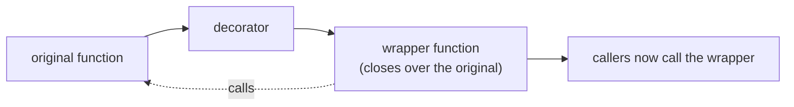

## Why this matters

`@app.get("/ask")`, `@tool`, `@pytest.fixture`, `@dataclass`, `@lru_cache` — decorators are
everywhere in the stack you are learning. Understanding them turns framework magic into
ordinary Python you can read, debug and write yourself. In Phase 22 you will write a `@tool`
decorator that turns a function into something an LLM can call; this lesson is how.

## Mental Model

A decorator is **a function that takes a function and returns a replacement**.

```python
@timed
def search(query): ...

# is exactly:
def search(query): ...
search = timed(search)
```



## Core Concepts

### The simplest decorator

```python
import functools
import time


def timed(fn):
    @functools.wraps(fn)                     # keeps __name__, __doc__, signature
    def wrapper(*args, **kwargs):
        start = time.perf_counter()
        try:
            return fn(*args, **kwargs)
        finally:
            elapsed_ms = (time.perf_counter() - start) * 1000
            print(f"{fn.__name__} took {elapsed_ms:.1f}ms")
    return wrapper


@timed
def embed(texts: list[str]) -> list[list[float]]:
    """Pretend to embed."""
    time.sleep(0.05)
    return [[0.1] * 4 for _ in texts]


embed(["a", "b"])
print(embed.__name__, "|", embed.__doc__)
```

```text
embed took 51.2ms
embed | Pretend to embed.
```

:::danger Always use `functools.wraps`
Without it, `embed.__name__` becomes `"wrapper"`, the docstring disappears, and tools that
introspect signatures — FastAPI, pytest, LangChain's `@tool` — break in confusing ways.
:::

### Decorators with arguments

A decorator that takes arguments is a function that *returns* a decorator — three levels.

```python
def retry(attempts: int = 3, *, delay: float = 0.5, exceptions=(Exception,)):
    """Retry a function on the given exceptions."""

    def decorator(fn):
        @functools.wraps(fn)
        def wrapper(*args, **kwargs):
            last: Exception | None = None
            for attempt in range(1, attempts + 1):
                try:
                    return fn(*args, **kwargs)
                except exceptions as exc:
                    last = exc
                    if attempt == attempts:
                        break
                    time.sleep(delay * 2 ** (attempt - 1))
            raise RuntimeError(f"{fn.__name__} failed after {attempts} attempts") from last
        return wrapper

    return decorator


@retry(attempts=4, delay=0.1, exceptions=(TimeoutError, ConnectionError))
def fetch(url: str) -> str: ...
```

Read it outside-in: `retry(...)` runs first and returns `decorator`, which is then applied
to `fetch`.

### Stacking

```python
@traced
@retry(attempts=3)
@timed
def answer(question: str) -> str: ...

# equivalent to: answer = traced(retry(attempts=3)(timed(answer)))
```

Bottom-up application, top-down execution: `traced` runs first at call time. Put
cross-cutting concerns in a consistent order across your codebase — usually tracing
outermost, then retries, then timing closest to the work.

### Class-based decorators

Useful when the decorator needs state.

```python
class CallCounter:
    def __init__(self, fn):
        functools.update_wrapper(self, fn)
        self.fn = fn
        self.calls = 0

    def __call__(self, *args, **kwargs):
        self.calls += 1
        return self.fn(*args, **kwargs)


@CallCounter
def embed(text: str) -> list[float]: ...

embed("x"); embed("y")
embed.calls          # 2
```

### Decorating methods

The wrapper receives `self` as the first positional argument like any other — no special
handling needed:

```python
class Client:
    @retry(attempts=3)
    def call(self, payload: dict) -> dict:      # `self` arrives inside *args
        ...
```

### The standard library ones you will use

```python
from functools import wraps, lru_cache, cache, cached_property, singledispatch

@lru_cache(maxsize=1024)          # memoise; arguments must be hashable
def tokenize(text: str) -> tuple[int, ...]: ...

@cache                             # unbounded lru_cache
def load_prompt(name: str) -> str: ...

class Index:
    @cached_property               # computed once per instance, then stored
    def dimension(self) -> int: ...

tokenize.cache_info()              # CacheInfo(hits=3, misses=1, maxsize=1024, currsize=1)
tokenize.cache_clear()
```

:::warning `lru_cache` on a method leaks memory
The cache keys include `self`, so instances are never garbage collected. Use
`@cached_property` for per-instance values, or cache a module-level function instead.
:::

## Minimal Example

```python title="decorators_demo.py"
import functools


def validate_not_empty(fn):
    """Reject blank string arguments before the function runs."""

    @functools.wraps(fn)
    def wrapper(text: str, *args, **kwargs):
        if not text or not text.strip():
            raise ValueError(f"{fn.__name__}() requires non-empty text")
        return fn(text, *args, **kwargs)

    return wrapper


@validate_not_empty
def summarise(text: str, max_words: int = 10) -> str:
    words = text.split()
    return " ".join(words[:max_words]) + ("…" if len(words) > max_words else "")


print(summarise("retrieval augmented generation grounds answers in your documents", max_words=4))
try:
    summarise("   ")
except ValueError as exc:
    print("rejected:", exc)
```

```text
retrieval augmented generation grounds…
rejected: summarise() requires non-empty text
```

## Real-World Example

A tool registry — the pattern behind `@tool` in every agent framework.

```python title="src/service/tools/registry.py"
"""Tool registry.

`@tool` records a function plus a JSON schema derived from its signature, so an
LLM can be told what it may call. This is genuinely all a framework's @tool does;
seeing it once removes the magic from Phase 22.
"""
from __future__ import annotations

import functools
import inspect
import logging
import time
from collections.abc import Callable
from dataclasses import dataclass, field
from typing import Any, get_type_hints

logger = logging.getLogger(__name__)

JSON_TYPES: dict[type, str] = {
    str: "string",
    int: "integer",
    float: "number",
    bool: "boolean",
    list: "array",
    dict: "object",
}


@dataclass(slots=True)
class RegisteredTool:
    name: str
    description: str
    fn: Callable[..., Any]
    schema: dict[str, Any]
    requires_approval: bool = False
    timeout_s: float = 10.0
    calls: int = 0
    failures: int = 0
    total_ms: float = 0.0

    @property
    def mean_ms(self) -> float:
        return self.total_ms / self.calls if self.calls else 0.0


REGISTRY: dict[str, RegisteredTool] = {}


def _build_schema(fn: Callable[..., Any]) -> dict[str, Any]:
    """Turn a signature + type hints into a JSON schema an LLM can consume."""
    signature = inspect.signature(fn)
    hints = get_type_hints(fn)

    properties: dict[str, Any] = {}
    required: list[str] = []

    for name, param in signature.parameters.items():
        if name == "self":
            continue
        annotation = hints.get(name, str)
        json_type = JSON_TYPES.get(annotation, "string")
        properties[name] = {"type": json_type, "description": f"{name} ({json_type})"}
        if param.default is inspect.Parameter.empty:
            required.append(name)

    return {"type": "object", "properties": properties, "required": required}


def tool(
    _fn: Callable[..., Any] | None = None,
    *,
    name: str | None = None,
    requires_approval: bool = False,
    timeout_s: float = 10.0,
):
    """Register a function as an LLM-callable tool.

    Usable bare (@tool) or with arguments (@tool(requires_approval=True)).
    """

    def decorator(fn: Callable[..., Any]) -> Callable[..., Any]:
        tool_name = name or fn.__name__
        description = inspect.getdoc(fn) or ""
        if not description:
            raise ValueError(f"tool {tool_name!r} needs a docstring - the model reads it")

        entry = RegisteredTool(
            name=tool_name,
            description=description.split("\n\n")[0],
            fn=fn,
            schema=_build_schema(fn),
            requires_approval=requires_approval,
            timeout_s=timeout_s,
        )

        @functools.wraps(fn)
        def wrapper(*args, **kwargs):
            start = time.perf_counter()
            entry.calls += 1
            try:
                return fn(*args, **kwargs)
            except Exception:
                entry.failures += 1
                logger.exception("tool %s failed", tool_name)
                raise
            finally:
                entry.total_ms += (time.perf_counter() - start) * 1000

        entry.fn = wrapper
        if tool_name in REGISTRY:
            raise ValueError(f"duplicate tool name: {tool_name!r}")
        REGISTRY[tool_name] = entry
        return wrapper

    return decorator(_fn) if _fn is not None else decorator


def tool_specs() -> list[dict[str, Any]]:
    """The payload you send to the model so it knows what it can call."""
    return [
        {"name": t.name, "description": t.description, "input_schema": t.schema}
        for t in REGISTRY.values()
    ]


# --- tools ----------------------------------------------------------------
@tool
def search_orders(customer_id: str, limit: int = 10) -> list[dict]:
    """Look up recent orders for a customer.

    Returns at most `limit` orders, newest first.
    """
    return [{"order_id": "A-993", "total": 129.99} for _ in range(min(limit, 2))]


@tool(requires_approval=True, timeout_s=30.0)
def issue_refund(order_id: str, amount: float) -> dict:
    """Refund an order. Requires human approval before execution."""
    return {"order_id": order_id, "refunded": amount}


if __name__ == "__main__":
    import json

    print(json.dumps(tool_specs(), indent=2))
    search_orders("cust_1", limit=2)
    search_orders("cust_2")
    entry = REGISTRY["search_orders"]
    print(f"\n{entry.name}: calls={entry.calls} failures={entry.failures} mean={entry.mean_ms:.2f}ms")
    print("needs approval:", [t.name for t in REGISTRY.values() if t.requires_approval])
```

```text
[
  {
    "name": "search_orders",
    "description": "Look up recent orders for a customer.",
    "input_schema": {
      "type": "object",
      "properties": {
        "customer_id": {"type": "string", "description": "customer_id (string)"},
        "limit": {"type": "integer", "description": "limit (integer)"}
      },
      "required": ["customer_id"]
    }
  },
  ...
]

search_orders: calls=2 failures=0 mean=0.01ms
needs approval: ['issue_refund']
```

## Common Mistakes

:::mistake
```python
# 1. Forgetting functools.wraps - breaks introspection everywhere

# 2. Calling the function at decoration time
def bad(fn):
    return fn()                 # runs immediately; returns the RESULT, not a function

# 3. Losing the return value
def wrapper(*args, **kwargs):
    fn(*args, **kwargs)         # returns None - a silent, maddening bug
    # return fn(...)

# 4. Bare vs parameterised confusion
@retry                          # if retry expects arguments, `fn` becomes `attempts`
@retry()                        # correct for a parameterised decorator

# 5. lru_cache with unhashable arguments
@lru_cache
def f(items: list): ...         # TypeError: unhashable type 'list'

# 6. Shared mutable state in a decorator across instances
def counted(fn):
    calls = 0                   # one counter for ALL instances of a decorated method
```
:::

## Debugging

```python
print(fn.__wrapped__)          # functools.wraps stores the original here
print(inspect.signature(fn))   # correct only if wraps was used
print(fn.__module__, fn.__qualname__)
```

If a decorated function behaves oddly, call `fn.__wrapped__(...)` to bypass the wrapper and
isolate whether the bug is in the decorator or the function.

## Best Practices

1. `functools.wraps` on every wrapper, always.
2. One concern per decorator; stack them rather than adding flags.
3. Support both `@d` and `@d(...)` forms only when it genuinely helps (the `_fn=None`
   pattern above).
4. Keep decorators thin — they should delegate to a tested function, not contain logic.
5. Do not hide expensive or dangerous behaviour behind a decorator; a reader must be able to
   see that a network call happens.

## Performance Considerations

- Each decorator adds one Python function call (~100 ns). Irrelevant for I/O-bound work,
  measurable in a million-iteration numeric loop.
- `lru_cache` turns repeated pure computation into a dict lookup — one of the highest-value
  one-line optimisations available (embedding the same query text, tokenising repeated
  prompts).
- Decorators run at **import time**. Heavy work there (opening connections, loading models)
  slows every import, including test collection.

## Hands-on Exercise

:::exercise A budget decorator
Write `@budget(max_calls, max_cost_usd)` that:

1. tracks calls and accumulated cost per decorated function,
2. expects the wrapped function to return `(result, cost_usd)`,
3. raises `BudgetExceeded` *before* calling when either limit would be breached,
4. exposes `fn.usage` → `{"calls": n, "cost_usd": x, "remaining_calls": r}`,
5. provides `fn.reset()`.

Then decorate a fake `llm_call(prompt)` and prove the guard triggers.
:::

:::solution Solution
```python title="budget_decorator.py"
from __future__ import annotations

import functools


class BudgetExceeded(RuntimeError):
    pass


def budget(*, max_calls: int = 100, max_cost_usd: float = 1.0):
    """Cap how often and how expensively a function may be called."""

    def decorator(fn):
        state = {"calls": 0, "cost_usd": 0.0}

        @functools.wraps(fn)
        def wrapper(*args, **kwargs):
            if state["calls"] >= max_calls:
                raise BudgetExceeded(
                    f"{fn.__name__}: call budget exhausted ({max_calls} calls)"
                )
            if state["cost_usd"] >= max_cost_usd:
                raise BudgetExceeded(
                    f"{fn.__name__}: cost budget exhausted "
                    f"(${state['cost_usd']:.4f} of ${max_cost_usd:.2f})"
                )

            result, cost = fn(*args, **kwargs)
            state["calls"] += 1
            state["cost_usd"] += cost
            return result

        def usage() -> dict[str, float | int]:
            return {
                "calls": state["calls"],
                "cost_usd": round(state["cost_usd"], 6),
                "remaining_calls": max_calls - state["calls"],
                "remaining_usd": round(max_cost_usd - state["cost_usd"], 6),
            }

        def reset() -> None:
            state["calls"], state["cost_usd"] = 0, 0.0

        wrapper.usage = usage          # attach helpers to the wrapper
        wrapper.reset = reset
        return wrapper

    return decorator


@budget(max_calls=3, max_cost_usd=0.05)
def llm_call(prompt: str) -> tuple[str, float]:
    """Fake call returning (text, cost)."""
    return f"answer to {prompt!r}", 0.02


if __name__ == "__main__":
    for i in range(4):
        try:
            print(llm_call(f"q{i}"), llm_call.usage())
        except BudgetExceeded as exc:
            print("blocked:", exc)
            break
    llm_call.reset()
    print("after reset:", llm_call.usage())
```

```text
answer to 'q0' {'calls': 1, 'cost_usd': 0.02, 'remaining_calls': 2, 'remaining_usd': 0.03}
answer to 'q1' {'calls': 2, 'cost_usd': 0.04, 'remaining_calls': 1, 'remaining_usd': 0.01}
blocked: llm_call: cost budget exhausted ($0.0400 of $0.05)
after reset: {'calls': 0, 'cost_usd': 0.0, 'remaining_calls': 3, 'remaining_usd': 0.05}
```

This is a real Phase 19 guardrail: a runaway agent stops costing money at a number you
chose, not at the number your invoice reveals next month.
:::

## Challenge

:::challenge A tracing decorator
Write `@traced(span_name)` that records, for every call: a generated span id, the parent
span id (via a `contextvars.ContextVar`, so nesting works), start/end timestamps, arguments
(redacted for parameters named in a `sensitive` set), the outcome, and any exception. Emit
each span as one JSON line.

Decorate three nested functions and confirm the output reconstructs the call tree. You have
just built the core of Phase 24's observability layer — Langfuse and OpenTelemetry do this,
with more features and the same idea.
:::

## Interview Questions

:::interview
1. What does `@decorator` actually do to the function?
2. Why is `functools.wraps` important?
3. How do you write a decorator that takes arguments?
4. In `@a @b def f()`, which wrapper runs first when `f` is called?
5. Why is `lru_cache` on an instance method a memory leak?
:::

## Cheat Sheet

```python
import functools

def simple(fn):
    @functools.wraps(fn)
    def wrapper(*args, **kwargs):
        return fn(*args, **kwargs)
    return wrapper

def parameterised(x=1):
    def decorator(fn):
        @functools.wraps(fn)
        def wrapper(*args, **kwargs):
            return fn(*args, **kwargs)
        return wrapper
    return decorator

# both @d and @d(...) supported
def flexible(_fn=None, *, opt=1):
    def decorator(fn): ...
    return decorator(_fn) if _fn else decorator

from functools import lru_cache, cache, cached_property, singledispatch
fn.__wrapped__            # the original, when wraps was used
```

```quiz
[
  {
    "question": "Why use functools.wraps inside a decorator?",
    "options": [
      "It makes the function faster",
      "It copies __name__, __doc__ and signature metadata to the wrapper",
      "It is required for the decorator to work",
      "It enables caching"
    ],
    "answer": 1,
    "explanation": "Without it the decorated function reports itself as 'wrapper' with no docstring, breaking help(), pytest collection, FastAPI routing and schema generation."
  },
  {
    "question": "@traced @retry(3) @timed def f(): ... — which wrapper executes first when f() is called?",
    "options": ["timed", "retry", "traced", "Undefined order"],
    "answer": 2,
    "explanation": "Decorators apply bottom-up, so traced ends up outermost and runs first; timed is closest to the original function."
  },
  {
    "question": "Your decorator makes the function return None. What is the most likely bug?",
    "options": [
      "Missing functools.wraps",
      "The wrapper calls fn(...) but does not return its result",
      "The decorator takes arguments",
      "The function is async"
    ],
    "answer": 1,
    "explanation": "Forgetting `return` in the wrapper silently discards every result - the single most common decorator bug."
  }
]
```

## Summary

- A decorator replaces a function with a wrapper that closes over the original.
- Parameterised decorators are functions returning decorators — three nested levels.
- Always `functools.wraps`; always return the wrapped call's result.
- Registries built with decorators are how frameworks discover tools, routes and fixtures.

## Next Step

Generators, iterators and context managers — laziness, streaming, and guaranteed cleanup.
