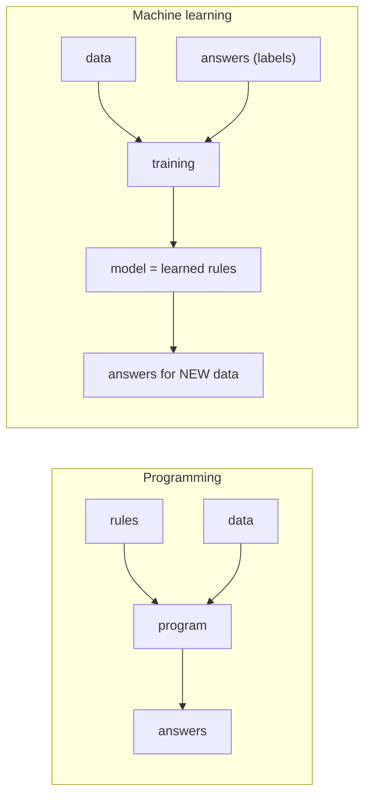

## Why this matters

Two reasons this phase is not optional for an AI engineer. First, a large share of the
problems people bring to LLMs are better solved by a 40-line classifier — cheaper, faster,
testable. Second, every concept you need for judging LLM systems (Phase 24) originates here:
what a held-out set is, why a metric can be high and the system still useless, and how
leakage manufactures results that evaporate in production.

## Mental Model

Traditional programming and machine learning run in opposite directions.



The output of training is a *function*, and the only thing that matters about it is how it
behaves on data it has never seen. Everything else — training accuracy, how clever the
algorithm is, how long it trained — is instrumental.

## Core Concepts

### The three kinds of learning

| Kind | You have | You want | Examples |
| --- | --- | --- | --- |
| **Supervised** | inputs **and** labels | predict the label for new inputs | spam detection, churn, price prediction, ticket routing |
| **Unsupervised** | inputs only | structure | customer segments, anomaly detection, topic clusters |
| **Reinforcement** | an environment and rewards | a policy | game playing, RLHF alignment of LLMs |

Supervised learning splits into **regression** (predict a number: latency, price, score) and
**classification** (predict a category: spam/not, escalate/answer/refuse).

### Features, labels, examples

```text
        ┌──────── features (X) ────────┐   ┌─ label (y) ─┐
row  |  tokens  latency_ms  top_score  |  |  escalated  |
 0   |    1840        920       0.88   |  |      0      |
 1   |    3120       2400       0.31   |  |      1      |

X.shape = (n_samples, n_features)      y.shape = (n_samples,)
```

Feature engineering — turning raw data into informative columns — usually matters more than
the choice of algorithm. A great model on weak features loses to a mediocre model on strong
ones, every time.

### The split, and why there are three parts

```text
ALL DATA
├── train       60%   the model fits its parameters here
├── validation  20%   you choose hyperparameters and compare models here
└── test        20%   touched ONCE, at the very end, to estimate real performance
```

The test set is a simulation of the future. Every time you look at it and change something,
you leak a little information into your decisions and the estimate becomes optimistic. The
discipline is not academic: it is the difference between "94% accurate" in a slide and 71%
in production.

```python
from sklearn.model_selection import train_test_split

X_train, X_temp, y_train, y_temp = train_test_split(
    X, y, test_size=0.4, random_state=42, stratify=y      # stratify keeps class balance
)
X_val, X_test, y_val, y_test = train_test_split(
    X_temp, y_temp, test_size=0.5, random_state=42, stratify=y_temp
)
```

:::danger Time-ordered data must be split by time
```python
train_test_split(X, y, shuffle=True)      # WRONG for anything with a time dimension
```
Random shuffling lets the model learn from the future to predict the past. For logs,
transactions, tickets and prices, sort by time and cut: train on January–March, validate on
April, test on May. Almost every over-optimistic model in the wild has this bug.
:::

### Overfitting, underfitting, and the trade-off

```text
UNDERFIT                  GOOD                      OVERFIT
train error  high         train error  low          train error  ~0
test error   high         test error   low          test error   high
"too simple to learn"     "learned the pattern"     "memorised the noise"

fix: more features,       stop here                 fix: more data, fewer features,
     more capacity                                       regularisation, simpler model
```

**Bias** is error from wrong assumptions (too simple). **Variance** is error from
sensitivity to the particular training sample (too complex). Total error falls then rises as
you add complexity; the minimum is the model you want, and the validation set is how you
find it.

```python
import matplotlib.pyplot as plt
from sklearn.model_selection import learning_curve

sizes, train_scores, val_scores = learning_curve(
    model, X, y, cv=5, train_sizes=np.linspace(0.1, 1.0, 8), scoring="f1"
)
# a large persistent gap between the curves = variance (overfitting): get more data
# both curves low and converged      = bias (underfitting): get a better model/features
```

### Data leakage — the silent killer

Leakage is any information in your training features that would not be available at
prediction time. It produces excellent offline numbers and a useless system.

| Leak | Why it happens | Fix |
| --- | --- | --- |
| Scaling before splitting | the scaler sees test statistics | fit the scaler on train only, inside a Pipeline |
| A feature computed from the label | `refund_amount` when predicting `refunded` | remove it; ask "would I know this at decision time?" |
| Duplicate rows across splits | the same record in train and test | deduplicate before splitting |
| Future information | "total orders" computed over the whole history | compute as of the prediction timestamp |
| Group leakage | same customer in train and test | `GroupShuffleSplit` by customer |
| Target encoding without folds | category means computed on all data | compute within cross-validation folds |

:::tip The leakage question
For every feature, ask: *"At the moment I need the prediction, do I actually have this
value?"* If the answer is "well, we'd know it soon after", it is a leak. This one question
catches most of them.
:::

## Minimal Example

A complete supervised workflow in fifteen lines — the shape everything else elaborates on.

```python title="first_model.py"
import numpy as np
from sklearn.datasets import make_classification
from sklearn.linear_model import LogisticRegression
from sklearn.metrics import accuracy_score, f1_score
from sklearn.model_selection import train_test_split
from sklearn.pipeline import make_pipeline
from sklearn.preprocessing import StandardScaler

X, y = make_classification(n_samples=2_000, n_features=12, n_informative=5,
                           weights=[0.85, 0.15], random_state=42)

X_train, X_test, y_train, y_test = train_test_split(
    X, y, test_size=0.2, random_state=42, stratify=y
)

# The Pipeline is what prevents scaling leakage: the scaler is fitted on train folds only.
model = make_pipeline(StandardScaler(), LogisticRegression(max_iter=1_000, class_weight="balanced"))
model.fit(X_train, y_train)

predictions = model.predict(X_test)
print(f"accuracy: {accuracy_score(y_test, predictions):.3f}")
print(f"f1      : {f1_score(y_test, predictions):.3f}")
print(f"baseline (always predict majority): {max(y_test.mean(), 1 - y_test.mean()):.3f}")
```

```text
accuracy: 0.878
f1      : 0.661
baseline (always predict majority): 0.850
```

Read those three numbers together. 87.8% accuracy sounds good until you see that predicting
"not spam" for everything scores 85%. **Always compute the trivial baseline first** — it is
the cheapest way to avoid celebrating nothing.

## Real-World Example

A leakage-free experiment harness: honest splits, a baseline, cross-validation, and a
report you could defend in a review.

```python title="src/ml/experiment.py"
"""A small experiment harness.

Everything that separates a trustworthy result from a flattering one:
  - deduplicate before splitting
  - split by group or by time when the data demands it
  - compare against a trivial baseline
  - all preprocessing inside a Pipeline so cross-validation cannot leak
  - report a confidence interval, not a single number
"""
from __future__ import annotations

from dataclasses import dataclass, field

import numpy as np
import pandas as pd
from sklearn.base import BaseEstimator
from sklearn.dummy import DummyClassifier
from sklearn.model_selection import (
    GroupShuffleSplit,
    StratifiedKFold,
    TimeSeriesSplit,
    cross_validate,
)


@dataclass
class ExperimentResult:
    name: str
    metrics: dict[str, float] = field(default_factory=dict)
    fold_scores: dict[str, list[float]] = field(default_factory=dict)
    n_train: int = 0
    n_test: int = 0

    def confidence_interval(self, metric: str) -> tuple[float, float]:
        """Rough 95% interval over folds - report this, not a bare mean."""
        scores = np.asarray(self.fold_scores.get(metric, []))
        if scores.size < 2:
            return (float("nan"), float("nan"))
        margin = 1.96 * scores.std(ddof=1) / np.sqrt(scores.size)
        return (float(scores.mean() - margin), float(scores.mean() + margin))

    def summary(self) -> str:
        lines = [f"{self.name}  (train={self.n_train:,})"]
        for metric, value in self.metrics.items():
            low, high = self.confidence_interval(metric)
            interval = f"  [{low:.3f}, {high:.3f}]" if not np.isnan(low) else ""
            lines.append(f"  {metric:<12} {value:.3f}{interval}")
        return "\n".join(lines)


def prepare(df: pd.DataFrame, *, key: str | None = None) -> pd.DataFrame:
    """Deduplicate before anything else: duplicates across splits are leakage."""
    before = len(df)
    cleaned = df.drop_duplicates(subset=[key] if key else None).reset_index(drop=True)
    if len(cleaned) < before:
        print(f"[prepare] dropped {before - len(cleaned):,} duplicate rows before splitting")
    return cleaned


def make_splitter(kind: str, *, n_splits: int = 5, random_state: int = 42):
    """Choose a split strategy that matches the data's structure."""
    if kind == "stratified":
        return StratifiedKFold(n_splits=n_splits, shuffle=True, random_state=random_state)
    if kind == "time":
        return TimeSeriesSplit(n_splits=n_splits)          # never trains on the future
    if kind == "group":
        return GroupShuffleSplit(n_splits=n_splits, test_size=0.2, random_state=random_state)
    raise ValueError(f"unknown split kind: {kind!r}")


def run_experiment(
    name: str,
    estimator: BaseEstimator,
    X: pd.DataFrame,
    y: pd.Series,
    *,
    split: str = "stratified",
    groups: pd.Series | None = None,
    scoring: tuple[str, ...] = ("accuracy", "precision", "recall", "f1", "roc_auc"),
) -> ExperimentResult:
    splitter = make_splitter(split)
    scores = cross_validate(
        estimator, X, y,
        cv=splitter,
        groups=groups,
        scoring=list(scoring),
        n_jobs=-1,
        return_train_score=True,
    )

    result = ExperimentResult(name=name, n_train=len(X))
    for metric in scoring:
        fold_values = scores[f"test_{metric}"]
        result.metrics[metric] = float(np.mean(fold_values))
        result.fold_scores[metric] = [float(v) for v in fold_values]

    # Overfitting check: a large train/test gap is variance, not skill.
    train_f1 = float(np.mean(scores.get("train_f1", [np.nan])))
    gap = train_f1 - result.metrics.get("f1", 0.0)
    result.metrics["train_test_gap"] = gap
    if gap > 0.15:
        print(f"[{name}] WARNING: train f1 exceeds test f1 by {gap:.2f} - likely overfitting")

    return result


def baseline(X: pd.DataFrame, y: pd.Series, *, split: str = "stratified") -> ExperimentResult:
    """The number every model must beat to be worth deploying."""
    return run_experiment("baseline (most frequent)",
                          DummyClassifier(strategy="most_frequent"), X, y, split=split)


def compare(results: list[ExperimentResult], *, metric: str = "f1") -> pd.DataFrame:
    rows = []
    for result in results:
        low, high = result.confidence_interval(metric)
        rows.append({
            "model": result.name,
            metric: round(result.metrics.get(metric, float("nan")), 4),
            "ci_low": round(low, 4),
            "ci_high": round(high, 4),
            "gap": round(result.metrics.get("train_test_gap", float("nan")), 4),
        })
    return pd.DataFrame(rows).sort_values(metric, ascending=False).reset_index(drop=True)


if __name__ == "__main__":
    from sklearn.ensemble import RandomForestClassifier
    from sklearn.linear_model import LogisticRegression
    from sklearn.pipeline import make_pipeline
    from sklearn.preprocessing import StandardScaler

    rng = np.random.default_rng(42)
    n = 4_000

    # A realistic escalation-prediction dataset for an LLM support assistant.
    df = pd.DataFrame({
        "user_id": rng.integers(1, 400, n),                  # groups: same user appears often
        "tokens": rng.integers(400, 6_000, n),
        "top_score": rng.beta(5, 2, n),
        "n_chunks": rng.integers(1, 12, n),
        "question_length": rng.integers(20, 500, n),
        "prior_escalations": rng.poisson(0.4, n),
    })
    logit = (
        -2.2
        + 2.6 * (1 - df["top_score"])
        + 0.0003 * df["tokens"]
        + 0.45 * df["prior_escalations"]
        + rng.normal(0, 0.6, n)
    )
    df["escalated"] = (1 / (1 + np.exp(-logit)) > 0.5).astype(int)

    df = prepare(df)
    features = ["tokens", "top_score", "n_chunks", "question_length", "prior_escalations"]
    X, y, groups = df[features], df["escalated"], df["user_id"]

    results = [
        baseline(X, y),
        run_experiment("logistic regression",
                       make_pipeline(StandardScaler(), LogisticRegression(max_iter=1_000)), X, y),
        run_experiment("random forest",
                       RandomForestClassifier(n_estimators=300, random_state=42), X, y),
        run_experiment("random forest (grouped split)",
                       RandomForestClassifier(n_estimators=300, random_state=42),
                       X, y, split="group", groups=groups),
    ]

    for result in results:
        print(result.summary(), "\n")
    print(compare(results).to_string(index=False))
```

```text
baseline (most frequent)  (train=4,000)
  accuracy     0.673  [0.665, 0.681]
  f1           0.000  [nan, nan]

logistic regression  (train=4,000)
  accuracy     0.839  [0.826, 0.852]
  f1           0.752  [0.733, 0.771]
  roc_auc      0.905  [0.895, 0.915]

[random forest] WARNING: train f1 exceeds test f1 by 0.24 - likely overfitting

                        model      f1  ci_low  ci_high     gap
          logistic regression  0.7524  0.7331   0.7717  0.0143
                random forest  0.7361  0.7188   0.7534  0.2402
 random forest (grouped split) 0.7188  0.6903   0.7473  0.2571
     baseline (most frequent)  0.0000     NaN      NaN  0.0000
```

Three things to take from that output. The baseline gets 67% accuracy by always saying "no"
— so accuracy alone would have been meaningless. The random forest memorises the training
set (gap 0.24) and does not beat plain logistic regression. And the grouped split scores
lower, because it stops the model recognising individual users — which is the honest number.

## Common Mistakes

:::mistake
```python
# 1. No baseline
"94% accuracy!"                    # on a dataset that is 94% one class

# 2. Scaling before splitting
X_scaled = StandardScaler().fit_transform(X)      # test statistics leak into training
train_test_split(X_scaled, y)
# → put the scaler in a Pipeline

# 3. Random split on time-ordered data
train_test_split(logs, shuffle=True)              # trains on the future

# 4. Tuning on the test set
for params in grid: score on X_test               # the test set is now a validation set

# 5. Ignoring class imbalance
# 1% positives: accuracy 99% by predicting nothing. Use precision/recall/PR-AUC.

# 6. A feature that encodes the answer
"days_until_cancellation" when predicting cancellation

# 7. Reporting a single number without an interval
"f1 = 0.73"                                        # over 5 folds it might be 0.61-0.85
```
:::

## Debugging

Questions to ask, in order, when a model disappoints:

1. **What is the baseline?** If the model does not beat "predict the majority" or "predict
   yesterday's value", nothing else matters.
2. **What is the train score?** Low → underfitting (bias). High with a low test score →
   overfitting (variance).
3. **Is it suspiciously good?** Above ~0.98 on a messy real problem almost always means
   leakage. Look for a feature that encodes the label.
4. **What does it get wrong?** Inspect the actual misclassified rows; patterns there beat
   any amount of hyperparameter tuning.
5. **Does performance hold on the most recent slice of time?** If not, there is drift or
   temporal leakage.

## Performance Considerations

- More data usually beats a better algorithm; better features usually beat both.
- Start with logistic regression or gradient boosting. If they cannot do it, the features
  are the problem.
- Cross-validation multiplies training cost by the number of folds — use 5 folds, and
  `n_jobs=-1`.
- If training takes hours, sample down while iterating; only train on everything for the
  final run.

## Hands-on Exercise

:::exercise Build a leaky model, then fix it
Create a dataset for predicting whether a support ticket will be escalated, with columns:
`ticket_id`, `customer_id`, `created_at`, `message_length`, `sentiment`, `product`,
`agent_response_time_min`, `resolution_hours`, and the label `escalated`.

1. Train a model using **all** columns and report the F1. It will be suspiciously high.
2. Identify which features are leaks and explain, for each, why it would not be available at
   prediction time.
3. Retrain without them and report the honest F1.
4. Now split by time instead of randomly and report again.
5. Finally split by `customer_id` groups and report again.

Write down the four numbers and one sentence explaining why they decrease.
:::

:::solution Solution
```python title="leakage_demo.py"
from __future__ import annotations

import numpy as np
import pandas as pd
from sklearn.ensemble import GradientBoostingClassifier
from sklearn.metrics import f1_score
from sklearn.model_selection import GroupShuffleSplit, train_test_split

rng = np.random.default_rng(7)
n = 6_000

created = pd.date_range("2026-01-01", periods=n, freq="20min")
df = pd.DataFrame({
    "ticket_id": [f"t{i}" for i in range(n)],
    "customer_id": rng.integers(1, 500, n),
    "created_at": created,
    "message_length": rng.integers(20, 1_200, n),
    "sentiment": rng.normal(0, 1, n).round(3),
    "product": rng.choice(["core", "addon", "legacy"], n, p=[0.6, 0.3, 0.1]),
})

# ground truth: long, negative messages about legacy products escalate
logit = (
    -2.0
    + 0.0018 * df["message_length"]
    - 0.9 * df["sentiment"]
    + 1.1 * (df["product"] == "legacy")
    + rng.normal(0, 0.5, n)
)
df["escalated"] = (1 / (1 + np.exp(-logit)) > 0.5).astype(int)

# LEAKS: both are consequences of escalation, known only afterwards
df["agent_response_time_min"] = np.where(
    df["escalated"] == 1, rng.gamma(2, 8, n), rng.gamma(2, 40, n)
).round(1)
df["resolution_hours"] = np.where(
    df["escalated"] == 1, rng.gamma(3, 18, n), rng.gamma(3, 4, n)
).round(1)

df = pd.get_dummies(df, columns=["product"], drop_first=True)

ALL = [c for c in df.columns if c not in {"ticket_id", "customer_id", "created_at", "escalated"}]
HONEST = [c for c in ALL if c not in {"agent_response_time_min", "resolution_hours"}]


def evaluate(features: list[str], *, mode: str) -> float:
    X, y = df[features], df["escalated"]

    if mode == "random":
        X_tr, X_te, y_tr, y_te = train_test_split(X, y, test_size=0.25, random_state=0, stratify=y)
    elif mode == "time":
        cut = int(len(df) * 0.75)
        X_tr, X_te, y_tr, y_te = X.iloc[:cut], X.iloc[cut:], y.iloc[:cut], y.iloc[cut:]
    else:  # group
        splitter = GroupShuffleSplit(n_splits=1, test_size=0.25, random_state=0)
        train_idx, test_idx = next(splitter.split(X, y, groups=df["customer_id"]))
        X_tr, X_te, y_tr, y_te = X.iloc[train_idx], X.iloc[test_idx], y.iloc[train_idx], y.iloc[test_idx]

    model = GradientBoostingClassifier(random_state=0).fit(X_tr, y_tr)
    return f1_score(y_te, model.predict(X_te))


print(f"1. all features, random split : {evaluate(ALL, mode='random'):.3f}   ← leaking")
print(f"2. honest features, random    : {evaluate(HONEST, mode='random'):.3f}")
print(f"3. honest features, time split: {evaluate(HONEST, mode='time'):.3f}")
print(f"4. honest features, group     : {evaluate(HONEST, mode='group'):.3f}")
```

```text
1. all features, random split : 0.962   ← leaking
2. honest features, random    : 0.781
3. honest features, time split: 0.774
4. honest features, group     : 0.769
```

`agent_response_time_min` and `resolution_hours` are recorded **after** the escalation
decision, so including them lets the model read the answer — 0.96 that would collapse in
production. The honest number is ~0.77, and it stays stable across time and group splits,
which is the signal that it is real.
:::

## Challenge

:::challenge Build a leakage detector
Write `detect_leakage(df, label, *, threshold=0.9)` that flags suspicious features by:

1. computing the mutual information between each feature and the label,
2. training a single-feature model per column and reporting its AUC,
3. flagging any feature whose solo AUC exceeds `threshold`,
4. warning when a feature's correlation with the label exceeds 0.95,
5. detecting near-duplicate rows that would straddle a split.

Run it on a public dataset and on one of your own. A feature that alone achieves 0.97 AUC on
a hard problem is a leak until proven otherwise — this check takes thirty seconds and has
saved many projects from shipping a fantasy.
:::

## Interview Questions

:::interview
1. Why do you need a validation set as well as a test set?
2. Explain the bias–variance trade-off in terms of train and test error.
3. Give three concrete examples of data leakage.
4. Why is accuracy a poor metric for imbalanced data?
5. How would you split data for a model predicting next month's churn?
:::

## Cheat Sheet

```python
from sklearn.model_selection import (train_test_split, StratifiedKFold,
                                     TimeSeriesSplit, GroupShuffleSplit, cross_validate)
train_test_split(X, y, test_size=0.2, random_state=42, stratify=y)   # never shuffle time data
cross_validate(model, X, y, cv=5, scoring=["f1","roc_auc"], return_train_score=True)

from sklearn.dummy import DummyClassifier, DummyRegressor      # ALWAYS start here
from sklearn.pipeline import make_pipeline                      # prevents preprocessing leakage

diagnosis:
  train low,  test low   → underfitting (bias)      more features/capacity
  train high, test low   → overfitting  (variance)  more data, regularise, simplify
  test ~ 1.0             → leakage                  find the feature that knows the answer
```

```quiz
[
  {
    "question": "Your fraud model gets 99.2% accuracy. Fraud is 0.8% of transactions. What do you conclude?",
    "options": [
      "Excellent model, ship it",
      "It may be predicting 'not fraud' every time - check precision, recall and the baseline",
      "The data is corrupted",
      "Accuracy is the wrong metric only for regression"
    ],
    "answer": 1,
    "explanation": "The trivial always-negative classifier scores 99.2% here. On imbalanced problems, report precision, recall and PR-AUC against a DummyClassifier baseline."
  },
  {
    "question": "Which is data leakage?",
    "options": [
      "Using last month's purchases to predict this month's churn",
      "Fitting StandardScaler on the full dataset before train_test_split",
      "Using a validation set for hyperparameter tuning",
      "Stratifying the split by class"
    ],
    "answer": 1,
    "explanation": "The scaler learns the mean and variance of the test data, so information from the test set influences training. Put preprocessing in a Pipeline so it is fitted per fold."
  },
  {
    "question": "Train F1 is 0.98 and validation F1 is 0.71. What is the problem and the fix?",
    "options": [
      "Underfitting - use a more complex model",
      "Overfitting - get more data, regularise, or simplify the model",
      "Leakage - remove a feature",
      "The metric is wrong"
    ],
    "answer": 1,
    "explanation": "A large train/validation gap is variance: the model memorised the training set. Regularisation, fewer features, more data, or a simpler model all reduce it."
  }
]
```

## Summary

- ML learns a function from examples; only performance on unseen data counts.
- Three splits: train fits, validation chooses, test is touched once.
- Underfitting is bias, overfitting is variance; the train/test gap tells you which.
- Leakage inflates offline scores and collapses in production — audit every feature with
  "would I have this at prediction time?"
- Always compute the trivial baseline before believing any metric.

## Next Step

The core algorithms — linear and logistic regression, trees, ensembles — and what each one
actually assumes about your data.
