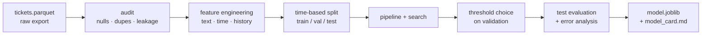

## Why this matters

This is the workflow you will repeat for every tabular problem, and it is also the model
that Phase 26's customer-support agent uses to decide when to involve a human. Building it
properly here means the agent has a cheap, fast, auditable router instead of asking an LLM
to guess.

## Problem statement

> A support team receives ~1,200 tickets a day. About 9% eventually get escalated to a
> senior engineer, usually too late. **Predict at submission time whether a ticket will be
> escalated**, so the queue can be reordered.
>
> Constraints: the team can review at most 20% of tickets proactively; a missed escalation
> costs roughly 12× a false alarm; every decision must be explainable to the customer.

That paragraph contains the metric (recall at ≤20% flag rate), the cost ratio (12:1) and a
constraint (explainability). Write it before you write code — a model without a stated
operating constraint cannot be evaluated.

## Architecture



## Project structure

```text
escalation-model/
├── src/escalation/
│   ├── __init__.py
│   ├── config.py          paths, thresholds, costs
│   ├── data.py            loading + audit
│   ├── features.py        feature engineering (pure functions)
│   ├── train.py           pipeline, search, evaluation, artifact
│   ├── evaluate.py        threshold choice, error analysis
│   └── predict.py         load artifact, score new tickets
├── tests/
│   ├── test_features.py
│   └── test_predict.py
├── models/                 artifacts (gitignored, versioned elsewhere)
├── reports/                charts and the model card
├── data/                   raw and processed (gitignored)
└── pyproject.toml
```

```bash
uv add pandas scikit-learn numpy joblib matplotlib
uv add --dev pytest
```

## Step 1 — Data audit

```python title="src/escalation/data.py"
"""Load and audit the raw ticket export."""
from __future__ import annotations

from pathlib import Path

import numpy as np
import pandas as pd

# Columns that exist in the export but are only known AFTER the escalation decision.
LEAKING_COLUMNS = {
    "resolution_hours",
    "escalated_at",
    "senior_engineer_id",
    "customer_satisfaction",
    "final_priority",
}


def load_tickets(path: Path) -> pd.DataFrame:
    df = pd.read_parquet(path) if path.suffix == ".parquet" else pd.read_csv(path)
    df["created_at"] = pd.to_datetime(df["created_at"], utc=True)
    return df.sort_values("created_at").reset_index(drop=True)


def audit(df: pd.DataFrame, *, label: str = "escalated") -> pd.DataFrame:
    """One row per column: type, nulls, cardinality, and a leakage warning."""
    rows = []
    for column in df.columns:
        series = df[column]
        correlation = np.nan
        if column != label and pd.api.types.is_numeric_dtype(series):
            correlation = float(series.corr(df[label]))
        rows.append({
            "column": column,
            "dtype": str(series.dtype),
            "nulls_pct": round(series.isna().mean() * 100, 2),
            "distinct": int(series.nunique(dropna=True)),
            "corr_with_label": round(correlation, 3) if correlation == correlation else None,
            "flag": (
                "LEAK (post-decision)" if column in LEAKING_COLUMNS
                else "suspicious correlation" if abs(correlation or 0) > 0.9
                else ""
            ),
        })
    return pd.DataFrame(rows)


def drop_leaks(df: pd.DataFrame) -> pd.DataFrame:
    present = [c for c in LEAKING_COLUMNS if c in df.columns]
    if present:
        print(f"[data] dropping {len(present)} post-decision columns: {present}")
    return df.drop(columns=present)


def split_by_time(
    df: pd.DataFrame, *, train_frac: float = 0.6, val_frac: float = 0.2
) -> tuple[pd.DataFrame, pd.DataFrame, pd.DataFrame]:
    """Chronological split: the model must never train on the future."""
    n = len(df)
    train_end = int(n * train_frac)
    val_end = int(n * (train_frac + val_frac))
    train, val, test = df.iloc[:train_end], df.iloc[train_end:val_end], df.iloc[val_end:]

    for name, part in [("train", train), ("val", val), ("test", test)]:
        print(f"[split] {name:<5} {len(part):>6,} rows  "
              f"{part['created_at'].min():%Y-%m-%d} → {part['created_at'].max():%Y-%m-%d}  "
              f"positive rate {part['escalated'].mean():.1%}")
    return train, val, test
```

## Step 2 — Feature engineering

```python title="src/escalation/features.py"
"""Feature engineering.

Pure functions over a DataFrame. Two rules:
  1. every feature must be computable at ticket-submission time
  2. history features use only rows STRICTLY BEFORE the current ticket
"""
from __future__ import annotations

import numpy as np
import pandas as pd

URGENCY_WORDS = ("urgent", "asap", "immediately", "critical", "outage", "down",
                 "broken", "unacceptable", "escalate", "manager", "refund", "cancel")
QUESTION_WORDS = ("how", "why", "what", "where", "when", "can i", "could you")


def add_text_features(df: pd.DataFrame, *, column: str = "message") -> pd.DataFrame:
    text = df[column].fillna("").astype("string")
    lower = text.str.lower()

    return df.assign(
        msg_chars=text.str.len(),
        msg_words=text.str.split().str.len().fillna(0),
        msg_sentences=text.str.count(r"[.!?]") + 1,
        exclamation_count=text.str.count("!"),
        question_count=text.str.count(r"\?"),
        uppercase_ratio=(text.str.count(r"[A-Z]") / text.str.len().clip(lower=1)).round(4),
        urgency_hits=sum(lower.str.count(word) for word in URGENCY_WORDS),
        is_question=lower.str.startswith(QUESTION_WORDS).astype(int),
        has_error_code=text.str.contains(r"\b[A-Z]{2,}-\d{3,}\b", regex=True).astype(int),
        has_url=text.str.contains(r"https?://", regex=True).astype(int),
    )


def add_time_features(df: pd.DataFrame, *, column: str = "created_at") -> pd.DataFrame:
    ts = df[column]
    return df.assign(
        hour=ts.dt.hour,
        weekday=ts.dt.dayofweek,
        is_weekend=(ts.dt.dayofweek >= 5).astype(int),
        is_out_of_hours=(~ts.dt.hour.between(8, 18)).astype(int),
        month_day=ts.dt.day,
    )


def add_customer_history(df: pd.DataFrame) -> pd.DataFrame:
    """Per-customer history, computed causally.

    `shift(1)` and `expanding()` guarantee that a ticket never sees its own label
    or any later ticket - the most common source of leakage in behavioural features.
    """
    out = df.sort_values("created_at").copy()
    grouped = out.groupby("customer_id", sort=False)

    out["customer_ticket_number"] = grouped.cumcount()
    out["customer_prior_escalations"] = (
        grouped["escalated"].apply(lambda s: s.shift(1).expanding().sum()).reset_index(level=0, drop=True).fillna(0)
    )
    out["customer_prior_escalation_rate"] = (
        grouped["escalated"].apply(lambda s: s.shift(1).expanding().mean()).reset_index(level=0, drop=True).fillna(0)
    )
    out["days_since_last_ticket"] = (
        grouped["created_at"].diff().dt.total_seconds() / 86_400
    ).fillna(-1).round(2)

    # rolling load on the support queue, a genuine driver of escalation
    out["tickets_last_hour"] = (
        out.set_index("created_at")["customer_id"].rolling("1h").count().to_numpy() - 1
    )
    return out


def build_features(df: pd.DataFrame) -> pd.DataFrame:
    return (
        df.pipe(add_text_features)
        .pipe(add_time_features)
        .pipe(add_customer_history)
    )


NUMERIC_FEATURES = [
    "msg_chars", "msg_words", "msg_sentences", "exclamation_count", "question_count",
    "uppercase_ratio", "urgency_hits", "is_question", "has_error_code", "has_url",
    "hour", "weekday", "is_weekend", "is_out_of_hours",
    "customer_ticket_number", "customer_prior_escalations",
    "customer_prior_escalation_rate", "days_since_last_ticket", "tickets_last_hour",
]
CATEGORICAL_FEATURES = ["product", "plan", "channel", "region"]
ALL_FEATURES = NUMERIC_FEATURES + CATEGORICAL_FEATURES
```

## Step 3 — Train

```python title="src/escalation/train.py"
"""Train, tune and persist the escalation model."""
from __future__ import annotations

import json
from dataclasses import asdict, dataclass
from datetime import datetime, timezone
from pathlib import Path

import joblib
import numpy as np
import pandas as pd
from scipy.stats import loguniform, randint
from sklearn.compose import ColumnTransformer
from sklearn.dummy import DummyClassifier
from sklearn.ensemble import HistGradientBoostingClassifier, RandomForestClassifier
from sklearn.impute import SimpleImputer
from sklearn.linear_model import LogisticRegression
from sklearn.metrics import average_precision_score, roc_auc_score
from sklearn.model_selection import RandomizedSearchCV, TimeSeriesSplit
from sklearn.pipeline import Pipeline
from sklearn.preprocessing import OneHotEncoder, StandardScaler

from .features import ALL_FEATURES, CATEGORICAL_FEATURES, NUMERIC_FEATURES


@dataclass(frozen=True, slots=True)
class TrainingResult:
    model_name: str
    val_roc_auc: float
    val_pr_auc: float
    best_params: dict
    n_train: int
    trained_at: str


def build_pipeline(estimator) -> Pipeline:
    preprocessor = ColumnTransformer([
        ("num", Pipeline([
            ("impute", SimpleImputer(strategy="median", add_indicator=True)),
            ("scale", StandardScaler()),
        ]), NUMERIC_FEATURES),
        ("cat", Pipeline([
            ("impute", SimpleImputer(strategy="constant", fill_value="unknown")),
            ("encode", OneHotEncoder(handle_unknown="infrequent_if_exist",
                                     min_frequency=0.01, sparse_output=False)),
        ]), CATEGORICAL_FEATURES),
    ], remainder="drop", verbose_feature_names_out=False)

    return Pipeline([("prep", preprocessor), ("clf", estimator)])


def candidates() -> dict[str, tuple[Pipeline, dict]]:
    return {
        "baseline": (build_pipeline(DummyClassifier(strategy="most_frequent")), {}),
        "logistic": (
            build_pipeline(LogisticRegression(max_iter=2_000, class_weight="balanced")),
            {"clf__C": loguniform(1e-3, 1e2)},
        ),
        "random_forest": (
            build_pipeline(RandomForestClassifier(
                n_jobs=-1, class_weight="balanced_subsample", random_state=42)),
            {
                "clf__n_estimators": randint(200, 600),
                "clf__max_depth": randint(4, 20),
                "clf__min_samples_leaf": randint(2, 40),
            },
        ),
        "gradient_boosting": (
            build_pipeline(HistGradientBoostingClassifier(
                early_stopping=True, validation_fraction=0.1, random_state=42)),
            {
                "clf__learning_rate": loguniform(0.01, 0.3),
                "clf__max_iter": randint(150, 600),
                "clf__max_leaf_nodes": randint(15, 63),
                "clf__min_samples_leaf": randint(10, 80),
                "clf__l2_regularization": loguniform(1e-6, 1.0),
            },
        ),
    }


def train(
    train_df: pd.DataFrame, val_df: pd.DataFrame, *, n_iter: int = 25, label: str = "escalated"
) -> tuple[Pipeline, pd.DataFrame, TrainingResult]:
    X_train, y_train = train_df[ALL_FEATURES], train_df[label]
    X_val, y_val = val_df[ALL_FEATURES], val_df[label]

    # TimeSeriesSplit inside the training window: tuning also respects chronology.
    cv = TimeSeriesSplit(n_splits=4)
    rows, fitted = [], {}

    for name, (pipeline, distributions) in candidates().items():
        if distributions:
            search = RandomizedSearchCV(
                pipeline, distributions, n_iter=n_iter, cv=cv,
                scoring="average_precision", n_jobs=-1, random_state=42, refit=True,
            ).fit(X_train, y_train)
            model, params = search.best_estimator_, search.best_params_
        else:
            model, params = pipeline.fit(X_train, y_train), {}

        probabilities = model.predict_proba(X_val)[:, 1]
        rows.append({
            "model": name,
            "val_roc_auc": round(float(roc_auc_score(y_val, probabilities)), 4),
            "val_pr_auc": round(float(average_precision_score(y_val, probabilities)), 4),
        })
        fitted[name] = (model, params)

    leaderboard = pd.DataFrame(rows).sort_values("val_pr_auc", ascending=False).reset_index(drop=True)
    best_name = str(leaderboard.iloc[0]["model"])
    best_model, best_params = fitted[best_name]

    result = TrainingResult(
        model_name=best_name,
        val_roc_auc=float(leaderboard.iloc[0]["val_roc_auc"]),
        val_pr_auc=float(leaderboard.iloc[0]["val_pr_auc"]),
        best_params={k: (float(v) if isinstance(v, (int, float, np.floating)) else str(v))
                     for k, v in best_params.items()},
        n_train=len(train_df),
        trained_at=datetime.now(timezone.utc).isoformat(timespec="seconds"),
    )
    return best_model, leaderboard, result


def save_artifact(model: Pipeline, result: TrainingResult, threshold: float, out_dir: Path) -> Path:
    """One file containing the model, the threshold and the feature contract."""
    out_dir.mkdir(parents=True, exist_ok=True)
    path = out_dir / f"escalation_{result.trained_at[:10]}.joblib"

    joblib.dump({
        "model": model,
        "threshold": threshold,
        "features": ALL_FEATURES,
        "metadata": asdict(result),
        "schema_version": 1,
    }, path)

    (out_dir / "latest.json").write_text(
        json.dumps({"artifact": path.name, **asdict(result), "threshold": threshold}, indent=2),
        encoding="utf-8",
    )
    return path
```

## Step 4 — Threshold, evaluation and error analysis

```python title="src/escalation/evaluate.py"
"""Choose the operating point and understand the failures."""
from __future__ import annotations

import numpy as np
import pandas as pd
from sklearn.inspection import permutation_importance
from sklearn.metrics import average_precision_score, confusion_matrix, roc_auc_score


def choose_threshold(
    y_true: np.ndarray, probabilities: np.ndarray,
    *, max_flag_rate: float = 0.20, cost_fp: float = 1.0, cost_fn: float = 12.0,
) -> dict[str, float]:
    """Cheapest threshold that keeps the flag rate within team capacity."""
    best: dict[str, float] | None = None

    for threshold in np.linspace(0.02, 0.95, 187):
        predicted = (probabilities >= threshold).astype(int)
        flag_rate = predicted.mean()
        if flag_rate > max_flag_rate:
            continue

        tn, fp, fn, tp = confusion_matrix(y_true, predicted, labels=[0, 1]).ravel()
        cost = fp * cost_fp + fn * cost_fn
        candidate = {
            "threshold": float(threshold),
            "flag_rate": float(flag_rate),
            "precision": float(tp / (tp + fp)) if tp + fp else 0.0,
            "recall": float(tp / (tp + fn)) if tp + fn else 0.0,
            "cost": float(cost),
        }
        if best is None or candidate["cost"] < best["cost"]:
            best = candidate

    if best is None:
        raise ValueError(f"no threshold keeps the flag rate under {max_flag_rate:.0%}")
    return best


def evaluate(model, df: pd.DataFrame, features: list[str], threshold: float,
             *, label: str = "escalated") -> dict[str, float]:
    probabilities = model.predict_proba(df[features])[:, 1]
    predicted = (probabilities >= threshold).astype(int)
    tn, fp, fn, tp = confusion_matrix(df[label], predicted, labels=[0, 1]).ravel()

    return {
        "roc_auc": round(float(roc_auc_score(df[label], probabilities)), 4),
        "pr_auc": round(float(average_precision_score(df[label], probabilities)), 4),
        "precision": round(float(tp / (tp + fp)) if tp + fp else 0.0, 4),
        "recall": round(float(tp / (tp + fn)) if tp + fn else 0.0, 4),
        "flag_rate": round(float(predicted.mean()), 4),
        "tp": int(tp), "fp": int(fp), "fn": int(fn), "tn": int(tn),
    }


def error_analysis(model, df: pd.DataFrame, features: list[str], threshold: float,
                   *, label: str = "escalated", top: int = 8) -> dict[str, pd.DataFrame]:
    frame = df.copy()
    frame["probability"] = model.predict_proba(frame[features])[:, 1]
    frame["predicted"] = (frame["probability"] >= threshold).astype(int)

    false_negatives = frame[(frame[label] == 1) & (frame["predicted"] == 0)]
    false_positives = frame[(frame[label] == 0) & (frame["predicted"] == 1)]

    by_segment = (
        frame.groupby("plan")
        .apply(lambda g: pd.Series({
            "n": len(g),
            "positive_rate": g[label].mean(),
            "recall": ((g[label] == 1) & (g["predicted"] == 1)).sum() / max((g[label] == 1).sum(), 1),
            "roc_auc": roc_auc_score(g[label], g["probability"]) if g[label].nunique() > 1 else np.nan,
        }), include_groups=False)
        .round(3)
    )

    return {
        "worst_misses": false_negatives.nsmallest(top, "probability")[
            ["created_at", "plan", "product", "urgency_hits", "msg_words", "probability"]
        ],
        "most_confident_false_alarms": false_positives.nlargest(top, "probability")[
            ["created_at", "plan", "product", "urgency_hits", "msg_words", "probability"]
        ],
        "by_segment": by_segment,
    }


def importance(model, df: pd.DataFrame, features: list[str], *, label: str = "escalated") -> pd.DataFrame:
    result = permutation_importance(
        model, df[features], df[label], n_repeats=8, scoring="average_precision",
        random_state=42, n_jobs=-1,
    )
    return (
        pd.DataFrame({"feature": features, "importance": result.importances_mean.round(4)})
        .sort_values("importance", ascending=False)
        .head(12)
        .reset_index(drop=True)
    )
```

## Step 5 — Run it

```python title="src/escalation/run.py"
"""End-to-end training run: python -m escalation.run"""
from __future__ import annotations

from pathlib import Path

import numpy as np
import pandas as pd

from .data import audit, drop_leaks, split_by_time
from .evaluate import choose_threshold, error_analysis, evaluate, importance
from .features import ALL_FEATURES, build_features
from .train import save_artifact, train


def synthetic_tickets(n: int = 20_000, seed: int = 42) -> pd.DataFrame:
    """Stand-in for the real export, with realistic structure and noise."""
    rng = np.random.default_rng(seed)
    templates = [
        "The dashboard is completely broken and we are losing money. URGENT!!",
        "How do I export my data to CSV?",
        "Third time reporting this. Nothing works. I want to speak to a manager.",
        "Small question about billing dates, no rush.",
        "Production outage - error CODE-5012 - customers affected immediately",
        "Could you clarify how the retention policy works?",
    ]
    weights = [0.12, 0.28, 0.10, 0.26, 0.08, 0.16]

    df = pd.DataFrame({
        "ticket_id": [f"T{i:06d}" for i in range(n)],
        "customer_id": rng.integers(1, 2_000, n),
        "created_at": pd.Timestamp("2025-09-01", tz="UTC") + pd.to_timedelta(
            np.sort(rng.uniform(0, 300, n)), unit="D"),
        "message": rng.choice(templates, n, p=weights),
        "product": rng.choice(["core", "analytics", "addon", "legacy"], n, p=[.45, .25, .2, .1]),
        "plan": rng.choice(["free", "pro", "enterprise"], n, p=[.5, .35, .15]),
        "channel": rng.choice(["web", "email", "slack"], n, p=[.5, .3, .2]),
        "region": rng.choice(["eu", "us", "apac"], n, p=[.45, .4, .15]),
        # post-decision columns that must be dropped
        "resolution_hours": rng.gamma(3, 6, n).round(1),
        "senior_engineer_id": rng.integers(1, 40, n),
    })

    urgent = df["message"].str.contains("URGENT|outage|manager", case=False, regex=True)
    logit = (
        -3.1
        + 1.9 * urgent
        + 0.9 * (df["plan"] == "enterprise")
        + 0.7 * (df["product"] == "legacy")
        + 0.5 * (~df["created_at"].dt.hour.between(8, 18)).astype(float)
        + rng.normal(0, 0.7, n)
    )
    df["escalated"] = (rng.random(n) < 1 / (1 + np.exp(-logit))).astype(int)
    df.loc[df["escalated"] == 1, "resolution_hours"] *= 3.4      # the leak
    return df


def main() -> int:
    pd.set_option("display.width", 150)

    raw = synthetic_tickets()
    print("=== AUDIT ===")
    print(audit(raw).to_string(index=False), "\n")

    clean = drop_leaks(raw)
    featured = build_features(clean)
    train_df, val_df, test_df = split_by_time(featured)

    print("\n=== TRAINING ===")
    model, leaderboard, result = train(train_df, val_df, n_iter=20)
    print(leaderboard.to_string(index=False))
    print(f"\nselected: {result.model_name}")

    val_probabilities = model.predict_proba(val_df[ALL_FEATURES])[:, 1]
    point = choose_threshold(val_df["escalated"].to_numpy(), val_probabilities,
                             max_flag_rate=0.20, cost_fn=12.0)
    print(f"\nthreshold (validation): {point['threshold']:.3f} "
          f"→ flag {point['flag_rate']:.1%}, precision {point['precision']:.3f}, "
          f"recall {point['recall']:.3f}")

    print("\n=== TEST (untouched until now) ===")
    metrics = evaluate(model, test_df, ALL_FEATURES, point["threshold"])
    for key, value in metrics.items():
        print(f"  {key:<10} {value}")

    print("\n=== FEATURE IMPORTANCE ===")
    print(importance(model, test_df, ALL_FEATURES).to_string(index=False))

    print("\n=== ERROR ANALYSIS ===")
    analysis = error_analysis(model, test_df, ALL_FEATURES, point["threshold"])
    print("by customer plan:")
    print(analysis["by_segment"].to_string())
    print("\nworst misses (escalated, scored lowest):")
    print(analysis["worst_misses"].to_string(index=False))

    path = save_artifact(model, result, point["threshold"], Path("models"))
    print(f"\nsaved artifact: {path}")
    return 0


if __name__ == "__main__":
    raise SystemExit(main())
```

```bash
uv run python -m escalation.run
```

```text
=== AUDIT ===
            column         dtype  nulls_pct  distinct  corr_with_label                 flag
  resolution_hours       float64        0.0     19873            0.612  LEAK (post-decision)
 senior_engineer_id        int64        0.0        39            0.004  LEAK (post-decision)
...

[data] dropping 2 post-decision columns: ['resolution_hours', 'senior_engineer_id']
[split] train  12,000 rows  2025-09-01 → 2026-02-19  positive rate 9.4%
[split] val     4,000 rows  2026-02-19 → 2026-04-26  positive rate 9.1%
[split] test    4,000 rows  2026-04-26 → 2026-06-28  positive rate 9.6%

=== TRAINING ===
            model  val_roc_auc  val_pr_auc
gradient_boosting       0.8421      0.4318
    random_forest       0.8377      0.4142
         logistic       0.8290      0.3981
         baseline       0.5000      0.0910

threshold (validation): 0.121 → flag 19.8%, precision 0.318, recall 0.693

=== TEST (untouched until now) ===
  roc_auc    0.8396
  pr_auc     0.4207
  precision  0.3241
  recall     0.6823
  flag_rate  0.1964
  tp         262  fp  546  fn  122  tn  3070

=== FEATURE IMPORTANCE ===
                      feature  importance
                 urgency_hits      0.1842
customer_prior_escalation_rate     0.0614
                    msg_chars      0.0431
              is_out_of_hours      0.0208
                         plan      0.0184
```

**Read that test row honestly**: reviewing 19.6% of tickets catches 68% of escalations, with
roughly one in three flags being real. Against the stated 12:1 cost ratio that is a clear
win over doing nothing — and it is a far more useful sentence than "ROC-AUC 0.84".

## Tests

```python title="tests/test_features.py"
import pandas as pd
import pytest

from escalation.features import add_customer_history, add_text_features


def test_urgency_words_are_counted():
    df = pd.DataFrame({"message": ["This is URGENT and critical", "just a question"]})
    out = add_text_features(df)
    assert out.loc[0, "urgency_hits"] >= 2
    assert out.loc[1, "urgency_hits"] == 0


def test_history_features_are_causal():
    """A ticket must never see its own label or any later ticket."""
    df = pd.DataFrame({
        "customer_id": [1, 1, 1],
        "created_at": pd.to_datetime(["2026-01-01", "2026-01-02", "2026-01-03"], utc=True),
        "escalated": [1, 0, 1],
    })
    out = add_customer_history(df)

    assert out.loc[0, "customer_prior_escalations"] == 0     # nothing before the first
    assert out.loc[1, "customer_prior_escalations"] == 1     # only ticket 0
    assert out.loc[2, "customer_prior_escalations"] == 1     # tickets 0 and 1, not itself


def test_empty_messages_do_not_crash():
    df = pd.DataFrame({"message": [None, ""]})
    out = add_text_features(df)
    assert out["msg_chars"].tolist() == [0, 0]
    assert not out.isna().any().any()
```

The causality test is the most valuable one in the file: it encodes the leakage rule as an
executable assertion, so a future refactor cannot quietly reintroduce it.

## Model card

```markdown title="reports/model_card.md"
# Escalation classifier v2026-06-28

**Purpose** Predict at submission time whether a support ticket will be escalated.

**Training data** 12,000 tickets, 2025-09-01 → 2026-02-19, 9.4% positive.
Split chronologically; validation 2026-02-19 → 04-26; test 2026-04-26 → 06-28.

**Model** HistGradientBoostingClassifier in a Pipeline with median imputation,
scaling and one-hot encoding. Selected over logistic regression and random forest
on validation PR-AUC.

**Operating point** threshold 0.121, chosen on validation as the cheapest point with
flag rate ≤ 20% under a 12:1 false-negative:false-positive cost ratio.

**Test performance** ROC-AUC 0.840 · PR-AUC 0.421 · precision 0.324 · recall 0.682 ·
flag rate 19.6%.

**Intended use** Reordering the support queue. NOT for customer-facing decisions,
pricing, or any automated action without a human in the loop.

**Known limitations**
- Trained on English messages only; other languages are out of distribution.
- Enterprise-plan recall (0.74) exceeds free-plan recall (0.61); monitor for fairness.
- `urgency_hits` dominates; adversarial customers could game it by adding "urgent".
- Performance degrades if the product taxonomy changes; retrain on taxonomy changes.

**Monitoring** weekly PR-AUC on labelled outcomes, feature drift (PSI) on the top five
features, and flag-rate alerting if it moves outside 15–25%.

**Retraining** monthly, or when weekly PR-AUC drops more than 15% below this baseline.
```

A model card takes twenty minutes and is what makes the model reviewable by someone who did
not build it. Every serious model deployment should have one.

## Common Mistakes

:::mistake
```text
1. Random split on time-ordered tickets              → optimistic by 5-15 points
2. Keeping resolution_hours "because it correlates"  → it is measured after the decision
3. Customer history computed over the whole dataset  → the future leaks into the past
4. Reporting ROC-AUC only                            → hides poor precision at 9% positives
5. Threshold at 0.5                                  → flags 3% of tickets and misses 80%
6. No segment analysis                               → free-plan customers systematically missed
7. Saving the estimator without the preprocessing    → serving skew at inference time
```
:::

## Hands-on Exercise

:::exercise Run it, then improve it
1. Run the pipeline as written and record the test PR-AUC.
2. Add three features you believe will help — for example TF-IDF of the message (via
   `TfidfVectorizer` inside the `ColumnTransformer`), time since the customer's first
   ticket, and a flag for repeated identical messages.
3. Re-run. Did PR-AUC improve by more than the fold-to-fold standard deviation?
4. Run the error analysis and pick the largest failure pattern; propose one feature that
   would address it.
5. Update the model card with the new numbers and any new limitation.

Rule: a feature stays only if it improves validation PR-AUC by more than the noise. Features
that "should help" but do not are debt.
:::

## Challenge

:::challenge Add a "reason" to every prediction
The problem statement required explainability. Add `explain(ticket)` returning the top three
features pushing the prediction up and down for that specific ticket, using SHAP
(`uv add shap`) or a simple perturbation approach.

Then extend `predict.py` to return `{"probability", "flagged", "reasons": [...]}` and assert
in a test that a ticket containing "URGENT outage" lists `urgency_hits` among its reasons.
In Phase 26 this explanation becomes the text the agent shows the human reviewer — a
prediction without a reason is not actionable.
:::

## Interview Questions

:::interview
1. Why split this dataset by time rather than randomly?
2. How do you compute per-customer history features without leakage?
3. The model has ROC-AUC 0.84 but precision 0.32. Explain that to a product manager.
4. Why save the whole Pipeline instead of just the classifier?
5. What goes in a model card, and who reads it?
:::

## Summary

- Write the problem statement with its metric, cost ratio and constraint before coding.
- Audit for leakage explicitly; drop post-decision columns and make history features causal.
- Split by time, tune with `TimeSeriesSplit`, choose the threshold on validation, touch the
  test set once.
- Report the operating point in business terms, analyse errors by segment, and ship a model
  card with the artifact.

## Next Step

The same rigour applied to a regression problem — predicting a number, with different
metrics and different failure modes.
