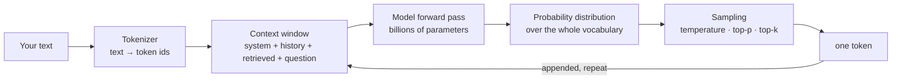

:::note In one line
**Most confusion about AI is vocabulary, not difficulty.** Learn these words properly and the papers, docs and job adverts all become readable.
:::

## Why this matters

These words appear in every API parameter, every cost calculation and every incident
post-mortem. Vague definitions lead to real mistakes: setting temperature to 0 and expecting
determinism, assuming a 200k context window means 200k *useful* tokens, or trying to fix a
hallucination by "telling the model not to make things up".

## Mental Model

Two words explain most billing and most "why did it forget?" confusion: **tokens** and the
**context window**.
<figure class="lesson-figure">
<svg viewBox="0 0 660 240" role="img" aria-label="Diagram: a sentence split into tokens showing that tokens are pieces of words, and a context window bar showing the system prompt, retrieved documents, conversation history and the reply all competing for the same space.">
  <text class="dg-sub" x="14" y="20">Text is chopped into tokens — roughly three quarters of a word each:</text>
  <rect x="14" y="32" width="66" height="30" rx="5" fill="var(--panel-2)" stroke="var(--accent)" stroke-width="1.5"/>
  <text class="dg-mono" x="47" y="52" text-anchor="middle" style="font-size:11px">retrie</text>
  <rect x="84" y="32" width="46" height="30" rx="5" fill="var(--panel-2)" stroke="var(--accent)" stroke-width="1.5"/>
  <text class="dg-mono" x="107" y="52" text-anchor="middle" style="font-size:11px">val</text>
  <rect x="134" y="32" width="40" height="30" rx="5" fill="var(--panel-2)" stroke="var(--accent)" stroke-width="1.5"/>
  <text class="dg-mono" x="154" y="52" text-anchor="middle" style="font-size:11px">is</text>
  <rect x="178" y="32" width="66" height="30" rx="5" fill="var(--panel-2)" stroke="var(--accent)" stroke-width="1.5"/>
  <text class="dg-mono" x="211" y="52" text-anchor="middle" style="font-size:11px">import</text>
  <rect x="248" y="32" width="40" height="30" rx="5" fill="var(--panel-2)" stroke="var(--accent)" stroke-width="1.5"/>
  <text class="dg-mono" x="268" y="52" text-anchor="middle" style="font-size:11px">ant</text>
  <text class="dg-sub" x="306" y="52">5 tokens, 3 words. You are billed per token, both in and out.</text>
  <text class="dg-sub" x="14" y="100">The context window is one fixed-size shelf that everything shares:</text>
  <rect x="14" y="112" width="632" height="46" rx="8" fill="none" stroke="var(--accent-2)" stroke-width="2"/>
  <rect x="18" y="116" width="96" height="38" rx="5" fill="var(--panel-2)" stroke="var(--border-strong)" stroke-width="1.2"/>
  <text class="dg-sub" x="66" y="139" text-anchor="middle">system</text>
  <rect x="118" y="116" width="226" height="38" rx="5" fill="var(--panel-2)" stroke="var(--accent-3)" stroke-width="1.5"/>
  <text class="dg-sub" x="231" y="139" text-anchor="middle" fill="var(--accent-3)">retrieved documents</text>
  <rect x="348" y="116" width="170" height="38" rx="5" fill="var(--panel-2)" stroke="var(--accent-2)" stroke-width="1.5"/>
  <text class="dg-sub" x="433" y="139" text-anchor="middle" fill="var(--accent-2)">conversation so far</text>
  <rect x="522" y="116" width="120" height="38" rx="5" fill="var(--panel-2)" stroke="var(--ok)" stroke-width="1.5"/>
  <text class="dg-sub" x="582" y="139" text-anchor="middle" fill="var(--ok)">room to reply</text>
  <text class="dg-sub" x="14" y="184" fill="var(--danger)">Fill the shelf and something must go. That is why a long chat "forgets" the beginning:</text>
  <text class="dg-sub" x="14" y="202" fill="var(--danger)">the oldest turns were dropped to make room. Nothing broke; the shelf was full.</text>
  <text class="dg-sub" x="14" y="228">Count tokens with the provider's own counter — never guess, and never use another model's tokeniser.</text>
</svg>
<figcaption>
<strong>Tokens are the unit of both cost and memory.</strong> Every design decision in RAG
and memory later is really a decision about what deserves space on this shelf.
</figcaption>
</figure>



The single most clarifying fact: **the model produces one token at a time, and each token is
sampled from a probability distribution.** Every behaviour you observe — fluency, apparent
reasoning, hallucination, the effect of temperature — follows from that loop.

## Core Concepts

### Tokens

Models do not see characters or words. Text is split into **tokens**: frequent sub-word
pieces from a fixed vocabulary (typically 50k–200k entries).

```text
"Retrieval-augmented generation"  →  ["Retrie", "val", "-", "augmented", " generation"]
"cat"        → 1 token
"Antidisestablishmentarianism" → 6-8 tokens
"日本語"      → 3-6 tokens (non-Latin scripts often cost more)
"1234567"    → 2-4 tokens (digits split unpredictably)
```

Practical rules for English: ~4 characters per token, ~0.75 words per token, so 1,000 words
≈ 1,300 tokens. Code and non-English text are denser in tokens per character.

```python
# Count with the tokenizer of the model you are actually calling - they differ.
import anthropic                                 # Claude models
client = anthropic.Anthropic()
client.messages.count_tokens(
    model="claude-opus-5",
    messages=[{"role": "user", "content": text}],
).input_tokens

import tiktoken                                  # OpenAI-family models only
len(tiktoken.get_encoding("o200k_base").encode(text))

from transformers import AutoTokenizer           # any open-weight model
len(AutoTokenizer.from_pretrained("bert-base-uncased").encode(text))
```

:::warning Tokenizers are not interchangeable
`tiktoken` is OpenAI's tokenizer. Using it to estimate Claude token counts undercounts by
roughly 15-20% on prose and far more on code. Use the provider's own counting endpoint
whenever the number drives a budget or a hard limit.
:::

:::note Why tokenisation explains "weird" model failures
Counting letters in a word, reversing a string, or arithmetic on long numbers are hard
because the model never sees letters or digits individually — it sees chunks. This is a
representation limitation, not a reasoning failure, and the fix is a tool (Phase 22), not a
better prompt.
:::

### Context window

The maximum number of tokens the model can attend to in one request — **input plus output
together**.

```text
Context window: 200,000 tokens

  system prompt        1,200   ← every request
  tool definitions     2,400   ← grows with every tool you add
  conversation history 8,000   ← grows with every turn
  retrieved chunks     6,000   ← your retrieval budget
  user question          200
  ─────────────────────────
  input               17,800
  output reserve       4,000   ← must fit too
```

Two facts people get wrong:

1. **Bigger is not free.** Attention cost grows roughly quadratically with sequence length;
   long contexts are slower and more expensive per request.
2. **Bigger is not better.** Retrieval quality matters more than quantity: models attend
   less reliably to material in the middle of a long context ("lost in the middle"), and
   irrelevant chunks measurably degrade answers. Five good chunks beat fifty mediocre ones.

### Parameters

The learned weights. A "70B model" has 70 billion of them. Parameter count correlates with
capability but is not the whole story: training data quality, training compute and
post-training alignment matter as much. Memory for inference is roughly
`parameters × bytes_per_parameter` — 70B at 2 bytes (float16) needs ~140 GB, which is why
quantisation (int8, int4) exists.

For an AI engineer using APIs, parameter counts mostly matter as a proxy for cost and
latency tiers: small/medium/large. Choose per request (Phase 25), not once for the project.

### Inference and sampling controls

At each step the model outputs a score (logit) for every token in the vocabulary. Sampling
turns that distribution into one choice.

**Temperature** rescales the distribution before sampling:

```text
logits [3.2, 2.9, 1.1, 0.4]

T = 0.0   always the argmax           → deterministic-ish, repetitive
T = 0.3   sharpened                   → focused, good for extraction and classification
T = 0.7   mild flattening             → natural prose, some variety
T = 1.0   raw distribution            → creative, less reliable
T = 1.5+  heavily flattened           → often incoherent
```

**Top-p (nucleus sampling)** keeps the smallest set of tokens whose cumulative probability
reaches *p*, then samples from that set. `top_p=0.9` adapts to the distribution's shape: it
keeps few candidates when the model is confident and more when it is not.

**Top-k** keeps the k highest-probability tokens. Cruder than top-p; rarely the better
choice.

**Frequency / presence penalties** reduce the probability of tokens already used, to curb
repetition.

**Stop sequences** end generation when a string appears. **Max tokens** caps output length
and therefore cost.

| Task | Suggested settings (models that expose sampling) |
| --- | --- |
| Extraction, classification, structured output | `temperature=0`, `top_p=1` |
| Factual Q&A over retrieved documents | `temperature=0–0.2` |
| Summarisation | `temperature=0.2–0.4` |
| Conversational assistant | `temperature=0.5–0.7` |
| Brainstorming, copy variants | `temperature=0.8–1.0` |

:::note Not every model exposes these controls
Current Claude models (Opus 5, Sonnet 5, the 4.7/4.8 family) **reject** `temperature`,
`top_p` and `top_k` outright; reasoning depth is set with `output_config.effort` instead.
Haiku 4.5, older Claude models, OpenAI, Gemini and open-weight models all still use
`temperature` as described above. Check the model family before copying a setting from a
tutorial.
:::

:::warning `temperature=0` is not a guarantee of determinism
It selects the highest-probability token, but floating-point non-determinism in batched GPU
execution, mixture-of-experts routing, and silent model updates all mean the same prompt can
still produce different output. Treat "deterministic" as "low-variance", and pin model
versions where it matters. Your tests must assert on properties, not exact strings.
:::

### In-context learning

Foundation models adapt from examples placed in the prompt, with no weight updates.

```text
zero-shot   "Classify the sentiment: 'The export failed again.'"
few-shot    "Text: 'Works great!' → positive
             Text: 'Crashed twice.' → negative
             Text: 'The export failed again.' →"
```

Three to five well-chosen, *diverse* examples usually capture most of the available gain.
Examples are especially effective at pinning down **format**, which is often what you
actually need.

### Hallucination

The model states something false with the same fluency as something true.

**Why it happens, mechanically:** the model was trained to produce a probable continuation,
not a true one. Nothing in the objective distinguishes "well-formed and correct" from
"well-formed and wrong". When the context does not contain the answer, the most probable
continuation is a plausible invention.

Common triggers:

| Trigger | Mitigation |
| --- | --- |
| Knowledge not in training data | retrieval (Phase 12) |
| Knowledge after the cutoff | retrieval, or a tool for live data |
| Question presupposes something false | teach the model to challenge the premise |
| Retrieved context does not answer the question | require "insufficient context" as a valid answer |
| Arithmetic or exact computation | a calculator tool (Phase 22) |
| Citations and identifiers | verify every citation against the retrieved set |
| Very long context | reduce and rerank; do not just add more |

What does **not** work: "Do not hallucinate" in the system prompt. What does work: give the
model the facts, make refusal an acceptable output, and **verify the output in code**.

```python
def validate_citations(answer: str, retrieved_ids: set[str]) -> list[str]:
    """Any citation not in the retrieved set is a hallucination - reject, do not ship."""
    import re
    cited = set(re.findall(r"\[([a-z0-9_-]+)\]", answer))
    return sorted(cited - retrieved_ids)
```

### Other terms you will meet

| Term | Meaning |
| --- | --- |
| Pre-training | the large, expensive, self-supervised phase (predict the next token) |
| Fine-tuning | further training on a smaller task-specific dataset |
| RLHF / alignment | training on human preferences to make the model helpful and safe |
| Instruction-tuned | a model post-trained to follow instructions rather than merely continue text |
| Embedding | a vector representation of text (Phase 11) |
| Perplexity | how surprised the model is by a text; a training-time metric, not a product metric |
| Quantisation | reducing weight precision (16→8→4 bit) to shrink memory and cost |
| Distillation | training a small model to imitate a large one |
| Multimodal | a model that also accepts images, audio or video |
| KV cache | cached attention state that makes generating token *n+1* cheap |
| Prompt caching | provider-side reuse of a repeated prefix, typically at a large discount |

## Real-World Example

A token budget and cost estimator you will genuinely reuse.

```python title="src/llm/budget.py"
"""Token accounting and context budgeting.

Two failures this prevents:
  1. a request that exceeds the context window at the worst possible moment
  2. a bill nobody predicted
"""
from __future__ import annotations

from dataclasses import dataclass, field


@dataclass(frozen=True, slots=True)
class ModelSpec:
    name: str
    context_window: int
    input_per_million: float          # USD
    output_per_million: float
    cached_input_discount: float = 0.1
    typical_latency_ms_per_1k_output: float = 900.0


CATALOGUE: dict[str, ModelSpec] = {
    "small": ModelSpec("small", 200_000, 0.25, 1.25),
    "medium": ModelSpec("medium", 200_000, 3.00, 15.00),
    "large": ModelSpec("large", 200_000, 15.00, 75.00),
}


@dataclass
class ContextBudget:
    """Plan what goes into the window before you build the prompt."""

    model: ModelSpec
    system_tokens: int = 0
    tool_definition_tokens: int = 0
    history_tokens: int = 0
    retrieved_tokens: int = 0
    question_tokens: int = 0
    output_reserve: int = 4_000
    warnings: list[str] = field(default_factory=list)

    @property
    def input_tokens(self) -> int:
        return (self.system_tokens + self.tool_definition_tokens + self.history_tokens
                + self.retrieved_tokens + self.question_tokens)

    @property
    def total_planned(self) -> int:
        return self.input_tokens + self.output_reserve

    @property
    def headroom(self) -> int:
        return self.model.context_window - self.total_planned

    def validate(self) -> list[str]:
        problems: list[str] = []
        if self.headroom < 0:
            problems.append(
                f"over the context window by {-self.headroom:,} tokens - "
                f"reduce retrieved chunks or summarise history"
            )
        if self.history_tokens > self.retrieved_tokens * 2 and self.retrieved_tokens > 0:
            problems.append(
                "conversation history is crowding out retrieval - summarise older turns"
            )
        if self.retrieved_tokens > self.model.context_window * 0.5:
            problems.append(
                "more than half the window is retrieved context - rerank and cut; "
                "recall usually degrades past this point"
            )
        if self.tool_definition_tokens > 4_000:
            problems.append(
                "tool definitions exceed 4k tokens - consider tool selection per request"
            )
        return problems

    def cost_usd(self, output_tokens: int | None = None, *, cached_tokens: int = 0) -> float:
        output = self.output_reserve if output_tokens is None else output_tokens
        billable_input = max(self.input_tokens - cached_tokens, 0)
        return (
            billable_input / 1e6 * self.model.input_per_million
            + cached_tokens / 1e6 * self.model.input_per_million * self.model.cached_input_discount
            + output / 1e6 * self.model.output_per_million
        )

    def report(self, *, requests_per_day: int = 1) -> str:
        lines = [
            f"model            {self.model.name} ({self.model.context_window:,} token window)",
            f"system           {self.system_tokens:>8,}",
            f"tools            {self.tool_definition_tokens:>8,}",
            f"history          {self.history_tokens:>8,}",
            f"retrieved        {self.retrieved_tokens:>8,}",
            f"question         {self.question_tokens:>8,}",
            f"input total      {self.input_tokens:>8,}",
            f"output reserve   {self.output_reserve:>8,}",
            f"headroom         {self.headroom:>8,}  ({self.headroom / self.model.context_window:.0%})",
            f"cost / request   ${self.cost_usd():.5f}",
            f"cost / day       ${self.cost_usd() * requests_per_day:,.2f} at {requests_per_day:,} requests",
            f"cost / month     ${self.cost_usd() * requests_per_day * 30:,.2f}",
        ]
        for problem in self.validate():
            lines.append(f"  WARNING: {problem}")
        return "\n".join(lines)


def estimate_tokens(text: str) -> int:
    """Fast heuristic: ~4 characters per token for English prose.

    Use a real tokenizer when the number drives a hard decision; use this when you
    need a number in a loop over a million documents.
    """
    return max(1, len(text) // 4)


def compare_models(budget_template: dict, *, requests_per_day: int = 5_000) -> str:
    rows = ["tier     in+out tokens   $/request   $/month   headroom"]
    for name, spec in CATALOGUE.items():
        budget = ContextBudget(model=spec, **budget_template)
        rows.append(
            f"{name:<8} {budget.total_planned:>13,} {budget.cost_usd():>11.5f} "
            f"{budget.cost_usd() * requests_per_day * 30:>9,.0f} {budget.headroom:>10,}"
        )
    return "\n".join(rows)


if __name__ == "__main__":
    template = {
        "system_tokens": 1_200,
        "tool_definition_tokens": 2_400,
        "history_tokens": 8_000,
        "retrieved_tokens": 6_000,
        "question_tokens": 200,
        "output_reserve": 800,
    }

    budget = ContextBudget(model=CATALOGUE["medium"], **template)
    print(budget.report(requests_per_day=5_000))
    print()
    print(compare_models(template))
    print()

    # what caching the stable prefix is worth
    cacheable = template["system_tokens"] + template["tool_definition_tokens"]
    full = budget.cost_usd()
    cached = budget.cost_usd(cached_tokens=cacheable)
    print(f"prompt caching saves ${(full - cached) * 5_000 * 30:,.2f}/month "
          f"({(1 - cached / full):.0%} of spend)")
```

```text
model            medium (200,000 token window)
system              1,200
tools               2,400
history             8,000
retrieved           6,000
question              200
input total        17,800
output reserve        800
headroom          181,400  (91%)
cost / request   $0.06540
cost / day       $327.00 at 5,000 requests
cost / month     $9,810.00

tier     in+out tokens   $/request   $/month   headroom
small           18,600     0.00545     818       181,400
medium          18,600     0.06540   9,810       181,400
large           18,600     0.32700  49,050       181,400

prompt caching saves $1,620.00/month (17% of spend)
```

Three decisions fall straight out of that table: the medium tier costs 12× the small tier,
caching the stable prefix is worth $1,600 a month for a one-line change, and 8,000 tokens of
history is more than the retrieval budget — which the validator flags.

## Common Mistakes

:::mistake
```text
1. "temperature=0 makes it deterministic"     → low-variance, not deterministic
2. "200k context means I can stuff everything in"
                                               → quality falls, cost rises quadratically
3. Estimating cost from characters             → count tokens; code and CJK differ sharply
4. Ignoring output tokens in the budget        → output is typically 5-10x the input price
5. "Tell it not to hallucinate"                → give it facts and verify the output in code
6. Sending the whole conversation every turn   → summarise; history grows without bound
7. Using top_p AND temperature aggressively    → change one at a time; interactions are opaque
8. Assuming the model knows today's date       → it does not; pass it in
```
:::

## Hands-on Exercise

:::exercise Measure your own tokens
1. `uv add tiktoken` and write `token_report(text)` printing: characters, words, tokens, the
   characters-per-token ratio, and the first 20 tokens decoded individually.
2. Run it on: an English paragraph, a Python function, a JSON payload, a non-English
   paragraph, and a long number.
3. Tabulate the characters-per-token ratio for each and explain the differences.
4. Using the budget module, compute the monthly cost of a system with 2,000 requests/day,
   1,500 system tokens, 5,000 retrieved tokens and 600 output tokens, on each tier.
5. Then compute the saving from (a) caching the system prompt and (b) cutting retrieval from
   5,000 to 2,500 tokens. Which is the bigger lever?
:::

:::solution Reference output
```text
sample                chars  words  tokens  chars/token
english paragraph       612    104     138          4.4
python function         418      -     131          3.2
json payload            284      -     102          2.8
german paragraph        598     78     201          3.0
long number (40 digits)  40      1      20          2.0

Explanation: English prose is closest to the tokenizer's training distribution, so
common words are single tokens. Code fragments punctuation and identifiers; JSON adds
braces, quotes and colons as separate tokens; German compounds split into pieces; long
digit strings split roughly every two characters.

Monthly cost at 2,000 requests/day:
  small   $  190
  medium  $2,280
  large   $11,400

Levers on the medium tier:
  cache the system prompt      -$  74/month   (3%)
  halve the retrieval budget   -$ 450/month  (20%)

Retrieval size is the bigger lever here - and cutting it often *improves* answers by
removing low-relevance chunks. Caching wins when the stable prefix is large (long tool
definitions or a long system prompt), which is exactly the case in agent systems.
```
:::

## Challenge

:::challenge A context budget guard
Write `fit_to_budget(system, tools, history, chunks, question, *, model, output_reserve)`
that returns a prompt guaranteed to fit, applying these rules in order:

1. Never drop the system prompt or the question.
2. Drop the lowest-scoring retrieved chunks first, down to a floor of two chunks.
3. Then summarise the oldest conversation turns into a single note.
4. Then drop tool definitions for tools unused in the last five turns.
5. Raise `ContextOverflow` if it still does not fit.

Return the assembled prompt plus a report of what was dropped and why. In Phase 21 this
becomes the memory manager; here it is a pure function you can unit-test exhaustively.
:::

## Interview Questions

:::interview
1. What is a token, and why is "4 characters" only a rule of thumb?
2. What exactly does temperature do to the distribution?
3. Why is a larger context window not automatically better?
4. Explain hallucination in terms of the training objective.
5. How do you reduce the cost of an LLM feature without changing the model?
:::

## Cheat Sheet

```text
TOKENS      ~4 chars / ~0.75 words per token (English); code and CJK are denser
            count with tiktoken or the model's own tokenizer

CONTEXT     input + output share one window
            budget: system + tools + history + retrieved + question + output reserve
            attention cost ~ O(n²); quality degrades with irrelevant context

SAMPLING    temperature  0 → argmax · 0.2 extraction · 0.7 chat · 1.0+ creative
            top_p 0.9 nucleus · top_k crude · frequency/presence penalties curb repetition
            stop sequences and max_tokens cap cost

COST        output tokens usually cost 4-5x input tokens
            prompt caching discounts a repeated prefix heavily
            levers, in order: retrieval size → model tier → caching → history strategy

HALLUCINATION  a property of "predict the probable next token"
            fix with retrieval + tools + permitted refusal + output verification in code
```

```quiz
[
  {
    "question": "You set temperature=0 and the same prompt returns slightly different text on two days. Why?",
    "options": [
      "Temperature 0 still samples randomly",
      "Batched GPU floating-point non-determinism, expert routing and silent model updates all break exact reproducibility",
      "The tokenizer changed",
      "It is impossible; something else changed in your code"
    ],
    "answer": 1,
    "explanation": "Temperature 0 picks the argmax, but the logits themselves are not bit-identical across runs or model revisions. Pin versions and assert on properties, never exact strings."
  },
  {
    "question": "Your RAG answers get worse after you increase retrieval from 5 to 40 chunks. What is the most likely explanation?",
    "options": [
      "The model ran out of parameters",
      "Irrelevant context dilutes attention and the relevant chunk is buried mid-context",
      "Tokens became more expensive",
      "The temperature changed"
    ],
    "answer": 1,
    "explanation": "More context is not more information. Precision matters: rerank and keep fewer, better chunks (Phase 13)."
  },
  {
    "question": "Which actually reduces hallucinated citations?",
    "options": [
      "Adding 'do not hallucinate' to the system prompt",
      "Verifying in code that every cited id appears in the retrieved set, and rejecting otherwise",
      "Lowering temperature to 0",
      "Using a larger model"
    ],
    "answer": 1,
    "explanation": "Prompts are advisory; the model can always produce a plausible-looking id. A deterministic check after generation cannot be talked around."
  }
]
```

## Summary

- Models emit one token at a time, sampled from a distribution — everything else follows.
- Count tokens with a real tokenizer; input and output share the context window, and output
  tokens cost several times more.
- Temperature and top-p shape the distribution; low values for extraction, higher for
  creative work; neither guarantees determinism.
- Hallucination follows from the training objective; the fixes are retrieval, tools,
  permitted refusal and code-level verification.

## Next Step

Phase 9: neural networks and PyTorch — building the machinery underneath all of this,
to the depth an AI engineer actually needs.
