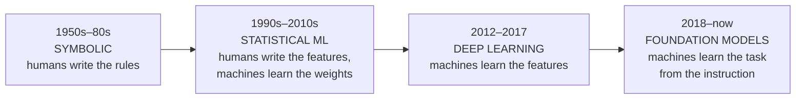

:::note In one line
**AI has swung between hand-written rules and learning from data for seventy years.** Knowing the swings tells you why today looks the way it does.
:::

## Why this matters

Every current debate — will scaling continue, do models reason, is retrieval a crutch — is a
rerun of an argument the field has had before, with new hardware. Knowing the history stops
you from being surprised by the limitations you are about to hit, and it explains *why*
retrieval, tools and agents exist at all: they are answers to specific, known failure modes.

## Mental Model

AI has swung between two ideas for seventy years: **write the rules** or **learn from data**.
<figure class="lesson-figure">
<svg viewBox="0 0 660 220" role="img" aria-label="Timeline of AI from the 1950s to today, alternating between rule-writing approaches and learning-from-data approaches, ending with foundation models.">
  <line x1="24" y1="120" x2="640" y2="120" stroke="var(--border-strong)" stroke-width="1.6"/>
  <circle cx="70" cy="120" r="6" fill="var(--accent-2)"/>
  <text class="dg-sub" x="70" y="146" text-anchor="middle">1950s-70s</text>
  <rect x="24" y="52" width="106" height="54" rx="8" fill="var(--panel-2)" stroke="var(--accent-2)" stroke-width="1.6"/>
  <text class="dg-sub" x="77" y="72" text-anchor="middle" fill="var(--accent-2)">write rules</text>
  <text class="dg-sub" x="77" y="90" text-anchor="middle">logic, search</text>
  <circle cx="230" cy="120" r="6" fill="var(--accent-2)"/>
  <text class="dg-sub" x="230" y="146" text-anchor="middle">1980s</text>
  <rect x="176" y="52" width="108" height="54" rx="8" fill="var(--panel-2)" stroke="var(--accent-2)" stroke-width="1.6"/>
  <text class="dg-sub" x="230" y="72" text-anchor="middle" fill="var(--accent-2)">expert systems</text>
  <text class="dg-sub" x="230" y="90" text-anchor="middle">thousands of ifs</text>
  <circle cx="390" cy="120" r="6" fill="var(--accent-3)"/>
  <text class="dg-sub" x="390" y="146" text-anchor="middle">1990s-2000s</text>
  <rect x="336" y="148" width="110" height="54" rx="8" fill="var(--panel-2)" stroke="var(--accent-3)" stroke-width="1.6"/>
  <text class="dg-sub" x="391" y="168" text-anchor="middle" fill="var(--accent-3)">learn from data</text>
  <text class="dg-sub" x="391" y="186" text-anchor="middle">statistical ML</text>
  <circle cx="520" cy="120" r="6" fill="var(--accent-3)"/>
  <text class="dg-sub" x="520" y="146" text-anchor="middle">2012+</text>
  <rect x="466" y="148" width="108" height="54" rx="8" fill="var(--panel-2)" stroke="var(--accent-3)" stroke-width="1.6"/>
  <text class="dg-sub" x="520" y="168" text-anchor="middle" fill="var(--accent-3)">deep learning</text>
  <text class="dg-sub" x="520" y="186" text-anchor="middle">data + GPUs</text>
  <circle cx="614" cy="120" r="7" fill="var(--accent)"/>
  <text class="dg-sub" x="614" y="146" text-anchor="middle">2020s</text>
  <rect x="552" y="40" width="96" height="66" rx="8" fill="var(--panel-2)" stroke="var(--accent)" stroke-width="2"/>
  <text class="dg-sub" x="600" y="60" text-anchor="middle" fill="var(--accent)">foundation</text>
  <text class="dg-sub" x="600" y="76" text-anchor="middle" fill="var(--accent)">models</text>
  <text class="dg-sub" x="600" y="94" text-anchor="middle">you are here</text>
  <text class="dg-sub" x="24" y="30" fill="var(--accent-2)">rules above the line</text>
  <text class="dg-sub" x="336" y="216" fill="var(--accent-3)">learning below the line</text>
</svg>
<figcaption>
<strong>Each swing followed a disappointment.</strong> Rules could not cope with messy
reality; learning needed data and computing power that did not exist yet. Today's models are
the learning side finally having both.
</figcaption>
</figure>



Each step moved one more thing from "specified by a human" to "learned from data". That is
the whole arc.

## Core Concepts

### 1950s–1980s: symbolic AI

Intelligence as logic. Programs manipulated symbols according to hand-written rules:
theorem provers, search algorithms, and **expert systems** like MYCIN, which diagnosed
blood infections with some 600 rules and matched specialists on narrow cases.

What it got right: explicit reasoning, full explainability, guarantees. A rules engine can
prove *why* it concluded something — still unmatched by anything since.

Why it stalled: the **knowledge acquisition bottleneck**. Every rule was written by a human,
rules interacted in ways nobody could predict, and the world contains far too many
exceptions. "A bird can fly" needs an exception for penguins, injured birds, birds in cages,
dead birds, and a dozen cases nobody listed. The first "AI winter" (late 1970s) and the
second (late 1980s) both followed inflated promises meeting this wall.

:::note Symbolic AI did not die
It is in your stack right now: SQL query planners, type checkers, compilers, business rules
engines, and the deterministic guardrails you will write in Phase 19. The lesson the field
learned was *not* "rules are bad" — it was "rules alone do not scale to open domains".
:::

### 1990s–2010s: statistical machine learning

Instead of writing rules, write **features** and let an algorithm learn the weights. Spam
filtering by Naive Bayes, credit scoring by logistic regression, search ranking by gradient
boosting. Everything in Phases 6–7.

What it got right: learning from data, graceful handling of uncertainty, quantified
performance.

Its limit: **feature engineering**. A human still had to decide that "number of capital
letters" and "sender reputation" were the right things to measure. For images, audio and
language, nobody could write features good enough — decades of work on hand-crafted visual
features (SIFT, HOG) plateaued well below human performance.

### 2012–2017: deep learning

2012, ImageNet: AlexNet, a convolutional network trained on two GPUs, cut the error rate
from 26% to 15%. Nothing about the maths was new — backpropagation dates from the 1980s.
What changed was three things arriving together:

1. **Data** — ImageNet's 14 million labelled images.
2. **Compute** — GPUs, thousands of times faster for matrix multiplication.
3. **Tricks that made deep nets trainable** — ReLU, dropout, batch normalisation, better
   initialisation.

The breakthrough idea is **representation learning**: the network learns its own features,
layer by layer — edges, then textures, then parts, then objects. The human stops specifying
what to measure.

Language followed: word2vec (2013) showed that words could become vectors with arithmetic
structure; RNNs and LSTMs handled sequences but processed them one step at a time, which made
them slow to train and poor at long-range dependencies.

### 2017: attention, and the transformer

"Attention Is All You Need" replaced recurrence with **self-attention**: every token looks
at every other token in parallel, weighting how much each one matters. Two consequences:

- **Parallel training.** No sequential dependency, so training scales across thousands of
  GPUs. This is the reason transformers won — not that attention is uniquely brilliant, but
  that it is uniquely parallelisable.
- **Direct long-range connections.** Token 1 and token 900 interact in one step, not 899.

You will implement attention in Phase 10.

### 2018–now: foundation models

Scale the transformer, train it on a large fraction of the text on the internet to predict
the next token, and something unexpected happens: the model becomes usable for tasks nobody
trained it on, described only in the prompt.

```text
BEFORE: one model per task, each needing thousands of labelled examples
  spam classifier · sentiment classifier · translator · summariser

AFTER: one pre-trained model, many tasks, specified in natural language
  "Classify this email as spam or not: …"
  "Summarise this in three bullets: …"
  "Extract every date as JSON: …"
```

The pattern is **pre-train once, adapt cheaply**: prompting (no training), few-shot examples
(no training), retrieval (no training), fine-tuning (a little training), RLHF/alignment
(done by the provider).

| Era | Human specifies | Machine learns | Bottleneck |
| --- | --- | --- | --- |
| Symbolic | rules | nothing | writing enough rules |
| Statistical ML | features | weights | designing features, labelled data |
| Deep learning | architecture | features + weights | data and compute |
| Foundation models | the **task**, in words | everything else | context, grounding, control |

Read the last row carefully — it describes your job. The bottleneck moved to *getting the
right information into the model and controlling what it does with it*, which is precisely
what RAG (Phase 12), tools (Phase 22) and guardrails (Phase 19) address.

### What has not changed

- **Data quality decides outcomes.** Garbage in, fluent garbage out.
- **Evaluation is hard and skipping it is fatal.** Every AI winter followed claims that
  outran measurement.
- **Generalisation is the only thing that matters.** Impressive demos on curated inputs
  proved nothing in 1985 and prove nothing now.
- **Symbolic methods remain better at exact, verifiable, auditable reasoning.** Hence:
  calculators as tools, SQL for aggregates, schema validators for output. Hybrid systems win.

## Real-World Example

The same problem, solved four ways — and the honest trade-offs.

> Route an incoming support ticket to one of eight teams.

```python title="four_eras.py"
"""Four paradigms on one task. All four are legitimate engineering choices."""
from __future__ import annotations

# 1. SYMBOLIC (1970s technique, still in production everywhere)
RULES = [
    (("invoice", "billing", "refund", "charge"), "billing"),
    (("password", "login", "2fa", "locked out"), "identity"),
    (("outage", "down", "500", "timeout"), "infrastructure"),
]

def route_symbolic(text: str) -> str | None:
    lower = text.lower()
    for keywords, team in RULES:
        if any(word in lower for word in keywords):
            return team
    return None                     # explicit "I do not know" - a real strength


# 2. STATISTICAL ML (needs ~2,000 labelled tickets)
def route_statistical(texts: list[str], labels: list[str]):
    from sklearn.feature_extraction.text import TfidfVectorizer
    from sklearn.linear_model import LogisticRegression
    from sklearn.pipeline import make_pipeline

    model = make_pipeline(
        TfidfVectorizer(ngram_range=(1, 2), min_df=3, sublinear_tf=True),
        LogisticRegression(max_iter=1_000, class_weight="balanced"),
    )
    return model.fit(texts, labels)      # ~30ms per prediction, fully auditable


# 3. DEEP LEARNING (fine-tuned encoder; needs GPUs and ~5,000 examples)
def route_finetuned(text: str) -> str:
    """A fine-tuned transformer classifier: highest accuracy for a fixed taxonomy,
    but retraining is required whenever the taxonomy changes."""
    ...


# 4. FOUNDATION MODEL (zero labelled examples)
ROUTING_PROMPT = """\
Route this support ticket to exactly one team.

Teams:
- billing: invoices, refunds, payment methods
- identity: login, passwords, SSO, 2FA
- infrastructure: outages, latency, errors
- data: exports, reports, analytics
- integrations: API, webhooks, third-party connectors
- onboarding: setup, migration, training
- security: vulnerabilities, access reviews, compliance
- other: anything else

Respond with JSON: {"team": "...", "confidence": 0.0-1.0, "reason": "one sentence"}

Ticket: {ticket}
"""
```

| Approach | Labelled data | Latency | Cost/1k | New team added | Explainable |
| --- | --- | --- | --- | --- | --- |
| Rules | 0 | <1 ms | ~0 | edit a list | perfectly |
| TF-IDF + logistic | ~2,000 | ~5 ms | ~0 | retrain | coefficients |
| Fine-tuned transformer | ~5,000 | ~30 ms | low | retrain + redeploy | poorly |
| LLM prompt | 0 | ~800 ms | ~$2 | edit the prompt | it explains itself (sometimes wrongly) |

The production answer is usually **rules for the obvious 60%, a cheap classifier for the
next 30%, and an LLM for the ambiguous remainder** — with the LLM's decisions sampled and
reviewed to build the labelled set that eventually makes the classifier good enough to take
more of the traffic. That layered design is the direct product of knowing this history.

## Common Mistakes

:::mistake
```text
1. "LLMs made classical ML obsolete"
   A logistic regression at 5ms and ~$0 still beats an 800ms, $2/1k LLM call for a
   stable, well-labelled classification task.

2. "The model reasons like a person"
   It predicts tokens. That produces behaviour that often looks like reasoning and
   sometimes is not - which is why you verify with tools and schemas.

3. "Bigger model = better product"
   Context, retrieval quality and guardrails move product metrics far more than a
   model upgrade, at a fraction of the cost.

4. "Fine-tuning fixes wrong facts"
   Fine-tuning shapes form and behaviour. Facts come from retrieval.

5. "This time there is no ceiling"
   Every previous paradigm was said to have none. Plan for the limitations you can
   already see: context limits, hallucination, cost, latency, non-determinism.
```
:::

## Hands-on Exercise

:::exercise Date a technique
For each of the following, identify the paradigm, the decade it became practical, and one
concrete limitation that motivated the next step:

1. Naive Bayes spam filtering
2. MYCIN's diagnostic rules
3. word2vec embeddings
4. AlexNet
5. BERT fine-tuning
6. Chain-of-thought prompting
7. Retrieval-augmented generation
8. Tool calling

Then write one sentence for each explaining which failure of the previous approach it was
trying to fix. That "what problem did this solve?" chain is the most compact way to hold the
field in your head.
:::

:::solution Answers
1. **Statistical ML, 1990s.** Limitation: bag-of-words ignores order and meaning — "not
   spam" and "spam not" are identical.
2. **Symbolic, 1970s.** Limitation: 600 hand-written rules for one narrow domain; nobody
   could scale or maintain that across medicine.
3. **Deep learning (shallow), 2013.** Fixed the bag-of-words problem by giving words
   geometry. Limitation: one vector per word regardless of context — "bank" has a single
   meaning.
4. **Deep learning, 2012.** Fixed hand-crafted visual features. Limitation: needs millions
   of labelled images per task.
5. **Foundation models (encoder era), 2018.** Fixed the labelled-data requirement via
   pre-training plus a small fine-tune. Limitation: still one fine-tuned model per task.
6. **Foundation models, 2022.** Fixed the observation that models fail at multi-step
   problems when forced to answer immediately. Limitation: more tokens, slower, and the
   stated reasoning is not guaranteed to be the actual cause of the answer.
7. **Foundation models + retrieval, 2020–.** Fixed stale, private and unverifiable
   knowledge. Limitation: quality is bounded by the retriever, and irrelevant context
   actively degrades answers.
8. **Foundation models + symbolic, 2023–.** Fixed arithmetic, current data and real-world
   actions. Limitation: every tool is a new attack surface and a new failure mode.

Notice items 7 and 8: the field's answer to the limits of pure learning was to reattach
symbolic components. The arc is not a straight line away from rules — it is a spiral back
toward hybrids.
:::

## Challenge

:::challenge Build the layered router
Implement the three-layer routing system: rules → TF-IDF classifier → LLM fallback. Measure,
on a labelled set of 500 tickets, the fraction handled by each layer, the accuracy of each
layer, the total cost, and the p95 latency.

Then answer with numbers: at what accuracy does the cheap classifier make the LLM layer
unnecessary, and how many labelled examples would you need to get there? That calculation —
not a preference for one technology — is how the decision should be made.
:::

## Interview Questions

:::interview
1. Why did symbolic AI stall, and where is it still the right tool?
2. What does "representation learning" mean and why did it matter?
3. Why did transformers displace RNNs?
4. What makes a model a "foundation" model?
5. Is a bigger model always the right upgrade? Argue both sides.
:::

## Cheat Sheet

```text
1956  Dartmouth workshop coins "artificial intelligence"
1966  ELIZA - pattern matching mistaken for understanding
1970s MYCIN and expert systems; knowledge acquisition bottleneck
1974  first AI winter        1987  second AI winter
1986  backpropagation popularised (Rumelhart, Hinton, Williams)
1997  Deep Blue beats Kasparov (search + hand-crafted evaluation, not learning)
2012  AlexNet - deep learning breaks ImageNet
2013  word2vec - words as vectors
2014  GANs; seq2seq with attention
2017  "Attention Is All You Need" - the transformer
2018  BERT and GPT - pre-train then adapt
2020  scaling laws; GPT-3 shows in-context learning; RAG proposed
2022  RLHF-aligned chat assistants reach the public
2023+ tool calling, agents, multimodal, long context
```

```quiz
[
  {
    "question": "What moved from 'human-specified' to 'learned' when deep learning replaced statistical ML?",
    "options": ["The rules", "The features", "The evaluation metric", "The training data"],
    "answer": 1,
    "explanation": "Statistical ML learned weights over human-designed features; deep networks learn the features themselves from raw input - which is why they unlocked vision and language."
  },
  {
    "question": "Why did transformers displace RNNs for language?",
    "options": [
      "Attention is mathematically more powerful than recurrence",
      "They process sequences in parallel, so training scales to far more data and compute",
      "They need less training data",
      "They are smaller"
    ],
    "answer": 1,
    "explanation": "Removing the sequential dependency made training parallelisable across thousands of GPUs. Scalability, not theoretical expressiveness, is what won."
  },
  {
    "question": "You must classify 50,000 tickets a day into 8 stable categories, with 20,000 labelled examples available. What is the sensible default?",
    "options": [
      "An LLM prompt for every ticket",
      "A fine-tuned or classical classifier, with an LLM only for low-confidence cases",
      "A multi-agent system",
      "Hand-written rules only"
    ],
    "answer": 1,
    "explanation": "With plenty of labels and a stable taxonomy, a classifier is orders of magnitude cheaper and faster, and it is auditable. Reserve the LLM for the ambiguous tail."
  }
]
```

## Summary

- The arc of AI is successive removal of human specification: rules → features → tasks.
- Symbolic AI stalled on the knowledge bottleneck but remains the right tool for exact,
  auditable logic — and has returned as tools and guardrails.
- Deep learning's breakthrough was representation learning; the transformer's was
  parallelism.
- Foundation models moved the bottleneck to context, grounding and control — which is what
  the rest of this handbook is about.

## Next Step

The vocabulary of generative AI: tokens, context windows, parameters, temperature, top-p and
hallucination — precisely defined.
