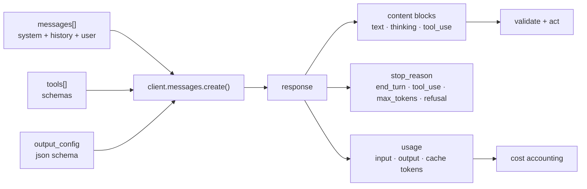
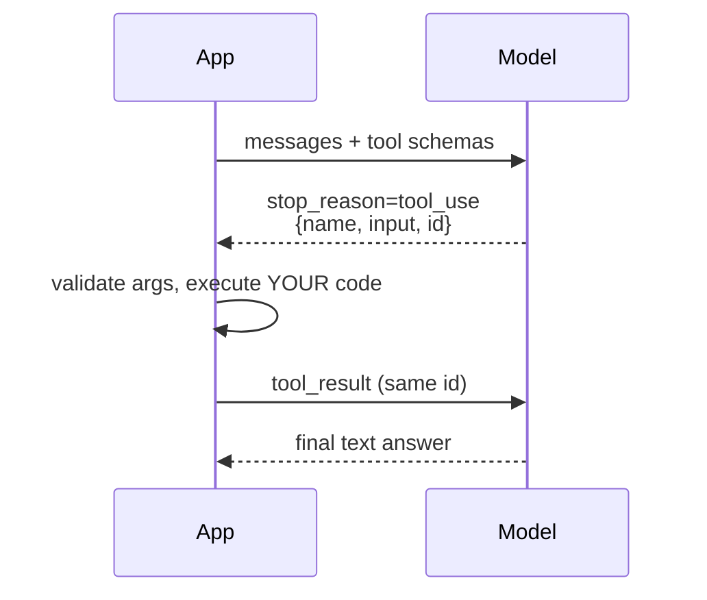

:::note In one line
**Treat the model like any other flaky network service.** Timeouts, retries, cost tracking and a fallback - production needs all four.
:::

## Why this matters

Everything from here on — RAG, agents, LangGraph, CrewAI — is built on this one call. A
prototype calls the model and prints the answer. A production system validates the output
against a schema, handles the rate limit, caches the stable prefix, counts the tokens,
streams to the user, and records what it cost. This lesson is that difference.

:::note Versions and providers used in this lesson
Code uses the **Anthropic Python SDK** (`anthropic`), model `claude-opus-5`, verified
against the current API. Other providers (OpenAI, Google, open-weight models via
vLLM/Ollama) expose the same five concepts — messages, structured output, tools, streaming,
usage — with different spellings. The **patterns** transfer; the parameter names do not.
Phase 16 shows the same operations through LangChain's provider-agnostic interface.
:::

## Mental Model

Treat the model like any other unreliable network service. Four things wrap every real call.
<figure class="lesson-figure">
<svg viewBox="0 0 660 240" role="img" aria-label="Diagram: a model call wrapped in a timeout, retries with backoff, a fallback to a second model, and cost tracking, with the raw unwrapped call shown as the fragile version.">
  <defs>
    <marker id="ap-a" markerWidth="9" markerHeight="9" refX="8" refY="3" orient="auto">
      <path d="M0,0 L8,3 L0,6 z" fill="var(--text-muted)"/>
    </marker>
  </defs>
  <text class="dg-label" x="14" y="22" fill="var(--danger)">Fragile</text>
  <rect x="86" y="8" width="180" height="30" rx="6" fill="var(--panel-2)" stroke="var(--danger)" stroke-width="1.5"/>
  <text class="dg-mono" x="176" y="28" text-anchor="middle" style="font-size:11px">client.messages.create(...)</text>
  <text class="dg-sub" x="282" y="28" fill="var(--danger)">one hiccup and your request dies</text>
  <line x1="14" y1="52" x2="646" y2="52" stroke="var(--border)" stroke-width="1"/>
  <text class="dg-label" x="14" y="76" fill="var(--ok)">Production</text>
  <rect x="14" y="88" width="632" height="136" rx="11" fill="none" stroke="var(--accent)" stroke-width="1.7" stroke-dasharray="6 4"/>
  <rect x="32" y="104" width="136" height="48" rx="8" fill="var(--panel-2)" stroke="var(--accent-3)" stroke-width="1.6"/>
  <text class="dg-label" x="100" y="124" text-anchor="middle" fill="var(--accent-3)">timeout</text>
  <text class="dg-sub"   x="100" y="142" text-anchor="middle">never hang forever</text>
  <rect x="184" y="104" width="136" height="48" rx="8" fill="var(--panel-2)" stroke="var(--accent-2)" stroke-width="1.6"/>
  <text class="dg-label" x="252" y="124" text-anchor="middle" fill="var(--accent-2)">retry</text>
  <text class="dg-sub"   x="252" y="142" text-anchor="middle">with backoff</text>
  <rect x="336" y="104" width="136" height="48" rx="8" fill="var(--panel-2)" stroke="var(--warn)" stroke-width="1.6"/>
  <text class="dg-label" x="404" y="124" text-anchor="middle" fill="var(--warn)">fallback</text>
  <text class="dg-sub"   x="404" y="142" text-anchor="middle">a second model</text>
  <rect x="488" y="104" width="140" height="48" rx="8" fill="var(--panel-2)" stroke="var(--ok)" stroke-width="1.6"/>
  <text class="dg-label" x="558" y="124" text-anchor="middle" fill="var(--ok)">count cost</text>
  <text class="dg-sub"   x="558" y="142" text-anchor="middle">tokens per request</text>
  <rect x="184" y="168" width="288" height="42" rx="8" fill="var(--panel)" stroke="var(--border-strong)" stroke-width="1.4"/>
  <text class="dg-mono" x="328" y="194" text-anchor="middle" style="font-size:11px">the actual model call</text>
  <path class="dg-arrow" d="M100,152 L200,166" marker-end="url(#ap-a)"/>
  <path class="dg-arrow" d="M252,152 L280,164" marker-end="url(#ap-a)"/>
  <path class="dg-arrow" d="M404,152 L376,164" marker-end="url(#ap-a)"/>
  <path class="dg-arrow" d="M556,152 L458,166" marker-end="url(#ap-a)"/>
</svg>
<figcaption>
<strong>None of these four are optional.</strong> Rate limits, overloaded providers and
half-finished streams are everyday events, not rare failures — and without cost tracking you
find out what you spent at the end of the month.
</figcaption>
</figure>



Four things come back from every call and production code reads **all four**: the content,
the stop reason, the usage, and (when it applies) the refusal details. Beginner code reads
only `content[0].text`.

## Prerequisites

```bash
uv add anthropic pydantic tenacity
```

```bash title=".env"
ANTHROPIC_API_KEY=sk-ant-...
```

The SDK reads `ANTHROPIC_API_KEY` from the environment automatically — never pass a key as a
literal in code.

## Core Concepts

### The basic call

```python
import anthropic

client = anthropic.Anthropic()          # reads ANTHROPIC_API_KEY from the environment

response = client.messages.create(
    model="claude-opus-5",
    max_tokens=1_024,
    system="You are a concise technical assistant.",
    messages=[{"role": "user", "content": "What is reciprocal rank fusion?"}],
)

for block in response.content:          # content is a LIST of typed blocks
    if block.type == "text":
        print(block.text)

print(response.stop_reason)             # end_turn | max_tokens | tool_use | refusal
print(response.usage.input_tokens, response.usage.output_tokens)
```

:::warning `content` is a list of blocks, not a string
`response.content[0].text` works until the first response that begins with a thinking block
or a tool-use block, and then raises `AttributeError` in production. Always iterate and
check `block.type`.
:::

### Stop reasons you must handle

| `stop_reason` | Meaning | What to do |
| --- | --- | --- |
| `end_turn` | finished normally | use the answer |
| `max_tokens` | truncated | raise `max_tokens`, or ask for a shorter answer |
| `tool_use` | wants to call a tool | execute it and continue the loop |
| `refusal` | declined for safety | read `response.stop_details.category`, route or fall back |
| `pause_turn` | a server-side tool paused | re-send to resume |

Ignoring `max_tokens` is the classic cause of "the JSON was cut off" bugs.

### Structured output — the single most useful feature

Do not ask for JSON and hope. Constrain the output to a schema.

```python
from pydantic import BaseModel, Field


class TicketTriage(BaseModel):
    team: str = Field(description="one of: billing, identity, infrastructure, data, other")
    urgency: int = Field(ge=1, le=5, description="1 = lowest, 5 = production outage")
    summary: str = Field(max_length=200)
    requires_human: bool
    reasoning: str


response = client.messages.parse(
    model="claude-opus-5",
    max_tokens=1_024,
    messages=[{"role": "user", "content": f"Triage this ticket:\n\n{ticket_text}"}],
    output_format=TicketTriage,        # the SDK enforces and validates the schema
)

triage = response.parsed_output        # a validated TicketTriage instance
print(triage.team, triage.urgency, triage.requires_human)
```

`messages.parse()` gives you a typed Python object, not a string you have to parse and
pray about. The raw-schema form is available too when you do not want Pydantic:

```python
response = client.messages.create(
    model="claude-opus-5",
    max_tokens=1_024,
    messages=[{"role": "user", "content": ticket_text}],
    output_config={
        "format": {
            "type": "json_schema",
            "schema": {
                "type": "object",
                "properties": {
                    "team": {"type": "string"},
                    "urgency": {"type": "integer"},
                    "requires_human": {"type": "boolean"},
                },
                "required": ["team", "urgency", "requires_human"],
                "additionalProperties": False,
            },
        }
    },
)
```

### Tool calling

A "tool" is a function *you* execute. The model only ever emits a structured request.



The SDK's tool runner drives that loop for you:

```python
import anthropic
from anthropic import beta_tool

client = anthropic.Anthropic()


@beta_tool
def search_orders(customer_id: str, limit: int = 10) -> str:
    """Look up recent orders for a customer.

    Args:
        customer_id: the customer's internal id.
        limit: maximum number of orders to return.
    """
    orders = database.recent_orders(customer_id, limit=limit)      # your code
    return json.dumps(orders)


runner = client.beta.messages.tool_runner(
    model="claude-opus-5",
    max_tokens=4_096,
    tools=[search_orders],
    messages=[{"role": "user", "content": "What did customer c_8821 order last?"}],
)

for message in runner:                  # loops until the model stops calling tools
    ...
final = message
```

The manual loop — worth writing once so the runner holds no mystery, and required when you
need approval gates or custom control flow:

```python
messages = [{"role": "user", "content": user_input}]

while True:
    response = client.messages.create(
        model="claude-opus-5", max_tokens=4_096, tools=TOOL_SCHEMAS, messages=messages
    )

    if response.stop_reason == "end_turn":
        break

    messages.append({"role": "assistant", "content": response.content})

    tool_results = []
    for block in response.content:
        if block.type != "tool_use":
            continue
        result = execute_tool(block.name, block.input)         # validate inside here
        tool_results.append({
            "type": "tool_result",
            "tool_use_id": block.id,                            # must match
            "content": result,
        })

    messages.append({"role": "user", "content": tool_results})  # ALL results, one message
```

:::danger Two rules that break tool use silently
1. **Return every `tool_result` in a single user message.** Splitting parallel calls across
   several messages teaches the model to stop making parallel calls.
2. **Never drop a failed tool.** Return `{"type": "tool_result", "tool_use_id": ..., "content":
   "Error: ...", "is_error": True}` so the model can recover instead of hanging.
:::

### Streaming

```python
with client.messages.stream(
    model="claude-opus-5",
    max_tokens=4_096,
    messages=[{"role": "user", "content": "Explain hybrid retrieval."}],
) as stream:
    for text in stream.text_stream:
        print(text, end="", flush=True)

    final = stream.get_final_message()       # full message with usage, after the stream

print(f"\n\n{final.usage.output_tokens} output tokens")
```

Stream whenever a human is waiting, and whenever `max_tokens` is large — it also avoids HTTP
timeouts on long generations.

### Token counting and cost

```python
count = client.messages.count_tokens(
    model="claude-opus-5",
    system=system_prompt,
    messages=messages,
)
print(count.input_tokens)       # exact, before you spend anything
```

:::warning Do not use `tiktoken` to count tokens for Claude
`tiktoken` is OpenAI's tokenizer and undercounts Claude tokens by roughly 15–20% on prose
and much more on code. Use the provider's own `count_tokens` endpoint; the "4 characters per
token" heuristic is fine for a rough budget, not for a billing estimate.
:::

### Prompt caching

Caching is a **prefix match**: stable content first, volatile content last.

```python
response = client.messages.create(
    model="claude-opus-5",
    max_tokens=2_048,
    system=[{
        "type": "text",
        "text": LONG_STABLE_SYSTEM_PROMPT,
        "cache_control": {"type": "ephemeral"},     # cache everything up to here
    }],
    messages=[{"role": "user", "content": question}],   # volatile: after the breakpoint
)

print(response.usage.cache_creation_input_tokens)   # written to cache (~1.25x)
print(response.usage.cache_read_input_tokens)       # served from cache (~0.1x)
```

If `cache_read_input_tokens` stays at zero across identical-prefix requests, something in
the prefix is changing — a timestamp, a UUID, an unsorted dict, or a tool list built in a
non-deterministic order.

### Thinking and effort

Current models decide how much to reason internally:

```python
response = client.messages.create(
    model="claude-opus-5",
    max_tokens=8_192,
    thinking={"type": "adaptive", "display": "summarized"},
    output_config={"effort": "high"},       # low | medium | high | xhigh | max
    messages=[{"role": "user", "content": hard_problem}],
)
```

Effort is a real cost lever: `low` for routing and classification, `high` for anything
intelligence-sensitive, `max` only when correctness outweighs cost.

:::note Sampling parameters differ by model family
Current Claude models (Opus 5, Sonnet 5, the 4.7/4.8 family) **reject** `temperature`,
`top_p` and `top_k` — depth is controlled by `output_config.effort` instead. Haiku 4.5 and
older models still accept them, and other providers (OpenAI, Gemini, open-weight models)
use `temperature` as normal. When you read "set temperature to 0 for extraction" in a
tutorial, check which model family it applies to.
:::

## Real-World Example

A production LLM client: retries, budgets, caching, structured output, usage accounting and
graceful degradation.

```python title="src/llm/client.py"
"""Production LLM client.

Everything a prototype omits and production requires:
  - typed errors and a retry policy that only retries retryable failures
  - a per-request and per-process budget, enforced before the call
  - prompt caching on the stable prefix
  - structured output validated with Pydantic
  - usage and cost accounting on every call
  - a smaller-model fallback when the primary fails or the budget is tight
"""
from __future__ import annotations

import json
import logging
import time
from dataclasses import dataclass, field
from typing import Any, TypeVar

import anthropic
from pydantic import BaseModel, ValidationError
from tenacity import (
    retry,
    retry_if_exception_type,
    stop_after_attempt,
    wait_exponential_jitter,
)

logger = logging.getLogger(__name__)
T = TypeVar("T", bound=BaseModel)


# --- pricing (USD per 1M tokens); keep in config, not scattered in code -------
PRICES: dict[str, tuple[float, float]] = {
    "claude-opus-5": (5.00, 25.00),
    "claude-sonnet-5": (2.00, 10.00),
    "claude-haiku-4-5": (1.00, 5.00),
}
CACHE_READ_MULTIPLIER = 0.1
CACHE_WRITE_MULTIPLIER = 1.25


class LLMError(RuntimeError):
    """Any failure talking to the model provider."""


class BudgetExceeded(LLMError):
    """The configured spend or call budget is exhausted."""


class OutputValidationError(LLMError):
    """The model's output did not satisfy the required schema."""


@dataclass
class UsageLedger:
    """Running totals for one process (or one request, if you scope it per request)."""

    calls: int = 0
    input_tokens: int = 0
    output_tokens: int = 0
    cache_read_tokens: int = 0
    cache_write_tokens: int = 0
    cost_usd: float = 0.0
    errors: int = 0
    retries: int = 0
    by_model: dict[str, int] = field(default_factory=dict)

    def record(self, model: str, usage: Any) -> float:
        input_price, output_price = PRICES.get(model, (0.0, 0.0))

        uncached_input = int(getattr(usage, "input_tokens", 0) or 0)
        cache_read = int(getattr(usage, "cache_read_input_tokens", 0) or 0)
        cache_write = int(getattr(usage, "cache_creation_input_tokens", 0) or 0)
        output = int(getattr(usage, "output_tokens", 0) or 0)

        cost = (
            uncached_input / 1e6 * input_price
            + cache_read / 1e6 * input_price * CACHE_READ_MULTIPLIER
            + cache_write / 1e6 * input_price * CACHE_WRITE_MULTIPLIER
            + output / 1e6 * output_price
        )

        self.calls += 1
        self.input_tokens += uncached_input
        self.output_tokens += output
        self.cache_read_tokens += cache_read
        self.cache_write_tokens += cache_write
        self.cost_usd += cost
        self.by_model[model] = self.by_model.get(model, 0) + 1
        return cost

    def summary(self) -> dict[str, Any]:
        cached_share = (
            self.cache_read_tokens / max(self.cache_read_tokens + self.input_tokens, 1)
        )
        return {
            "calls": self.calls,
            "input_tokens": self.input_tokens,
            "output_tokens": self.output_tokens,
            "cache_hit_share": round(cached_share, 3),
            "cost_usd": round(self.cost_usd, 6),
            "errors": self.errors,
            "retries": self.retries,
            "by_model": self.by_model,
        }


RETRYABLE = (
    anthropic.RateLimitError,
    anthropic.APIConnectionError,
    anthropic.APITimeoutError,
    anthropic.InternalServerError,
)


@dataclass
class LLMClient:
    """A thin, testable wrapper around the Messages API."""

    model: str = "claude-opus-5"
    fallback_model: str | None = "claude-sonnet-5"
    max_tokens: int = 4_096
    effort: str = "high"
    max_calls: int = 200
    max_cost_usd: float = 5.0
    client: anthropic.Anthropic = field(default_factory=anthropic.Anthropic)
    ledger: UsageLedger = field(default_factory=UsageLedger)

    # --- budget ----------------------------------------------------------
    def _check_budget(self) -> None:
        if self.ledger.calls >= self.max_calls:
            raise BudgetExceeded(f"call budget exhausted ({self.max_calls} calls)")
        if self.ledger.cost_usd >= self.max_cost_usd:
            raise BudgetExceeded(
                f"spend budget exhausted (${self.ledger.cost_usd:.4f} of ${self.max_cost_usd:.2f})"
            )

    # --- core call -------------------------------------------------------
    @retry(
        retry=retry_if_exception_type(RETRYABLE),
        wait=wait_exponential_jitter(initial=1, max=30),
        stop=stop_after_attempt(4),
        reraise=True,
    )
    def _create(self, **kwargs: Any):
        return self.client.messages.create(**kwargs)

    def complete(
        self,
        messages: list[dict[str, Any]],
        *,
        system: str | None = None,
        cache_system: bool = True,
        tools: list[dict] | None = None,
        model: str | None = None,
        max_tokens: int | None = None,
    ) -> tuple[str, dict[str, Any]]:
        """Return (text, metadata). Raises LLMError on unrecoverable failure."""
        self._check_budget()
        chosen = model or self.model
        started = time.perf_counter()

        request: dict[str, Any] = {
            "model": chosen,
            "max_tokens": max_tokens or self.max_tokens,
            "messages": messages,
            "output_config": {"effort": self.effort},
        }
        if system:
            # Stable prefix first, with a cache breakpoint: the whole point of ordering.
            request["system"] = (
                [{"type": "text", "text": system, "cache_control": {"type": "ephemeral"}}]
                if cache_system
                else system
            )
        if tools:
            request["tools"] = tools

        try:
            response = self._create(**request)
        except RETRYABLE as exc:
            self.ledger.errors += 1
            if self.fallback_model and chosen != self.fallback_model:
                logger.warning("primary model failed (%s); falling back to %s", exc, self.fallback_model)
                return self.complete(
                    messages, system=system, cache_system=cache_system,
                    tools=tools, model=self.fallback_model, max_tokens=max_tokens,
                )
            raise LLMError(f"model call failed after retries: {exc}") from exc
        except anthropic.BadRequestError as exc:
            self.ledger.errors += 1
            raise LLMError(f"invalid request (not retryable): {exc}") from exc

        cost = self.ledger.record(chosen, response.usage)

        if response.stop_reason == "refusal":
            details = getattr(response, "stop_details", None)
            raise LLMError(f"model refused: {getattr(details, 'category', 'unknown')}")

        text = "".join(block.text for block in response.content if block.type == "text")

        metadata = {
            "model": chosen,
            "stop_reason": response.stop_reason,
            "truncated": response.stop_reason == "max_tokens",
            "latency_ms": int((time.perf_counter() - started) * 1000),
            "cost_usd": round(cost, 6),
            "input_tokens": response.usage.input_tokens,
            "output_tokens": response.usage.output_tokens,
            "cache_read_tokens": getattr(response.usage, "cache_read_input_tokens", 0),
        }

        if metadata["truncated"]:
            logger.warning("response truncated at max_tokens - raise the limit or shorten the task")

        return text, metadata

    # --- structured output ----------------------------------------------
    def structured(
        self,
        messages: list[dict[str, Any]],
        schema: type[T],
        *,
        system: str | None = None,
        model: str | None = None,
    ) -> tuple[T, dict[str, Any]]:
        """Return a validated Pydantic object.

        The schema is enforced by the API; the validation here is belt and braces
        for the case where the shape is right but the values are not.
        """
        self._check_budget()
        chosen = model or self.model
        started = time.perf_counter()

        request: dict[str, Any] = {
            "model": chosen,
            "max_tokens": self.max_tokens,
            "messages": messages,
            "output_format": schema,
        }
        if system:
            request["system"] = [
                {"type": "text", "text": system, "cache_control": {"type": "ephemeral"}}
            ]

        try:
            response = self.client.messages.parse(**request)
        except anthropic.APIStatusError as exc:
            self.ledger.errors += 1
            raise LLMError(f"structured call failed: {exc}") from exc

        cost = self.ledger.record(chosen, response.usage)

        parsed = getattr(response, "parsed_output", None)
        if parsed is None:
            raise OutputValidationError("model returned no parseable structured output")
        if not isinstance(parsed, schema):
            try:
                parsed = schema.model_validate(parsed)
            except ValidationError as exc:
                raise OutputValidationError(f"output failed validation: {exc}") from exc

        return parsed, {
            "model": chosen,
            "latency_ms": int((time.perf_counter() - started) * 1000),
            "cost_usd": round(cost, 6),
            "input_tokens": response.usage.input_tokens,
            "output_tokens": response.usage.output_tokens,
        }

    # --- streaming --------------------------------------------------------
    def stream(self, messages: list[dict[str, Any]], *, system: str | None = None):
        """Yield text chunks; the final usage is recorded when the stream closes."""
        self._check_budget()
        request: dict[str, Any] = {
            "model": self.model,
            "max_tokens": self.max_tokens,
            "messages": messages,
        }
        if system:
            request["system"] = [
                {"type": "text", "text": system, "cache_control": {"type": "ephemeral"}}
            ]

        with self.client.messages.stream(**request) as stream:
            for chunk in stream.text_stream:
                yield chunk
            final = stream.get_final_message()
            self.ledger.record(self.model, final.usage)

    def count_tokens(self, messages: list[dict[str, Any]], *, system: str | None = None) -> int:
        payload: dict[str, Any] = {"model": self.model, "messages": messages}
        if system:
            payload["system"] = system
        return self.client.messages.count_tokens(**payload).input_tokens


# --- example usage ----------------------------------------------------------
class TicketTriage(BaseModel):
    team: str
    urgency: int
    summary: str
    requires_human: bool
    reasoning: str


SYSTEM = """\
You triage support tickets for a SaaS company.

Teams: billing, identity, infrastructure, data, other.
Urgency: 1 (question) to 5 (production outage affecting customers).
Set requires_human when the ticket involves refunds, security, or legal matters.
Base every field on the ticket text alone. Do not invent customer details.
"""


if __name__ == "__main__":
    logging.basicConfig(level="INFO", format="%(levelname)s %(message)s")
    llm = LLMClient(max_calls=20, max_cost_usd=0.50)

    tickets = [
        "Our production dashboard has been down for 40 minutes. Customers are complaining.",
        "How do I change the billing email on my account?",
        "I think someone else logged into my account from another country. Please help.",
    ]

    for ticket in tickets:
        triage, meta = llm.structured(
            [{"role": "user", "content": ticket}], TicketTriage, system=SYSTEM
        )
        print(
            f"{triage.team:<16} urgency={triage.urgency} human={triage.requires_human!s:<5} "
            f"{meta['latency_ms']:>5}ms ${meta['cost_usd']:.5f}  {triage.summary[:60]}"
        )

    print("\nledger:", json.dumps(llm.ledger.summary(), indent=2))
```

```bash
uv run python -m llm.client
```

```text
infrastructure   urgency=5 human=False  1840ms $0.00214  Production dashboard outage affecting customers for 40 minutes
billing          urgency=1 human=False   920ms $0.00108  Customer asks how to update the billing email address
identity         urgency=4 human=True   1210ms $0.00151  Possible unauthorised account access from another country

ledger: {
  "calls": 3,
  "input_tokens": 412,
  "output_tokens": 289,
  "cache_hit_share": 0.611,
  "cost_usd": 0.004731,
  "errors": 0,
  "retries": 0,
  "by_model": {"claude-opus-5": 3}
}
```

`cache_hit_share` of 0.611 on the second and third calls is the shared system prompt being
served from cache. That number is the first thing to check when a bill looks wrong.

### Testing it without an API key

```python title="tests/test_llm_client.py"
from unittest.mock import MagicMock

import anthropic
import pytest

from llm.client import BudgetExceeded, LLMClient, LLMError


def fake_response(text: str = "ok", *, stop_reason: str = "end_turn"):
    block = MagicMock(type="text", text=text)
    usage = MagicMock(input_tokens=100, output_tokens=20,
                      cache_read_input_tokens=0, cache_creation_input_tokens=0)
    return MagicMock(content=[block], stop_reason=stop_reason, usage=usage, stop_details=None)


def test_records_usage_and_cost():
    sdk = MagicMock()
    sdk.messages.create.return_value = fake_response("hello")
    llm = LLMClient(client=sdk)

    text, meta = llm.complete([{"role": "user", "content": "hi"}])

    assert text == "hello"
    assert llm.ledger.calls == 1
    assert meta["cost_usd"] > 0


def test_enforces_call_budget():
    sdk = MagicMock()
    sdk.messages.create.return_value = fake_response()
    llm = LLMClient(client=sdk, max_calls=2)

    for _ in range(2):
        llm.complete([{"role": "user", "content": "hi"}])

    with pytest.raises(BudgetExceeded, match="call budget"):
        llm.complete([{"role": "user", "content": "hi"}])


def test_flags_truncated_responses():
    sdk = MagicMock()
    sdk.messages.create.return_value = fake_response(stop_reason="max_tokens")
    llm = LLMClient(client=sdk)

    _, meta = llm.complete([{"role": "user", "content": "hi"}])
    assert meta["truncated"] is True


def test_bad_request_is_not_retried():
    sdk = MagicMock()
    sdk.messages.create.side_effect = anthropic.BadRequestError(
        "bad", response=MagicMock(status_code=400), body=None
    )
    llm = LLMClient(client=sdk)

    with pytest.raises(LLMError, match="not retryable"):
        llm.complete([{"role": "user", "content": "hi"}])
    assert sdk.messages.create.call_count == 1        # exactly one attempt
```

```text
4 passed in 0.08s
```

Four tests, no network, no API key, no cost — and they cover the behaviours that actually
break in production.

## Common Mistakes

:::mistake
```python
# 1. Reading content as a string
text = response.content[0].text          # breaks on thinking/tool blocks
text = "".join(b.text for b in response.content if b.type == "text")

# 2. Ignoring stop_reason
# a truncated response looks like a valid short answer until json.loads fails

# 3. Asking for JSON in the prompt instead of constraining the output
"Respond only with JSON"                 # works ~95% of the time; that 5% is your pager
messages.parse(..., output_format=Model) # enforced

# 4. Retrying everything
except Exception: retry()                # a 400 will fail identically forever
except (RateLimitError, APIConnectionError, InternalServerError): retry()

# 5. Volatile content before the cacheable prefix
system=f"Today is {datetime.now()}. {LONG_PROMPT}"   # cache never hits
# put the timestamp in the user message instead

# 6. No budget
# an agent loop with a bug can spend hundreds of dollars in minutes

# 7. Creating a client per request
anthropic.Anthropic()                    # inside the handler: no connection reuse

# 8. Logging the whole prompt and response
# your log store becomes the largest PII store in the company
```
:::

## Security Considerations

:::security Non-negotiables for any LLM call
1. **Keys from the environment only.** Never in code, notebooks, screenshots, or logs.
2. **Treat all model output as untrusted input** to whatever consumes it. Never `eval()` it,
   never interpolate it into SQL or a shell command, never render it as raw HTML.
3. **Any text in the context can attempt to instruct the model** — a retrieved document, a
   PDF, an email. Delimit untrusted content and keep real authority in code (Phase 19).
4. **Validate tool arguments in your own code** before executing. A schema constrains the
   shape, not the intent: `delete_user(user_id)` must check that the *caller* may delete
   that user.
5. **Log metadata, not content**, by default: token counts, latency, cost, ids.
:::

## Performance Considerations

| Lever | Typical effect |
| --- | --- |
| Prompt caching of a stable prefix | 50–90% of input cost in agent loops |
| Shorter outputs (`max_tokens`, "be concise") | output dominates latency and costs ~5× input |
| Cheaper model for easy requests | 2–5× cost reduction when routed well |
| Batch API for non-interactive work | ~50% discount, higher latency |
| Streaming | no cost change, large perceived-latency win |
| Fewer, better retrieved chunks | less input cost *and* better answers |
| Concurrency with a semaphore | throughput without triggering rate limits |

Measure before optimising: log `input_tokens`, `output_tokens`, `cache_read_input_tokens`,
latency and cost for every call, then look at the distribution. The expensive requests are
rarely the ones you expect.

## Hands-on Exercise

:::exercise Build a document extractor
Write a CLI that takes a text file and extracts structured data:

1. A Pydantic model `DocumentFacts` with `title`, `document_type` (a `Literal`),
   `key_dates: list[date]`, `entities: list[Entity]` (nested model with `name` and `role`),
   `summary` (max 300 chars) and `confidence` (0–1).
2. Use `messages.parse()` with that model and a cached system prompt.
3. Count tokens **before** calling and refuse anything over a configured limit with a clear
   message.
4. Record latency, tokens and cost per document; print a summary table for a directory.
5. Handle: rate limits (retry with backoff), truncation (`stop_reason == "max_tokens"`),
   refusal, and validation failure (retry once with the error message appended, then give up).
6. Add `--dry-run` that counts tokens and estimates cost without calling the API.
:::

:::solution Key pieces
```python title="extract.py (core)"
from datetime import date
from typing import Literal

from pydantic import BaseModel, Field


class Entity(BaseModel):
    name: str
    role: str


class DocumentFacts(BaseModel):
    title: str
    document_type: Literal["contract", "invoice", "report", "email", "other"]
    key_dates: list[date] = Field(default_factory=list)
    entities: list[Entity] = Field(default_factory=list)
    summary: str = Field(max_length=300)
    confidence: float = Field(ge=0.0, le=1.0)


def extract(llm: LLMClient, text: str, *, max_input_tokens: int = 30_000) -> DocumentFacts:
    messages = [{"role": "user", "content": text}]

    tokens = llm.count_tokens(messages, system=EXTRACTION_SYSTEM)
    if tokens > max_input_tokens:
        raise ValueError(
            f"document is {tokens:,} tokens, over the {max_input_tokens:,} limit. "
            f"Split it or summarise it first."
        )

    try:
        facts, meta = llm.structured(messages, DocumentFacts, system=EXTRACTION_SYSTEM)
    except OutputValidationError as exc:
        # one repair attempt, with the validation error as feedback
        repair = messages + [
            {"role": "assistant", "content": "(invalid output)"},
            {"role": "user", "content": f"That failed validation: {exc}. Return valid output."},
        ]
        facts, meta = llm.structured(repair, DocumentFacts, system=EXTRACTION_SYSTEM)

    logger.info("extracted", extra={"tokens": tokens, **meta})
    return facts
```

```text
document                 tokens  latency   cost      type       entities  conf
contract_2026_03.txt      4,218   2,140ms  $0.00412  contract          4  0.92
invoice_8821.txt            612     810ms  $0.00071  invoice           2  0.97
board_notes.txt          12,904   3,920ms  $0.01121  report            9  0.78
─────────────────────────────────────────────────────────────────────────────
3 documents · 17,734 tokens · $0.01604 · mean 2,290ms
```

The `--dry-run` column is the one people appreciate: it turns "how much will indexing 40,000
documents cost?" from a guess into a number, before you spend anything.
:::

## Challenge

:::challenge A model router
Build `route(question) -> model` that picks the cheapest model likely to answer correctly,
using cheap signals: question length, presence of code, whether retrieval returned
high-scoring chunks, and a keyword list for known-hard categories.

Then evaluate it: run 100 questions through both the router and always-use-the-largest-model,
score the answers with an LLM judge (Phase 24), and report quality, cost and latency for
each. Report the honest result — if the router loses quality for the money it saves, say so.
Routing is one of the highest-leverage optimisations in production AI, and one of the
easiest to get wrong without measurement.
:::

## Interview Questions

:::interview
1. Why is constrained structured output better than asking for JSON in the prompt?
2. Which API errors should you retry, and which must you not?
3. How does prompt caching work, and what silently defeats it?
4. What happens when `stop_reason` is `max_tokens` and you ignore it?
5. Walk me through the tool-calling loop. Who executes the tool?
:::

## Cheat Sheet

```python
client = anthropic.Anthropic()                       # key from ANTHROPIC_API_KEY

client.messages.create(model="claude-opus-5", max_tokens=4096,
                       system=[{"type":"text","text":S,"cache_control":{"type":"ephemeral"}}],
                       messages=[{"role":"user","content":q}],
                       tools=[...], output_config={"effort":"high"},
                       thinking={"type":"adaptive","display":"summarized"})

client.messages.parse(..., output_format=PydanticModel)   -> .parsed_output
client.messages.stream(...) as s: s.text_stream ; s.get_final_message()
client.messages.count_tokens(model=..., messages=...).input_tokens

response.content        # list of blocks: check block.type
response.stop_reason    # end_turn | max_tokens | tool_use | refusal | pause_turn
response.usage          # input_tokens, output_tokens, cache_read_input_tokens

tool loop: stop_reason=="tool_use" → execute → {"type":"tool_result","tool_use_id":id,
           "content":..., "is_error":bool} → ALL results in ONE user message

retry: RateLimitError, APIConnectionError, APITimeoutError, InternalServerError
never: BadRequestError, AuthenticationError, NotFoundError
```

```quiz
[
  {
    "question": "Which failures should be retried with exponential backoff?",
    "options": [
      "Every exception",
      "Rate limits, connection errors, timeouts and 5xx - but never 400 or 401",
      "Only timeouts",
      "None; fail fast always"
    ],
    "answer": 1,
    "explanation": "A malformed request or a bad key fails identically on every attempt, so retrying wastes latency and budget. Transient failures are the ones worth retrying."
  },
  {
    "question": "Your cache_read_input_tokens is always 0 despite a large fixed system prompt. What is the most likely cause?",
    "options": [
      "Caching is disabled on your account",
      "Something in the prefix changes each request - a timestamp, UUID, or non-deterministic ordering",
      "The prompt is too short to cache",
      "You need to call a separate cache API"
    ],
    "answer": 1,
    "explanation": "Caching is a byte-exact prefix match. Any variation before the breakpoint invalidates everything after it - a rendered `datetime.now()` in the system prompt is the classic culprit."
  },
  {
    "question": "The model returns a tool_use block. Who runs the tool?",
    "options": [
      "The model provider runs it and returns the result",
      "Your code runs it, then sends a tool_result block back with the same tool_use_id",
      "The SDK runs it automatically in all cases",
      "It runs in a sandbox on the model's server"
    ],
    "answer": 1,
    "explanation": "For custom tools the model only emits a structured request; your application validates the arguments, executes the function, and returns the result. That boundary is where permissions and validation belong."
  }
]
```

## Summary

- Read all four parts of a response: content blocks, `stop_reason`, `usage`, and refusal
  details.
- Constrain structured output with a schema; never parse hopeful JSON.
- Tool calls are requests, not actions — your code validates and executes them.
- Retry only transient failures, cap budgets, cache the stable prefix, and record cost per
  call.
- Count tokens with the provider's own endpoint, not a foreign tokenizer.

## Next Step

Prompting as engineering: patterns that measurably change output quality, and the ones that
merely feel like they do.
