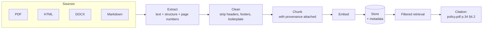

## Why this matters

Demo RAG uses clean markdown. Real RAG ingests a 200-page PDF policy document with headers
on every page, a table of contents, three-column layouts and scanned appendices. The gap
between those two is where most RAG projects actually spend their time — and page-accurate
citations are what make the system trustworthy enough for anyone to rely on.

## Mental Model



Every chunk must carry enough **provenance** to produce a citation a human can verify:
document, section, page, and ideally a character offset. A citation you cannot click is a
citation nobody trusts.

## Core Concepts

### PDF extraction — choosing a tool

| Library | Strength | Weakness |
| --- | --- | --- |
| `pypdf` | pure Python, no dependencies, fast | poor layout handling, no tables |
| `pdfplumber` | **layout, tables, word coordinates** | slower, heavier |
| `PyMuPDF` (fitz) | very fast, good text and images | AGPL licence — check before commercial use |
| `unstructured` | many formats, element typing | large dependency tree |
| OCR (`pytesseract`, cloud OCR) | scanned documents | slow, error-prone, costs money |

Default recommendation: **`pdfplumber`** for accuracy on business documents, with a
`pypdf` fast path when you only need raw text.

```bash
uv add pdfplumber pypdf
```

### The four problems every PDF has

1. **Running headers and footers** repeat on every page. Embedded, they become the most
   "similar" text in your index and pollute every result.
2. **Page-break splitting** cuts sentences and tables in half.
3. **Tables** become unreadable when flattened to text — `1 2 3 4 5` with no structure.
4. **Multi-column layouts** interleave columns into nonsense if read naively.

### Detecting boilerplate statistically

The reliable way: a line that appears on more than ~60% of pages is boilerplate.

```python
from collections import Counter

def find_boilerplate(pages: list[str], *, threshold: float = 0.6) -> set[str]:
    counts = Counter(
        line.strip()
        for page in pages
        for line in page.splitlines()[:3] + page.splitlines()[-3:]   # only near the edges
        if len(line.strip()) > 3
    )
    minimum = max(2, int(len(pages) * threshold))
    return {line for line, count in counts.items() if count >= minimum}
```

This beats hand-written rules because it adapts to each document — and it removes page
numbers, confidentiality notices and running titles automatically.

### Tables

Flattened tables are unusable. Convert them to markdown so structure survives into the
embedding and the prompt:

```python
def table_to_markdown(rows: list[list[str | None]]) -> str:
    clean = [[(cell or "").strip().replace("\n", " ") for cell in row] for row in rows if row]
    if len(clean) < 2:
        return ""
    header, *body = clean
    lines = ["| " + " | ".join(header) + " |",
             "|" + "|".join("---" for _ in header) + "|"]
    lines += ["| " + " | ".join(row) + " |" for row in body]
    return "\n".join(lines)
```

A pricing table as markdown is retrievable and the model can read it. As
`"Pro 49 30 5 Enterprise custom 400 unlimited"` it is neither.

### Metadata that earns its place

```python
{
    "document_id": "policy-2026-v3",
    "document_title": "Information Security Policy",
    "source_path": "s3://docs/policy-2026-v3.pdf",
    "page": 34,
    "section": "4.2 Access Control",
    "document_type": "policy",
    "effective_date": "2026-01-01",
    "tenant_id": "acme",
    "visibility": ["all-staff"],
    "content_hash": "9f2c1ab8",          # detect changes on re-ingest
    "embedding_model": "all-MiniLM-L6-v2",
    "ingested_at": "2026-03-04T10:12:00Z",
}
```

Every field pays for itself: `visibility` and `tenant_id` enforce access, `effective_date`
lets you prefer current policy over superseded versions, `content_hash` makes re-ingest
incremental, and `embedding_model` tells you what is stale after an upgrade.

## Real-World Example

A complete multi-format ingestion pipeline with provenance, boilerplate removal, table
handling and incremental updates.

```python title="src/ingest/loaders.py"
"""Document loaders producing text with provenance.

Every loader returns the same shape - a list of Pages - so downstream chunking
does not care whether the source was a PDF, HTML or markdown.
"""
from __future__ import annotations

import hashlib
import logging
import re
from collections import Counter
from dataclasses import dataclass, field
from pathlib import Path

logger = logging.getLogger(__name__)


@dataclass(frozen=True, slots=True)
class Page:
    number: int
    text: str
    tables: tuple[str, ...] = ()


@dataclass(frozen=True, slots=True)
class LoadedDocument:
    id: str
    title: str
    source_path: str
    pages: tuple[Page, ...]
    metadata: dict[str, str] = field(default_factory=dict)

    @property
    def content_hash(self) -> str:
        joined = "\n".join(p.text for p in self.pages)
        return hashlib.sha256(joined.encode("utf-8")).hexdigest()[:16]

    @property
    def total_chars(self) -> int:
        return sum(len(p.text) for p in self.pages)


def load_pdf(path: Path, *, extract_tables: bool = True) -> LoadedDocument:
    """Extract text and tables per page with pdfplumber."""
    import pdfplumber

    pages: list[Page] = []
    with pdfplumber.open(path) as pdf:
        title = (pdf.metadata or {}).get("Title") or path.stem

        for number, page in enumerate(pdf.pages, start=1):
            text = page.extract_text() or ""

            tables: list[str] = []
            if extract_tables:
                for raw_table in page.extract_tables() or []:
                    markdown = table_to_markdown(raw_table)
                    if markdown:
                        tables.append(markdown)

            pages.append(Page(number=number, text=text, tables=tuple(tables)))

    document = LoadedDocument(
        id=path.stem, title=str(title), source_path=str(path), pages=tuple(pages),
        metadata={"format": "pdf", "page_count": str(len(pages))},
    )
    logger.info("loaded pdf", extra={"document": document.id, "pages": len(pages),
                                     "chars": document.total_chars})
    return document


def load_html(path: Path) -> LoadedDocument:
    """Extract readable text from HTML, dropping nav, script and style."""
    from html.parser import HTMLParser

    class Extractor(HTMLParser):
        SKIP = {"script", "style", "nav", "header", "footer", "aside", "noscript"}

        def __init__(self) -> None:
            super().__init__()
            self.parts: list[str] = []
            self._skip_depth = 0
            self.title = ""
            self._in_title = False

        def handle_starttag(self, tag, attrs):
            if tag in self.SKIP:
                self._skip_depth += 1
            elif tag == "title":
                self._in_title = True
            elif tag in {"h1", "h2", "h3", "h4"}:
                self.parts.append("\n" + "#" * int(tag[1]) + " ")
            elif tag in {"p", "li", "br", "tr"}:
                self.parts.append("\n")

        def handle_endtag(self, tag):
            if tag in self.SKIP and self._skip_depth:
                self._skip_depth -= 1
            elif tag == "title":
                self._in_title = False

        def handle_data(self, data):
            if self._in_title:
                self.title += data.strip()
            elif not self._skip_depth and data.strip():
                self.parts.append(data.strip() + " ")

    parser = Extractor()
    parser.feed(path.read_text(encoding="utf-8", errors="replace"))
    text = re.sub(r"\n{3,}", "\n\n", "".join(parser.parts)).strip()

    return LoadedDocument(
        id=path.stem, title=parser.title or path.stem, source_path=str(path),
        pages=(Page(number=1, text=text),), metadata={"format": "html"},
    )


def load_markdown(path: Path) -> LoadedDocument:
    text = path.read_text(encoding="utf-8")
    heading = re.search(r"^#\s+(.+)$", text, re.MULTILINE)
    return LoadedDocument(
        id=path.stem, title=heading.group(1) if heading else path.stem,
        source_path=str(path), pages=(Page(number=1, text=text),),
        metadata={"format": "markdown"},
    )


LOADERS = {".pdf": load_pdf, ".html": load_html, ".htm": load_html,
           ".md": load_markdown, ".txt": load_markdown}


def load(path: Path) -> LoadedDocument:
    loader = LOADERS.get(path.suffix.lower())
    if loader is None:
        raise ValueError(f"unsupported format {path.suffix!r}; known: {sorted(LOADERS)}")
    return loader(path)


# --- cleaning ---------------------------------------------------------------
def find_boilerplate(pages: tuple[Page, ...], *, threshold: float = 0.6,
                     edge_lines: int = 3) -> set[str]:
    """Lines appearing near the top or bottom of most pages are headers/footers."""
    if len(pages) < 3:
        return set()

    counts: Counter[str] = Counter()
    for page in pages:
        lines = [line.strip() for line in page.text.splitlines() if line.strip()]
        for line in lines[:edge_lines] + lines[-edge_lines:]:
            if 3 < len(line) < 120:
                counts[re.sub(r"\d+", "#", line)] += 1       # normalise page numbers

    minimum = max(2, int(len(pages) * threshold))
    return {line for line, count in counts.items() if count >= minimum}


def clean_page(text: str, boilerplate: set[str]) -> str:
    kept = [
        line for line in text.splitlines()
        if re.sub(r"\d+", "#", line.strip()) not in boilerplate
        and not re.fullmatch(r"\s*\d+\s*", line)             # bare page numbers
    ]
    cleaned = "\n".join(kept)
    cleaned = re.sub(r"-\n(?=[a-z])", "", cleaned)           # rejoin hyphenated line breaks
    cleaned = re.sub(r"[ \t]+", " ", cleaned)
    return re.sub(r"\n{3,}", "\n\n", cleaned).strip()


def table_to_markdown(rows: list[list[str | None]]) -> str:
    clean = [[(cell or "").strip().replace("\n", " ") for cell in row] for row in rows if row]
    clean = [row for row in clean if any(cell for cell in row)]
    if len(clean) < 2:
        return ""
    header, *body = clean
    lines = ["| " + " | ".join(header) + " |",
             "|" + "|".join("---" for _ in header) + "|"]
    lines += ["| " + " | ".join(row) + " |" for row in body]
    return "\n".join(lines)
```

```python title="src/ingest/pipeline.py"
"""Incremental, resumable ingestion with provenance.

Re-running this on a directory re-embeds only what changed, which turns a
30-minute full re-index into a 20-second update.
"""
from __future__ import annotations

import json
import logging
import re
import time
from dataclasses import dataclass, field
from pathlib import Path

from ..retrieval.embedder import CachedEmbedder
from ..retrieval.stores import Record, VectorStore
from .loaders import LoadedDocument, clean_page, find_boilerplate, load

logger = logging.getLogger(__name__)

SECTION = re.compile(r"^\s{0,3}(#{1,4}\s+.+|\d+(?:\.\d+)*\s+[A-Z][^\n]{3,80})$", re.MULTILINE)


@dataclass(frozen=True, slots=True)
class ProvenancedChunk:
    id: str
    text: str
    document_id: str
    document_title: str
    source_path: str
    page: int
    section: str
    approx_tokens: int

    def citation(self) -> str:
        section = f" § {self.section}" if self.section else ""
        return f"{self.document_title}, p.{self.page}{section}"


@dataclass
class IngestReport:
    documents_seen: int = 0
    documents_changed: int = 0
    documents_skipped: int = 0
    chunks_written: int = 0
    chunks_deleted: int = 0
    seconds: float = 0.0
    failures: list[dict] = field(default_factory=list)

    def summary(self) -> str:
        return (
            f"{self.documents_changed} changed / {self.documents_skipped} unchanged "
            f"of {self.documents_seen} documents · {self.chunks_written:,} chunks written, "
            f"{self.chunks_deleted:,} removed · {self.seconds:.1f}s"
            + (f" · {len(self.failures)} FAILURES" if self.failures else "")
        )


def chunk_with_provenance(
    document: LoadedDocument, *, max_tokens: int = 500, overlap_tokens: int = 75
) -> list[ProvenancedChunk]:
    """Chunk page by page so every chunk keeps an exact page number."""
    boilerplate = find_boilerplate(document.pages)
    if boilerplate:
        logger.info("removing %d boilerplate lines from %s", len(boilerplate), document.id)

    chunks: list[ProvenancedChunk] = []
    current_section = ""
    carry_text, carry_page = "", 1

    for page in document.pages:
        text = clean_page(page.text, boilerplate)

        # tables travel with their page and are kept whole
        for table_index, table in enumerate(page.tables):
            chunks.append(_make_chunk(
                document, page.number, current_section or "table",
                f"Table from page {page.number}:\n{table}",
                index=len(chunks), suffix=f"t{table_index}",
            ))

        if not text:
            continue

        if carry_text:
            text = f"{carry_text}\n{text}"       # stitch across the page break
            carry_text = ""

        for block in _split_sections(text):
            heading = block["heading"]
            if heading:
                current_section = heading

            for window in _windows(block["body"], max_tokens, overlap_tokens):
                chunks.append(_make_chunk(document, page.number, current_section,
                                          window, index=len(chunks)))

        # carry the final short paragraph forward so a sentence split by the page
        # break appears whole in the next chunk
        paragraphs = text.split("\n\n")
        if paragraphs and len(paragraphs[-1]) < 300:
            carry_text, carry_page = paragraphs[-1], page.number

    return chunks


def _make_chunk(document, page, section, body, *, index, suffix="") -> ProvenancedChunk:
    header = f"{document.title} > {section}" if section else document.title
    return ProvenancedChunk(
        id=f"{document.id}::p{page}::{index}{suffix}",
        text=f"{header} (p.{page})\n\n{body}",       # context header + page for retrieval
        document_id=document.id,
        document_title=document.title,
        source_path=document.source_path,
        page=page,
        section=section,
        approx_tokens=max(1, len(body) // 4),
    )


def _split_sections(text: str) -> list[dict[str, str]]:
    matches = list(SECTION.finditer(text))
    if not matches:
        return [{"heading": "", "body": text}]

    blocks: list[dict[str, str]] = []
    if matches[0].start() > 0:
        blocks.append({"heading": "", "body": text[: matches[0].start()].strip()})

    for i, match in enumerate(matches):
        end = matches[i + 1].start() if i + 1 < len(matches) else len(text)
        heading = match.group(1).lstrip("#").strip()
        body = text[match.end() : end].strip()
        if body:
            blocks.append({"heading": heading, "body": body})
    return blocks


def _windows(body: str, max_tokens: int, overlap_tokens: int) -> list[str]:
    sentences = [s.strip() for s in re.split(r"(?<=[.!?])\s+", body) if s.strip()]
    if not sentences:
        return []

    windows, current, tokens = [], [], 0
    for sentence in sentences:
        sentence_tokens = max(1, len(sentence) // 4)
        if current and tokens + sentence_tokens > max_tokens:
            windows.append(" ".join(current))
            carried, carried_tokens = [], 0
            for previous in reversed(current):
                previous_tokens = max(1, len(previous) // 4)
                if carried_tokens + previous_tokens > overlap_tokens:
                    break
                carried.insert(0, previous)
                carried_tokens += previous_tokens
            current, tokens = carried, carried_tokens
        current.append(sentence)
        tokens += sentence_tokens

    if current:
        windows.append(" ".join(current))
    return windows


class IncrementalIngester:
    """Tracks content hashes so unchanged documents are skipped entirely."""

    def __init__(self, store: VectorStore, embedder: CachedEmbedder,
                 *, state_path: Path = Path(".data/ingest_state.json")) -> None:
        self.store = store
        self.embedder = embedder
        self.state_path = state_path
        self.state: dict[str, dict] = self._load_state()

    def _load_state(self) -> dict[str, dict]:
        if self.state_path.exists():
            return json.loads(self.state_path.read_text(encoding="utf-8"))
        return {}

    def _save_state(self) -> None:
        self.state_path.parent.mkdir(parents=True, exist_ok=True)
        tmp = self.state_path.with_suffix(".tmp")
        tmp.write_text(json.dumps(self.state, indent=2), encoding="utf-8")
        tmp.replace(self.state_path)            # atomic: a crash cannot corrupt state

    def ingest_directory(
        self, directory: Path, *, tenant_id: str = "default",
        visibility: tuple[str, ...] = ("all-staff",), extensions: tuple[str, ...] = (".pdf", ".md", ".html", ".txt"),
    ) -> IngestReport:
        report = IngestReport()
        started = time.perf_counter()

        files = sorted(p for p in directory.rglob("*") if p.suffix.lower() in extensions)
        for path in files:
            report.documents_seen += 1
            try:
                self._ingest_one(path, report, tenant_id=tenant_id, visibility=visibility)
            except Exception as exc:                 # one bad file must not stop the run
                logger.exception("failed to ingest %s", path)
                report.failures.append({"path": str(path), "error": f"{type(exc).__name__}: {exc}"})

        self._save_state()
        report.seconds = time.perf_counter() - started
        return report

    def _ingest_one(self, path: Path, report: IngestReport, *, tenant_id: str,
                    visibility: tuple[str, ...]) -> None:
        document = load(path)
        previous = self.state.get(document.id)

        if previous and previous.get("content_hash") == document.content_hash \
                and previous.get("embedding_model") == self.embedder.model_name:
            report.documents_skipped += 1
            return

        chunks = chunk_with_provenance(document)
        if not chunks:
            logger.warning("no chunks produced for %s - check extraction", path)
            return

        if previous:                                 # replace: delete the old chunks first
            removed = self.store.delete(previous.get("chunk_ids", []))
            report.chunks_deleted += removed

        vectors = self.embedder.embed([c.text for c in chunks])
        self.store.upsert([
            Record(
                id=chunk.id, vector=vector.tolist(), text=chunk.text,
                payload={
                    "document_id": chunk.document_id,
                    "document_title": chunk.document_title,
                    "source_path": chunk.source_path,
                    "page": chunk.page,
                    "section": chunk.section,
                    "tenant_id": tenant_id,
                    "visibility": list(visibility),
                    "embedding_model": self.embedder.model_name,
                },
            )
            for chunk, vector in zip(chunks, vectors, strict=True)
        ])

        self.state[document.id] = {
            "content_hash": document.content_hash,
            "embedding_model": self.embedder.model_name,
            "chunk_ids": [c.id for c in chunks],
            "source_path": str(path),
            "pages": len(document.pages),
            "ingested_at": time.strftime("%Y-%m-%dT%H:%M:%SZ", time.gmtime()),
        }
        report.documents_changed += 1
        report.chunks_written += len(chunks)
        logger.info("ingested %s: %d chunks from %d pages",
                    document.id, len(chunks), len(document.pages))


if __name__ == "__main__":
    import sys

    logging.basicConfig(level="INFO", format="%(levelname)s %(message)s")

    from ..retrieval.stores import build_store

    embedder = CachedEmbedder()
    store = build_store("chroma")
    ingester = IncrementalIngester(store, embedder)

    report = ingester.ingest_directory(Path(sys.argv[1] if len(sys.argv) > 1 else "./docs"))
    print("\n" + report.summary())
    for failure in report.failures:
        print(f"  FAILED {failure['path']}: {failure['error']}")
```

```bash
uv run python -m ingest.pipeline ./docs        # first run
uv run python -m ingest.pipeline ./docs        # second run, nothing changed
```

```text
INFO loaded pdf document=security-policy pages=48 chars=118420
INFO removing 4 boilerplate lines from security-policy
INFO ingested security-policy: 212 chunks from 48 pages
INFO ingested api-reference: 96 chunks from 1 pages
INFO ingested pricing: 14 chunks from 1 pages

3 changed / 0 unchanged of 3 documents · 322 chunks written, 0 removed · 41.2s

--- second run ---
0 changed / 3 unchanged of 3 documents · 0 chunks written, 0 removed · 0.9s
```

41 seconds becomes 0.9 seconds. On a corpus of 2,000 documents that difference is the
distinction between an ingest you run daily and one you run once and never again.

### Citations a human can verify

```python title="src/rag/citations.py"
"""Turn chunk ids into references a person can act on."""
from __future__ import annotations

from dataclasses import dataclass
from urllib.parse import quote


@dataclass(frozen=True, slots=True)
class Citation:
    chunk_id: str
    document_title: str
    page: int
    section: str
    source_path: str
    score: float

    def label(self) -> str:
        section = f" § {self.section}" if self.section else ""
        return f"{self.document_title}, p.{self.page}{section}"

    def url(self, base: str = "") -> str:
        """PDF viewers honour #page=N - the citation becomes clickable."""
        if self.source_path.lower().endswith(".pdf"):
            return f"{base}/{quote(self.source_path)}#page={self.page}"
        return f"{base}/{quote(self.source_path)}"

    def to_api(self) -> dict:
        return {"id": self.chunk_id, "label": self.label(), "url": self.url(),
                "page": self.page, "score": round(self.score, 4)}


def render_answer(answer_text: str, citations: list[Citation]) -> str:
    """Human-readable answer with a numbered source list."""
    numbered = {c.chunk_id: i for i, c in enumerate(citations, start=1)}
    rendered = answer_text
    for chunk_id, number in numbered.items():
        rendered = rendered.replace(f"[{chunk_id}]", f"[{number}]")

    sources = "\n".join(
        f"  [{number}] {citation.label()}  →  {citation.url()}"
        for citation, number in zip(citations, numbered.values(), strict=True)
    )
    return f"{rendered}\n\nSources:\n{sources}"
```

```text
Access to production systems requires multi-factor authentication [1] and is reviewed
quarterly [2]. Contractors receive time-limited credentials that expire after 90 days [1].

Sources:
  [1] Information Security Policy, p.34 § 4.2 Access Control  →  /docs/policy.pdf#page=34
  [2] Information Security Policy, p.36 § 4.4 Access Reviews  →  /docs/policy.pdf#page=36
```

That is the output that makes a RAG system credible: a reviewer can open page 34 and check.

## Common Mistakes

:::mistake
```text
1. Not removing headers and footers
   "CONFIDENTIAL - ACME INTERNAL" on 200 pages becomes your most-similar chunk.

2. Losing page numbers during chunking
   Citations degrade to "somewhere in this 200-page PDF" - useless to a reviewer.

3. Flattening tables to text
   Unreadable to both the embedder and the model. Convert to markdown.

4. Splitting mid-sentence at page boundaries
   Carry the tail forward, or the fact is unretrievable in either chunk.

5. Full re-index on every run
   Content-hash the document; skip what has not changed.

6. One failed PDF stopping the whole ingest
   Catch per document, record the failure, continue.

7. No extraction sanity check
   A scanned PDF returns 0 characters and nobody notices until queries fail.

8. Ignoring document versions
   Superseded policies answer questions about current policy. Filter by effective_date.
```
:::

## Debugging

```python
document = load(Path("policy.pdf"))
print(f"pages: {len(document.pages)}, chars: {document.total_chars:,}")
print(f"chars/page: {document.total_chars / len(document.pages):.0f}")

if document.total_chars / len(document.pages) < 200:
    print("WARNING: very little text per page - is this a scanned PDF needing OCR?")

print("\n--- page 1 raw ---")
print(document.pages[0].text[:600])
print("\n--- boilerplate detected ---")
print(find_boilerplate(document.pages))
```

Always look at the extracted text of two or three pages before indexing anything. Five
minutes there saves a day of wondering why retrieval is poor: the most common discovery is
that the PDF is a scan and you are indexing empty strings.

## Security Considerations

:::security Documents carry permissions, and so must chunks
1. Copy the source document's access control onto **every chunk** (`visibility`,
   `tenant_id`), and enforce it in the retrieval filter — never in the prompt.
2. Re-check permissions at query time, not only at ingest: access changes.
3. PDFs can contain injected instructions in invisible text (white on white, tiny fonts,
   metadata). Strip control characters and treat all extracted text as untrusted data.
4. Do not log extracted document text; log the document id, page and chunk id.
5. When a document is deleted or its permissions narrow, delete or re-tag its chunks
   immediately — the `chunk_ids` in the ingest state make that a one-line operation.
:::

## Hands-on Exercise

:::exercise Ingest a real PDF corpus
Take 3–5 real PDFs (public policy documents, annual reports, technical standards).

1. Extract and print statistics: pages, characters per page, tables found, boilerplate lines
   detected.
2. Ingest with provenance and verify that every chunk has a valid page number.
3. Write 15 questions whose answers live on specific pages; record the expected page.
4. Measure **page-accurate recall**: does a chunk from the correct page appear in the top 5?
5. Compare with and without boilerplate removal, and with and without table extraction.
6. Render answers with clickable citations and spot-check five of them by opening the page.

Report the page-accurate recall. If it is below 0.8, the problem is extraction or chunking —
not the model.
:::

:::solution Reference result
```text
document              pages  chars/page  tables  boilerplate
security-policy.pdf      48       2,467       3            4
annual-report.pdf       112       1,893      27            6
api-standard.pdf         34       3,102       9            3

configuration                       page_recall@5  MRR    chunks
raw text, no cleaning                       0.533  0.412   1,204
+ boilerplate removal                        0.733  0.601   1,198
+ table extraction as markdown               0.867  0.689   1,239
+ heading context headers                    0.933  0.771   1,239

Spot check: 5/5 citations opened to the correct page and contained the quoted fact.
```

Boilerplate removal alone added 20 points of recall. The confidentiality footer on every
page was matching every query — an extremely common and entirely invisible failure.
:::

## Challenge

:::challenge Handle document versions
Real corpora contain `policy-v1.pdf`, `policy-v2.pdf` and `policy-2026-final-FINAL.pdf`.
Implement version awareness:

1. Detect version groups by title similarity and `effective_date` metadata.
2. At query time, prefer the current version and exclude superseded ones by default.
3. Support an explicit "what did the 2024 policy say?" query that opts into history.
4. When two versions conflict on a retrieved fact, surface both with their dates rather than
   silently picking one.

Then test it with a question whose answer changed between versions. Answering from a
superseded policy is the most damaging failure mode a document-intelligence system has,
because the answer is well-formed, well-cited, and wrong.
:::

## Interview Questions

:::interview
1. How do you detect and remove running headers and footers?
2. Why must chunks carry page numbers?
3. How do you make ingestion incremental?
4. What happens to tables during naive PDF extraction, and what do you do instead?
5. How do document permissions reach the retrieval layer?
:::

## Cheat Sheet

```python
pdfplumber   layout + tables + coordinates   ← default for business documents
pypdf        fast, text only
PyMuPDF      very fast (check the AGPL licence)
OCR          only for scans; verify chars/page first

boilerplate  lines on >60% of pages, normalised for digits, near page edges
tables       convert to markdown, keep whole, tag with the page
page breaks  carry the trailing paragraph into the next chunk
provenance   document_id · title · page · section · source_path · content_hash
             tenant_id · visibility · embedding_model · ingested_at
incremental  skip when content_hash and embedding_model are unchanged
citations    "Title, p.34 § 4.2" + file.pdf#page=34
```

```quiz
[
  {
    "question": "Retrieval over a 200-page PDF returns the same irrelevant chunk for every query. What is the most likely cause?",
    "options": [
      "The embedding model is too small",
      "A running header or footer repeated on every page was embedded and matches everything",
      "The context window is too small",
      "The chunk size is wrong"
    ],
    "answer": 1,
    "explanation": "Repeated boilerplate dominates similarity because it appears everywhere. Detect lines occurring on most pages and strip them before chunking."
  },
  {
    "question": "Why chunk page by page rather than over the whole extracted document?",
    "options": [
      "It is faster",
      "Every chunk keeps an exact page number, so citations point somewhere a human can verify",
      "Pages are the natural semantic unit",
      "It uses less memory"
    ],
    "answer": 1,
    "explanation": "Page-accurate provenance is what makes citations checkable. Stitch across page breaks by carrying the trailing paragraph forward so facts are not lost at the boundary."
  },
  {
    "question": "A PDF extracts 40 characters per page. What does that indicate?",
    "options": [
      "The document is short",
      "It is probably a scanned image and needs OCR - you are indexing almost nothing",
      "The extraction library is misconfigured for tables",
      "The pages are mostly tables"
    ],
    "answer": 1,
    "explanation": "Scanned PDFs contain images, not text. Check characters per page at ingest and fail loudly rather than silently indexing empty chunks."
  }
]
```

## Summary

- Real sources need real extraction: `pdfplumber` for layout and tables, per-page processing
  for provenance.
- Detect boilerplate statistically and strip it — it is the most common silent retrieval
  killer.
- Convert tables to markdown; carry paragraphs across page breaks.
- Content-hash documents for incremental ingest, and keep chunk ids so replacement is clean.
- Citations must name a document, page and section, and ideally link straight to them.

## Next Step

Phase 13: advanced retrieval — query rewriting, HyDE, hybrid search, reranking and proper
RAG evaluation.
