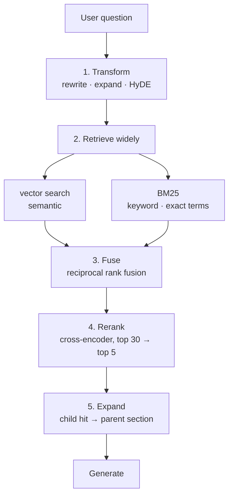

:::note In one line
**The question a user types is rarely the best search query.** Rewrite it, search two ways, then rerank.
:::

## Why this matters

Basic RAG gets you to roughly 70–85% recall. The remaining gap is where user trust is lost:
acronyms the embedding model has never seen, follow-up questions that are meaningless
standalone, exact identifiers that semantic search blurs, and the relevant chunk sitting at
rank 8 when you only take 5. Each technique here targets a specific one of those failures.

## Mental Model



Each stage exists because of a measurable failure:

| Stage | Fixes |
| --- | --- |
| Transform | vague questions, follow-ups, vocabulary mismatch |
| Hybrid | exact identifiers, rare terms, acronyms |
| Fusion | combining scores that are not on the same scale |
| Rerank | the right chunk retrieved but ranked too low |
| Parent expansion | retrieved chunk too small to answer from |

Add them **one at a time, measuring each**. Every stage costs latency, and some will not help
your corpus.

## Core Concepts

### 1. Query rewriting

The user's question is often not a good search query.

```text
"what about enterprise?"        → meaningless alone
"How much does the Enterprise plan cost?"    ← contextualised from history

"it keeps 429ing"               → informal
"HTTP 429 rate limit exceeded API"           ← normalised to document vocabulary
```

Two variants worth implementing:

- **Contextualisation**: fold conversation history into a standalone question. Mandatory for
  any multi-turn RAG.
- **Normalisation**: rephrase into the vocabulary the documents use. Helpful when users and
  documents speak differently (customers say "bill", docs say "invoice").

:::warning Rewriting can change the question
A rewrite that alters meaning produces a confident, well-cited, wrong answer. Mitigate by
retrieving with **both** the original and the rewritten query and fusing the results — you
keep the upside and bound the downside.
:::

### 2. Multi-query retrieval

Generate several phrasings and union the results.

```text
"How do we handle access reviews?"
  → "access review process and frequency"
  → "who approves production system access"
  → "quarterly permission audit policy"
```

Recall rises because different phrasings surface different chunks. Cost: one extra model
call plus N searches. Typically worth it for a knowledge base with heterogeneous writing
styles.

### 3. HyDE — Hypothetical Document Embeddings

Ask the model to *write the answer it imagines*, then embed **that** instead of the
question. A hypothetical answer looks more like a document than a question does, so it lands
closer to real documents in embedding space.

```text
Q: "What is the log retention period?"
Hypothetical: "Logs are retained for 30 days on standard plans. Enterprise customers
               may configure retention up to 400 days in the admin console."
                ↑ embed this - it shares vocabulary and shape with the real document
```

Works well on corpora where questions and documents use very different registers. Fails when
the model's hypothesis is wrong in a way that pulls retrieval toward the wrong topic — so
fuse HyDE results with plain query results rather than replacing them.

### 4. Hybrid search: BM25 + vectors

| | Vector search | BM25 (keyword) |
| --- | --- | --- |
| Finds | meaning | exact terms |
| Handles synonyms | yes | no |
| Handles `ERR_4021`, `v2.3.1`, `§4.2` | **poorly** | **exactly** |
| Rare terms | dilutes them | weights them highly |
| Typos | tolerant | intolerant |

They fail on opposite inputs, which is why combining them is one of the most reliable
improvements available. BM25 scores relevance from term frequency, inverse document
frequency and a length normalisation — a 1990s algorithm that is still hard to beat on exact
terms.

### 5. Reciprocal rank fusion

Vector scores (0–1 cosine) and BM25 scores (unbounded) are not comparable. RRF ignores the
scores and uses only the ranks:

```text
score(d) = Σ over lists  1 / (k + rank_in_that_list)      k = 60 conventionally

doc appearing at rank 1 in both lists:  1/61 + 1/61 = 0.0328
doc at rank 1 in one, absent in other:  1/61         = 0.0164
doc at rank 3 in both:                  1/63 + 1/63 = 0.0317
```

Appearing in both lists beats ranking first in one. Simple, robust, no tuning, no calibration
— and it generalises to any number of retrievers.

### 6. Reranking with a cross-encoder

The embedding model encodes query and document **separately** (fast, but it never sees them
together). A cross-encoder processes the pair jointly and scores relevance directly — far
more accurate, far too slow to run over a whole corpus.

```text
retrieve 30 candidates (fast bi-encoder)  →  rerank to top 5 (accurate cross-encoder)
```

This is the standard two-stage pattern from search engines, and it is usually the single
largest quality jump in a RAG system.

```python
from sentence_transformers import CrossEncoder

reranker = CrossEncoder("cross-encoder/ms-marco-MiniLM-L-6-v2")
scores = reranker.predict([(query, chunk.text) for chunk in candidates])
```

Cost: ~10–50 ms for 30 candidates on CPU. Hosted reranking APIs exist and are stronger, at a
per-call price.

### 7. Parent-child retrieval

Embed small chunks for precision; return the **parent** section for context.

```text
index:   200-token children  → precise matching
return:  1,000-token parent  → enough context to answer from
```

Best of both: small chunks match specific facts, but the model receives the surrounding
section instead of a fragment.

## Real-World Example

An advanced retriever combining all of it, behind the same interface as the simple one.

```python title="src/retrieval/advanced.py"
"""Advanced retrieval pipeline.

Every stage is independently switchable so you can measure its contribution.
The default configuration is deliberately conservative: hybrid + rerank, which
is where most of the gain is for most corpora.
"""
from __future__ import annotations

import logging
import math
import re
import time
from collections import Counter, defaultdict
from dataclasses import dataclass, field

logger = logging.getLogger(__name__)

TOKEN = re.compile(r"[a-z0-9][a-z0-9_.-]*")


# --- BM25 -------------------------------------------------------------------
@dataclass
class BM25Index:
    """Classic BM25. ~100 lines, no dependencies, still excellent on exact terms."""

    k1: float = 1.5
    b: float = 0.75
    _documents: list[str] = field(default_factory=list)
    _ids: list[str] = field(default_factory=list)
    _term_frequencies: list[Counter] = field(default_factory=list)
    _document_frequency: Counter = field(default_factory=Counter)
    _lengths: list[int] = field(default_factory=list)
    _average_length: float = 0.0

    @staticmethod
    def tokenize(text: str) -> list[str]:
        return TOKEN.findall(text.lower())

    def add(self, ids: list[str], texts: list[str]) -> None:
        for chunk_id, text in zip(ids, texts, strict=True):
            tokens = self.tokenize(text)
            frequencies = Counter(tokens)
            self._ids.append(chunk_id)
            self._documents.append(text)
            self._term_frequencies.append(frequencies)
            self._lengths.append(len(tokens))
            for term in frequencies:
                self._document_frequency[term] += 1
        self._average_length = sum(self._lengths) / max(len(self._lengths), 1)

    def search(self, query: str, k: int = 20) -> list[tuple[str, float]]:
        terms = self.tokenize(query)
        if not terms or not self._ids:
            return []

        total = len(self._ids)
        scores: dict[int, float] = defaultdict(float)

        for term in terms:
            document_frequency = self._document_frequency.get(term, 0)
            if document_frequency == 0:
                continue
            # IDF: rare terms carry more weight - this is what vectors dilute
            idf = math.log(1 + (total - document_frequency + 0.5) / (document_frequency + 0.5))

            for index, frequencies in enumerate(self._term_frequencies):
                frequency = frequencies.get(term, 0)
                if frequency == 0:
                    continue
                length_norm = 1 - self.b + self.b * self._lengths[index] / self._average_length
                scores[index] += idf * (frequency * (self.k1 + 1)) / (frequency + self.k1 * length_norm)

        ranked = sorted(scores.items(), key=lambda kv: kv[1], reverse=True)[:k]
        return [(self._ids[index], score) for index, score in ranked]


# --- fusion -----------------------------------------------------------------
def reciprocal_rank_fusion(
    rankings: dict[str, list[str]], *, k: int = 60, weights: dict[str, float] | None = None
) -> list[tuple[str, float]]:
    """Combine ranked id lists. Scale-free: only ranks matter."""
    fused: dict[str, float] = defaultdict(float)
    for name, ranking in rankings.items():
        weight = (weights or {}).get(name, 1.0)
        for rank, chunk_id in enumerate(ranking, start=1):
            fused[chunk_id] += weight / (k + rank)
    return sorted(fused.items(), key=lambda kv: kv[1], reverse=True)


# --- query transformation ---------------------------------------------------
class QueryTransformer:
    """LLM-powered rewriting. Every method degrades to the original on failure."""

    CONTEXTUALISE = """\
Rewrite the user's latest question as a standalone question that makes sense without
the conversation history. Preserve the original meaning exactly - do not add
constraints, do not answer it. Output only the rewritten question."""

    MULTI_QUERY = """\
Generate {n} alternative phrasings of this question that would retrieve relevant
documents. Vary vocabulary and specificity. Output one per line, nothing else."""

    HYDE = """\
Write a short, plausible passage (2-3 sentences) that would answer this question,
as if extracted from internal documentation. Do not hedge, do not say you are
unsure - this text is used only for retrieval, never shown to a user."""

    def __init__(self, llm, *, model_tier: str = "small") -> None:
        self.llm = llm
        self.model_tier = model_tier

    def contextualise(self, question: str, history: list[dict]) -> str:
        if not history:
            return question
        recent = "\n".join(f"{m['role']}: {m['content'][:300]}" for m in history[-4:])
        try:
            text, _ = self.llm.complete(
                [{"role": "user", "content": f"{recent}\nuser: {question}"}],
                system=self.CONTEXTUALISE,
            )
            rewritten = text.strip().strip('"')
            return rewritten if 3 < len(rewritten) < 400 else question
        except Exception:
            logger.warning("contextualisation failed; using the original question")
            return question

    def multi_query(self, question: str, *, n: int = 3) -> list[str]:
        try:
            text, _ = self.llm.complete(
                [{"role": "user", "content": question}],
                system=self.MULTI_QUERY.format(n=n),
            )
            variants = [line.strip("-• ").strip() for line in text.splitlines() if line.strip()]
            return [question, *variants[:n]]
        except Exception:
            return [question]

    def hyde(self, question: str) -> str:
        try:
            text, _ = self.llm.complete(
                [{"role": "user", "content": question}], system=self.HYDE
            )
            return text.strip() or question
        except Exception:
            return question


# --- the retriever ----------------------------------------------------------
@dataclass
class AdvancedRetriever:
    embedder: object
    store: object
    bm25: BM25Index | None = None
    reranker: object | None = None          # CrossEncoder or an API client
    transformer: QueryTransformer | None = None

    # stage switches - flip one at a time and measure
    use_hybrid: bool = True
    use_rerank: bool = True
    use_multi_query: bool = False
    use_hyde: bool = False

    candidates_k: int = 30                  # retrieve widely
    final_k: int = 5                        # return narrowly
    rrf_k: int = 60
    weights: dict[str, float] = field(default_factory=lambda: {"vector": 1.0, "bm25": 0.7})

    def retrieve(
        self, question: str, *, history: list[dict] | None = None,
        where: dict | None = None,
    ) -> tuple[list, dict]:
        timings: dict[str, int] = {}
        rankings: dict[str, list[str]] = {}
        chunk_by_id: dict[str, object] = {}

        # --- 1. transform ---------------------------------------------------
        started = time.perf_counter()
        search_query = question
        queries = [question]

        if self.transformer:
            if history:
                search_query = self.transformer.contextualise(question, history)
                if search_query != question:
                    queries.append(search_query)
            if self.use_multi_query:
                queries = self.transformer.multi_query(search_query)
            if self.use_hyde:
                queries.append(self.transformer.hyde(search_query))
        timings["transform"] = int((time.perf_counter() - started) * 1000)

        # --- 2. vector search over every query variant ----------------------
        started = time.perf_counter()
        for index, query in enumerate(dict.fromkeys(queries)):        # dedupe, keep order
            hits = self.store.search(self.embedder.embed_query(query),
                                     k=self.candidates_k, where=where)
            rankings[f"vector:{index}"] = [h.id for h in hits]
            for hit in hits:
                chunk_by_id.setdefault(hit.id, hit)
        timings["vector"] = int((time.perf_counter() - started) * 1000)

        # --- 3. keyword search ----------------------------------------------
        if self.use_hybrid and self.bm25 is not None:
            started = time.perf_counter()
            keyword_hits = self.bm25.search(search_query, k=self.candidates_k)
            rankings["bm25"] = [chunk_id for chunk_id, _ in keyword_hits]
            for chunk_id, _ in keyword_hits:
                if chunk_id not in chunk_by_id:
                    fetched = self.store.get(chunk_id) if hasattr(self.store, "get") else None
                    if fetched is not None:
                        chunk_by_id[chunk_id] = fetched
            timings["bm25"] = int((time.perf_counter() - started) * 1000)

        # --- 4. fuse ---------------------------------------------------------
        started = time.perf_counter()
        weights = {
            name: self.weights.get(name.split(":")[0], 1.0) for name in rankings
        }
        fused = reciprocal_rank_fusion(rankings, k=self.rrf_k, weights=weights)
        candidates = [chunk_by_id[cid] for cid, _ in fused if cid in chunk_by_id]
        timings["fuse"] = int((time.perf_counter() - started) * 1000)

        # --- 5. rerank --------------------------------------------------------
        if self.use_rerank and self.reranker is not None and candidates:
            started = time.perf_counter()
            pool = candidates[: self.candidates_k]
            scores = self.reranker.predict([(search_query, c.text) for c in pool])
            ordered = sorted(zip(pool, scores, strict=True), key=lambda p: p[1], reverse=True)
            candidates = [chunk for chunk, _ in ordered]
            timings["rerank"] = int((time.perf_counter() - started) * 1000)

        selected = candidates[: self.final_k]

        diagnostics = {
            "queries_used": len(dict.fromkeys(queries)),
            "rewritten_query": search_query if search_query != question else None,
            "candidates": len(chunk_by_id),
            "returned": len(selected),
            "timings_ms": timings,
            "total_ms": sum(timings.values()),
        }
        logger.info("advanced retrieval", extra=diagnostics)
        return selected, diagnostics


# --- parent-child expansion --------------------------------------------------
@dataclass
class ParentChildExpander:
    """Retrieve precise children, hand the model their parents."""

    parent_by_child: dict[str, str]          # child id -> parent id
    parent_text: dict[str, str]              # parent id -> full section text

    def expand(self, chunks: list, *, max_parents: int = 4) -> list[dict]:
        seen: set[str] = set()
        expanded: list[dict] = []

        for chunk in chunks:
            parent_id = self.parent_by_child.get(chunk.id)
            if parent_id is None:
                expanded.append({"id": chunk.id, "text": chunk.text, "expanded": False})
                continue
            if parent_id in seen:
                continue                      # two children of one parent: include once
            seen.add(parent_id)
            expanded.append({
                "id": parent_id,
                "text": self.parent_text.get(parent_id, chunk.text),
                "expanded": True,
                "matched_child": chunk.id,
            })
            if len(expanded) >= max_parents:
                break

        return expanded
```

### Measuring each stage

```python title="src/retrieval/ablation.py"
"""Ablation study: which stage is actually earning its latency?"""
from __future__ import annotations

import numpy as np


def evaluate(retriever, cases: list[dict], *, k: int = 5) -> dict[str, float]:
    """cases: [{"question": str, "relevant_ids": [str], "history": [...]}]"""
    recalls, reciprocal_ranks, latencies = [], [], []

    for case in cases:
        chunks, diagnostics = retriever.retrieve(
            case["question"], history=case.get("history")
        )
        returned = [c.id for c in chunks][:k]
        relevant = set(case["relevant_ids"])

        recalls.append(len(relevant & set(returned)) / max(len(relevant), 1))
        rank = next((i for i, cid in enumerate(returned, 1) if cid in relevant), None)
        reciprocal_ranks.append(1 / rank if rank else 0.0)
        latencies.append(diagnostics["total_ms"])

    return {
        f"recall@{k}": round(float(np.mean(recalls)), 3),
        "mrr": round(float(np.mean(reciprocal_ranks)), 3),
        "p50_ms": round(float(np.percentile(latencies, 50))),
        "p95_ms": round(float(np.percentile(latencies, 95))),
    }


def ablate(build_retriever, cases: list[dict]) -> None:
    configurations = [
        ("vector only", {"use_hybrid": False, "use_rerank": False}),
        ("+ hybrid (BM25)", {"use_hybrid": True, "use_rerank": False}),
        ("+ rerank", {"use_hybrid": True, "use_rerank": True}),
        ("+ multi-query", {"use_hybrid": True, "use_rerank": True, "use_multi_query": True}),
        ("+ HyDE", {"use_hybrid": True, "use_rerank": True, "use_hyde": True}),
    ]

    print(f"{'configuration':<22}{'recall@5':>10}{'mrr':>8}{'p50_ms':>9}{'p95_ms':>9}")
    for label, options in configurations:
        metrics = evaluate(build_retriever(**options), cases)
        print(f"{label:<22}{metrics['recall@5']:>10}{metrics['mrr']:>8}"
              f"{metrics['p50_ms']:>9}{metrics['p95_ms']:>9}")
```

```text
configuration           recall@5     mrr   p50_ms   p95_ms
vector only                0.740   0.612       18       31
+ hybrid (BM25)            0.840   0.701       27       44
+ rerank                   0.940   0.878       71      112
+ multi-query              0.950   0.881      704      986
+ HyDE                     0.930   0.844      689      941
```

Read that table carefully — it is the point of the lesson:

- **Hybrid**: +10 points of recall for 9 ms. Take it.
- **Reranking**: +10 more points and a large MRR jump (0.70 → 0.88, meaning the right chunk
  moves to the top) for 44 ms. Take it.
- **Multi-query**: +1 point for **630 ms**. Not worth it here — it adds an LLM call.
- **HyDE**: *worse* than reranking alone on this corpus, and slow. Reject it.

Two techniques that every blog post recommends did not pay for themselves on this data.
That is why you measure instead of adopting.

## Common Mistakes

:::mistake
```text
1. Adding every technique at once
   You cannot tell which helped, and you pay for all of them.

2. Replacing vector search with HyDE rather than fusing
   When the hypothesis is off-topic, retrieval follows it off-topic.

3. Rewriting without keeping the original query
   A meaning-changing rewrite becomes a confident wrong answer. Fuse both.

4. Reranking the whole corpus
   Cross-encoders are O(n) with a large constant. Rerank 20-50 candidates, not 50,000.

5. Normalising BM25 and cosine scores to combine them
   They are not comparable. Use RRF - it only needs ranks.

6. Multi-query on every request
   An extra LLM call per query, usually for a marginal gain. Reserve it for
   low-confidence cases: run it only when the top score is below a threshold.

7. Ignoring the latency budget
   700 ms of retrieval on a 2-second budget is a third of the experience for +1 point.
```
:::

## Performance Considerations

| Stage | Typical latency | Quality effect |
| --- | --- | --- |
| Vector search | 5–20 ms | baseline |
| BM25 | 5–15 ms | +5–15 recall on exact terms |
| RRF fusion | <1 ms | makes combination possible |
| Cross-encoder rerank (30 candidates, CPU) | 40–80 ms | **+5–15 recall, large MRR gain** |
| Hosted reranker API | 100–300 ms | stronger than local, per-call cost |
| Query rewrite (LLM) | 300–800 ms | essential for multi-turn, otherwise variable |
| Multi-query | 400–900 ms | +0–5 recall |
| HyDE | 400–900 ms | corpus-dependent, sometimes negative |

A pragmatic default: **hybrid + rerank always; contextualisation only when history exists;
multi-query only when the top fused score is below a confidence threshold.**

```python
chunks, diagnostics = retriever.retrieve(question, history=history)
if chunks and chunks[0].score < LOW_CONFIDENCE:
    retriever.use_multi_query = True                 # escalate only when needed
    chunks, diagnostics = retriever.retrieve(question, history=history)
```

## Hands-on Exercise

:::exercise Run your own ablation
Using your corpus and the 20-question evaluation set from Phase 12:

1. Add exact-identifier questions (error codes, version numbers, section references) — these
   are where vector-only retrieval fails and BM25 shines.
2. Add 5 follow-up questions that require conversation history.
3. Implement BM25 and RRF from this lesson.
4. Add a cross-encoder reranker.
5. Run the ablation and produce the table: recall@5, MRR, p50, p95 for each configuration.
6. Choose a configuration and justify it in two sentences, naming the latency you accepted.

Expect BM25 to help most on the identifier questions and reranking to help everywhere.
Expect at least one recommended technique to fail on your data.
:::

:::solution Reference result with identifier questions
```text
configuration         recall@5   mrr   id_recall   followup_recall   p50_ms
vector only              0.700  0.581      0.400             0.200       17
+ hybrid                 0.850  0.712      0.933             0.200       26
+ rerank                 0.925  0.869      0.933             0.200       68
+ contextualisation      0.950  0.884      0.933             1.000      412*

* contextualisation only runs when history is present: 412 ms on follow-up
  questions, 68 ms on standalone ones.

Chosen: hybrid + rerank always, contextualisation only when history is non-empty.
BM25 took identifier recall from 0.40 to 0.93 (semantic search cannot distinguish
ERR_4021 from ERR_4022); reranking lifted MRR from 0.71 to 0.87; contextualisation is
the only thing that makes follow-ups work at all, and we pay its 350 ms only on the
~30% of turns that have history.
```

The `id_recall` column is the clearest possible argument for hybrid search: 0.40 → 0.93 on
questions containing exact identifiers.
:::

## Challenge

:::challenge Adaptive retrieval
Build a router that picks the retrieval strategy per query, from cheap signals:

- contains an identifier pattern (`[A-Z]+_\d+`, `v\d+\.\d+`, `§\d`) → weight BM25 higher
- has conversation history → contextualise
- is short and vague (< 5 words) → multi-query
- top fused score below threshold → escalate to multi-query + HyDE
- otherwise → hybrid + rerank

Measure quality *and* mean latency against always-run-everything and always-run-basic. The
goal is the recall of the expensive pipeline at close to the latency of the cheap one — and
a table showing you achieved it.
:::

## Interview Questions

:::interview
1. Why combine BM25 with vector search rather than choosing one?
2. What is reciprocal rank fusion, and why not just normalise and add the scores?
3. How does a cross-encoder differ from a bi-encoder, and why is it a second stage?
4. When does HyDE help, and how can it hurt?
5. What does parent-child retrieval solve?
:::

## Cheat Sheet

```text
TRANSFORM  contextualise (multi-turn, essential) · normalise · multi-query · HyDE
           always keep the original query in the fusion

HYBRID     vector (meaning) + BM25 (exact terms, identifiers, rare words)
           BM25: tf-idf with length normalisation; k1=1.5, b=0.75

FUSE       RRF: score = Σ 1/(60 + rank). Scale-free, no calibration, any number of lists.

RERANK     bi-encoder retrieves 20-50 → cross-encoder scores (query, doc) jointly → top 5
           the biggest single quality jump in most RAG systems

EXPAND     parent-child: embed small for precision, return the parent for context

RULE       add one stage at a time and measure recall, MRR and p95 latency
```

```quiz
[
  {
    "question": "Users search for error code ERR_4021 and get chunks about ERR_4022 and general error handling. What fixes this?",
    "options": [
      "A larger embedding model",
      "Hybrid search: BM25 matches the exact token, which vector similarity blurs together",
      "A bigger context window",
      "Lower the score threshold"
    ],
    "answer": 1,
    "explanation": "Embeddings place similar-looking identifiers near each other because they carry almost no semantic difference. Keyword scoring treats them as distinct rare terms."
  },
  {
    "question": "Why use reciprocal rank fusion instead of normalising and averaging scores?",
    "options": [
      "It is faster",
      "Cosine and BM25 scores are on incomparable scales; RRF uses only ranks, so no calibration is needed",
      "RRF is more accurate in all cases",
      "Normalisation is not possible"
    ],
    "answer": 1,
    "explanation": "Any score normalisation requires assumptions about distributions that change per corpus and per query. Ranks are robust, and RRF extends to any number of retrievers."
  },
  {
    "question": "Your ablation shows multi-query adds +1 point of recall for +630 ms. What should you do?",
    "options": [
      "Ship it - recall is what matters",
      "Reject it as a default, and consider running it only when the top score is low",
      "Ship it and increase the timeout",
      "Replace reranking with it"
    ],
    "answer": 1,
    "explanation": "A third of a second for one point is a poor trade at every request. Conditional escalation keeps the upside for hard queries while leaving the common case fast."
  }
]
```

## Summary

- Each advanced technique targets a specific retrieval failure; add them one at a time and
  measure.
- Hybrid search fixes exact identifiers and rare terms; RRF combines rankings without
  calibration.
- Cross-encoder reranking is usually the biggest quality gain per millisecond.
- Query rewriting is essential for multi-turn but must keep the original query in the fusion.
- Multi-query and HyDE are corpus-dependent and frequently not worth their latency —
  escalate to them conditionally.

## Next Step

Evaluating RAG properly: faithfulness, answer relevance, context precision, and building the
dataset that makes every change measurable.
