:::note In one line
**You can write a real agent in about forty lines, with no framework.** Doing it once means every framework afterwards looks like convenience rather than magic.
:::

## Why this matters

Every agent framework you will meet — LangChain, LangGraph, CrewAI — is this loop plus
conveniences. Writing it yourself once means you can read their source, debug their
behaviour, and judge honestly whether a framework is adding value for your case. It also
produces something you can actually ship: this agent has the safety properties most
framework examples omit.

## Mental Model

```mermaid
flowchart TB
  START([goal]) --> CHECK{"limits ok?<br/>iterations · cost · time"}
  CHECK -->|no| STOP([stop with reason])
  CHECK -->|yes| MODEL["model(messages, tools)"]
  MODEL --> D{"stop_reason"}
  D -->|end_turn| FINAL([final answer])
  D -->|tool_use| VAL["validate arguments"]
  VAL -->|invalid| OBS
  VAL -->|valid| PERM{"permitted?"}
  PERM -->|needs approval| HUMAN["human gate"]
  PERM -->|allowed| EXEC["execute tool"]
  EXEC --> OBS["observation<br/>(result or error)"]
  HUMAN --> OBS
  OBS --> CHECK
```



Three properties the loop must have, which no prompt can provide:

1. **It always terminates** — every exit path has a named reason.
2. **Errors become observations** — a failed tool teaches the agent, it does not crash the
   run.
3. **Every step is recorded** — the trajectory is the only way to debug an agent.

## Project structure

```text
agent/
├── src/agent/
│   ├── __init__.py
│   ├── tools.py         registry, schemas, validated execution
│   ├── memory.py         conversation + scratchpad with trimming
│   ├── trace.py          trajectory recording
│   ├── loop.py           the agent itself
│   └── cli.py
├── tests/
│   ├── test_tools.py
│   └── test_loop.py
└── pyproject.toml
```

```bash
uv add anthropic pydantic
uv add --dev pytest
```

## Step 1 — Tools

```python title="src/agent/tools.py"
"""Tool registry with schemas, validation and permissions.

A tool is the only way an agent touches the world, so each one is:
  - described precisely (the model reads the description as a specification)
  - schema-validated before execution
  - permission-classified (read / write / dangerous)
  - timed, counted and error-wrapped
"""
from __future__ import annotations

import functools
import inspect
import json
import logging
import time
from collections.abc import Callable
from dataclasses import dataclass, field
from enum import StrEnum
from typing import Any, get_type_hints

logger = logging.getLogger(__name__)


class Permission(StrEnum):
    READ = "read"              # safe: query data, no side effects
    WRITE = "write"            # changes state: needs care
    DANGEROUS = "dangerous"    # irreversible or external: needs human approval


class ToolError(RuntimeError):
    """A tool failed in a way the agent should see and can react to."""


JSON_TYPES: dict[type, str] = {
    str: "string", int: "integer", float: "number", bool: "boolean",
    list: "array", dict: "object",
}


@dataclass
class Tool:
    name: str
    description: str
    fn: Callable[..., Any]
    schema: dict[str, Any]
    permission: Permission = Permission.READ
    timeout_s: float = 10.0
    max_result_chars: int = 4_000

    calls: int = 0
    failures: int = 0
    total_ms: float = 0.0

    @property
    def spec(self) -> dict[str, Any]:
        """The payload sent to the model."""
        return {"name": self.name, "description": self.description, "input_schema": self.schema}


class ToolRegistry:
    def __init__(self) -> None:
        self._tools: dict[str, Tool] = {}

    def register(self, tool: Tool) -> Tool:
        if tool.name in self._tools:
            raise ValueError(f"duplicate tool name: {tool.name!r}")
        self._tools[tool.name] = tool
        return tool

    def get(self, name: str) -> Tool:
        try:
            return self._tools[name]
        except KeyError as exc:
            raise ToolError(
                f"unknown tool {name!r}. Available tools: {sorted(self._tools)}"
            ) from exc

    def specs(self, *, allowed: set[Permission] | None = None) -> list[dict[str, Any]]:
        """Only expose tools the caller is allowed to use - least privilege by construction."""
        return [
            tool.spec for tool in self._tools.values()
            if allowed is None or tool.permission in allowed
        ]

    def names(self) -> list[str]:
        return sorted(self._tools)

    def stats(self) -> list[dict[str, Any]]:
        return [
            {"tool": t.name, "calls": t.calls, "failures": t.failures,
             "mean_ms": round(t.total_ms / t.calls, 1) if t.calls else 0.0}
            for t in self._tools.values() if t.calls
        ]


registry = ToolRegistry()


def _build_schema(fn: Callable[..., Any]) -> dict[str, Any]:
    signature = inspect.signature(fn)
    hints = get_type_hints(fn)
    properties: dict[str, Any] = {}
    required: list[str] = []

    docstring = inspect.getdoc(fn) or ""
    described: dict[str, str] = {}
    for line in docstring.splitlines():
        stripped = line.strip()
        if ":" in stripped and stripped.split(":")[0].strip() in signature.parameters:
            name, _, text = stripped.partition(":")
            described[name.strip()] = text.strip()

    for name, parameter in signature.parameters.items():
        annotation = hints.get(name, str)
        properties[name] = {
            "type": JSON_TYPES.get(annotation, "string"),
            "description": described.get(name, name),
        }
        if parameter.default is inspect.Parameter.empty:
            required.append(name)

    return {"type": "object", "properties": properties, "required": required,
            "additionalProperties": False}


def tool(
    _fn: Callable[..., Any] | None = None, *,
    permission: Permission = Permission.READ,
    timeout_s: float = 10.0,
    name: str | None = None,
):
    """Register a function as an agent tool.

    The docstring becomes the model's specification of the tool, so write it for
    the model: say what it returns, what the arguments mean, and when NOT to use it.
    """

    def decorator(fn: Callable[..., Any]) -> Callable[..., Any]:
        docstring = inspect.getdoc(fn)
        if not docstring:
            raise ValueError(f"tool {fn.__name__!r} needs a docstring - the model reads it")

        entry = Tool(
            name=name or fn.__name__,
            description=docstring,
            fn=fn,
            schema=_build_schema(fn),
            permission=permission,
            timeout_s=timeout_s,
        )
        registry.register(entry)

        @functools.wraps(fn)
        def wrapper(*args, **kwargs):
            return fn(*args, **kwargs)

        wrapper.tool = entry           # type: ignore[attr-defined]
        return wrapper

    return decorator(_fn) if _fn is not None else decorator


def execute(name: str, arguments: dict[str, Any]) -> tuple[str, bool]:
    """Run a tool. Returns (observation, is_error).

    Errors are returned, never raised: the agent must SEE the failure to recover
    from it. A raised exception ends the run; a returned error is a data point.
    """
    try:
        entry = registry.get(name)
    except ToolError as exc:
        return str(exc), True

    missing = [key for key in entry.schema["required"] if key not in arguments]
    if missing:
        entry.failures += 1
        return (f"Error: missing required arguments {missing} for {name}. "
                f"Schema: {json.dumps(entry.schema['properties'])}"), True

    unexpected = [key for key in arguments if key not in entry.schema["properties"]]
    if unexpected:
        entry.failures += 1
        return f"Error: unknown arguments {unexpected} for {name}.", True

    started = time.perf_counter()
    entry.calls += 1
    try:
        result = entry.fn(**arguments)
        text = result if isinstance(result, str) else json.dumps(result, default=str)

        if len(text) > entry.max_result_chars:
            text = (text[: entry.max_result_chars]
                    + f"\n\n[truncated: {len(text):,} chars total. Narrow the query.]")
        return text, False

    except Exception as exc:
        entry.failures += 1
        logger.warning("tool %s failed: %s", name, exc)
        # A useful error tells the agent how to fix its call.
        return f"Error from {name}: {type(exc).__name__}: {exc}", True
    finally:
        entry.total_ms += (time.perf_counter() - started) * 1000
```

## Step 2 — Memory and trajectory

```python title="src/agent/memory.py"
"""Conversation state with trimming.

An agent's context grows with every observation. Without trimming, a 15-step run
exhausts the window and the agent forgets its own goal.
"""
from __future__ import annotations

from dataclasses import dataclass, field
from typing import Any


@dataclass
class AgentMemory:
    goal: str
    messages: list[dict[str, Any]] = field(default_factory=list)
    max_messages: int = 40
    max_observation_chars: int = 4_000

    def add_user(self, content: str) -> None:
        self.messages.append({"role": "user", "content": content})

    def add_assistant(self, content: Any) -> None:
        self.messages.append({"role": "assistant", "content": content})

    def add_tool_results(self, results: list[dict[str, Any]]) -> None:
        """All results from one assistant turn go in ONE user message."""
        self.messages.append({"role": "user", "content": results})

    def trim(self) -> int:
        """Keep the first exchange (the goal) and the most recent turns."""
        if len(self.messages) <= self.max_messages:
            return 0

        keep_head = 2
        keep_tail = self.max_messages - keep_head - 1
        dropped = len(self.messages) - keep_head - keep_tail

        summary = {
            "role": "user",
            "content": (f"[{dropped} earlier steps omitted for context length. "
                        f"The goal remains: {self.goal}]"),
        }
        self.messages = self.messages[:keep_head] + [summary] + self.messages[-keep_tail:]
        return dropped

    def approx_tokens(self) -> int:
        return sum(len(str(m.get("content", ""))) for m in self.messages) // 4
```

```python title="src/agent/trace.py"
"""Trajectory recording - the only way to debug an agent."""
from __future__ import annotations

import json
import time
from dataclasses import asdict, dataclass, field
from pathlib import Path


@dataclass(frozen=True, slots=True)
class Step:
    index: int
    kind: str                       # think | tool_call | observation | final | limit
    tool: str | None = None
    arguments: dict | None = None
    content: str = ""
    is_error: bool = False
    ms: int = 0
    input_tokens: int = 0
    output_tokens: int = 0
    cost_usd: float = 0.0


@dataclass
class Trajectory:
    goal: str
    steps: list[Step] = field(default_factory=list)
    started_at: float = field(default_factory=time.time)
    stop_reason: str = ""
    final_answer: str = ""

    def record(self, **kwargs) -> Step:
        step = Step(index=len(self.steps), **kwargs)
        self.steps.append(step)
        return step

    @property
    def tool_calls(self) -> list[Step]:
        return [s for s in self.steps if s.kind == "tool_call"]

    @property
    def errors(self) -> list[Step]:
        return [s for s in self.steps if s.is_error]

    @property
    def total_cost(self) -> float:
        return sum(s.cost_usd for s in self.steps)

    @property
    def total_ms(self) -> int:
        return sum(s.ms for s in self.steps)

    def repeated_calls(self) -> dict[str, int]:
        """Detect looping: the same tool with the same arguments, repeatedly."""
        seen: dict[str, int] = {}
        for step in self.tool_calls:
            key = f"{step.tool}:{json.dumps(step.arguments, sort_keys=True)}"
            seen[key] = seen.get(key, 0) + 1
        return {key: count for key, count in seen.items() if count > 1}

    def summary(self) -> dict:
        return {
            "goal": self.goal[:120],
            "stop_reason": self.stop_reason,
            "steps": len(self.steps),
            "tool_calls": len(self.tool_calls),
            "errors": len(self.errors),
            "repeated_calls": self.repeated_calls(),
            "total_ms": self.total_ms,
            "cost_usd": round(self.total_cost, 5),
        }

    def render(self) -> str:
        lines = [f"GOAL: {self.goal}", ""]
        for step in self.steps:
            marker = "✗" if step.is_error else "·"
            if step.kind == "tool_call":
                lines.append(f"{step.index:>2} {marker} CALL {step.tool}"
                             f"({json.dumps(step.arguments)[:100]})")
            elif step.kind == "observation":
                lines.append(f"{step.index:>2} {marker} OBS  {step.content[:120]}")
            elif step.kind == "final":
                lines.append(f"{step.index:>2}   FINAL {step.content[:200]}")
            else:
                lines.append(f"{step.index:>2}   {step.kind.upper()} {step.content[:120]}")
        lines += ["", json.dumps(self.summary(), indent=2)]
        return "\n".join(lines)

    def save(self, path: Path) -> None:
        path.parent.mkdir(parents=True, exist_ok=True)
        with path.open("a", encoding="utf-8") as handle:
            handle.write(json.dumps({
                "goal": self.goal, "stop_reason": self.stop_reason,
                "final_answer": self.final_answer,
                "steps": [asdict(s) for s in self.steps],
                "summary": self.summary(),
            }, default=str) + "\n")
```

## Step 3 — The loop

```python title="src/agent/loop.py"
"""The agent loop.

Every exit path has a named stop reason. Every limit is enforced in code before
the model is called, never by asking the model to behave.
"""
from __future__ import annotations

import logging
import time
from collections.abc import Callable
from dataclasses import dataclass, field
from enum import StrEnum
from pathlib import Path

from . import tools as tool_module
from .memory import AgentMemory
from .tools import Permission, registry
from .trace import Trajectory

logger = logging.getLogger(__name__)


class StopReason(StrEnum):
    COMPLETED = "completed"
    MAX_ITERATIONS = "max_iterations"
    BUDGET_EXCEEDED = "budget_exceeded"
    TIMEOUT = "timeout"
    TOO_MANY_ERRORS = "too_many_errors"
    LOOP_DETECTED = "loop_detected"
    HUMAN_REJECTED = "human_rejected"
    MODEL_ERROR = "model_error"


SYSTEM_TEMPLATE = """\
You are an investigation agent. You work toward the goal using the available tools.

How to work:
- Take one step at a time. Call a tool, read the result, then decide the next step.
- Call several tools at once only when they are genuinely independent.
- If a tool returns an error, read it and try a different approach; do not repeat
  the identical call.
- Do not guess values you could look up. Do not invent data.
- When you have enough information, stop and give the final answer.
- If you cannot complete the goal, say what you found, what is missing, and what
  you would need.

Completion criteria:
{criteria}

Goal:
{goal}
"""


@dataclass
class AgentResult:
    answer: str
    stop_reason: StopReason
    trajectory: Trajectory
    iterations: int
    cost_usd: float

    @property
    def succeeded(self) -> bool:
        return self.stop_reason is StopReason.COMPLETED

    def to_api(self) -> dict:
        return {
            "answer": self.answer,
            "succeeded": self.succeeded,
            "stop_reason": str(self.stop_reason),
            "iterations": self.iterations,
            "tool_calls": len(self.trajectory.tool_calls),
            "cost_usd": round(self.cost_usd, 5),
            "latency_ms": self.trajectory.total_ms,
        }


@dataclass
class Agent:
    llm: object                                   # .call_with_tools(messages, tools, system)
    max_iterations: int = 8
    max_cost_usd: float = 0.50
    max_seconds: float = 120.0
    max_consecutive_errors: int = 3
    max_repeated_calls: int = 3
    allowed_permissions: set[Permission] = field(
        default_factory=lambda: {Permission.READ}          # read-only by default
    )
    approval_callback: Callable[[str, dict], bool] | None = None
    trace_path: Path | None = None

    def run(self, goal: str, *, criteria: str = "You have answered the goal fully.") -> AgentResult:
        memory = AgentMemory(goal=goal)
        memory.add_user(goal)
        trajectory = Trajectory(goal=goal)

        system = SYSTEM_TEMPLATE.format(goal=goal, criteria=criteria)
        specs = registry.specs(allowed=self.allowed_permissions)

        started = time.monotonic()
        consecutive_errors = 0
        answer = ""
        stop_reason = StopReason.MAX_ITERATIONS
        iteration = 0

        while iteration < self.max_iterations:
            iteration += 1

            # --- limits, checked BEFORE spending anything --------------------
            elapsed = time.monotonic() - started
            if elapsed > self.max_seconds:
                stop_reason = StopReason.TIMEOUT
                break
            if trajectory.total_cost >= self.max_cost_usd:
                stop_reason = StopReason.BUDGET_EXCEEDED
                break
            if consecutive_errors >= self.max_consecutive_errors:
                stop_reason = StopReason.TOO_MANY_ERRORS
                break
            repeated = trajectory.repeated_calls()
            if repeated and max(repeated.values()) >= self.max_repeated_calls:
                stop_reason = StopReason.LOOP_DETECTED
                logger.warning("loop detected: %s", repeated)
                break

            memory.trim()

            # --- call the model ----------------------------------------------
            call_started = time.perf_counter()
            try:
                response = self.llm.call_with_tools(
                    messages=memory.messages, tools=specs, system=system
                )
            except Exception as exc:
                logger.exception("model call failed")
                trajectory.record(kind="limit", content=f"model error: {exc}", is_error=True)
                stop_reason = StopReason.MODEL_ERROR
                break
            call_ms = int((time.perf_counter() - call_started) * 1000)

            trajectory.record(
                kind="think", content=response.text[:500], ms=call_ms,
                input_tokens=response.input_tokens, output_tokens=response.output_tokens,
                cost_usd=response.cost_usd,
            )

            # --- finished? -----------------------------------------------------
            if not response.tool_calls:
                answer = response.text
                stop_reason = StopReason.COMPLETED
                trajectory.record(kind="final", content=answer)
                break

            memory.add_assistant(response.raw_content)

            # --- execute the requested tools ------------------------------------
            results = []
            any_error = False

            for call in response.tool_calls:
                trajectory.record(kind="tool_call", tool=call.name, arguments=call.arguments)

                entry = None
                try:
                    entry = registry.get(call.name)
                except tool_module.ToolError:
                    pass

                # permission gate: approval happens here, in code
                if entry and entry.permission not in self.allowed_permissions:
                    observation, is_error = (
                        f"Error: tool {call.name!r} is not permitted in this context.", True
                    )
                elif entry and entry.permission is Permission.DANGEROUS:
                    if self.approval_callback is None:
                        observation, is_error = (
                            f"Error: {call.name} requires human approval, which is not "
                            f"available. Explain what you would do instead."), True
                    elif not self.approval_callback(call.name, call.arguments):
                        trajectory.record(kind="limit", content=f"human rejected {call.name}")
                        stop_reason = StopReason.HUMAN_REJECTED
                        answer = f"Action {call.name} was not approved. No changes were made."
                        return self._finish(answer, stop_reason, trajectory, iteration)
                    else:
                        observation, is_error = tool_module.execute(call.name, call.arguments)
                else:
                    observation, is_error = tool_module.execute(call.name, call.arguments)

                any_error = any_error or is_error
                trajectory.record(kind="observation", tool=call.name,
                                  content=observation[:500], is_error=is_error)
                results.append({
                    "type": "tool_result", "tool_use_id": call.id,
                    "content": observation, "is_error": is_error,
                })

            consecutive_errors = consecutive_errors + 1 if any_error else 0
            memory.add_tool_results(results)

        if not answer:
            answer = self._explain_stop(stop_reason, trajectory)

        return self._finish(answer, stop_reason, trajectory, iteration)

    def _finish(self, answer: str, stop_reason: StopReason,
                trajectory: Trajectory, iterations: int) -> AgentResult:
        trajectory.stop_reason = str(stop_reason)
        trajectory.final_answer = answer
        if self.trace_path:
            trajectory.save(self.trace_path)
        logger.info("agent finished", extra=trajectory.summary())
        return AgentResult(answer=answer, stop_reason=stop_reason, trajectory=trajectory,
                           iterations=iterations, cost_usd=trajectory.total_cost)

    @staticmethod
    def _explain_stop(stop_reason: StopReason, trajectory: Trajectory) -> str:
        """Never return an empty answer: say what happened and what was learned."""
        findings = [s.content[:150] for s in trajectory.steps
                    if s.kind == "observation" and not s.is_error][-3:]
        detail = ("\n\nWhat I found before stopping:\n"
                  + "\n".join(f"- {f}" for f in findings)) if findings else ""

        messages = {
            StopReason.MAX_ITERATIONS: "I reached the maximum number of steps without completing the goal.",
            StopReason.BUDGET_EXCEEDED: "I reached the cost limit for this request.",
            StopReason.TIMEOUT: "I ran out of time for this request.",
            StopReason.TOO_MANY_ERRORS: "Several tools failed in a row, so I stopped.",
            StopReason.LOOP_DETECTED: "I was repeating the same action without progress, so I stopped.",
            StopReason.MODEL_ERROR: "The model call failed and could not be recovered.",
        }
        return messages.get(stop_reason, "I stopped before completing the goal.") + detail
```

## Step 4 — Tools and a run

```python title="src/agent/cli.py"
"""A runnable investigation agent over a fake billing system."""
from __future__ import annotations

import logging
from datetime import date
from pathlib import Path

from .loop import Agent
from .tools import Permission, tool

logger = logging.getLogger(__name__)

# --- fake data --------------------------------------------------------------
CHARGES = {
    "c_881": [
        {"id": "ch_1", "date": "2026-03-01", "amount": 49.00, "description": "Pro plan, March"},
        {"id": "ch_2", "date": "2026-03-01", "amount": 49.00, "description": "Pro plan, March"},
        {"id": "ch_3", "date": "2026-03-14", "amount": 12.00, "description": "API overage"},
    ]
}
SUBSCRIPTIONS = {
    "c_881": [
        {"plan": "pro", "seats": 1, "started": "2025-11-01", "status": "active"},
        {"plan": "pro", "seats": 1, "started": "2026-03-01", "status": "cancelled",
         "note": "created by a failed migration job, cancelled 2026-03-02"},
    ]
}
KNOWN_ISSUES = [
    {"id": "INC-204", "date": "2026-03-01",
     "summary": "Migration job duplicated subscriptions for ~40 customers; duplicate "
                "charges were raised and are eligible for automatic refund."},
]


# --- tools ------------------------------------------------------------------
@tool(permission=Permission.READ)
def list_charges(customer_id: str, month: str) -> list[dict]:
    """List all charges for a customer in a given month.

    customer_id: the internal customer id, e.g. c_881.
    month: the month in YYYY-MM format, e.g. 2026-03.
    Returns a list of charges with id, date, amount and description.
    """
    return [c for c in CHARGES.get(customer_id, []) if c["date"].startswith(month)]


@tool(permission=Permission.READ)
def get_subscriptions(customer_id: str) -> list[dict]:
    """List every subscription record for a customer, including cancelled ones.

    Use this to check whether duplicate charges came from duplicate subscriptions.
    customer_id: the internal customer id.
    """
    return SUBSCRIPTIONS.get(customer_id, [])


@tool(permission=Permission.READ)
def search_known_issues(query: str) -> list[dict]:
    """Search recorded incidents for a matching known issue.

    Use this before concluding that a billing anomaly is unexplained.
    query: keywords, e.g. "duplicate charge migration".
    """
    words = set(query.lower().split())
    return [issue for issue in KNOWN_ISSUES
            if words & set(issue["summary"].lower().split())]


@tool(permission=Permission.DANGEROUS, timeout_s=30)
def issue_refund(charge_id: str, amount: float, reason: str) -> dict:
    """Refund a charge. IRREVERSIBLE - requires human approval.

    Only call this after confirming the charge is genuinely duplicated or erroneous.
    charge_id: the charge to refund, e.g. ch_2.
    amount: the amount in the customer's currency.
    reason: a one-line justification recorded in the audit log.
    """
    return {"refunded": True, "charge_id": charge_id, "amount": amount,
            "reason": reason, "processed_on": str(date.today())}


# --- the run ----------------------------------------------------------------
def approve_in_terminal(tool_name: str, arguments: dict) -> bool:
    print(f"\n  APPROVAL REQUIRED: {tool_name}({arguments})")
    return input("  approve? [y/N] ").strip().lower() == "y"


def main() -> int:
    logging.basicConfig(level="INFO", format="%(levelname)s %(message)s")

    from ..llm.agent_client import AgentLLM      # thin wrapper returning tool_calls

    agent = Agent(
        llm=AgentLLM(model="claude-opus-5"),
        max_iterations=8,
        max_cost_usd=0.25,
        allowed_permissions={Permission.READ},       # investigation only
        trace_path=Path(".data/trajectories.jsonl"),
    )

    result = agent.run(
        goal="Customer c_881 says they were charged twice in March 2026. "
             "Investigate and explain what happened. Do not take any action.",
        criteria="You have identified the cause of the duplicate charge and can "
                 "explain it with specific charge ids and dates.",
    )

    print("\n" + result.trajectory.render())
    print("\n=== ANSWER ===\n" + result.answer)
    return 0 if result.succeeded else 1


if __name__ == "__main__":
    raise SystemExit(main())
```

```bash
uv run python -m agent.cli
```

```text
GOAL: Customer c_881 says they were charged twice in March 2026. Investigate and explain...

 0   THINK I'll start by listing the charges for March.
 1 · CALL list_charges({"customer_id": "c_881", "month": "2026-03"})
 2 · OBS  [{"id": "ch_1", "date": "2026-03-01", "amount": 49.0, ...}, {"id": "ch_2", ...
 3   THINK Two identical $49 charges on the same day. Let me check the subscriptions.
 4 · CALL get_subscriptions({"customer_id": "c_881"})
 5 · OBS  [{"plan": "pro", "seats": 1, "started": "2025-11-01", "status": "active"}, ...
 6   THINK There is a second subscription created 2026-03-01 by a failed migration.
 7 · CALL search_known_issues({"query": "duplicate subscription migration charge"})
 8 · OBS  [{"id": "INC-204", "date": "2026-03-01", "summary": "Migration job duplicated...
 9   FINAL Customer c_881 was charged twice on 2026-03-01 ($49.00 each, ch_1 and ch_2)...

{
  "goal": "Customer c_881 says they were charged twice in March 2026. Investigate and ex",
  "stop_reason": "completed",
  "steps": 10,
  "tool_calls": 3,
  "errors": 0,
  "repeated_calls": {},
  "total_ms": 6182,
  "cost_usd": 0.01894
}

=== ANSWER ===
Customer c_881 was charged twice on 2026-03-01 ($49.00 each: ch_1 and ch_2). The cause
is a duplicate subscription created the same day by a failed migration job and cancelled
on 2026-03-02. This matches known incident INC-204, which states that affected duplicate
charges are eligible for automatic refund. Charge ch_2 should be refunded; ch_3 ($12.00
API overage on 2026-03-14) is legitimate.
```

Three tool calls, six seconds, two cents — and a trajectory that shows exactly how it got
there. Note that the agent did **not** attempt the refund: `issue_refund` was not in its
permitted set, so it was never even offered to the model. Least privilege, enforced by
construction.

## Step 5 — Tests

```python title="tests/test_loop.py"
"""Agent tests without a model or a network."""
from __future__ import annotations

from dataclasses import dataclass, field

import pytest

from agent.loop import Agent, StopReason
from agent.tools import Permission, registry, tool


@dataclass
class FakeCall:
    id: str
    name: str
    arguments: dict


@dataclass
class FakeResponse:
    text: str = ""
    tool_calls: list[FakeCall] = field(default_factory=list)
    raw_content: list = field(default_factory=list)
    input_tokens: int = 100
    output_tokens: int = 30
    cost_usd: float = 0.001


class ScriptedLLM:
    """Replays a fixed sequence of model responses."""

    def __init__(self, responses: list[FakeResponse]):
        self.responses = list(responses)
        self.calls = 0

    def call_with_tools(self, *, messages, tools, system):
        self.calls += 1
        if self.responses:
            return self.responses.pop(0)
        return FakeResponse(text="done")


@tool(permission=Permission.READ)
def echo(value: str) -> str:
    """Echo a value back. value: the text to echo."""
    return f"echo: {value}"


@tool(permission=Permission.READ)
def always_fails(value: str) -> str:
    """A tool that always raises. value: ignored."""
    raise RuntimeError("upstream unavailable")


@tool(permission=Permission.DANGEROUS)
def delete_everything(confirm: str) -> str:
    """Irreversible destructive action. confirm: must be 'yes'."""
    return "deleted"


def test_completes_when_the_model_stops_calling_tools():
    llm = ScriptedLLM([
        FakeResponse(tool_calls=[FakeCall("1", "echo", {"value": "hi"})]),
        FakeResponse(text="The answer is hi."),
    ])
    result = Agent(llm=llm).run("say hi")

    assert result.stop_reason is StopReason.COMPLETED
    assert result.answer == "The answer is hi."
    assert len(result.trajectory.tool_calls) == 1


def test_iteration_cap_is_enforced():
    """The model never stops; the loop must."""
    llm = ScriptedLLM([FakeResponse(tool_calls=[FakeCall(str(i), "echo", {"value": str(i)})])
                       for i in range(50)])
    result = Agent(llm=llm, max_iterations=4).run("loop forever")

    assert result.stop_reason is StopReason.MAX_ITERATIONS
    assert result.iterations == 4
    assert "maximum number of steps" in result.answer


def test_loop_detection_stops_repeated_identical_calls():
    llm = ScriptedLLM([FakeResponse(tool_calls=[FakeCall(str(i), "echo", {"value": "same"})])
                       for i in range(10)])
    result = Agent(llm=llm, max_iterations=10, max_repeated_calls=3).run("repeat")

    assert result.stop_reason is StopReason.LOOP_DETECTED


def test_tool_errors_become_observations_not_crashes():
    llm = ScriptedLLM([
        FakeResponse(tool_calls=[FakeCall("1", "always_fails", {"value": "x"})]),
        FakeResponse(text="The tool failed, here is what I can say instead."),
    ])
    result = Agent(llm=llm).run("try the broken tool")

    assert result.stop_reason is StopReason.COMPLETED
    assert result.trajectory.errors                     # the failure was recorded
    assert "failed" in result.answer.lower()


def test_consecutive_errors_stop_the_run():
    llm = ScriptedLLM([FakeResponse(tool_calls=[FakeCall(str(i), "always_fails", {"value": str(i)})])
                       for i in range(10)])
    result = Agent(llm=llm, max_iterations=10, max_consecutive_errors=3).run("fail repeatedly")

    assert result.stop_reason is StopReason.TOO_MANY_ERRORS


def test_dangerous_tools_are_invisible_without_permission():
    agent = Agent(llm=ScriptedLLM([]), allowed_permissions={Permission.READ})
    specs = registry.specs(allowed=agent.allowed_permissions)
    assert "delete_everything" not in {s["name"] for s in specs}


def test_human_rejection_stops_the_run_without_acting():
    llm = ScriptedLLM([
        FakeResponse(tool_calls=[FakeCall("1", "delete_everything", {"confirm": "yes"})]),
    ])
    agent = Agent(
        llm=llm,
        allowed_permissions={Permission.READ, Permission.DANGEROUS},
        approval_callback=lambda name, arguments: False,       # always reject
    )
    result = agent.run("delete it all")

    assert result.stop_reason is StopReason.HUMAN_REJECTED
    assert "No changes were made" in result.answer


def test_budget_cap_is_enforced():
    llm = ScriptedLLM([
        FakeResponse(tool_calls=[FakeCall(str(i), "echo", {"value": str(i)})], cost_usd=0.2)
        for i in range(10)
    ])
    result = Agent(llm=llm, max_iterations=10, max_cost_usd=0.35).run("spend money")

    assert result.stop_reason is StopReason.BUDGET_EXCEEDED
    assert result.cost_usd <= 0.6                # stops shortly after crossing the line


def test_invalid_arguments_produce_a_corrective_observation():
    llm = ScriptedLLM([
        FakeResponse(tool_calls=[FakeCall("1", "echo", {"wrong_arg": "x"})]),
        FakeResponse(text="I used the wrong argument name; the schema requires 'value'."),
    ])
    result = Agent(llm=llm).run("call badly")

    observation = next(s for s in result.trajectory.steps if s.kind == "observation")
    assert observation.is_error
    assert "unknown arguments" in observation.content
```

```text
9 passed in 0.11s
```

Every one of those tests encodes a safety property. `test_dangerous_tools_are_invisible_
without_permission` is the strongest: the destructive tool is not merely refused, it is never
shown to the model.

## Common Mistakes

:::mistake
```text
1. No iteration cap                  → the single most expensive AI bug
2. Raising on tool failure           → the agent cannot recover from what it cannot see
3. Exposing every tool always        → least privilege: filter by permission per run
4. Unbounded tool output             → one query returns 200k tokens and blows the window
5. No trajectory                     → "it did something wrong" is unactionable
6. Approval prompts in the model     → the gate must be code the model cannot talk past
7. No loop detection                 → the agent repeats one call until the cap
8. Empty answer on limit             → always explain what you found before stopping
9. Tool descriptions for humans      → the model reads them as the spec; write for it
```
:::

## Performance Considerations

- **Parallel tool calls**: when the model requests several independent tools in one turn,
  execute them concurrently (Phase 2's `asyncio` lesson). A three-tool turn drops from 900 ms
  to 300 ms.
- **Prompt caching**: the system prompt and tool definitions are a stable prefix — cache them
  and save 50–90% of input cost across a multi-step run.
- **Memory trimming**: keeps long runs inside the window and keeps cost roughly linear in
  steps rather than quadratic.
- **Cheap model for tool selection**: some teams route the "which tool next?" decision to a
  smaller model and use the larger one only for the final synthesis.
- **Truncate observations**: cap at 2–4k characters with a message telling the agent to
  narrow its query.

## Hands-on Exercise

:::exercise Add the missing capabilities
Extend this agent with:

1. **Parallel tool execution** using `asyncio.gather` with a semaphore, preserving result
   order and per-tool timeouts.
2. **A planning step**: before the loop, ask the model for a short plan; include it in the
   system prompt and ask it to note deviations.
3. **A reflection step**: before returning, ask the model whether the answer actually
   satisfies the completion criteria; if not, continue (up to a reflection cap).
4. **Trajectory scoring**: a function grading a run on steps used, errors, repeated calls and
   whether the goal was met.
5. **An eval set** of 10 investigation scenarios with expected conclusions; report completion
   rate, mean steps and mean cost.

Then answer with data: did planning and reflection improve the completion rate enough to
justify their extra calls?
:::

:::solution Expected result
```text
configuration          completion   mean_steps   mean_cost   mean_latency
baseline loop               0.700          4.8     $0.0184          7.2s
+ planning                  0.800          4.2     $0.0216          8.1s
+ reflection                0.900          5.6     $0.0291         10.4s
+ both                      0.900          5.1     $0.0318         11.2s

Planning reduced steps (the agent stopped exploring blindly) and reflection caught
three premature stops. Together they add 73% to cost and 4 seconds of latency for
+20 points of completion. For an investigation agent handling ~200 tickets a day
that is $6/day for twenty percent fewer escalations - clearly worth it. For a
high-volume, low-value task it would not be.
```

Notice that planning *reduced* mean steps: a plan makes exploration cheaper, partially
paying for its own extra call.
:::

## Challenge

:::challenge Add a critic
Implement a second model call that reviews the trajectory before the answer is returned:

- Did the agent verify its conclusion, or assert it?
- Did it ignore a tool error?
- Is every factual claim in the answer traceable to an observation in the trajectory?

Return `{approved, issues[], suggested_next_step}`. When the critic rejects, feed its issues
back into the loop for one more iteration.

Then measure the critic's own reliability on 20 runs where you know whether the answer was
correct. A critic that approves everything is worse than no critic, because it manufactures
confidence — and finding that out requires measuring it.
:::

## Interview Questions

:::interview
1. Walk through the agent loop. Where does each safety limit go?
2. Why return tool errors as observations rather than raising?
3. How do you stop an agent from repeating the same action?
4. How do you prevent an agent from taking an irreversible action?
5. What is a trajectory and what do you use it for?
:::

## Cheat Sheet

```python
while iteration < max_iterations:
    check(cost, time, consecutive_errors, repeated_calls)   # BEFORE calling the model
    response = model(messages, tools=permitted_specs, system=system)
    if not response.tool_calls:
        return final(response.text)
    for call in response.tool_calls:
        if not permitted(call): observation = "Error: not permitted"
        elif dangerous(call) and not approved(call): return rejected()
        else: observation, is_error = execute(call)     # errors RETURNED, not raised
    messages.append(all_results_in_one_user_message)

STOP REASONS  completed · max_iterations · budget · timeout · too_many_errors
              loop_detected · human_rejected · model_error

TOOLS   docstring = the model's spec · schema-validated args · permission class
        timeout · truncated output · call/failure/latency counters
TRACE   every step recorded: think · tool_call · observation · final
```

```quiz
[
  {
    "question": "A tool raises an exception mid-run. What should the agent loop do?",
    "options": [
      "Propagate the exception and end the run",
      "Return the error text as the tool observation so the model can adapt",
      "Retry the tool silently until it succeeds",
      "Skip the observation entirely"
    ],
    "answer": 1,
    "explanation": "An agent recovers from failures it can see. A returned error ('Error from get_invoice: NotFound') lets it try a different approach; a raised exception just ends the run."
  },
  {
    "question": "How do you guarantee an agent never issues a refund without approval?",
    "options": [
      "Tell it in the system prompt",
      "Classify the tool as DANGEROUS and gate execution behind an approval callback in code - and omit it from the tool list entirely when approval is unavailable",
      "Set temperature to 0",
      "Use a smaller model"
    ],
    "answer": 1,
    "explanation": "Prompts are advisory. Permission classification plus a code gate is a guarantee, and not exposing the tool at all is stronger still."
  },
  {
    "question": "Why cap repeated identical tool calls separately from the iteration cap?",
    "options": [
      "To save memory",
      "Because a stuck agent burns the entire iteration budget making no progress; detecting the repetition stops it immediately and gives a clearer stop reason",
      "Because the model requires it",
      "To improve accuracy"
    ],
    "answer": 1,
    "explanation": "The iteration cap bounds the damage; loop detection catches the specific pathology early and tells you exactly what went wrong in the trajectory."
  }
]
```

## Summary

- An agent is a bounded loop: model → validated tool execution → observation → repeat.
- Every limit lives in code: iterations, cost, time, consecutive errors, repeated calls.
- Tool errors are observations; dangerous tools are gated or simply not exposed.
- The trajectory is the debugging artifact — record every step and its cost.

## Next Step

Agentic patterns: ReAct, planner/executor, reflection, routing and supervisors — and when
not to use any of them.
