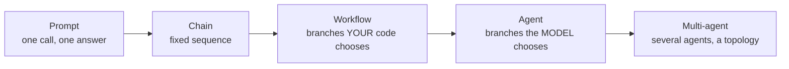

:::note In one line
**An agent is a loop where the model decides what to do next and when to stop.** If you decide the steps, it is a workflow, and a workflow is usually the better choice.
:::

## Why this matters

"Agent" is the most overloaded word in the field. Teams build agents where a two-step
workflow would be faster, cheaper and testable, then spend months making the agent
predictable — which is to say, turning it back into a workflow. Getting this distinction
right at design time is worth more than any framework.

## Mental Model

The whole distinction is **who decides what happens next**.

<figure class="lesson-figure">
<svg viewBox="0 0 660 300" role="img" aria-label="Diagram: an agent loop. The model looks at the conversation and chooses either to call a tool, whose result is appended and sent back to the model, or to stop and answer. A step limit also ends the loop.">
  <defs>
    <marker id="ag-a" markerWidth="9" markerHeight="9" refX="8" refY="3" orient="auto">
      <path d="M0,0 L8,3 L0,6 z" fill="var(--accent)"/>
    </marker>
    <marker id="ag-s" markerWidth="9" markerHeight="9" refX="8" refY="3" orient="auto">
      <path d="M0,0 L8,3 L0,6 z" fill="var(--text-muted)"/>
    </marker>
    <marker id="ag-o" markerWidth="9" markerHeight="9" refX="8" refY="3" orient="auto">
      <path d="M0,0 L8,3 L0,6 z" fill="var(--ok)"/>
    </marker>
  </defs>

  <rect x="28" y="120" width="112" height="56" rx="9" class="dg-box"/>
  <text class="dg-label" x="84" y="144" text-anchor="middle">Your request</text>
  <text class="dg-sub"   x="84" y="161" text-anchor="middle">one message</text>

  <rect x="200" y="112" width="150" height="72" rx="11" fill="var(--panel-2)" stroke="var(--accent)" stroke-width="2.2"/>
  <text class="dg-label" x="275" y="140" text-anchor="middle" fill="var(--accent)">The model decides</text>
  <text class="dg-sub"   x="275" y="158" text-anchor="middle">tool? or finished?</text>
  <text class="dg-sub"   x="275" y="174" text-anchor="middle">this is the whole idea</text>

  <rect x="418" y="28" width="140" height="62" rx="10" class="dg-box"/>
  <text class="dg-label" x="488" y="52" text-anchor="middle">Run a tool</text>
  <text class="dg-sub"   x="488" y="70" text-anchor="middle">search, SQL, HTTP</text>

  <rect x="418" y="208" width="140" height="62" rx="10" fill="var(--panel-2)" stroke="var(--ok)" stroke-width="1.8"/>
  <text class="dg-label" x="488" y="232" text-anchor="middle" fill="var(--ok)">Stop and answer</text>
  <text class="dg-sub"   x="488" y="250" text-anchor="middle">the model chose to</text>

  <path class="dg-arrow" d="M140,148 L194,148" marker-end="url(#ag-s)"/>
  <path d="M350,132 Q390,132 412,90" stroke="var(--accent)" stroke-width="2" fill="none" marker-end="url(#ag-a)"/>
  <path d="M350,166 Q390,166 412,210" stroke="var(--ok)" stroke-width="2" fill="none" marker-end="url(#ag-o)"/>
  <path d="M418,59 Q300,59 275,106" stroke="var(--accent)" stroke-width="2" fill="none" stroke-dasharray="5 4" marker-end="url(#ag-a)"/>
  <text class="dg-sub" x="306" y="46" text-anchor="middle" fill="var(--accent)">result goes back in</text>

  <rect x="196" y="228" width="158" height="46" rx="9" fill="var(--panel)" stroke="var(--danger)" stroke-width="1.6" stroke-dasharray="4 3"/>
  <text class="dg-sub" x="275" y="248" text-anchor="middle" fill="var(--danger)">step limit, budget cap</text>
  <text class="dg-sub" x="275" y="264" text-anchor="middle">you must add these</text>
  <path d="M275,228 L275,190" stroke="var(--danger)" stroke-width="1.4" fill="none" stroke-dasharray="3 3"/>
</svg>
<figcaption>
<strong>An agent is a loop with the model in charge of the exit.</strong> Nothing more
mystical than that. And because the model controls the exit, <em>you</em> must add the step
limit and the budget cap, or the loop can run until the money runs out.
</figcaption>
</figure>




| | Control flow | Steps known in advance | Latency | Testable |
| --- | --- | --- | --- | --- |
| Prompt | none | 1 | 1× | fully |
| Chain | your code | fixed | n× | fully |
| Workflow | your code (branching) | bounded | n× | fully |
| **Agent** | **the model** | **unknown** | **1–20×, variable** | by property only |
| Multi-agent | models + a topology | unknown | 5–50× | with difficulty |

An agent is precisely: **a loop in which a model chooses tools, sees their results, and
decides when to stop.** Nothing more mystical than that.

```python
while not done:
    decision = model(messages)          # ← the model chooses
    if decision.is_final:
        done = True
    else:
        result = execute(decision.tool, decision.arguments)   # your code executes
        messages.append(result)
```

## Core Concepts

### The four components

Every agent, in every framework, has these:

1. **A goal** — what the user asked for.
2. **Tools** — functions the model may request; the only way it touches the world.
3. **A loop** — model → tool → observation → model, until a stop condition.
4. **Stop conditions** — final answer, iteration cap, budget cap, timeout, error limit.

Everything else — planning, reflection, memory, sub-agents — is elaboration on those four.

### What makes an agent worth the cost

Use an agent when the **number and order of steps cannot be known before you start**:

```text
WORKFLOW (steps known)              AGENT (steps unknown)
──────────────────────              ────────────────────
"Answer from our docs"              "Investigate why this customer was double-billed"
  retrieve → generate → cite          maybe: look up account, then invoices, then
                                      payment log, then the refund history, then
                                      compare with the pricing rules — and which of
                                      those you need depends on what you find

"Summarise this ticket"             "Fix this failing test"
  one call                            read the test, run it, read the source, form a
                                      hypothesis, edit, re-run, repeat until green
```

The test: *can you draw the flowchart before the request arrives?* If yes, build the
flowchart. If the flowchart depends on what you discover along the way, you need an agent.

### The honest cost

| | Workflow | Agent |
| --- | --- | --- |
| Model calls | 2–3 | 5–20 |
| Latency | 2–4 s | 10–90 s |
| Cost per request | $0.003 | $0.05–0.50 |
| Failure modes | few, enumerable | loops, tool misuse, drift, partial completion |
| Debuggability | read the code | read the trace |
| Reproducibility | high | low |

An agent is roughly **10–30× more expensive and slower** than a workflow for the same task.
It buys flexibility. Pay when you need it.

### Agent failure modes

These are specific and worth memorising, because each has a specific mitigation:

| Failure | What it looks like | Mitigation |
| --- | --- | --- |
| **Infinite loop** | calls the same tool 40 times | iteration cap, repeated-call detection |
| **Budget burn** | $12 on one request | cost cap checked before every call |
| **Tool misuse** | wrong arguments, wrong tool | strict schemas, validation, clear descriptions |
| **Goal drift** | ends up solving a different problem | restate the goal each iteration; a critic step |
| **Premature stop** | answers with half the work done | completion criteria in the prompt; a verification step |
| **Silent partial failure** | a tool errored, the agent ignored it | return errors as observations, never swallow |
| **Irreversible mistake** | sent the email, issued the refund | human approval gate (Phase 20) |
| **Context exhaustion** | loses the early plan in a long run | summarise old turns; keep the goal pinned |

Notice how many are bounded by *code*, not by prompting. That is the central lesson of
agent engineering.

### The autonomy ladder

```text
LEVEL 0  fixed workflow                  fully predictable
LEVEL 1  workflow + a model-chosen branch (routing)
LEVEL 2  agent with read-only tools      safe to run unattended
LEVEL 3  agent with write tools + approval gates
LEVEL 4  agent with write tools, no gates
LEVEL 5  multi-agent with delegation
```

Ship the lowest level that solves the problem. Most production "agents" are level 1 or 2,
and that is a good outcome, not a compromise.

## Real-World Example

The same business task at three levels, with the numbers that should drive the decision.

> **Task:** a customer asks "why was I charged twice in March?"

```python title="three_levels.py"
"""One task, three designs. The right answer depends on the question's variability."""
from __future__ import annotations


# --- LEVEL 0: workflow. Handles the 70% that are simple duplicate charges. ---
def workflow_answer(customer_id: str, month: str) -> dict:
    """Fixed four steps. 1.8s, $0.004, fully testable, no surprises."""
    charges = billing.list_charges(customer_id, month=month)          # your code
    duplicates = [c for c in charges if _looks_duplicate(c, charges)]  # your code

    if not duplicates:
        return {"resolved": False, "reason": "no_duplicates_found", "escalate": True}

    explanation = llm.complete(                                        # one model call
        [{"role": "user", "content": f"Explain these charges to the customer:\n{charges}"}],
        system=EXPLAIN_SYSTEM,
    )
    return {"resolved": True, "answer": explanation, "charges": charges}


# --- LEVEL 1: workflow with a model-chosen branch ---------------------------
def routed_answer(question: str, customer_id: str) -> dict:
    """The model picks the branch; each branch is still a fixed workflow.
    2.4s, $0.006. Handles ~90% of billing questions."""
    route = llm.structured(                                   # one cheap classification
        [{"role": "user", "content": question}], BillingRoute, system=ROUTER_SYSTEM
    )

    match route.category:
        case "duplicate_charge":
            return workflow_answer(customer_id, route.month)
        case "unexpected_amount":
            return explain_pricing(customer_id, route.month)
        case "refund_status":
            return refund_status(customer_id)
        case _:
            return {"resolved": False, "escalate": True, "reason": "unroutable"}


# --- LEVEL 2: agent. For the 10% that need genuine investigation. -----------
AGENT_TOOLS = [
    "list_charges", "get_invoice", "get_payment_log",
    "get_subscription_history", "get_pricing_rules", "search_known_issues",
]   # ALL READ-ONLY: no refunds, no emails, no account changes

def agent_answer(question: str, customer_id: str) -> dict:
    """The model decides which records to examine and in what order.
    12-40s, $0.08-0.30. Use only when the workflow could not resolve it."""
    return agent.run(
        goal=f"Explain the billing question for customer {customer_id}: {question}",
        tools=AGENT_TOOLS,
        max_iterations=8,
        max_cost_usd=0.50,
    )


# --- the actual production design -------------------------------------------
def handle_billing_question(question: str, customer_id: str) -> dict:
    """Escalate through the levels. Most requests never reach the agent."""
    result = routed_answer(question, customer_id)
    if result.get("resolved"):
        return result

    result = agent_answer(question, customer_id)               # the expensive path
    if result.get("confidence", 0) < 0.6 or result.get("needs_action"):
        return escalate_to_human(question, customer_id, investigation=result)
    return result
```

```text
100 billing questions, measured:

design                  resolved   mean_latency   cost/question   escalations
workflow only                 71%          1.8s        $0.0040           29%
+ routing (level 1)           89%          2.4s        $0.0061           11%
+ agent fallback (level 2)    96%          4.1s*       $0.0142            4%
agent for everything          95%         18.7s        $0.1180            5%

* mean across all questions: only 11% reach the agent path
```

The final row is the important one. **Agent-for-everything resolves slightly fewer questions,
takes 4.5× longer and costs 8× more** than escalating into an agent only when the cheap paths
fail. That escalation pattern — cheap, deterministic first; agent as the fallback — is the
production design that most "agent" projects converge on after their first invoice.

## Common Mistakes

:::mistake
```text
1. Building an agent for a task with known steps
   You added latency, cost and failure modes in exchange for nothing.

2. No iteration cap
   The single most expensive bug in AI engineering. Cap it in code.

3. Giving write tools before read tools work
   Prove the agent can investigate correctly before letting it act.

4. Tool descriptions written for humans
   The model reads them as the specification. "Gets stuff" is not a specification.

5. Swallowing tool errors
   The agent cannot recover from a failure it never sees. Return errors as observations.

6. Calling any loop with an LLM in it "an agent"
   If your code chooses every step, it is a workflow. Naming it accurately sets
   correct expectations about latency, cost and reliability.

7. Measuring agents like workflows
   Assertions do not work. Measure task completion rate, steps, cost and
   trajectory quality (Phase 24).
```
:::

## Hands-on Exercise

:::exercise Classify and redesign
For each system, decide: prompt, chain, workflow, agent, or multi-agent — and justify it in
one sentence.

1. Translate a document into five languages.
2. Answer HR questions from a policy PDF with citations.
3. Given a failing CI build, find the cause and propose a fix.
4. Extract structured data from 10,000 invoices.
5. Plan a three-city business trip within a budget, with flights and hotels.
6. Moderate user comments against a policy.
7. Research a company and produce a two-page briefing with sources.
8. Reconcile a bank statement against a ledger and explain every mismatch.

Then pick the two you marked "agent" and design a **cheaper** version: what fixed workflow
would handle the common case, and what fraction of requests would still need the agent?
:::

:::solution Answers
1. **Chain** (or five parallel prompts). Steps are fixed and known.
2. **Workflow**: retrieve → generate → verify citations. Nothing is decided by the model.
3. **Agent**. Which logs to read depends on what the last log said — the flowchart cannot be
   drawn in advance. Cheaper version: parse the error, match against a known-failure table,
   and only invoke the agent on a miss (typically 60–70% hit rate).
4. **Chain** with structured output, batched. An agent here would be absurd.
5. **Agent**. Search results change what to search next, and the budget constraint requires
   backtracking. Cheaper version: fixed search → rank → one model call to assemble; escalate
   to the agent only when no combination fits the budget.
6. **Prompt** with structured output, plus a deterministic rule layer for the clear cases.
7. **Agent**, possibly multi-agent (researcher + writer). But the single-agent version with
   search and fetch tools usually matches it at a fraction of the cost — measure before
   adding a second agent.
8. **Workflow first** (match by amount and date), **agent for the residue**. The unmatched 3%
   is exactly the "unknown steps" case; the other 97% is arithmetic.

The pattern across every "agent" answer: a deterministic layer handles the majority and the
agent handles the tail. That is the design you should be reaching for by default.
:::

## Interview Questions

:::interview
1. Define an agent in one sentence without using the word "autonomous".
2. When is a workflow the better choice, and how do you decide?
3. What are the three most common agent failure modes, and how do you bound each?
4. Why should write tools come after read tools?
5. How do you test something whose steps are not known in advance?
:::

## Cheat Sheet

```text
PROMPT     one call
CHAIN      fixed sequence of calls
WORKFLOW   branches YOUR code chooses
AGENT      loop where the MODEL chooses the next step   ← the only real distinction
MULTI      several agents plus a topology

AGENT = goal + tools + loop + stop conditions

USE AN AGENT WHEN   you cannot draw the flowchart before the request arrives
COST                10-30x a workflow in latency and money
BOUND IN CODE       max_iterations · max_cost · timeout · repeated-call detection
                    read-only tools first · approval gates for irreversible actions

DESIGN PATTERN      deterministic path first, agent as the escalation for the tail
```

```quiz
[
  {
    "question": "Which task genuinely requires an agent?",
    "options": [
      "Summarise each of 5,000 documents",
      "Answer questions from a knowledge base with citations",
      "Diagnose why a specific production deployment failed, where each finding determines what to check next",
      "Classify support tickets into eight categories"
    ],
    "answer": 2,
    "explanation": "Only the diagnosis task has a control flow that depends on intermediate findings. The others have fixed step sequences and should be chains or workflows."
  },
  {
    "question": "What is the single most important safeguard in an agent loop?",
    "options": [
      "A well-written system prompt",
      "Hard caps in code on iterations, cost and time",
      "A larger model",
      "More tools"
    ],
    "answer": 1,
    "explanation": "Prompts are advisory; a loop that only stops when the model decides to stop has no guaranteed termination. Caps in code are the guarantee."
  },
  {
    "question": "Your agent resolves 95% of tickets at $0.12 each. A routed workflow resolves 89% at $0.006. What should you build?",
    "options": [
      "The agent - higher resolution rate wins",
      "The workflow first, escalating to the agent only when it cannot resolve - highest resolution at a fraction of the cost",
      "The workflow only",
      "Two agents in parallel"
    ],
    "answer": 1,
    "explanation": "Escalation gets the agent's coverage on the hard tail while 89% of traffic takes the cheap, fast, testable path - typically an order of magnitude cheaper overall."
  }
]
```

## Summary

- An agent is a loop where the model chooses the next step; everything else is elaboration.
- Choose an agent only when the steps cannot be known in advance — it costs 10–30× a
  workflow.
- Agent failure modes are specific and bounded in code, not by prompting.
- The production pattern is deterministic-first with agent escalation for the tail.

## Next Step

Build one. Tool calling and the agent loop from scratch, with every safeguard in place.
