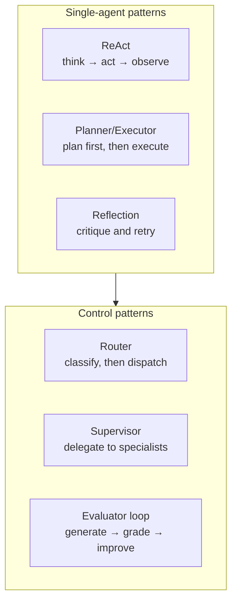

## Why this matters

These patterns are the vocabulary of agentic AI, and each one exists because a simpler design
failed in a specific way. Knowing which failure each pattern addresses lets you add exactly
the machinery your problem needs — instead of adopting a framework's full architecture and
paying for capabilities you never use.

## Mental Model



Every pattern trades **model calls for reliability**. The engineering question is never "is
this pattern good?" but "does this pattern's reliability gain justify its calls *on my
task*?" — a question only measurement answers.

## Core Concepts

### 1. ReAct — reason + act

The default agent loop from Phase 14: the model alternates reasoning and tool calls,
choosing each step from what it has observed.

```text
Thought:     I need the customer's charges for March.
Action:      list_charges(customer_id="c_881", month="2026-03")
Observation: two identical $49 charges on 2026-03-01
Thought:     Duplicates. Check whether there are duplicate subscriptions.
Action:      get_subscriptions(customer_id="c_881")
...
```

**Fixes**: tasks where the next step depends on the last result.
**Fails at**: long horizons — without a plan the agent loses the thread after ~6 steps, and
it can wander into a neighbouring problem.
**Cost**: 1 model call per step.

Modern models interleave reasoning natively (`thinking: {"type": "adaptive"}`), so you rarely
need to prompt for "Thought:" blocks explicitly any more — the pattern survives as the loop
structure.

### 2. Planner / executor

Make the plan once, then execute it. Separating the two means the plan is inspectable,
cacheable and reusable.

```text
PLAN (one call)
  1. list charges for March
  2. if duplicates found, check subscription history
  3. search known incidents matching the pattern
  4. summarise with charge ids and dates

EXECUTE (n calls, each aware of the plan and its position in it)
```

**Fixes**: goal drift, aimless exploration, unpredictable step counts.
**Fails at**: tasks where the right plan is unknowable up front — a rigid plan then blocks
adaptation.
**Cost**: +1 call, but usually *fewer* total steps.

The important refinement is **replanning**: after each step, allow the executor to revise the
plan when an observation invalidates it. Without that, planner/executor is brittle.

### 3. Reflection / self-critique

Generate, then critique your own output against explicit criteria, then revise.

```text
draft  → critique against criteria → revise → (repeat up to N times)
```

**Fixes**: premature stops, incomplete answers, missed requirements, sloppy formatting.
**Fails at**: factual errors the model cannot detect — it will confidently approve a wrong
fact, because the same knowledge produced and reviewed it.
**Cost**: 2–3× per reflection round.

:::warning Reflection only catches what the model can see
Self-critique is effective for completeness, structure and instruction-following. It is
*ineffective* for truth. A model that believed a false fact when writing believes it when
reviewing. Truth needs an **external check**: a tool, a retrieval verification, a test suite,
or a human.
:::

### 4. Self-correction with an external signal

Reflection becomes far more powerful when the critique comes from reality:

```text
write code → RUN THE TESTS → read the failure → fix → re-run
draft SQL  → EXECUTE IT     → read the error  → fix → re-run
write an answer → VERIFY CITATIONS → fix unsupported claims
```

**Fixes**: factual and functional errors — genuinely.
**Requires**: an external verifier. This is the single biggest reliability multiplier
available, and it is why coding agents work so much better than open-ended research agents.

### 5. Routing

Classify the request, then dispatch to a specialised handler.

```text
question → classifier → { faq_workflow | rag_pipeline | investigation_agent | human }
```

**Fixes**: cost and latency — most requests take a cheap path.
**Fails at**: misclassification, which sends a request down a path that cannot serve it.
Always include a fallback and measure routing accuracy separately.
**Cost**: +1 cheap call, usually saving far more.

This is the highest return-on-investment pattern in production systems.

### 6. Supervisor / hierarchical delegation

One coordinating agent delegates to specialists and assembles the result.

```text
supervisor
  ├── researcher   (search + fetch tools)
  ├── analyst      (data tools)
  └── writer       (no tools; synthesis only)
```

**Fixes**: tool-list bloat (20+ tools confuse a single agent), genuinely distinct skill sets,
and parallelism across independent subtasks.
**Fails at**: everything else — it multiplies cost, latency and failure modes.
**Cost**: 3–10× a single agent.

:::danger Do not start with a multi-agent system
Try a single agent with well-described tools first. Most multi-agent designs exist because
the single-agent version was never tuned. Phase 23 covers the cases where it is genuinely
the right answer — and how to tell.
:::

### 7. Evaluator / optimiser loop

A generator produces, an evaluator scores against a rubric, and the loop continues until the
score passes or a cap is reached.

```text
generate → evaluate(rubric) → if score < threshold: regenerate with feedback
```

**Fixes**: quality on tasks with a clear rubric — copy, translations, structured extraction.
**Fails at**: rubrics the evaluator cannot apply reliably; unbounded loops.
**Cost**: 2–4× per iteration; always cap the iterations.

### When NOT to use agentic patterns

| Situation | Use instead |
| --- | --- |
| Steps are known in advance | a workflow |
| One model call answers it | a prompt with structured output |
| The task is high-volume and simple | a classifier, or rules |
| Errors are irreversible and unreviewable | a human, with the model advising |
| Latency budget under 3 seconds | a workflow; agents are 10 s+ |
| You cannot describe success | nothing yet — you cannot evaluate it either |

That last row is the one people skip. If you cannot state what a good outcome looks like, you
cannot build an evaluation, and without an evaluation you cannot tell whether your agent
works.

## Real-World Example

The patterns as composable components, with a measured comparison.

```python title="src/agentic/patterns.py"
"""Agentic patterns as composable pieces.

Each pattern is a thin wrapper around the Phase 14 agent, so they can be combined
and - more importantly - measured against each other on the same task set.
"""
from __future__ import annotations

import json
import logging
from dataclasses import dataclass, field

from pydantic import BaseModel, Field

logger = logging.getLogger(__name__)


# --- 1. PLANNER ---------------------------------------------------------------
class Plan(BaseModel):
    steps: list[str] = Field(description="ordered, concrete steps; 2-6 of them")
    tools_needed: list[str] = Field(default_factory=list)
    success_criteria: str = Field(description="how to know the goal is met")
    risks: list[str] = Field(default_factory=list)


PLANNER_SYSTEM = """\
Produce a short, concrete plan for the goal using only the listed tools.

Rules:
- 2 to 6 steps. Each step is one action, not a phase of work.
- Name the tool each step will use.
- State how you will know the goal is met.
- Note anything that could invalidate the plan.
Do not execute anything. Plan only."""


@dataclass
class Planner:
    llm: object

    def plan(self, goal: str, tool_names: list[str]) -> tuple[Plan, float]:
        payload = json.dumps({"goal": goal, "available_tools": tool_names})
        plan, meta = self.llm.structured(
            [{"role": "user", "content": payload}], Plan, system=PLANNER_SYSTEM
        )
        return plan, float(meta.get("cost_usd", 0.0))


# --- 2. REFLECTION -------------------------------------------------------------
class Critique(BaseModel):
    meets_criteria: bool
    missing: list[str] = Field(default_factory=list, description="what is absent or wrong")
    unverified_claims: list[str] = Field(default_factory=list)
    suggested_next_step: str = ""
    confidence: float = Field(ge=0.0, le=1.0)


CRITIC_SYSTEM = """\
Review the answer against the criteria and the evidence actually gathered.

Be strict about two things:
1. Every factual claim must be traceable to an observation in the evidence.
   List any claim that is not.
2. The criteria must be fully met, not partially.

You are reviewing completeness and groundedness, not style. If the answer is
complete and grounded, say so plainly."""


@dataclass
class Reflector:
    llm: object
    max_rounds: int = 2

    def critique(self, goal: str, criteria: str, answer: str, evidence: list[str]) -> tuple[Critique, float]:
        payload = json.dumps({
            "goal": goal, "criteria": criteria, "answer": answer,
            "evidence": evidence[-12:],           # the observations actually collected
        })
        critique, meta = self.llm.structured(
            [{"role": "user", "content": payload}], Critique, system=CRITIC_SYSTEM
        )
        return critique, float(meta.get("cost_usd", 0.0))


# --- 3. ROUTER ------------------------------------------------------------------
class Route(BaseModel):
    handler: str = Field(description="one of the provided handler names")
    confidence: float = Field(ge=0.0, le=1.0)
    reason: str = Field(max_length=200)


@dataclass
class Router:
    llm: object
    handlers: dict[str, str]                    # name -> description
    min_confidence: float = 0.6
    fallback: str = "escalate"

    def route(self, request: str) -> tuple[str, Route, float]:
        system = (
            "Choose exactly one handler for the request.\n\nHandlers:\n"
            + "\n".join(f"- {name}: {description}" for name, description in self.handlers.items())
            + f"\n- {self.fallback}: anything that does not clearly fit another handler."
            + "\n\nPrefer the cheapest handler that can fully serve the request. "
              "Set a low confidence when uncertain - a wrong route is worse than an escalation."
        )
        route, meta = self.llm.structured(
            [{"role": "user", "content": request}], Route, system=system
        )
        chosen = route.handler if route.confidence >= self.min_confidence else self.fallback
        if chosen != route.handler:
            logger.info("route confidence %.2f below threshold; escalating", route.confidence)
        return chosen, route, float(meta.get("cost_usd", 0.0))


# --- 4. EVALUATOR / OPTIMISER LOOP -------------------------------------------
class Score(BaseModel):
    score: int = Field(ge=1, le=5)
    strengths: list[str] = Field(default_factory=list)
    weaknesses: list[str] = Field(default_factory=list)
    fix_instructions: str = ""


@dataclass
class EvaluatorLoop:
    llm: object
    rubric: str
    threshold: int = 4
    max_rounds: int = 3

    def run(self, task: str, generate) -> dict:
        """generate(task, feedback) -> str"""
        history: list[dict] = []
        feedback = ""
        cost = 0.0

        for round_number in range(1, self.max_rounds + 1):
            draft = generate(task, feedback)
            score, meta = self.llm.structured(
                [{"role": "user", "content": json.dumps({"task": task, "draft": draft})}],
                Score, system=f"Score the draft against this rubric:\n{self.rubric}",
            )
            cost += float(meta.get("cost_usd", 0.0))
            history.append({"round": round_number, "score": score.score,
                            "weaknesses": score.weaknesses})

            if score.score >= self.threshold:
                return {"output": draft, "score": score.score, "rounds": round_number,
                        "history": history, "cost_usd": cost, "passed": True}

            feedback = (f"Previous attempt scored {score.score}/5.\n"
                        f"Weaknesses: {'; '.join(score.weaknesses)}\n"
                        f"Fix: {score.fix_instructions}")

        return {"output": draft, "score": score.score, "rounds": self.max_rounds,
                "history": history, "cost_usd": cost, "passed": False}


# --- composed agent ------------------------------------------------------------
@dataclass
class AgenticAgent:
    """The Phase 14 agent plus optional planning and reflection."""

    agent: object                   # the base Agent from Phase 14
    planner: Planner | None = None
    reflector: Reflector | None = None
    max_reflection_rounds: int = 2

    def run(self, goal: str, *, criteria: str) -> dict:
        extra_cost = 0.0
        plan_text = ""

        if self.planner:
            plan, cost = self.planner.plan(goal, self.agent.tool_names())
            extra_cost += cost
            plan_text = "\n".join(f"{i}. {step}" for i, step in enumerate(plan.steps, 1))
            criteria = f"{criteria}\n\nPlan to follow (revise if an observation invalidates it):\n{plan_text}"
            logger.info("plan: %s", plan.steps)

        result = self.agent.run(goal, criteria=criteria)
        rounds = 0

        if self.reflector:
            for rounds in range(1, self.max_reflection_rounds + 1):
                evidence = [s.content for s in result.trajectory.steps
                            if s.kind == "observation" and not s.is_error]
                critique, cost = self.reflector.critique(goal, criteria, result.answer, evidence)
                extra_cost += cost

                if critique.meets_criteria and not critique.unverified_claims:
                    break

                logger.info("reflection round %d: missing=%s unverified=%s",
                            rounds, critique.missing, critique.unverified_claims)

                followup = (
                    f"Your previous answer was reviewed and found incomplete.\n"
                    f"Missing: {'; '.join(critique.missing) or 'nothing'}\n"
                    f"Claims not supported by evidence: "
                    f"{'; '.join(critique.unverified_claims) or 'none'}\n"
                    f"Next step: {critique.suggested_next_step}\n"
                    f"Continue working toward the goal."
                )
                result = self.agent.run(f"{goal}\n\n{followup}", criteria=criteria)

        return {
            "answer": result.answer,
            "stop_reason": str(result.stop_reason),
            "plan": plan_text,
            "reflection_rounds": rounds,
            "iterations": result.iterations,
            "tool_calls": len(result.trajectory.tool_calls),
            "cost_usd": round(result.cost_usd + extra_cost, 5),
            "trajectory": result.trajectory,
        }
```

### Measuring the patterns

```python title="src/agentic/compare.py"
"""Which pattern is worth its calls? Only measurement answers this."""
from __future__ import annotations

import statistics
import time


SCENARIOS = [
    {"goal": "Customer c_881 was charged twice in March 2026. Explain why.",
     "criteria": "Identifies the duplicate subscription and cites specific charge ids.",
     "expect": ["ch_2", "migration"]},
    {"goal": "Customer c_902 says their March invoice is higher than February. Explain.",
     "criteria": "Explains the difference with specific line items.",
     "expect": ["overage", "seats"]},
    {"goal": "Customer c_915 believes a refund was never processed. Determine the status.",
     "criteria": "States the refund status with a date or explains why none exists.",
     "expect": ["refund"]},
    # ... 10+ scenarios in practice
]


def evaluate(build_agent, scenarios: list[dict], *, runs: int = 3) -> dict:
    completions, costs, steps, latencies = [], [], [], []

    for scenario in scenarios:
        for _ in range(runs):                        # agents are non-deterministic: repeat
            agent = build_agent()
            started = time.perf_counter()
            result = agent.run(scenario["goal"], criteria=scenario["criteria"])
            latencies.append(time.perf_counter() - started)

            answer = result["answer"].lower()
            completions.append(all(term.lower() in answer for term in scenario["expect"]))
            costs.append(result["cost_usd"])
            steps.append(result["tool_calls"])

    return {
        "completion_rate": round(sum(completions) / len(completions), 3),
        "mean_cost": round(statistics.mean(costs), 4),
        "mean_tool_calls": round(statistics.mean(steps), 1),
        "p95_latency_s": round(sorted(latencies)[int(len(latencies) * 0.95) - 1], 1),
    }


if __name__ == "__main__":
    from .patterns import AgenticAgent, Planner, Reflector

    configurations = {
        "react only": lambda: AgenticAgent(agent=make_agent()),
        "+ planning": lambda: AgenticAgent(agent=make_agent(), planner=Planner(llm)),
        "+ reflection": lambda: AgenticAgent(agent=make_agent(), reflector=Reflector(llm)),
        "+ both": lambda: AgenticAgent(agent=make_agent(), planner=Planner(llm),
                                       reflector=Reflector(llm)),
    }

    print(f"{'pattern':<16}{'completion':>12}{'cost':>10}{'calls':>8}{'p95_s':>8}")
    for label, build in configurations.items():
        metrics = evaluate(build, SCENARIOS)
        print(f"{label:<16}{metrics['completion_rate']:>12}{metrics['mean_cost']:>10}"
              f"{metrics['mean_tool_calls']:>8}{metrics['p95_latency_s']:>8}")
```

```text
pattern           completion      cost   calls   p95_s
react only             0.733    0.0184     4.8     9.4
+ planning             0.800    0.0216     4.1    10.2
+ reflection           0.911    0.0402     6.9    17.8
+ both                 0.933    0.0447     6.2    18.6

routing layer (classify first, agent only on the hard 12%):
  overall completion 0.94 · mean cost $0.0071 · p95 4.1s
```

The last line is the finding that matters. **Routing produced the same completion rate as the
most elaborate agent configuration at one sixth the cost and a quarter of the p95 latency**,
because 88% of requests never reached the agent at all.

The general lesson: *make the expensive path rarer* before *making the expensive path
better*.

## Common Mistakes

:::mistake
```text
1. Adopting a framework's full architecture without measuring
   Planning, reflection and supervision each cost calls. Prove each one earns them.

2. Reflection for factual accuracy
   The model approves its own errors. Use an external verifier.

3. Unbounded reflection or evaluator loops
   "Improve until good" never terminates. Cap the rounds.

4. A rigid plan with no replanning
   The first surprising observation makes the plan wrong and the agent follows it anyway.

5. Multi-agent before single-agent is tuned
   Usually a fix for tool descriptions that were never written properly.

6. Routing without a fallback
   Every misclassification becomes a failure instead of an escalation.

7. Measuring an agent once
   Agents are non-deterministic. Run each scenario 3-5 times and report the rate.

8. Optimising the agent instead of reducing how often it runs
   Routing is almost always the bigger win.
```
:::

## Hands-on Exercise

:::exercise Measure the patterns on your own task
Take the agent you built in Phase 14 and:

1. Write 10 scenarios with checkable success criteria (a term that must appear, a value that
   must be correct).
2. Run each scenario 3 times under four configurations: ReAct only, +planning, +reflection,
   +both.
3. Record completion rate, mean cost, mean tool calls and p95 latency.
4. Add a routing layer that sends easy cases to a workflow and only hard ones to the agent.
   Measure the blended numbers.
5. Produce the comparison table and choose a configuration, stating the trade-off.

Expect reflection to help most, planning to reduce steps, and routing to beat both on cost.
:::

:::solution Reading your own table
```text
pattern              completion    cost    calls   p95_s   $/100 requests
react only                0.733  0.0184      4.8     9.4          $1.84
+ planning                0.800  0.0216      4.1    10.2          $2.16
+ reflection              0.911  0.0402      6.9    17.8          $4.02
+ both                    0.933  0.0447      6.2    18.6          $4.47
routing + (both)          0.940  0.0071      0.7     4.1          $0.71

Decision: routing in front of the planning+reflection agent. The agent configuration
matters much less than how often it runs: 88% of requests are resolved by a workflow
in under a second, and the 12% that reach the agent get the most reliable version of
it. Completion is the highest of any configuration and cost is a quarter of the
cheapest agent-only design.
```
:::

## Challenge

:::challenge Build an external verifier
Reflection cannot check facts, but a tool can. For your domain, build a verifier that checks
the agent's answer against reality:

- a RAG agent → verify every claim against the retrieved chunks
- a SQL agent → execute the generated query and compare it against an expected row count
- a coding agent → run the test suite
- a data agent → re-compute the reported numbers from source

Wire it into the loop: if verification fails, feed the specific failure back and continue.
Measure the completion rate with reflection-only versus external verification.

Expect external verification to outperform self-critique substantially. That gap is the most
important empirical fact in agent engineering: **grounding beats introspection.**
:::

## Interview Questions

:::interview
1. What is ReAct, and what does it fail at?
2. Why is self-reflection ineffective for factual errors?
3. When is planner/executor better than a plain loop, and what must you add to it?
4. Why is routing usually a bigger win than improving the agent?
5. What would make you choose a multi-agent design?
:::

## Cheat Sheet

```text
ReAct          think → act → observe          fixes: adaptive steps   fails: long horizons
Planner        plan once, then execute        fixes: drift            fails: unknown plans
Reflection     critique own output, revise    fixes: completeness     fails: factual errors
Self-correct   external verifier in the loop  fixes: REAL errors      needs: a verifier
Routing        classify → dispatch            fixes: cost & latency   needs: a fallback
Supervisor     delegate to specialists        fixes: tool bloat       costs: 3-10x
Evaluator      generate → score → retry       fixes: rubric quality   needs: a cap

RULES  cap every loop · measure each pattern's marginal value · run scenarios 3-5x
       make the expensive path RARER before making it better
       grounding (tools, tests, retrieval) beats introspection
```

```quiz
[
  {
    "question": "Your agent produces confident but factually wrong answers. Which pattern helps?",
    "options": [
      "Reflection - have it critique its own answer",
      "Self-correction with an external verifier that checks claims against tools, retrieved context or tests",
      "Planning before execution",
      "A supervisor agent"
    ],
    "answer": 1,
    "explanation": "Self-critique uses the same knowledge that produced the error, so it approves it. Only an external source of truth catches factual errors reliably."
  },
  {
    "question": "Agent-only handling costs $0.045/request at 93% completion. Adding a router gives 94% at $0.007. Why the difference?",
    "options": [
      "The router uses a better model",
      "Most requests never reach the agent - they take a cheap deterministic path",
      "Routing makes the agent faster",
      "The measurement is wrong"
    ],
    "answer": 1,
    "explanation": "Routing reduces how often the expensive path runs. Reducing the frequency of an expensive operation almost always beats optimising it."
  },
  {
    "question": "When is a multi-agent supervisor design justified?",
    "options": [
      "Whenever the task has several parts",
      "When a single agent is genuinely confused by 20+ tools, the subtasks need different skills, and independent subtasks can run in parallel - after the single-agent version has been tuned",
      "Always, it is the modern approach",
      "When the model is small"
    ],
    "answer": 1,
    "explanation": "Multi-agent multiplies cost, latency and failure modes. Reach for it only when a tuned single agent has demonstrably hit a wall."
  }
]
```

## Summary

- Each pattern fixes a specific failure: ReAct adapts, planning prevents drift, reflection
  completes, verification corrects, routing saves, supervision separates skills.
- Reflection catches incompleteness; only external verification catches falsehood.
- Cap every loop, and measure each pattern's marginal completion gain against its cost.
- Making the expensive path rarer beats making it better.

## Next Step

Phase 16: LangChain — the same concepts through a framework, and an honest account of what
it adds.
