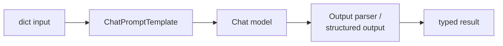

:::note In one line
**LangChain is glue, not magic.** It standardises models, messages, tools and output parsing so you can swap parts out.
:::

## Why this matters

You have now built by hand everything LangChain provides: a client wrapper, a prompt
library, a tool registry, an agent loop, a RAG pipeline. That is exactly the position from
which to use a framework well — you can tell what it is doing, and you can tell when it is
getting in the way.

LangChain's genuine value is **provider abstraction and composition**: swapping models is one
string, and the same `Runnable` interface gives you `invoke`, `batch`, `stream` and `async`
for free on anything you build.

:::warning Version matters enormously
This lesson targets **LangChain 1.x** (`langchain>=1.0`, `langchain-core>=1.0`). The 0.x
APIs you will find in most tutorials — `LLMChain`, `initialize_agent`, `ConversationChain`,
`from langchain.schema import ...` — are removed or moved. Check the version in any example
you copy, and pin yours:

```toml
dependencies = [
    "langchain==1.4.0",
    "langchain-core==1.6.3",
    "langchain-anthropic==1.*",
]
```
:::

## Mental Model

LangChain is **glue**, not magic. It gives one shape to things every provider does slightly
differently.
<figure class="lesson-figure">
<svg viewBox="0 0 660 230" role="img" aria-label="Diagram: without LangChain each provider needs its own calling code, while with LangChain one interface sits in front of them all so swapping providers is a one-line change.">
  <defs>
    <marker id="lc-a" markerWidth="9" markerHeight="9" refX="8" refY="3" orient="auto">
      <path d="M0,0 L8,3 L0,6 z" fill="var(--text-muted)"/>
    </marker>
  </defs>
  <text class="dg-label" x="14" y="22" fill="var(--danger)">Without it — one adapter each</text>
  <rect x="14" y="34" width="86" height="28" rx="5" class="dg-box"/>
  <text class="dg-sub" x="57" y="53" text-anchor="middle">your code</text>
  <rect x="124" y="30" width="76" height="22" rx="4" fill="var(--panel-2)" stroke="var(--danger)" stroke-width="1.2"/>
  <text class="dg-sub" x="162" y="46" text-anchor="middle">provider A</text>
  <rect x="124" y="56" width="76" height="22" rx="4" fill="var(--panel-2)" stroke="var(--danger)" stroke-width="1.2"/>
  <text class="dg-sub" x="162" y="72" text-anchor="middle">provider B</text>
  <rect x="124" y="82" width="76" height="22" rx="4" fill="var(--panel-2)" stroke="var(--danger)" stroke-width="1.2"/>
  <text class="dg-sub" x="162" y="98" text-anchor="middle">provider C</text>
  <path class="dg-arrow" d="M100,46 L118,41"/>
  <path class="dg-arrow" d="M100,50 L118,67"/>
  <path class="dg-arrow" d="M100,54 L118,93"/>
  <text class="dg-sub" x="212" y="70" fill="var(--danger)">three code paths to maintain</text>
  <line x1="14" y1="122" x2="646" y2="122" stroke="var(--border)" stroke-width="1"/>
  <text class="dg-label" x="14" y="146" fill="var(--ok)">With it — one shape</text>
  <rect x="14" y="158" width="86" height="34" rx="6" class="dg-box"/>
  <text class="dg-sub" x="57" y="180" text-anchor="middle">your code</text>
  <rect x="126" y="152" width="148" height="46" rx="8" fill="var(--panel-2)" stroke="var(--accent)" stroke-width="2"/>
  <text class="dg-label" x="200" y="172" text-anchor="middle" fill="var(--accent)">one interface</text>
  <text class="dg-mono"  x="200" y="190" text-anchor="middle" style="font-size:10px">init_chat_model()</text>
  <rect x="300" y="150" width="76" height="22" rx="4" fill="var(--panel-2)" stroke="var(--ok)" stroke-width="1.2"/>
  <text class="dg-sub" x="338" y="166" text-anchor="middle">provider A</text>
  <rect x="300" y="176" width="76" height="22" rx="4" fill="var(--panel-2)" stroke="var(--ok)" stroke-width="1.2"/>
  <text class="dg-sub" x="338" y="192" text-anchor="middle">provider B</text>
  <path class="dg-arrow" d="M100,175 L120,175" marker-end="url(#lc-a)"/>
  <path class="dg-arrow" d="M274,170 L294,161"/>
  <path class="dg-arrow" d="M274,180 L294,187"/>
  <rect x="404" y="148" width="242" height="54" rx="8" fill="var(--panel-2)" stroke="var(--accent)" stroke-width="1.5"/>
  <text class="dg-sub" x="418" y="168">It also standardises messages, tools,</text>
  <text class="dg-sub" x="418" y="186">structured output and streaming.</text>
  <text class="dg-sub" x="14" y="218">The cost: another dependency, and its own abstractions to learn when something breaks.</text>
</svg>
<figcaption>
<strong>Worth it when you will swap parts.</strong> If you only ever call one provider one
way, the raw SDK is simpler — and this handbook teaches the raw version first for exactly
that reason.
</figcaption>
</figure>

```text
Everything in LangChain is a RUNNABLE: something with .invoke / .stream / .batch / .ainvoke

  prompt | model | parser          ← the pipe operator composes runnables

  Because they share one interface, composition is free:
    chain.invoke(x)        one input
    chain.batch([x, y])    parallel
    chain.stream(x)        token by token
    await chain.ainvoke(x) async
```



## Setup

```bash
uv add "langchain==1.4.0" "langchain-anthropic" "langchain-core"
```

```bash title=".env"
ANTHROPIC_API_KEY=sk-ant-...
```

## Core Concepts

### Chat models

```python
from langchain.chat_models import init_chat_model

model = init_chat_model("anthropic:claude-opus-5")       # provider:model
response = model.invoke("What is reciprocal rank fusion?")

print(response.text)              # the text
print(response.usage_metadata)    # {'input_tokens': 14, 'output_tokens': 96, ...}
print(response.response_metadata) # provider-specific: stop reason, model id
```

The provider-prefixed string is the abstraction that earns its place: changing
`"anthropic:claude-opus-5"` to another provider's model changes nothing else in your code.

Or use the provider class directly when you need provider-specific arguments:

```python
from langchain_anthropic import ChatAnthropic

model = ChatAnthropic(model="claude-opus-5", max_tokens=2_048, timeout=30, max_retries=3)
```

### Messages

```python
from langchain.messages import AIMessage, HumanMessage, SystemMessage, ToolMessage

conversation = [
    SystemMessage("You answer only from the provided context."),
    HumanMessage("How long are logs retained?"),
    AIMessage("30 days on the Pro plan."),
    HumanMessage("And on Enterprise?"),
]
response = model.invoke(conversation)
```

| Message | Role |
| --- | --- |
| `SystemMessage` | instructions and persona |
| `HumanMessage` | user input |
| `AIMessage` | model output (may carry `tool_calls`) |
| `ToolMessage` | a tool result, linked by `tool_call_id` |

### Prompt templates

```python
from langchain.prompts import ChatPromptTemplate

prompt = ChatPromptTemplate.from_messages([
    ("system", "You answer questions about {product} documentation. "
               "Cite chunk ids. If the context is insufficient, say so."),
    ("human", "<context>\n{context}\n</context>\n\n<question>\n{question}\n</question>"),
])

messages = prompt.invoke({"product": "ACME", "context": chunks, "question": q})
```

Templates give you variable validation (a missing variable raises immediately rather than
rendering `{question}` literally into a prompt) and a place to keep prompts out of business
logic.

For few-shot examples and conversation placeholders:

```python
from langchain.prompts import MessagesPlaceholder

prompt = ChatPromptTemplate.from_messages([
    ("system", SYSTEM),
    MessagesPlaceholder("history"),        # a list of messages slots in here
    ("human", "{question}"),
])
```

### Structured output

```python
from pydantic import BaseModel, Field


class TicketTriage(BaseModel):
    """Routing decision for a support ticket."""
    team: str = Field(description="billing, identity, infrastructure, data or other")
    urgency: int = Field(ge=1, le=5)
    requires_human: bool
    summary: str = Field(max_length=200)


structured_model = model.with_structured_output(TicketTriage)
triage = structured_model.invoke("Production dashboard is down, customers affected!")

triage.team          # 'infrastructure'
triage.urgency       # 5
```

`with_structured_output` returns a runnable producing validated Pydantic objects. This is the
single most useful thing LangChain does for ordinary application code.

### Tools

```python
from langchain.tools import tool


@tool
def search_orders(customer_id: str, limit: int = 10) -> str:
    """Look up recent orders for a customer.

    Args:
        customer_id: the internal customer id.
        limit: maximum orders to return.
    """
    return json.dumps(database.recent_orders(customer_id, limit))


model_with_tools = model.bind_tools([search_orders])
response = model_with_tools.invoke("What did customer c_881 order?")

for call in response.tool_calls:
    print(call["name"], call["args"])       # you still execute them
```

As in Phase 14: the model requests, your code executes. The decorator's job is deriving the
schema from the signature and docstring.

### LCEL — composing runnables

```python
from langchain_core.output_parsers import StrOutputParser

chain = prompt | model | StrOutputParser()

chain.invoke({"product": "ACME", "context": ctx, "question": q})     # one
chain.batch([{...}, {...}, {...}])                                   # parallel
for chunk in chain.stream({...}): print(chunk, end="")               # streaming
await chain.ainvoke({...})                                           # async
```

Parallel branches and passthroughs:

```python
from langchain_core.runnables import RunnableLambda, RunnableParallel, RunnablePassthrough

chain = (
    RunnableParallel(
        context=retriever | format_chunks,     # runs concurrently
        question=RunnablePassthrough(),
    )
    | prompt
    | model
    | StrOutputParser()
)
```

Fallbacks, retries and configuration, declaratively:

```python
robust = (
    model.with_retry(stop_after_attempt=3)
         .with_fallbacks([init_chat_model("anthropic:claude-sonnet-5")])
)

configurable = model.configurable_fields(
    max_tokens=ConfigurableField(id="max_tokens")
)
configurable.invoke(prompt, config={"configurable": {"max_tokens": 4096}})
```

This is where LangChain earns its keep: retry, fallback, batching, streaming and tracing all
compose onto anything you build, without you writing them.

## Real-World Example

The ticket triage service from Phase 10, rebuilt in LangChain — and honestly compared.

```python title="src/triage/langchain_service.py"
"""Ticket triage with LangChain 1.x.

The same behaviour as the hand-written version in Phase 10, with provider
abstraction, declarative fallbacks and free batching/streaming/async.
"""
from __future__ import annotations

import logging
from typing import Literal

from langchain.chat_models import init_chat_model
from langchain.prompts import ChatPromptTemplate
from langchain_core.runnables import Runnable, RunnableLambda
from pydantic import BaseModel, Field

logger = logging.getLogger(__name__)

Team = Literal["billing", "identity", "infrastructure", "data", "other"]


class Triage(BaseModel):
    """Routing decision for one support ticket."""

    team: Team = Field(description="the team that should own this ticket")
    urgency: int = Field(ge=1, le=5, description="1 = question, 5 = production outage")
    requires_human: bool = Field(description="true for refunds, security or legal matters")
    summary: str = Field(max_length=200, description="one sentence, no preamble")
    reasoning: str = Field(max_length=300, description="why this team and urgency")


SYSTEM = """\
You triage support tickets for a SaaS company.

Teams:
- billing: invoices, refunds, payment methods, pricing questions
- identity: login, passwords, SSO, MFA, account access
- infrastructure: outages, latency, errors, availability
- data: exports, reports, analytics, retention
- other: anything that does not clearly belong above

Urgency: 1 question · 2 minor issue · 3 blocked user · 4 blocked team · 5 production outage.
Set requires_human for refunds, security incidents, legal matters or account deletion.

Judge only from the ticket text. Do not invent customer details or system state.
"""

PROMPT = ChatPromptTemplate.from_messages([
    ("system", SYSTEM),
    ("human", "Ticket from {channel} ({plan} plan):\n\n{ticket}"),
])


def build_triage_chain(
    *, model_name: str = "anthropic:claude-opus-5",
    fallback_name: str = "anthropic:claude-sonnet-5",
) -> Runnable:
    """prompt → model (structured, retried, with a fallback) → Triage object."""
    primary = init_chat_model(model_name, max_tokens=1_024)
    fallback = init_chat_model(fallback_name, max_tokens=1_024)

    structured = (
        primary.with_structured_output(Triage)
        .with_retry(stop_after_attempt=3)
        .with_fallbacks([fallback.with_structured_output(Triage)])
    )

    return PROMPT | structured


def build_routing_chain() -> Runnable:
    """Triage, then attach the queue and SLA - business rules stay in code."""
    SLA_MINUTES = {5: 15, 4: 60, 3: 240, 2: 480, 1: 1_440}

    def apply_policy(triage: Triage) -> dict:
        return {
            "team": triage.team,
            "queue": f"{triage.team}-urgent" if triage.urgency >= 4 else triage.team,
            "sla_minutes": SLA_MINUTES[triage.urgency],
            "requires_human": triage.requires_human,
            "auto_reply": triage.urgency <= 2 and not triage.requires_human,
            "summary": triage.summary,
            "urgency": triage.urgency,
        }

    return build_triage_chain() | RunnableLambda(apply_policy)


if __name__ == "__main__":
    logging.basicConfig(level="INFO", format="%(levelname)s %(message)s")
    chain = build_routing_chain()

    tickets = [
        {"ticket": "The dashboard has been down for 40 minutes. Customers are complaining.",
         "channel": "slack", "plan": "enterprise"},
        {"ticket": "How do I change the billing email on my account?",
         "channel": "web", "plan": "pro"},
        {"ticket": "Someone logged into my account from another country. Help!",
         "channel": "email", "plan": "free"},
    ]

    # batch() runs them concurrently - one line, no asyncio boilerplate
    for ticket, decision in zip(tickets, chain.batch(tickets), strict=True):
        print(f"{decision['queue']:<22} urgency={decision['urgency']} "
              f"human={decision['requires_human']!s:<5} sla={decision['sla_minutes']:>4}m  "
              f"{decision['summary'][:60]}")
```

```bash
uv run python -m triage.langchain_service
```

```text
infrastructure-urgent  urgency=5 human=False sla=  15m  Production dashboard outage affecting customers
billing                urgency=1 human=False sla=1440m  Customer wants to update their billing email
identity-urgent        urgency=4 human=True  sla=  60m  Possible unauthorised account access reported
```

### The honest comparison

| | Hand-written (Phase 10) | LangChain |
| --- | --- | --- |
| Lines for this feature | ~180 | ~70 |
| Switch model provider | rewrite the adapter | change one string |
| Retry + fallback | hand-written | `.with_retry().with_fallbacks()` |
| Batch/stream/async | implement each | free on every runnable |
| Tracing | build it | one env var (Phase 24) |
| Dependencies | 1 | ~15 transitive |
| Debuggability | you wrote every line | read the framework's source |
| Breaking changes | yours only | pin and read release notes |

**Use LangChain when**: you want provider portability, you are assembling many components,
or you want streaming/batching/tracing without building them.

**Skip it when**: you have one provider and one simple flow. A 40-line client you fully
understand beats a framework you half-understand — and the fifteen transitive dependencies
are a real supply-chain surface.

## Common Mistakes

:::mistake
```python
# 1. Copying 0.x tutorials
from langchain.chains import LLMChain          # removed in 1.x
chain = prompt | model                          # 1.x: compose runnables

# 2. Old import paths
from langchain.schema import HumanMessage       # moved
from langchain.messages import HumanMessage     # 1.x

# 3. Parsing JSON out of a string response
json.loads(response.content)                    # fragile
model.with_structured_output(Schema)            # validated

# 4. Not pinning versions
"langchain>=1.0"                                # a minor release can move a class
"langchain==1.4.0"

# 5. Expecting bind_tools to execute tools
model.bind_tools([t]).invoke(q)                 # returns tool_calls; YOU execute them

# 6. Rebuilding the chain per request
def handle(q): return (prompt | model).invoke(q)   # rebuilds objects every call
CHAIN = prompt | model                              # build once at import

# 7. Burying business rules in prompts
# SLA thresholds, queue names and policy belong in code, not in the system prompt.
```
:::

## Debugging

```python
import os
os.environ["LANGCHAIN_VERBOSE"] = "true"          # print each step

chain.get_graph().print_ascii()                    # see the composition

# inspect what the prompt actually rendered
rendered = PROMPT.invoke({"ticket": "...", "channel": "web", "plan": "pro"})
for message in rendered.messages:
    print(f"--- {message.type} ---\n{message.content[:400]}")
```

For real tracing — every step, its input, output, tokens and latency — use LangSmith or
Langfuse (Phase 24). Debugging a multi-step chain without a trace viewer is the main reason
people find frameworks opaque.

## Performance Considerations

- `chain.batch(inputs, config={"max_concurrency": 8})` parallelises without any asyncio code.
- Use `ainvoke`/`astream` inside an async web framework; mixing sync calls into an async
  handler blocks the event loop (Phase 2).
- `with_fallbacks` adds latency only on failure — it is free in the happy path.
- Build chains once at import, not per request: prompt and model objects are reusable and
  thread-safe.
- Caching: `set_llm_cache(SQLiteCache(...))` deduplicates identical calls, which is
  surprisingly effective in evaluation runs and tests.

## Hands-on Exercise

:::exercise Port your own code to LangChain
Take the prompt library and LLM client from Phase 10 and rebuild them with LangChain:

1. A `ChatPromptTemplate` for each prompt version, with the same variables.
2. `with_structured_output` for the extraction task.
3. `.with_retry()` and `.with_fallbacks()` instead of hand-written retry code.
4. A chain composing prompt → model → post-processing with `RunnableLambda`.
5. Run your existing evaluation set against both implementations.

Report: lines of code, evaluation pass rate, p95 latency and cost for each. Then write two
sentences on which you would ship and why. Either answer can be right; an unmeasured answer
cannot.
:::

:::solution Reference comparison
```text
implementation     lines   pass_rate   p50_ms   p95_ms   cost/call   deps
hand-written         184       0.880     1,412    2,681    $0.0031      1
langchain             71       0.880     1,486    2,903    $0.0031     15

Identical quality (same model, same prompt), 60% less code, +8% p95 latency from the
framework's overhead. Shipping LangChain: the portability and free batch/stream/async
are worth 200ms of p95 for this internal service. For a latency-critical public
endpoint at 10x the volume, the hand-written client would be the better trade.
```
:::

## Challenge

:::challenge Build a provider-agnostic evaluation
Use `init_chat_model` to run the same chain across three model tiers, then measure quality,
latency and cost for each on your evaluation set. Produce a table and a recommendation for
which tier to route each request category to.

Then implement the router: a cheap model classifies difficulty, and the chain is configured
per request with `configurable_fields`. Measure blended cost against always using the largest
model. This is Phase 25's cost optimisation, built with one framework feature.
:::

## Interview Questions

:::interview
1. What is a Runnable, and what does the `|` operator do?
2. How does `with_structured_output` differ from parsing JSON from a string?
3. When does LangChain earn its dependency weight, and when does it not?
4. What happens when you call `.bind_tools()` and invoke the model?
5. Why pin the LangChain version?
:::

## Cheat Sheet

```python
from langchain.chat_models import init_chat_model
from langchain.messages import SystemMessage, HumanMessage, AIMessage, ToolMessage
from langchain.prompts import ChatPromptTemplate, MessagesPlaceholder
from langchain.tools import tool
from langchain_core.output_parsers import StrOutputParser
from langchain_core.runnables import RunnableLambda, RunnableParallel, RunnablePassthrough

model = init_chat_model("anthropic:claude-opus-5", max_tokens=2048)
model.invoke(msgs) / .stream() / .batch() / await .ainvoke()
model.with_structured_output(PydanticModel)
model.bind_tools([tool_fn])                    # returns tool_calls; you execute
model.with_retry(stop_after_attempt=3).with_fallbacks([cheaper_model])

chain = prompt | model | StrOutputParser()
chain.batch(inputs, config={"max_concurrency": 8})
chain.get_graph().print_ascii()

response.text · response.tool_calls · response.usage_metadata
```

```quiz
[
  {
    "question": "What does `prompt | model | parser` create?",
    "options": [
      "A Unix pipeline",
      "A composed Runnable supporting invoke, batch, stream and async on the whole chain",
      "Three separate API calls",
      "A LangGraph graph"
    ],
    "answer": 1,
    "explanation": "LCEL composition produces a single Runnable, so batching, streaming, retries and tracing apply to the whole chain without extra code."
  },
  {
    "question": "You call model.bind_tools([get_weather]).invoke('weather in Paris?'). What comes back?",
    "options": [
      "The weather",
      "An AIMessage containing tool_calls, which your code must execute",
      "A ToolMessage with the result",
      "An error"
    ],
    "answer": 1,
    "explanation": "Binding tools tells the model what it may request. Execution is always yours - which is where validation, permissions and audit logging belong."
  },
  {
    "question": "A tutorial uses `from langchain.chains import LLMChain`. What should you do?",
    "options": [
      "Copy it as-is",
      "Recognise it as LangChain 0.x and translate it to 1.x LCEL composition (prompt | model)",
      "Install an older version",
      "Use it with a compatibility flag"
    ],
    "answer": 1,
    "explanation": "LLMChain was removed in 1.x. Most LangChain content online predates the rewrite, so always check the version before copying."
  }
]
```

## Summary

- Everything is a Runnable; `|` composes them and `invoke`/`batch`/`stream`/`async` come free.
- `init_chat_model("provider:model")` is the portability that justifies the dependency.
- `with_structured_output` replaces hopeful JSON parsing with validated objects.
- `bind_tools` produces requests; your code still executes them.
- Pin the version — 0.x tutorials do not translate.

## Next Step

LangChain's retrieval and agent layers: loaders, splitters, vector stores, retrievers,
`create_agent` and middleware.
