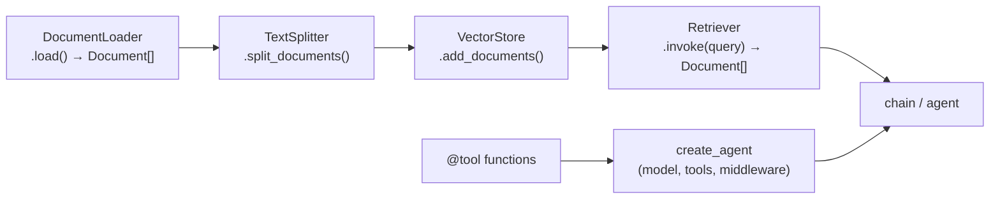

:::note In one line
**Everything you built by hand, now in five lines.** Worth knowing both, so you can debug when the five lines misbehave.
:::

## Why this matters

This is where a framework pays off most: fifteen document loaders, a dozen vector store
integrations and a tested agent loop that you do not have to write. Because you built all of
it by hand in Phases 12–14, you can now read exactly what these components do and swap in
your own where the defaults do not fit.

## Mental Model

Everything you built by hand in Phase 12 has a one-line equivalent here. Useful, provided you
remember what each line is doing underneath.
<figure class="lesson-figure">
<svg viewBox="0 0 660 220" role="img" aria-label="Diagram mapping the hand-built RAG steps onto their LangChain equivalents: loading and splitting, embedding and storing, retrieving, and generating with citations.">
  <text class="dg-label" x="14" y="22">What you wrote by hand</text>
  <text class="dg-label" x="366" y="22" fill="var(--accent)">What LangChain calls it</text>
  <rect x="14" y="32" width="326" height="32" rx="5" fill="var(--panel-2)" stroke="var(--border-strong)" stroke-width="1.3"/>
  <text class="dg-sub" x="28" y="52">read files, cut into chunks</text>
  <rect x="366" y="32" width="280" height="32" rx="5" fill="var(--panel-2)" stroke="var(--accent)" stroke-width="1.4"/>
  <text class="dg-mono" x="380" y="52" style="font-size:10.5px">DocumentLoader + TextSplitter</text>
  <rect x="14" y="72" width="326" height="32" rx="5" fill="var(--panel-2)" stroke="var(--border-strong)" stroke-width="1.3"/>
  <text class="dg-sub" x="28" y="92">embed each chunk, keep the vectors</text>
  <rect x="366" y="72" width="280" height="32" rx="5" fill="var(--panel-2)" stroke="var(--accent)" stroke-width="1.4"/>
  <text class="dg-mono" x="380" y="92" style="font-size:10.5px">VectorStore.from_documents()</text>
  <rect x="14" y="112" width="326" height="32" rx="5" fill="var(--panel-2)" stroke="var(--border-strong)" stroke-width="1.3"/>
  <text class="dg-sub" x="28" y="132">embed the question, find nearest</text>
  <rect x="366" y="112" width="280" height="32" rx="5" fill="var(--panel-2)" stroke="var(--accent)" stroke-width="1.4"/>
  <text class="dg-mono" x="380" y="132" style="font-size:10.5px">store.as_retriever()</text>
  <rect x="14" y="152" width="326" height="32" rx="5" fill="var(--panel-2)" stroke="var(--border-strong)" stroke-width="1.3"/>
  <text class="dg-sub" x="28" y="172">build the prompt, call the model</text>
  <rect x="366" y="152" width="280" height="32" rx="5" fill="var(--panel-2)" stroke="var(--accent)" stroke-width="1.4"/>
  <text class="dg-mono" x="380" y="172" style="font-size:10.5px">prompt | model | parser</text>
  <text class="dg-sub" x="330" y="206" text-anchor="middle">Same six steps. The framework saves typing, not understanding.</text>
</svg>
<figcaption>
<strong>This mapping is why the handbook builds RAG by hand first.</strong> When a chain
returns nothing useful, you need to know which of these six steps to go and inspect.
</figcaption>
</figure>



Every LangChain retrieval component is a `Runnable`, so a retriever composes into a chain
with the same `|` operator as everything else.

## Setup

```bash
uv add "langchain==1.4.0" langchain-anthropic langchain-community \
       langchain-text-splitters langchain-chroma pypdf
```

## Core Concepts

### Documents and loaders

```python
from langchain_core.documents import Document

document = Document(
    page_content="Logs are retained for 30 days on the Pro plan.",
    metadata={"source": "pricing.pdf", "page": 4, "tenant_id": "acme"},
)
```

A `Document` is text plus metadata — exactly the shape you built in Phase 12. Loaders produce
them:

```python
from langchain_community.document_loaders import (
    DirectoryLoader, PyPDFLoader, TextLoader, WebBaseLoader,
)

PyPDFLoader("policy.pdf").load()            # one Document per page, with page metadata
TextLoader("notes.md", encoding="utf-8").load()
WebBaseLoader(["https://example.com/docs"]).load()

DirectoryLoader(
    "docs/", glob="**/*.pdf", loader_cls=PyPDFLoader, show_progress=True,
).load()
```

:::note Loaders save time, not judgement
`PyPDFLoader` gives you per-page documents in one line — but it will not strip running
headers, detect scanned pages or convert tables. The quality decisions from Phase 12 remain
yours; the framework just removes the plumbing.
:::

### Text splitters

```python
from langchain_text_splitters import (
    MarkdownHeaderTextSplitter, RecursiveCharacterTextSplitter,
)

splitter = RecursiveCharacterTextSplitter(
    chunk_size=800,
    chunk_overlap=120,
    separators=["\n## ", "\n### ", "\n\n", "\n", ". ", " "],   # tried in order
    length_function=len,
    add_start_index=True,          # records the offset in the source: useful for citations
)
chunks = splitter.split_documents(documents)
```

`RecursiveCharacterTextSplitter` tries each separator in turn, preferring to break at
structural boundaries before falling back to arbitrary positions — the "sentence-aware"
strategy from Phase 11, implemented for you.

For markdown, split on headings and keep them as metadata:

```python
header_splitter = MarkdownHeaderTextSplitter(
    headers_to_split_on=[("#", "h1"), ("##", "h2"), ("###", "h3")],
    strip_headers=False,           # keep the heading text in the chunk
)
sections = header_splitter.split_text(markdown_text)
# each chunk's metadata now carries {"h1": ..., "h2": ...} - your context header, free
```

Token-aware splitting, when the chunk budget is in tokens rather than characters:

```python
splitter = RecursiveCharacterTextSplitter.from_tiktoken_encoder(
    chunk_size=500, chunk_overlap=75,
)
```

### Vector stores and retrievers

```python
from langchain_chroma import Chroma
from langchain_huggingface import HuggingFaceEmbeddings

embeddings = HuggingFaceEmbeddings(
    model_name="sentence-transformers/all-MiniLM-L6-v2",
    encode_kwargs={"normalize_embeddings": True},
)

store = Chroma(
    collection_name="handbook",
    embedding_function=embeddings,
    persist_directory=".data/chroma",
)
store.add_documents(chunks)

retriever = store.as_retriever(
    search_type="mmr",                       # or "similarity", "similarity_score_threshold"
    search_kwargs={
        "k": 5,
        "fetch_k": 20,                       # retrieve wide, select narrow (Phase 12)
        "lambda_mult": 0.6,                  # MMR diversity
        "filter": {"tenant_id": "acme"},     # access control (Phase 11)
    },
)

docs = retriever.invoke("how long are logs kept?")     # a Runnable like everything else
```

Compose retrieval into a chain:

```python
from langchain_core.output_parsers import StrOutputParser
from langchain_core.runnables import RunnableParallel, RunnablePassthrough


def format_docs(docs) -> str:
    return "\n\n".join(
        f"[{d.metadata.get('source')}#{d.metadata.get('page', 0)}] {d.page_content}"
        for d in docs
    )


rag_chain = (
    RunnableParallel(context=retriever | format_docs, question=RunnablePassthrough())
    | prompt
    | model
    | StrOutputParser()
)

rag_chain.invoke("how long are logs kept?")
```

That is the Phase 12 pipeline in eight lines — with streaming, batching and async included.

### Agents with `create_agent`

```python
from langchain.agents import create_agent
from langchain.tools import tool


@tool
def list_charges(customer_id: str, month: str) -> str:
    """List a customer's charges for a month.

    Args:
        customer_id: internal customer id, e.g. c_881.
        month: YYYY-MM, e.g. 2026-03.
    """
    return json.dumps(billing.charges(customer_id, month))


agent = create_agent(
    model="anthropic:claude-opus-5",
    tools=[list_charges, get_subscriptions, search_known_issues],
    system_prompt="You investigate billing questions using the available tools. "
                  "Do not guess values you could look up.",
)

result = agent.invoke({"messages": [{"role": "user", "content": "Why was c_881 charged twice?"}]})
print(result["messages"][-1].content)
```

`create_agent` builds the loop from Phase 14 — model, tool execution, message accumulation —
on top of LangGraph (Phase 17), which is why it gets persistence and streaming for free.

Custom state, when the agent needs to carry more than messages:

```python
from langchain.agents import AgentState


class BillingState(AgentState):
    customer_id: str
    tools_used: list[str]
    escalate: bool


agent = create_agent(model=..., tools=[...], state_schema=BillingState)
```

Persistence across turns:

```python
from langgraph.checkpoint.memory import InMemorySaver

agent = create_agent(model=..., tools=[...], checkpointer=InMemorySaver())
config = {"configurable": {"thread_id": "customer-881"}}

agent.invoke({"messages": [user_message]}, config=config)
agent.invoke({"messages": [follow_up]}, config=config)     # remembers the first turn
```

### Middleware — the cross-cutting layer

Middleware wraps the agent loop so concerns like budgets, approvals, logging and summarisation
live outside the business logic:

```python
agent = create_agent(
    model="anthropic:claude-opus-5",
    tools=tools,
    middleware=[BudgetMiddleware(max_usd=0.50), ApprovalMiddleware(gated={"issue_refund"})],
)
```

This is the framework equivalent of the limit checks you wrote by hand in Phase 14 — with the
advantage that they compose and are reusable across agents.

## Real-World Example

A complete LangChain RAG + agent service with ingestion, a hybrid retriever, an agent with
budget and approval middleware, and evaluation hooks.

```python title="src/assistant/ingest.py"
"""Ingestion with LangChain loaders and splitters."""
from __future__ import annotations

import logging
from pathlib import Path

from langchain_chroma import Chroma
from langchain_community.document_loaders import (
    DirectoryLoader, PyPDFLoader, TextLoader,
)
from langchain_core.documents import Document
from langchain_huggingface import HuggingFaceEmbeddings
from langchain_text_splitters import RecursiveCharacterTextSplitter

logger = logging.getLogger(__name__)

SPLITTER = RecursiveCharacterTextSplitter(
    chunk_size=800,
    chunk_overlap=120,
    separators=["\n## ", "\n### ", "\n\n", "\n", ". ", " ", ""],
    add_start_index=True,
)


def build_embeddings():
    return HuggingFaceEmbeddings(
        model_name="sentence-transformers/all-MiniLM-L6-v2",
        encode_kwargs={"normalize_embeddings": True},
    )


def build_store(persist_directory: str = ".data/chroma") -> Chroma:
    return Chroma(
        collection_name="assistant",
        embedding_function=build_embeddings(),
        persist_directory=persist_directory,
    )


def add_context_headers(documents: list[Document]) -> list[Document]:
    """Prepend source and page to each chunk - the Phase 11 recall win, in one pass."""
    enriched: list[Document] = []
    for document in documents:
        source = Path(str(document.metadata.get("source", "unknown"))).stem
        page = document.metadata.get("page")
        header = f"{source}" + (f" (p.{page + 1})" if isinstance(page, int) else "")
        enriched.append(Document(
            page_content=f"{header}\n\n{document.page_content}",
            metadata={**document.metadata, "context_header": header},
        ))
    return enriched


def ingest(directory: Path, *, tenant_id: str = "default") -> dict:
    loaders = [
        DirectoryLoader(str(directory), glob="**/*.pdf", loader_cls=PyPDFLoader),
        DirectoryLoader(str(directory), glob="**/*.md",
                        loader_cls=TextLoader, loader_kwargs={"encoding": "utf-8"}),
    ]

    documents: list[Document] = []
    for loader in loaders:
        documents.extend(loader.load())

    if not documents:
        raise FileNotFoundError(f"no documents found under {directory}")

    # quality gate: catch scanned PDFs before indexing empty chunks
    empty = [d for d in documents if len(d.page_content.strip()) < 40]
    if len(empty) > len(documents) * 0.3:
        logger.warning("%d of %d pages have almost no text - possible scanned PDFs",
                       len(empty), len(documents))

    chunks = add_context_headers(SPLITTER.split_documents(documents))
    for chunk in chunks:
        chunk.metadata["tenant_id"] = tenant_id
        chunk.metadata.pop("start_index", None) or None   # keep metadata JSON-serialisable

    store = build_store()
    store.add_documents(chunks)

    return {"documents": len(documents), "chunks": len(chunks),
            "mean_chunk_chars": round(sum(len(c.page_content) for c in chunks) / len(chunks))}
```

```python title="src/assistant/agent.py"
"""A support assistant: RAG as a tool, plus business tools, budget and approval."""
from __future__ import annotations

import json
import logging
from dataclasses import dataclass, field

from langchain.agents import AgentState, create_agent
from langchain.tools import tool
from langgraph.checkpoint.memory import InMemorySaver

from .ingest import build_store

logger = logging.getLogger(__name__)


class SupportState(AgentState):
    """Custom state carried through the run alongside messages."""
    customer_id: str
    escalated: bool
    tools_used: list[str]


# --- tools -------------------------------------------------------------------
@tool
def search_documentation(query: str, k: int = 5) -> str:
    """Search internal documentation for relevant passages.

    Use this before answering any policy or product question.
    Args:
        query: a specific question or keywords.
        k: number of passages to return (1-10).
    """
    retriever = build_store().as_retriever(
        search_type="mmr", search_kwargs={"k": min(k, 10), "fetch_k": 20}
    )
    documents = retriever.invoke(query)
    if not documents:
        return "No relevant documentation found. Say so rather than guessing."

    return "\n\n".join(
        f"[{d.metadata.get('context_header', 'doc')}] {d.page_content[:800]}"
        for d in documents
    )


@tool
def get_account(customer_id: str) -> str:
    """Look up a customer's plan, seats and status.

    Args:
        customer_id: internal customer id, e.g. c_881.
    """
    return json.dumps(ACCOUNTS.get(customer_id, {"error": "unknown customer"}))


@tool
def create_ticket(customer_id: str, summary: str, priority: str) -> str:
    """Create a support ticket for human follow-up.

    Use this when you cannot resolve the issue from documentation.
    Args:
        customer_id: internal customer id.
        summary: one-sentence description of the problem.
        priority: low, normal, high or urgent.
    """
    ticket_id = tickets.create(customer_id, summary, priority)
    return json.dumps({"ticket_id": ticket_id, "status": "open"})


# --- middleware ----------------------------------------------------------------
@dataclass
class BudgetMiddleware:
    """Stop the agent when it has spent enough. Framework-agnostic in spirit:
    the same check you wrote by hand in Phase 14."""

    max_usd: float = 0.50
    max_tool_calls: int = 10
    spent: float = 0.0
    calls: int = 0

    def before_model(self, state) -> dict | None:
        if self.spent >= self.max_usd or self.calls >= self.max_tool_calls:
            logger.warning("budget reached: $%.4f, %d calls", self.spent, self.calls)
            return {"messages": [{
                "role": "assistant",
                "content": ("I have reached the limit for this request. Here is what I "
                            "established so far; please continue with a human agent."),
            }], "jump_to": "end"}
        return None

    def after_model(self, state, response) -> None:
        usage = getattr(response, "usage_metadata", {}) or {}
        self.spent += usage.get("input_tokens", 0) / 1e6 * 5.0
        self.spent += usage.get("output_tokens", 0) / 1e6 * 25.0

    def before_tool(self, state, call) -> None:
        self.calls += 1


@dataclass
class ApprovalMiddleware:
    """Gate irreversible tools behind a human decision."""

    gated: set[str] = field(default_factory=set)
    approver: object | None = None

    def before_tool(self, state, call) -> dict | None:
        if call["name"] not in self.gated:
            return None
        if self.approver is None or not self.approver.approve(call["name"], call["args"]):
            return {"result": f"Action {call['name']} was not approved. Do not retry it; "
                              f"explain the situation to the user instead."}
        return None


# --- assembly --------------------------------------------------------------------
SYSTEM = """\
You are a support assistant for ACME.

How to work:
1. Search the documentation before answering any product or policy question.
2. Quote the source header in square brackets for every factual claim.
3. If documentation does not cover it, say so and create a ticket.
4. Never invent policy, prices, dates or account details.
5. Keep answers under 150 words.
"""


def build_assistant(*, approver=None, checkpointer=None):
    return create_agent(
        model="anthropic:claude-opus-5",
        tools=[search_documentation, get_account, create_ticket],
        system_prompt=SYSTEM,
        state_schema=SupportState,
        middleware=[
            BudgetMiddleware(max_usd=0.50, max_tool_calls=8),
            ApprovalMiddleware(gated={"create_ticket"}, approver=approver),
        ],
        checkpointer=checkpointer or InMemorySaver(),
    )


if __name__ == "__main__":
    logging.basicConfig(level="INFO", format="%(levelname)s %(message)s")

    assistant = build_assistant()
    config = {"configurable": {"thread_id": "demo-881"}}

    for question in [
        "How long do you keep my logs? I'm on the Pro plan.",
        "And if I upgrade to Enterprise?",            # follow-up: needs the thread
    ]:
        result = assistant.invoke(
            {"messages": [{"role": "user", "content": question}], "customer_id": "c_881"},
            config=config,
        )
        print(f"\nQ: {question}\nA: {result['messages'][-1].content}")
```

```text
Q: How long do you keep my logs? I'm on the Pro plan.
A: Logs are retained for 30 days on the Pro plan [pricing (p.4)]. Retention is not
   configurable on Pro; Enterprise plans can extend it [pricing (p.5)].

Q: And if I upgrade to Enterprise?
A: Enterprise customers can configure log retention up to 400 days in the admin
   console [pricing (p.5)]. The change applies from the start of the next billing
   period [pricing (p.6)].
```

The second answer works only because the checkpointer preserved the thread — "And if I
upgrade to Enterprise?" is meaningless without it.

### Streaming the agent

```python
for chunk in assistant.stream(
    {"messages": [{"role": "user", "content": question}], "customer_id": "c_881"},
    config=config,
    stream_mode="updates",          # "values" | "updates" | "messages"
):
    for node, update in chunk.items():
        print(f"[{node}] {str(update)[:160]}")
```

```text
[agent] {'messages': [AIMessage(content='', tool_calls=[{'name': 'search_documentation'...
[tools] {'messages': [ToolMessage(content='[pricing (p.4)] Logs are retained for 30 days...
[agent] {'messages': [AIMessage(content='Logs are retained for 30 days on the Pro plan...
```

Streaming updates per node is what lets a UI show "searching documentation…" instead of a
spinner — a large perceived-latency win for agent products.

## Common Mistakes

:::mistake
```python
# 1. Rebuilding the store or embeddings per request
def tool(): return build_store().as_retriever()...    # loads the model every call
STORE = build_store()                                  # module level, once

# 2. Losing metadata during splitting
splitter.split_text(raw)          # returns strings: metadata gone
splitter.split_documents(docs)    # keeps metadata

# 3. No metadata filter on a multi-tenant retriever
store.as_retriever(search_kwargs={"k": 5})                          # leaks across tenants
store.as_retriever(search_kwargs={"k": 5, "filter": {"tenant_id": t}})

# 4. Expecting create_agent to enforce limits by default
# budgets, approvals and iteration caps come from middleware or your own config

# 5. Non-serialisable metadata
chunk.metadata["loaded_at"] = datetime.now()    # Chroma wants scalars
chunk.metadata["loaded_at"] = datetime.now().isoformat()

# 6. Ignoring extraction quality because the loader "worked"
# PyPDFLoader happily returns 50 empty pages from a scanned PDF

# 7. Reusing one thread_id for every user
# conversations bleed into each other; thread_id must be per conversation
```
:::

## Performance Considerations

- Build embeddings, store and agent **once** at import; they are expensive to construct.
- `store.as_retriever(search_kwargs={"fetch_k": 20, "k": 5})` is the retrieve-wide,
  select-narrow pattern with MMR diversity, in one line.
- `stream_mode="updates"` shows progress per node without buffering the whole run.
- Batch ingestion: `add_documents` in batches of ~500; one call per chunk is dramatically
  slower.
- For high-throughput services use the async variants (`ainvoke`, `astream`, `aadd_documents`)
  so the event loop is not blocked.

## Hands-on Exercise

:::exercise Rebuild your Phase 12 RAG in LangChain
Using the corpus and evaluation set you already have:

1. Ingest with `DirectoryLoader` + `RecursiveCharacterTextSplitter`, adding context headers.
2. Build a retriever with MMR, `fetch_k=20`, `k=5` and a tenant filter.
3. Compose a RAG chain with a prompt that requires citations and permits refusal.
4. Run your Phase 13 evaluation harness against it.
5. Compare against your hand-written pipeline: recall@5, faithfulness, p95 latency, lines of
   code.
6. Then wrap the retriever as a tool and build an agent version; compare all three.

Report the table. The interesting question is whether the agent version is worth its latency
over the fixed chain — on most document Q&A, it is not.
:::

:::solution Reference comparison
```text
implementation        recall@5  faithfulness  pass_rate   p50_ms   p95_ms  lines
hand-written chain       0.920         0.941      0.880    1,412    2,681    340
langchain chain          0.920         0.938      0.880    1,486    2,903     95
langchain agent          0.940         0.951      0.900    4,210    9,840    120

The agent retrieves twice on hard questions, which lifts recall by 2 points and
faithfulness slightly - at 3.6x the p95 latency. For a support widget with a 3-second
budget, ship the chain. For an internal research tool where 10 seconds is acceptable,
the agent's ability to re-query is worth it.
```

That is the recurring judgement of this handbook: the agent is better and much slower, and
which matters depends on the product, not on the technology.
:::

## Challenge

:::challenge Custom retriever and middleware
1. Implement a `BaseRetriever` subclass that performs the hybrid BM25 + vector + RRF
   retrieval from Phase 13, so it drops into any LangChain chain.
2. Write a `CitationMiddleware` that inspects the agent's final message, verifies every
   cited source exists in the retrieved documents, and rejects the answer back into the loop
   when it does not.
3. Measure faithfulness with and without the middleware on your evaluation set.

You will have rebuilt your hand-written guarantees as reusable framework components — which
is the right end state: framework convenience, your safety properties.
:::

## Interview Questions

:::interview
1. What is a `Document` and why does metadata matter?
2. How does `RecursiveCharacterTextSplitter` decide where to split?
3. What does `as_retriever(search_type="mmr")` change, and why would you want it?
4. What does `create_agent` do that you would otherwise write yourself?
5. What is middleware for in an agent, and what belongs there?
:::

## Cheat Sheet

```python
from langchain_community.document_loaders import DirectoryLoader, PyPDFLoader, TextLoader
from langchain_text_splitters import RecursiveCharacterTextSplitter, MarkdownHeaderTextSplitter
from langchain_chroma import Chroma
from langchain.agents import create_agent, AgentState
from langchain.tools import tool
from langgraph.checkpoint.memory import InMemorySaver

docs = DirectoryLoader(path, glob="**/*.pdf", loader_cls=PyPDFLoader).load()
chunks = RecursiveCharacterTextSplitter(chunk_size=800, chunk_overlap=120,
                                        add_start_index=True).split_documents(docs)
store = Chroma(collection_name=..., embedding_function=..., persist_directory=...)
store.add_documents(chunks)
retriever = store.as_retriever(search_type="mmr",
                               search_kwargs={"k": 5, "fetch_k": 20, "filter": {...}})

chain = RunnableParallel(context=retriever | format_docs,
                         question=RunnablePassthrough()) | prompt | model | StrOutputParser()

agent = create_agent(model="anthropic:claude-opus-5", tools=[...], system_prompt=...,
                     state_schema=CustomState, middleware=[...], checkpointer=InMemorySaver())
agent.invoke({"messages": [...]}, config={"configurable": {"thread_id": tid}})
agent.stream(..., stream_mode="updates")
```

```quiz
[
  {
    "question": "Why use split_documents rather than split_text?",
    "options": [
      "It is faster",
      "It preserves each chunk's metadata (source, page), which citations and filters depend on",
      "It produces smaller chunks",
      "split_text is deprecated"
    ],
    "answer": 1,
    "explanation": "split_text returns bare strings. Losing metadata means losing citations, tenant filters and provenance - the things that make retrieval trustworthy."
  },
  {
    "question": "Your multi-tenant retriever occasionally returns another customer's document. What is the fix?",
    "options": [
      "Instruct the model to ignore documents from other tenants",
      "Pass a metadata filter in search_kwargs so forbidden chunks are never retrieved",
      "Lower k",
      "Use a larger embedding model"
    ],
    "answer": 1,
    "explanation": "Once a chunk is retrieved it has already crossed the boundary. Access control belongs in the query filter, enforced in the retriever construction."
  },
  {
    "question": "What does create_agent give you over the loop you wrote in Phase 14?",
    "options": [
      "Better reasoning",
      "A tested loop with persistence, streaming and middleware hooks - but the limits and approvals are still yours to configure",
      "Automatic tool creation",
      "Guaranteed termination"
    ],
    "answer": 1,
    "explanation": "The plumbing is provided; the safety properties are still your responsibility, which is exactly why building the loop by hand first was worth it."
  }
]
```

## Summary

- Loaders and splitters remove plumbing, not judgement — extraction quality is still yours.
- Retrievers are Runnables; MMR with `fetch_k` implements retrieve-wide/select-narrow in one
  line, and `filter` carries access control.
- `create_agent` provides the Phase 14 loop plus persistence, streaming and middleware.
- Middleware is where budgets, approvals and verification belong — the safety properties you
  wrote by hand, made reusable.

## Next Step

Phase 17: LangGraph — explicit state machines, checkpointing and human-in-the-loop, for when
an agent needs to be pausable, resumable and inspectable.
