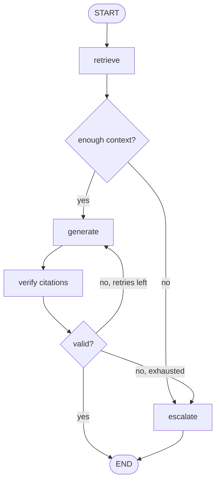

:::note In one line
**LangGraph is a state machine: nodes change state, edges decide what runs next.** Once you see that, the API reads itself.
:::

## Why this matters

An agent loop is a state machine whose transitions the model chooses. Writing that explicitly
— named states, named transitions, typed shared state — turns an opaque loop into something
you can draw, test, pause, resume and debug. That is what LangGraph is for, and it is why
production agent systems converge on it.

## Mental Model

```text
STATE     a typed dict that flows through the graph; every node reads it and
          returns a partial update

NODE      a function: State -> partial State update
          "retrieve", "generate", "check_citations", "escalate"

EDGE      what runs next
          fixed:       A -> B  always
          conditional: A -> (a function of state) -> B or C or END

REDUCER   how updates merge into state
          default: replace.   Annotated[list, add]: append.
```



Compare that with the Phase 14 loop: same behaviour, but every state and transition is named,
so a trace tells you *which node* misbehaved rather than "the agent did something".

## Build one by hand first

Before the framework, thirty lines that make the idea concrete:

```python title="hand_rolled_graph.py"
"""A state machine with no framework. LangGraph is this, made general."""
from __future__ import annotations

from typing import Any, Callable, TypedDict

END = "__end__"


class State(TypedDict, total=False):
    question: str
    chunks: list[str]
    answer: str
    attempts: int
    trace: list[str]


def run_graph(
    nodes: dict[str, Callable[[State], dict[str, Any]]],
    edges: dict[str, str | Callable[[State], str]],
    initial: State,
    *,
    entry: str,
    max_steps: int = 25,
) -> State:
    state: State = {**initial, "trace": []}
    current = entry

    for _ in range(max_steps):                       # bounded, like every loop in this handbook
        if current == END:
            return state

        update = nodes[current](state)               # a node returns a PARTIAL update
        state = {**state, **update,
                 "trace": [*state.get("trace", []), current]}

        route = edges[current]
        current = route(state) if callable(route) else route

    raise RuntimeError(f"graph did not terminate within {max_steps} steps")


# --- the nodes -----------------------------------------------------------------
def retrieve(state: State) -> dict:
    return {"chunks": search(state["question"], k=5)}


def generate(state: State) -> dict:
    answer = llm_answer(state["question"], state["chunks"])
    return {"answer": answer, "attempts": state.get("attempts", 0) + 1}


def escalate(state: State) -> dict:
    return {"answer": "I could not answer this; a human has been notified."}


def after_retrieve(state: State) -> str:
    return "generate" if state["chunks"] else "escalate"


def after_generate(state: State) -> str:
    if citations_valid(state["answer"], state["chunks"]):
        return END
    return "generate" if state["attempts"] < 2 else "escalate"


final = run_graph(
    nodes={"retrieve": retrieve, "generate": generate, "escalate": escalate},
    edges={"retrieve": after_retrieve, "generate": after_generate, "escalate": END},
    initial={"question": "How long are logs kept?"},
    entry="retrieve",
)
print(final["trace"])      # ['retrieve', 'generate']  ← the path taken, for free
```

That `trace` list is the point. Everything LangGraph adds — reducers, checkpoints, interrupts,
streaming, parallel branches — is built on this skeleton.

## Setup

```bash
uv add "langgraph==1.2.11" "langchain==1.4.0" langchain-anthropic
```

## Core Concepts

### State and reducers

```python
from typing import Annotated
from typing_extensions import TypedDict
from operator import add

from langchain.messages import AnyMessage
from langgraph.graph.message import add_messages


class State(TypedDict):
    question: str                                    # replaced by each update
    messages: Annotated[list[AnyMessage], add_messages]   # appended, ids deduplicated
    chunks: Annotated[list[dict], add]                # concatenated
    attempts: int                                     # replaced
```

The reducer is the whole subtlety:

```text
no reducer         update replaces the value           {"question": "new"} → overwrites
Annotated[list, add]   update is concatenated          {"chunks": [c4]}    → existing + [c4]
add_messages       append, replacing by message id     handles tool results correctly
```

:::warning A missing reducer silently loses data
```python
chunks: list[dict]                       # each node OVERWRITES the list
chunks: Annotated[list[dict], add]       # each node APPENDS to it
```
If two parallel nodes both return `chunks`, the no-reducer version keeps whichever finished
last — and nothing warns you. This is the most common LangGraph bug.
:::

### Nodes

A node is a function from state to a **partial** update:

```python
def retrieve(state: State) -> dict:
    chunks = retriever.invoke(state["question"])
    return {"chunks": [{"id": d.metadata["id"], "text": d.page_content} for d in chunks]}
```

Return only what changed. Returning `{}` means "no update". Nodes should be small, named
after what they do, and individually testable — that is the main benefit over a monolithic
loop.

### Building the graph

```python
from langgraph.graph import END, START, StateGraph

builder = StateGraph(State)

builder.add_node("retrieve", retrieve)
builder.add_node("generate", generate)
builder.add_node("escalate", escalate)

builder.add_edge(START, "retrieve")           # entry point
builder.add_conditional_edges(
    "retrieve",
    lambda state: "generate" if state["chunks"] else "escalate",
    {"generate": "generate", "escalate": "escalate"},     # explicit map: readable diagrams
)
builder.add_edge("generate", END)
builder.add_edge("escalate", END)

graph = builder.compile()

result = graph.invoke({"question": "How long are logs kept?", "attempts": 0})
```

### Visualising and streaming

```python
print(graph.get_graph().draw_ascii())            # the diagram, from the code
open("graph.png", "wb").write(graph.get_graph().draw_mermaid_png())

for event in graph.stream(input_state, stream_mode="updates"):
    for node, update in event.items():
        print(f"[{node}] {str(update)[:120]}")
```

Stream modes: `"values"` (full state after each step), `"updates"` (just the change — usually
what you want), `"messages"` (LLM tokens as they arrive).

### Parallel branches

```python
builder.add_edge(START, "vector_search")
builder.add_edge(START, "keyword_search")        # both run concurrently
builder.add_edge("vector_search", "fuse")
builder.add_edge("keyword_search", "fuse")       # fuse waits for both
```

Parallel nodes writing to the same key **must** have a reducer, or their results collide.

### Cycles and termination

```python
builder.add_conditional_edges("generate", after_generate,
                              {"generate": "generate", "escalate": "escalate", END: END})

graph = builder.compile()
graph.invoke(state, config={"recursion_limit": 25})     # hard cap on total steps
```

`recursion_limit` is the framework's version of `max_iterations`: a cycle that never routes to
`END` raises `GraphRecursionError` rather than running forever.

## Real-World Example

A production RAG graph: retrieve → grade → optionally rewrite and re-retrieve → generate →
verify → escalate, with full instrumentation.

```python title="src/graphs/rag_graph.py"
"""Self-correcting RAG as an explicit graph.

Why a graph rather than a chain: the flow has three decision points (was retrieval
good enough? are the citations valid? have we retried too often?) and one cycle.
Expressed as a graph, each decision is a named, testable function.
"""
from __future__ import annotations

import logging
import re
import time
from typing import Annotated, Literal
from operator import add

from langchain.chat_models import init_chat_model
from langchain.prompts import ChatPromptTemplate
from langgraph.graph import END, START, StateGraph
from pydantic import BaseModel, Field
from typing_extensions import TypedDict

logger = logging.getLogger(__name__)

CITATION = re.compile(r"\[([A-Za-z0-9_.#:/-]+)\]")
MAX_RETRIEVAL_ATTEMPTS = 2
MAX_GENERATION_ATTEMPTS = 2


class RagState(TypedDict, total=False):
    # inputs
    question: str
    original_question: str
    tenant_id: str
    # working state
    chunks: Annotated[list[dict], add]        # appended across retrieval attempts
    graded_chunks: list[dict]
    answer: str
    citations: list[str]
    # control
    retrieval_attempts: int
    generation_attempts: int
    route: str
    # observability
    node_timings: Annotated[list[dict], add]
    warnings: Annotated[list[str], add]


class Grade(BaseModel):
    """Is the retrieved context sufficient to answer the question?"""
    sufficient: bool = Field(description="true only if the answer is fully present")
    relevant_chunk_ids: list[str] = Field(default_factory=list)
    missing: str = Field(default="", max_length=200,
                         description="what the context lacks, if anything")


model = init_chat_model("anthropic:claude-opus-5", max_tokens=1_024)
cheap_model = init_chat_model("anthropic:claude-haiku-4-5", max_tokens=512)

ANSWER_PROMPT = ChatPromptTemplate.from_messages([
    ("system",
     "Answer strictly from <context>. Cite the chunk id in square brackets after every "
     "factual claim. If the context is insufficient, reply exactly: INSUFFICIENT_CONTEXT. "
     "Maximum 150 words."),
    ("human", "<context>\n{context}\n</context>\n\n<question>\n{question}\n</question>"),
])

REWRITE_PROMPT = ChatPromptTemplate.from_messages([
    ("system",
     "Rewrite the question to retrieve better documentation passages. Use the vocabulary "
     "a technical document would use. Preserve the meaning exactly. Output only the "
     "rewritten question."),
    ("human", "Question: {question}\nWhat the first search missed: {missing}"),
])


def timed(node_name: str):
    """Decorator recording per-node latency into the state - the graph's own trace."""
    def decorator(fn):
        def wrapper(state: RagState) -> dict:
            started = time.perf_counter()
            update = fn(state)
            elapsed = int((time.perf_counter() - started) * 1000)
            return {**update, "node_timings": [{"node": node_name, "ms": elapsed}]}
        wrapper.__name__ = fn.__name__
        return wrapper
    return decorator


# --- nodes -------------------------------------------------------------------
@timed("retrieve")
def retrieve(state: RagState) -> dict:
    retriever = build_retriever(tenant_id=state["tenant_id"])
    documents = retriever.invoke(state["question"])
    chunks = [
        {"id": d.metadata.get("id", f"c{i}"), "text": d.page_content,
         "source": d.metadata.get("source", "unknown"),
         "score": d.metadata.get("score", 0.0)}
        for i, d in enumerate(documents)
    ]
    logger.info("retrieved %d chunks (attempt %d)",
                len(chunks), state.get("retrieval_attempts", 0) + 1)
    return {"chunks": chunks, "retrieval_attempts": state.get("retrieval_attempts", 0) + 1}


@timed("grade")
def grade(state: RagState) -> dict:
    """A cheap model decides whether retrieval succeeded - before we pay for generation."""
    if not state.get("chunks"):
        return {"graded_chunks": [], "route": "insufficient"}

    context = "\n\n".join(f"[{c['id']}] {c['text'][:600]}" for c in state["chunks"])
    grader = cheap_model.with_structured_output(Grade)
    verdict = grader.invoke(
        f"Question: {state['question']}\n\nContext:\n{context}\n\n"
        f"Is this context sufficient to answer the question fully?"
    )

    keep = [c for c in state["chunks"] if c["id"] in set(verdict.relevant_chunk_ids)] \
        or state["chunks"][:5]

    return {
        "graded_chunks": keep,
        "route": "sufficient" if verdict.sufficient else "insufficient",
        "warnings": [] if verdict.sufficient else [f"retrieval gap: {verdict.missing}"],
    }


@timed("rewrite")
def rewrite(state: RagState) -> dict:
    """Reformulate the query and try retrieval again."""
    missing = next((w for w in state.get("warnings", []) if w.startswith("retrieval gap")), "")
    rewritten = (REWRITE_PROMPT | cheap_model).invoke({
        "question": state.get("original_question", state["question"]),
        "missing": missing,
    }).text.strip()

    logger.info("rewrote query: %r -> %r", state["question"], rewritten)
    return {"question": rewritten,
            "original_question": state.get("original_question", state["question"])}


@timed("generate")
def generate(state: RagState) -> dict:
    context = "\n\n".join(f"[{c['id']}] {c['text']}" for c in state["graded_chunks"])
    answer = (ANSWER_PROMPT | model).invoke({
        "context": context,
        "question": state.get("original_question", state["question"]),
    }).text.strip()

    return {"answer": answer,
            "generation_attempts": state.get("generation_attempts", 0) + 1}


@timed("verify")
def verify(state: RagState) -> dict:
    """Deterministic citation check - the Phase 12 guardrail, as a node."""
    answer = state.get("answer", "")
    valid_ids = {c["id"] for c in state.get("graded_chunks", [])}
    cited = set(CITATION.findall(answer))
    invalid = sorted(cited - valid_ids)

    if "INSUFFICIENT_CONTEXT" in answer:
        return {"route": "insufficient", "citations": []}
    if invalid:
        return {"route": "invalid_citations", "citations": [],
                "warnings": [f"fabricated citations: {invalid}"]}
    if not cited:
        return {"route": "invalid_citations", "citations": [],
                "warnings": ["answer contained no citations"]}

    return {"route": "ok", "citations": sorted(cited)}


@timed("escalate")
def escalate(state: RagState) -> dict:
    return {
        "answer": ("I could not answer this from the available documentation. "
                   "A support ticket has been created."),
        "route": "escalated",
        "citations": [],
    }


# --- routing functions (pure, trivially testable) ------------------------------
def after_grade(state: RagState) -> Literal["generate", "rewrite", "escalate"]:
    if state.get("route") == "sufficient":
        return "generate"
    if state.get("retrieval_attempts", 0) < MAX_RETRIEVAL_ATTEMPTS:
        return "rewrite"
    return "escalate"


def after_verify(state: RagState) -> Literal["generate", "escalate", "__end__"]:
    route = state.get("route")
    if route == "ok":
        return END
    if state.get("generation_attempts", 0) < MAX_GENERATION_ATTEMPTS:
        return "generate"
    return "escalate"


# --- assembly --------------------------------------------------------------------
def build_rag_graph(checkpointer=None):
    builder = StateGraph(RagState)

    builder.add_node("retrieve", retrieve)
    builder.add_node("grade", grade)
    builder.add_node("rewrite", rewrite)
    builder.add_node("generate", generate)
    builder.add_node("verify", verify)
    builder.add_node("escalate", escalate)

    builder.add_edge(START, "retrieve")
    builder.add_edge("retrieve", "grade")
    builder.add_conditional_edges("grade", after_grade,
                                  {"generate": "generate", "rewrite": "rewrite",
                                   "escalate": "escalate"})
    builder.add_edge("rewrite", "retrieve")          # the cycle
    builder.add_edge("generate", "verify")
    builder.add_conditional_edges("verify", after_verify,
                                  {"generate": "generate", "escalate": "escalate", END: END})
    builder.add_edge("escalate", END)

    return builder.compile(checkpointer=checkpointer)


if __name__ == "__main__":
    logging.basicConfig(level="INFO", format="%(levelname)s %(message)s")
    graph = build_rag_graph()

    print(graph.get_graph().draw_ascii(), "\n")

    for question in ["How long are logs kept on the Pro plan?",
                     "What is the CEO's home address?"]:
        final = graph.invoke(
            {"question": question, "tenant_id": "acme",
             "retrieval_attempts": 0, "generation_attempts": 0},
            config={"recursion_limit": 15},
        )
        path = " → ".join(t["node"] for t in final["node_timings"])
        total_ms = sum(t["ms"] for t in final["node_timings"])

        print(f"\nQ: {question}")
        print(f"A: {final['answer'][:200]}")
        print(f"   path: {path}  ({total_ms}ms)")
        print(f"   citations: {final.get('citations')}  warnings: {final.get('warnings')}")
```

```text
        +-----------+
        | __start__ |
        +-----------+
              *
        +----------+
        | retrieve |
        +----------+
              *
          +-------+
          | grade |
          +-------+
        ..    .    ..
   +---------+   +----------+   +----------+
   | rewrite |   | generate |   | escalate |
   +---------+   +----------+   +----------+
                      *
                 +--------+
                 | verify |
                 +--------+

Q: How long are logs kept on the Pro plan?
A: Logs are retained for 30 days on the Pro plan [pricing#2]. Enterprise customers can
   configure retention up to 400 days [pricing#3].
   path: retrieve → grade → generate → verify  (2184ms)
   citations: ['pricing#2', 'pricing#3']  warnings: []

Q: What is the CEO's home address?
A: I could not answer this from the available documentation. A support ticket has been
   created.
   path: retrieve → grade → rewrite → retrieve → grade → escalate  (1620ms)
   citations: []  warnings: ['retrieval gap: no information about personal addresses', ...]
```

Look at the second path: the graph tried retrieval, judged it insufficient, rewrote the
query, tried again, and *then* escalated — without ever calling the expensive generation
model. The cheap grading node saved the cost of generating an answer that could not exist.

### Testing nodes individually

```python title="tests/test_rag_graph.py"
"""Nodes and routers are ordinary functions - test them without a model."""
import pytest

from graphs.rag_graph import after_grade, after_verify, verify


def test_router_generates_when_context_is_sufficient():
    assert after_grade({"route": "sufficient", "retrieval_attempts": 1}) == "generate"


def test_router_rewrites_once_then_escalates():
    assert after_grade({"route": "insufficient", "retrieval_attempts": 1}) == "rewrite"
    assert after_grade({"route": "insufficient", "retrieval_attempts": 2}) == "escalate"


def test_verify_rejects_fabricated_citations():
    state = {"answer": "It is 30 days [c9].", "graded_chunks": [{"id": "c1", "text": "x"}]}
    update = verify(state)
    assert update["route"] == "invalid_citations"
    assert "fabricated citations" in update["warnings"][0]


def test_verify_accepts_valid_citations():
    state = {"answer": "It is 30 days [c1].", "graded_chunks": [{"id": "c1", "text": "x"}]}
    assert verify(state)["route"] == "ok"


def test_verify_flags_missing_citations():
    state = {"answer": "It is 30 days.", "graded_chunks": [{"id": "c1", "text": "x"}]}
    assert verify(state)["route"] == "invalid_citations"


@pytest.mark.parametrize(
    ("route", "attempts", "expected"),
    [("ok", 1, "__end__"), ("invalid_citations", 1, "generate"),
     ("invalid_citations", 2, "escalate"), ("insufficient", 2, "escalate")],
)
def test_after_verify_routing(route, attempts, expected):
    assert after_verify({"route": route, "generation_attempts": attempts}) == expected
```

```text
8 passed in 0.04s
```

This is the practical advantage of a graph over a loop: the routing logic — the part most
likely to contain a bug — is a set of pure functions you can test exhaustively in
milliseconds.

## Common Mistakes

:::mistake
```python
# 1. Missing reducer on an accumulating field
chunks: list[dict]                       # each node overwrites
chunks: Annotated[list[dict], add]       # each node appends

# 2. Returning the whole state from a node
def node(state): return state            # works, but obscures what changed
def node(state): return {"answer": ...}  # return only the update

# 3. Mutating state in place
def node(state):
    state["chunks"].append(x)            # bypasses reducers; breaks checkpointing
    return {}
def node(state): return {"chunks": [x]}  # correct

# 4. A cycle with no exit route
builder.add_edge("generate", "verify")
builder.add_edge("verify", "generate")   # infinite; recursion_limit saves you, barely

# 5. Conditional edges without the mapping dict
builder.add_conditional_edges("grade", after_grade)     # works, but the diagram is unreadable
builder.add_conditional_edges("grade", after_grade, {...})

# 6. Node names that describe nothing
"node_1", "step2"                        # traces become useless
"retrieve", "grade", "verify"

# 7. Business logic inside routing functions
def after_grade(state):
    result = llm.invoke(...)             # routers should be pure and instant
```
:::

## Performance Considerations

- Nodes with no dependency between them should be **parallel edges**, not sequential — a
  hybrid retriever's vector and keyword branches run concurrently for free.
- A **cheap grading node before an expensive generation node** is one of the best cost
  patterns available: it fails fast on hopeless requests.
- `stream_mode="updates"` avoids serialising the full state on every step, which matters when
  state carries large chunk lists.
- Keep state small: store large blobs (documents, images) by reference, not by value.
  Checkpointing serialises the entire state on every step.
- Set `recursion_limit` deliberately; it is your loop cap.

## Hands-on Exercise

:::exercise Convert your agent into a graph
Take the Phase 14 agent and re-express it as a LangGraph:

1. Define `AgentState` with `messages` (using `add_messages`), `iterations`, `cost_usd` and
   `stop_reason`.
2. Nodes: `call_model`, `execute_tools`, `check_limits`, `finalise`.
3. Conditional edges implementing all the Phase 14 stop conditions.
4. Print the ASCII diagram and confirm it matches your mental model.
5. Write unit tests for every routing function with no model involved.
6. Run both versions on the same 10 scenarios and compare completion rate, steps and cost.

The behaviour should be identical. What changes is that you can now draw it, test the routing
exhaustively, and — next lesson — pause it.
:::

:::solution Key structure
```python
class AgentState(TypedDict):
    messages: Annotated[list[AnyMessage], add_messages]
    iterations: int
    cost_usd: float
    stop_reason: str


def call_model(state: AgentState) -> dict:
    response = model_with_tools.invoke(state["messages"])
    usage = response.usage_metadata or {}
    return {
        "messages": [response],
        "iterations": state["iterations"] + 1,
        "cost_usd": state["cost_usd"]
                    + usage.get("input_tokens", 0) / 1e6 * 5.0
                    + usage.get("output_tokens", 0) / 1e6 * 25.0,
    }


def should_continue(state: AgentState) -> str:
    if state["iterations"] >= MAX_ITERATIONS:
        return "finalise"
    if state["cost_usd"] >= MAX_COST:
        return "finalise"
    last = state["messages"][-1]
    return "execute_tools" if getattr(last, "tool_calls", None) else END
```

```text
scenarios: 10 · runs: 3

implementation    completion   mean_steps   mean_cost   testable_routers
phase 14 loop          0.733          4.8     $0.0184                 no
langgraph              0.733          4.8     $0.0186                yes

Identical behaviour and cost. The gain is structural: 14 routing unit tests that run
in 40ms, an ASCII diagram in code review, and - from the next lesson - the ability to
pause mid-run for human approval.
```
:::

## Challenge

:::challenge Add parallel retrieval
Extend the RAG graph so `vector_search` and `keyword_search` run as parallel branches from
`START`, converging on a `fuse` node that applies reciprocal rank fusion (Phase 13).

You will need a reducer on the results field, because both branches write to it. Then
deliberately remove the reducer and observe what happens — one branch's results vanish, with
no error. That failure, experienced once, is the most memorable way to learn what reducers
are for.
:::

## Interview Questions

:::interview
1. What is a reducer and when do you need one?
2. Why express an agent as a graph rather than a while loop?
3. What does a node return, and why only a partial update?
4. How do you prevent an infinite cycle?
5. How would you unit-test a graph's control flow without calling a model?
:::

## Cheat Sheet

```python
from typing import Annotated
from operator import add
from typing_extensions import TypedDict
from langgraph.graph import StateGraph, START, END
from langgraph.graph.message import add_messages

class State(TypedDict):
    field: str                                   # replaced
    items: Annotated[list, add]                  # appended
    messages: Annotated[list[AnyMessage], add_messages]

builder = StateGraph(State)
builder.add_node("name", fn)                     # fn(state) -> partial update
builder.add_edge(START, "name")
builder.add_edge("a", "b")
builder.add_conditional_edges("a", router_fn, {"x": "node_x", "y": "node_y", END: END})
graph = builder.compile(checkpointer=None)

graph.invoke(state, config={"recursion_limit": 25})
graph.stream(state, stream_mode="updates" | "values" | "messages")
graph.get_graph().draw_ascii() / .draw_mermaid_png()

RULES  return partial updates · never mutate state · reducers for accumulation
       parallel writers REQUIRE a reducer · name nodes after what they do
       routers stay pure and instant
```

```quiz
[
  {
    "question": "Two parallel nodes both return {'chunks': [...]}. The state field is declared `chunks: list[dict]`. What happens?",
    "options": [
      "Both lists are merged",
      "One branch's results silently overwrite the other's",
      "An error is raised",
      "The graph deadlocks"
    ],
    "answer": 1,
    "explanation": "Without a reducer the default is replacement, so whichever update is applied last wins - silently. Declare `Annotated[list[dict], add]` to accumulate."
  },
  {
    "question": "Why put a cheap 'grade the retrieved context' node before the generation node?",
    "options": [
      "It improves the answer quality directly",
      "It fails fast: hopeless requests are routed to rewrite or escalate without paying for generation",
      "It is required by LangGraph",
      "It reduces the context window"
    ],
    "answer": 1,
    "explanation": "A small model deciding 'is this context sufficient?' costs a fraction of generation and prevents the expensive call on requests that cannot succeed."
  },
  {
    "question": "What is the main testing advantage of a graph over a while loop?",
    "options": [
      "Graphs run faster",
      "Routing functions are pure functions of state, so every transition can be unit-tested without a model",
      "Graphs cannot loop infinitely",
      "State is automatically validated"
    ],
    "answer": 1,
    "explanation": "Control flow is where agent bugs live. Extracting it into pure routers makes it exhaustively testable in milliseconds."
  }
]
```

## Summary

- A graph is typed state, nodes that return partial updates, and edges that decide what runs
  next.
- Reducers control how updates merge; parallel writers require one.
- Conditional edges with an explicit mapping keep both the code and the diagram readable.
- Routing functions are pure, so control flow — the buggiest part of an agent — becomes
  testable.

## Next Step

Persistence, interrupts and human-in-the-loop: pausing a graph mid-run, asking a person, and
resuming exactly where it stopped.
