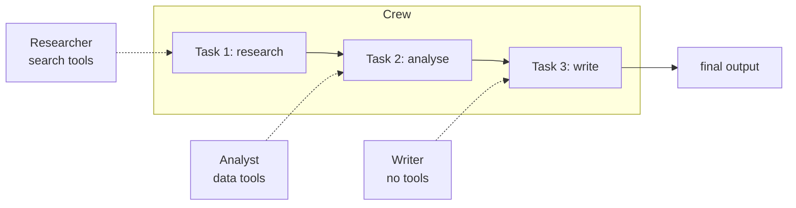

:::note In one line
**CrewAI gives agents roles and tasks.** Convenient for the shape it fits, constraining for anything else - here is how to choose.
:::

## Why this matters

CrewAI takes a different stance from LangGraph: instead of describing a state machine, you
describe a **team** — who does what, in what order, producing what. For content-generation
and research pipelines that map naturally onto human roles, it is dramatically less code. For
anything needing precise control flow, it is the wrong abstraction. Knowing which situation
you are in is the point of this lesson.

:::warning Version
Examples target **CrewAI 1.x** (`crewai==1.15.21` at the time of writing). The API has moved
substantially since the 0.x releases most tutorials use; pin your version and check the
imports before copying anything.
:::

## Mental Model

```text
LangGraph:  "here is the state machine"     nodes, edges, state, explicit transitions
CrewAI:     "here is the team"              roles, goals, tasks, a process

AGENT   a persona with a role, goal, backstory and tools
TASK    a unit of work: description, expected output, assigned agent
CREW    agents + tasks + a process that decides execution order
PROCESS sequential (fixed order) | hierarchical (a manager delegates)
```



Each task's output feeds the next. That pipeline shape is exactly what CrewAI is good at.

## Setup

```bash
uv add "crewai==1.15.21" "crewai-tools"
```

```bash title=".env"
ANTHROPIC_API_KEY=sk-ant-...
```

## Core Concepts

### Agents

```python
from crewai import Agent

researcher = Agent(
    role="Technical Research Analyst",
    goal="Find accurate, current, primary-source information about {topic}",
    backstory=(
        "You have ten years of experience in technical due diligence. You are "
        "sceptical of marketing claims, you always prefer primary sources, and you "
        "state plainly when evidence is thin rather than filling gaps with plausible "
        "assumptions."
    ),
    tools=[search_tool, fetch_tool],
    llm="anthropic/claude-opus-5",
    verbose=True,
    allow_delegation=False,        # this agent does its own work
    max_iter=8,                    # the loop cap - same idea as every other agent
)
```

Role, goal and backstory are prompt engineering with a structure. The backstory is where
behaviour gets specified: "sceptical of marketing claims" and "states plainly when evidence
is thin" are behavioural constraints that measurably change output.

### Tasks

```python
from crewai import Task

research_task = Task(
    description=(
        "Research {topic}. Find at least five credible sources published within "
        "the last 18 months. For each: the claim, the source URL, the publication "
        "date, and your confidence. Flag anything you could not verify."
    ),
    expected_output=(
        "A markdown list of 5-8 findings. Each: claim, source URL, date, "
        "confidence (high/medium/low). A final section listing unverified claims."
    ),
    agent=researcher,
    output_file="outputs/research.md",      # optional: persist the artifact
)

analysis_task = Task(
    description="Analyse the findings. Identify agreements, contradictions and gaps.",
    expected_output="A markdown analysis with sections: Consensus, Disputed, Gaps.",
    agent=analyst,
    context=[research_task],                # this task receives research_task's output
)
```

`expected_output` matters more than it looks: it is the task's contract, and vague contracts
produce vague output. "A report" gets you anything; the specification above gets you
something checkable.

### Crews and processes

```python
from crewai import Crew, Process

crew = Crew(
    agents=[researcher, analyst, writer],
    tasks=[research_task, analysis_task, writing_task],
    process=Process.sequential,       # tasks run in order, each receiving prior context
    verbose=True,
    memory=True,                      # shared memory across tasks
    max_rpm=20,                       # rate limiting across the whole crew
)

result = crew.kickoff(inputs={"topic": "vector database licensing changes in 2026"})
print(result.raw)
```

**Sequential**: tasks run in the listed order; each may receive earlier outputs via `context`.
Predictable, debuggable, and the right default.

**Hierarchical**: a manager agent decides which agent handles what, and validates results.

```python
crew = Crew(
    agents=[researcher, analyst, writer],
    tasks=[deliverable_task],
    process=Process.hierarchical,
    manager_llm="anthropic/claude-opus-5",     # required
    verbose=True,
)
```

More flexible, more expensive, less predictable — the same trade as any supervisor pattern
(Phase 15).

### Tools

```python
from crewai.tools import BaseTool
from pydantic import BaseModel, Field


class SearchInput(BaseModel):
    query: str = Field(description="the search query")
    max_results: int = Field(default=5, ge=1, le=20)


class DocumentationSearchTool(BaseTool):
    name: str = "search_documentation"
    description: str = (
        "Search internal documentation. Use this before making any claim about "
        "product behaviour. Returns passages with source references."
    )
    args_schema: type[BaseModel] = SearchInput

    def _run(self, query: str, max_results: int = 5) -> str:
        documents = retriever.invoke(query)[:max_results]
        if not documents:
            return "No matching documentation. Say so rather than guessing."
        return "\n\n".join(
            f"[{d.metadata.get('source')}] {d.page_content[:600]}" for d in documents
        )
```

Same contract as every other framework: schema, description written for the model, and your
code executes it.

### Structured output

```python
from pydantic import BaseModel


class Briefing(BaseModel):
    summary: str
    key_findings: list[str]
    risks: list[str]
    sources: list[str]
    confidence: float


writing_task = Task(
    description="Write the briefing from the analysis.",
    expected_output="A Briefing object.",
    agent=writer,
    output_pydantic=Briefing,          # validated object, not a string
    context=[analysis_task],
)

result = crew.kickoff(inputs={"topic": topic})
briefing = result.pydantic             # a Briefing instance
```

## Real-World Example

A research crew producing a sourced briefing, with guardrails and cost tracking.

```python title="src/crews/research_crew.py"
"""A three-role research crew.

Roles map to genuinely different jobs: gathering (tools, breadth), verifying
(scepticism, cross-checking) and writing (synthesis, no tools). That is the shape
CrewAI models well.
"""
from __future__ import annotations

import logging
import time
from pathlib import Path

from crewai import Agent, Crew, Process, Task
from crewai.tools import BaseTool
from pydantic import BaseModel, Field

logger = logging.getLogger(__name__)

MODEL = "anthropic/claude-opus-5"
CHEAP_MODEL = "anthropic/claude-haiku-4-5"


# --- output contracts ----------------------------------------------------------
class Finding(BaseModel):
    claim: str
    source_url: str
    published: str = Field(description="ISO date or 'unknown'")
    confidence: float = Field(ge=0.0, le=1.0)


class Briefing(BaseModel):
    """The deliverable. A schema makes the contract checkable."""
    title: str
    executive_summary: str = Field(max_length=1_200)
    findings: list[Finding]
    disputed_points: list[str] = Field(default_factory=list)
    unverified_claims: list[str] = Field(default_factory=list)
    recommendation: str = Field(max_length=600)
    overall_confidence: float = Field(ge=0.0, le=1.0)


# --- tools ------------------------------------------------------------------------
class WebSearchInput(BaseModel):
    query: str = Field(description="a specific search query, not a topic")
    max_results: int = Field(default=6, ge=1, le=10)


class WebSearchTool(BaseTool):
    name: str = "web_search"
    description: str = (
        "Search the web for current information. Use specific queries, not broad topics. "
        "Returns title, URL, date and snippet for each result. Prefer primary sources."
    )
    args_schema: type[BaseModel] = WebSearchInput

    def _run(self, query: str, max_results: int = 6) -> str:
        try:
            results = search_provider.search(query, limit=max_results)
        except Exception as exc:
            return f"Search failed: {exc}. Try a different query or report the gap."

        if not results:
            return f"No results for {query!r}. Report this as a gap rather than guessing."

        return "\n\n".join(
            f"{r['title']}\n{r['url']} ({r.get('date', 'undated')})\n{r['snippet'][:300]}"
            for r in results
        )


# --- agents --------------------------------------------------------------------------
def build_agents() -> dict[str, Agent]:
    researcher = Agent(
        role="Technical Research Analyst",
        goal="Gather accurate, current, primary-source evidence about {topic}",
        backstory=(
            "Ten years in technical due diligence. You distrust marketing claims and "
            "secondary reporting. You always record the source URL and publication date. "
            "When you cannot verify something, you say so rather than inferring."
        ),
        tools=[WebSearchTool()],
        llm=MODEL,
        max_iter=8,
        allow_delegation=False,
        verbose=True,
    )

    verifier = Agent(
        role="Fact Checker",
        goal="Identify contradictions, unsupported claims and missing evidence",
        backstory=(
            "You audit research for a regulated publisher. Your job is to be the "
            "person who finds the problem before publication. You flag any claim "
            "without a dated primary source, and you never soften a finding to be "
            "agreeable."
        ),
        tools=[WebSearchTool()],
        llm=MODEL,
        max_iter=6,
        allow_delegation=False,
        verbose=True,
    )

    writer = Agent(
        role="Technical Writer",
        goal="Produce a concise, decision-ready briefing from verified findings",
        backstory=(
            "You write for busy executives. You lead with the decision, keep the "
            "summary under 200 words, and never include a claim the fact checker "
            "flagged as unverified without labelling it as such."
        ),
        tools=[],                    # no tools: synthesis only, cannot introduce new facts
        llm=MODEL,
        max_iter=4,
        allow_delegation=False,
        verbose=True,
    )

    return {"researcher": researcher, "verifier": verifier, "writer": writer}


# --- tasks ---------------------------------------------------------------------------
def build_tasks(agents: dict[str, Agent]) -> list[Task]:
    research = Task(
        description=(
            "Research {topic}.\n"
            "Find at least 6 credible sources published within the last 18 months.\n"
            "Run at least 3 distinct searches with different phrasings.\n"
            "For each finding record: the claim, source URL, publication date, confidence.\n"
            "Explicitly list anything you could not verify."
        ),
        expected_output=(
            "A markdown list of 6-10 findings, each with claim, URL, date and "
            "confidence, followed by a 'Could not verify' section."
        ),
        agent=agents["researcher"],
        output_file="outputs/research.md",
    )

    verify = Task(
        description=(
            "Audit the research findings.\n"
            "1. Flag any claim lacking a dated primary source.\n"
            "2. Identify contradictions between sources and name both sides.\n"
            "3. Search independently to confirm the three most consequential claims.\n"
            "4. List what a decision-maker still does not know."
        ),
        expected_output=(
            "Markdown with sections: Verified, Disputed (with both sources), "
            "Unsupported, Remaining gaps."
        ),
        agent=agents["verifier"],
        context=[research],
        output_file="outputs/verification.md",
    )

    write = Task(
        description=(
            "Write the briefing using only verified findings.\n"
            "Label anything the fact checker disputed or could not verify.\n"
            "Lead with the recommendation. Keep the summary under 200 words."
        ),
        expected_output="A Briefing object with every field populated.",
        agent=agents["writer"],
        context=[research, verify],
        output_pydantic=Briefing,
        output_file="outputs/briefing.json",
    )

    return [research, verify, write]


# --- the crew ---------------------------------------------------------------------------
def build_crew(*, hierarchical: bool = False) -> Crew:
    agents = build_agents()
    tasks = build_tasks(agents)

    if hierarchical:
        return Crew(
            agents=list(agents.values()),
            tasks=[tasks[-1]],                 # the manager decomposes the deliverable
            process=Process.hierarchical,
            manager_llm=MODEL,
            verbose=True,
            max_rpm=20,
        )

    return Crew(
        agents=list(agents.values()),
        tasks=tasks,
        process=Process.sequential,
        verbose=True,
        memory=True,
        max_rpm=20,
    )


def run_research(topic: str, *, hierarchical: bool = False) -> dict:
    Path("outputs").mkdir(exist_ok=True)
    crew = build_crew(hierarchical=hierarchical)

    started = time.perf_counter()
    result = crew.kickoff(inputs={"topic": topic})
    elapsed = time.perf_counter() - started

    usage = getattr(result, "token_usage", None)
    report = {
        "topic": topic,
        "process": "hierarchical" if hierarchical else "sequential",
        "seconds": round(elapsed, 1),
        "total_tokens": getattr(usage, "total_tokens", 0),
        "briefing": result.pydantic.model_dump() if getattr(result, "pydantic", None) else None,
        "raw": result.raw[:500],
    }
    logger.info("crew finished", extra={k: v for k, v in report.items() if k != "briefing"})
    return report


if __name__ == "__main__":
    logging.basicConfig(level="INFO", format="%(levelname)s %(message)s")

    report = run_research("changes to vector database licensing in 2026")

    briefing = report["briefing"]
    print(f"\n{briefing['title']}\n")
    print(briefing["executive_summary"])
    print(f"\nfindings: {len(briefing['findings'])} · "
          f"disputed: {len(briefing['disputed_points'])} · "
          f"unverified: {len(briefing['unverified_claims'])}")
    print(f"confidence: {briefing['overall_confidence']:.2f}")
    print(f"\n{report['seconds']}s · {report['total_tokens']:,} tokens")
```

```text
INFO crew finished process=sequential seconds=84.2 total_tokens=41,208

Vector Database Licensing Changes in 2026

Two of the four major self-hosted vector databases changed licence terms in the first
half of 2026, both moving from permissive to source-available models for their
managed-service-competing features. Self-hosted single-tenant use remains unaffected
in both cases. The practical impact for internal deployments is limited; the impact
for teams reselling a managed vector service is significant...

findings: 7 · disputed: 1 · unverified: 2
confidence: 0.78

84.2s · 41,208 tokens
```

Three points worth noticing. The writer has **no tools**, so it cannot introduce facts the
research did not find. The verifier's backstory explicitly licenses it to be disagreeable,
which is what makes the "disputed" section non-empty. And `overall_confidence: 0.78` with two
unverified claims is a far more useful output than a confident essay.

## CrewAI vs LangGraph vs LangChain

| | **LangChain** | **LangGraph** | **CrewAI** |
| --- | --- | --- | --- |
| Abstraction | composable runnables | state machine | team of roles |
| Best for | chains, RAG, single agents | precise control flow, HITL | role-shaped pipelines |
| Control flow | linear composition | explicit nodes and edges | task order or a manager |
| State | passed through the chain | typed, reduced, checkpointed | task outputs and shared memory |
| Human in the loop | manual | **first class** (`interrupt`) | limited |
| Persistence | none built in | **checkpointers, threads** | basic memory |
| Debuggability | trace the chain | inspect any checkpoint | read the verbose log |
| Lines for a 3-step pipeline | ~80 | ~120 | **~50** |
| Lines for conditional retries and approval | ~200 | **~140** | awkward |
| Learning curve | moderate | steeper | gentlest |

**Decision rule:**

```text
Fixed pipeline, roles map to human jobs, no approval gates
    → CrewAI. Least code, most readable to non-engineers.

Conditional flow, retries, cycles, human approval, durable state, audit trail
    → LangGraph. The extra structure is exactly what production needs.

One model call, a chain, or RAG with no branching
    → LangChain alone. Do not add an agent framework.

A single provider, one simple flow, latency-critical
    → no framework. The Phase 14 loop is 300 lines you fully control.
```

They also compose: many production systems use LangChain for models and retrieval, LangGraph
for orchestration, and reach for CrewAI only when a content pipeline genuinely fits the crew
metaphor.

## Common Mistakes

:::mistake
```text
1. Vague expected_output
   "A report" produces anything. Specify sections, length and format.

2. Giving every agent every tool
   A writer with search tools starts researching and contradicts the researcher.
   Tool assignment IS the role boundary.

3. Hierarchical process by default
   A manager agent costs extra calls and removes predictability. Start sequential.

4. allow_delegation=True everywhere
   Agents delegate in circles. Enable it deliberately, for one coordinator.

5. No max_iter or max_rpm
   Same unbounded-loop problem as every agent framework. Cap both.

6. Backstories as flavour text
   "You are a helpful assistant" adds nothing. Encode constraints and standards.

7. Choosing CrewAI for a flow that needs approval gates
   Retrofitting human-in-the-loop onto a crew is painful. Use LangGraph.

8. Copying 0.x examples
   The 1.x API differs substantially. Pin the version and check imports.
```
:::

## Performance Considerations

- `max_rpm` on the crew is a real rate limiter across all agents — set it below your provider
  limit or the whole crew fails together.
- Sequential crews are inherently serial: three tasks at 25 s each is 75 s. Use async tasks
  (`async_execution=True`) for genuinely independent work.
- Assign a cheaper model to mechanical agents (formatting, extraction) and the strong model
  to research and synthesis; per-agent `llm` makes this a one-line change.
- `memory=True` adds retrieval calls between tasks — measure whether it helps before leaving
  it on.
- Cap `max_iter` per agent: a researcher with `max_iter=25` can spend a great deal of money
  on one task.

## Hands-on Exercise

:::exercise Build a content crew and compare it to a graph
Build a crew that produces a technical comparison document:

1. **Researcher** — gathers facts about two technologies (search tools, `max_iter=8`).
2. **Analyst** — builds a structured comparison table (no search tools; works from findings).
3. **Critic** — finds weak claims, missing criteria and bias (search tools, to verify).
4. **Writer** — produces the final document with `output_pydantic`.

Then build the *same* pipeline as a LangGraph with four nodes, and compare:

- lines of code
- total tokens and cost
- wall-clock time
- output quality on a 5-point rubric, judged blind
- effort required to add "pause for human review before publishing"

That last row is usually decisive.
:::

:::solution Reference comparison
```text
implementation   lines   tokens   cost     seconds   quality   +HITL effort
crewai              54   41,208  $0.247      84.2      4.2/5   hard (no interrupt)
langgraph          128   38,940  $0.231      79.6      4.3/5   one node, ~15 lines

Quality is indistinguishable - same models, same prompts in different wrappers. CrewAI
is 58% less code for the happy path. LangGraph wins the moment you need the approval
gate, because interrupt/resume is built in and a crew would need an external queue plus
a re-entry mechanism you write yourself.

Chosen: CrewAI for the internal, fire-and-forget weekly briefing. LangGraph for the
customer-facing version, where a human reviews before anything is sent.
```
:::

## Challenge

:::challenge Add a quality gate to a crew
CrewAI has no `interrupt()`. Build the gate yourself:

1. Split the crew at the review boundary: crew A produces a draft and exits.
2. Persist the draft plus all task outputs to a store with a review status.
3. A review UI (CLI is fine) approves, rejects with feedback, or edits.
4. Crew B resumes from the approved draft, receiving the feedback as task context.
5. Record who approved what, and when.

Then reflect: how much of LangGraph's checkpointer did you just reimplement? That exercise
is the clearest possible argument for choosing the framework whose primitives match your
requirements.
:::

## Interview Questions

:::interview
1. What are the four CrewAI primitives and how do they relate?
2. When is sequential better than hierarchical, and why?
3. Why does tool assignment define the role boundary?
4. When would you choose CrewAI over LangGraph, and vice versa?
5. How would you add human approval to a crew?
:::

## Cheat Sheet

```python
from crewai import Agent, Crew, Process, Task
from crewai.tools import BaseTool

Agent(role=..., goal=..., backstory=..., tools=[...], llm="anthropic/claude-opus-5",
      max_iter=8, allow_delegation=False, verbose=True)

Task(description=..., expected_output=..., agent=agent,
     context=[earlier_task], output_pydantic=Model, output_file="out.md",
     async_execution=False)

Crew(agents=[...], tasks=[...], process=Process.sequential | Process.hierarchical,
     manager_llm=... (hierarchical only), memory=True, max_rpm=20, verbose=True)

result = crew.kickoff(inputs={"topic": t})
result.raw · result.pydantic · result.token_usage

CHOOSE   fixed role pipeline        → CrewAI
         branching, HITL, durable   → LangGraph
         chain or RAG only          → LangChain
         one provider, simple, fast → no framework
```

```quiz
[
  {
    "question": "Why give the writer agent no tools?",
    "options": [
      "Writers do not need tools",
      "So it can only synthesise from the researcher's verified findings and cannot introduce unverified facts",
      "To reduce cost",
      "Tools are not supported for writing tasks"
    ],
    "answer": 1,
    "explanation": "Tool assignment defines the role boundary. A writer with search tools becomes a second, unverified researcher and produces claims the fact checker never saw."
  },
  {
    "question": "Your pipeline needs a human to approve the output before it is sent to a customer. Which framework?",
    "options": [
      "CrewAI with a hierarchical process",
      "LangGraph, where interrupt() and checkpointers make pause-and-resume a built-in primitive",
      "LangChain chains",
      "Any of them, equally"
    ],
    "answer": 1,
    "explanation": "CrewAI has no native interrupt; you would rebuild checkpointing and resumption yourself. Choose the framework whose primitives match your requirements."
  },
  {
    "question": "What does `expected_output` do in a CrewAI Task?",
    "options": [
      "Nothing; it is documentation",
      "It is the task's contract - a specific format specification measurably improves what the agent produces",
      "It validates the output automatically",
      "It sets the token limit"
    ],
    "answer": 1,
    "explanation": "It goes into the prompt as the deliverable specification. 'A report' yields anything; 'a markdown list of 6-10 findings with claim, URL, date and confidence' yields that."
  }
]
```

## Summary

- CrewAI models a team: agents with roles and tools, tasks with output contracts, a crew with
  a process.
- Sequential is the predictable default; hierarchical adds a manager and the usual supervisor
  costs.
- Tool assignment is the role boundary — the writer without search tools cannot invent facts.
- Choose by primitive fit: CrewAI for role pipelines, LangGraph for control flow and human
  gates, LangChain for chains, nothing for simple single-provider flows.

## Next Step

Phase 19: guardrails and AI safety — validating input and output, containing prompt injection,
and capping what an agent can do and spend.
