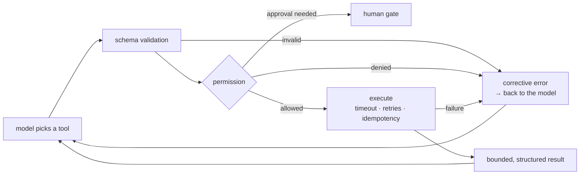

:::note In one line
**A tool is an API you expose to something that misreads instructions.** Narrow inputs, validate everything, log every call.
:::

## Why this matters

Agent quality is dominated by tool quality. A model with three well-designed tools
outperforms the same model with twenty vague ones, because every tool is a decision it has to
make correctly. Tools are also the only place an agent touches your systems — so each one is
simultaneously a usability problem and a security boundary.

## Mental Model

```text
A tool is an API whose only consumer reads documentation and never asks questions.

  NAME         a verb phrase the model can match to intent
  DESCRIPTION  the specification: what it does, when to use it, when NOT to
  SCHEMA       exact parameters, types, constraints, enums
  RESULT       structured, bounded, self-describing
  ERRORS       tell the model how to fix the call
  PERMISSION   read / write / dangerous
  LIMITS       timeout, rate limit, idempotency key
```



## Core Concepts

### Naming and granularity

```text
TOO BROAD    database_query(sql)          the model writes bad SQL; huge attack surface
TOO NARROW   get_customer_name(id)        twenty tools for one entity; the model gets lost
                                          in tool selection
RIGHT        get_customer(customer_id)    one entity, one purpose, structured result
             search_orders(customer_id, status?, since?)
```

Aim for **5–12 tools** for a single agent. Beyond that, either group them behind a router or
split into specialists (Phase 23). Name them as verb phrases — `search_orders`,
`issue_refund`, `create_ticket` — so the model can match intent to name without reasoning.

### Descriptions are specifications

```python
# Useless
@tool
def get_orders(customer_id: str) -> str:
    """Gets orders."""


# Useful
@tool
def get_orders(customer_id: str, status: str = "all", limit: int = 20) -> str:
    """Retrieve a customer's orders, newest first.

    Use this to answer questions about what a customer bought, when, and for how much.
    Do NOT use it for refund status - use get_refunds instead.

    Args:
        customer_id: internal id in the form c_NNN, e.g. c_881. Not an email address.
        status: one of all, pending, shipped, delivered, cancelled.
        limit: 1-100. Use a small limit unless the customer asks for full history.

    Returns:
        JSON: {"orders": [{"id", "date", "total", "status", "items"}], "total_count": int}
        Returns an empty list when the customer has no orders - that is not an error.
    """
```

Four things the second version supplies that the first does not: **when to use it**, **when
not to**, **the exact format of inputs**, and **what a normal empty result looks like**. The
last one prevents the agent from treating "no orders" as a failure and retrying forever.

### Schemas with real constraints

```python
from typing import Literal

from pydantic import BaseModel, Field, field_validator


class RefundInput(BaseModel):
    charge_id: str = Field(pattern=r"^ch_[a-zA-Z0-9]{6,32}$",
                           description="charge id from get_charges, e.g. ch_88a21f")
    amount: float = Field(gt=0, le=10_000,
                          description="amount in USD; must not exceed the original charge")
    reason: Literal["duplicate", "fraudulent", "requested_by_customer", "service_failure"]
    note: str = Field(max_length=500, description="one line for the audit log")

    @field_validator("amount")
    @classmethod
    def two_decimal_places(cls, value: float) -> float:
        return round(value, 2)
```

A constrained schema is a guardrail: the model cannot request a $1,000,000 refund with reason
"because" because the schema rejects it before your code runs.

### Errors that teach

```python
# Useless - the agent retries the identical call
"Error: invalid input"

# Useful - the agent can correct itself
"Error: customer_id must match c_NNN (got 'alice@corp.com'). "
"Use find_customer(email=...) first to get the id."

"Error: charge ch_88 has already been refunded on 2026-03-02 (refund rf_41). "
"No action taken. Tell the customer the refund is already processed."

"Error: amount 890.00 exceeds the original charge of 490.00. "
"Refund at most 490.00."
```

Every error message should answer: **what was wrong, what the valid form is, and what to do
next**. This single practice reduces agent failure rates more than most prompt tuning.

### Results the model can use

```python
# Bad: unbounded, unstructured
return str(database.query(...))          # 200,000 characters of repr()

# Good: bounded, structured, self-describing
return json.dumps({
    "orders": orders[:limit],
    "returned": len(orders[:limit]),
    "total_matching": total,
    "truncated": total > limit,
    "hint": "Use since= to narrow the range" if total > limit else None,
})
```

Cap every result at 2–4k characters, tell the model when you truncated, and suggest how to
narrow the query.

### Idempotency

An agent may retry. Without idempotency keys, a retry issues a second refund.

```python
def issue_refund(charge_id: str, amount: float, *, idempotency_key: str) -> dict:
    existing = refunds.find_by_key(idempotency_key)
    if existing:
        return {**existing, "idempotent_replay": True}     # same result, no second refund
    return refunds.create(charge_id, amount, key=idempotency_key)
```

Derive the key deterministically from the run and the arguments —
`f"{run_id}:{tool_name}:{hash(args)}"` — so a retry within a run replays rather than repeats.

### Timeouts, retries and circuit breaking

```python
TOOL_POLICY = {
    "search_documentation": {"timeout_s": 5,  "retries": 2, "retry_on": (TimeoutError,)},
    "get_orders":           {"timeout_s": 10, "retries": 2, "retry_on": (ConnectionError,)},
    "issue_refund":         {"timeout_s": 30, "retries": 0},      # never auto-retry a write
    "send_email":           {"timeout_s": 15, "retries": 0},
}
```

Never auto-retry a non-idempotent write. If it needs a retry, make it idempotent first.

## Real-World Example

A tool runtime with validation, permissions, idempotency, metrics and a circuit breaker.

```python title="src/tools/runtime.py"
"""Tool execution runtime.

Wraps every tool call with the things production needs and examples omit:
validation, permission checks, timeouts, idempotency, circuit breaking, result
bounding, and per-tool metrics.
"""
from __future__ import annotations

import hashlib
import json
import logging
import time
from collections import deque
from collections.abc import Callable
from dataclasses import dataclass, field
from enum import StrEnum
from typing import Any

from pydantic import BaseModel, ValidationError

logger = logging.getLogger(__name__)


class Permission(StrEnum):
    READ = "read"
    WRITE = "write"
    DANGEROUS = "dangerous"


@dataclass
class ToolPolicy:
    timeout_s: float = 10.0
    retries: int = 0
    max_result_chars: int = 3_000
    rate_limit_per_minute: int = 60
    idempotent: bool = True
    circuit_breaker_threshold: int = 5      # consecutive failures before opening
    circuit_cooldown_s: float = 60.0


@dataclass
class ToolMetrics:
    calls: int = 0
    failures: int = 0
    timeouts: int = 0
    validation_errors: int = 0
    permission_denials: int = 0
    idempotent_replays: int = 0
    latencies_ms: deque = field(default_factory=lambda: deque(maxlen=500))
    consecutive_failures: int = 0
    circuit_opened_at: float = 0.0

    @property
    def p95_ms(self) -> float:
        if not self.latencies_ms:
            return 0.0
        ordered = sorted(self.latencies_ms)
        return ordered[max(int(len(ordered) * 0.95) - 1, 0)]

    @property
    def error_rate(self) -> float:
        return self.failures / self.calls if self.calls else 0.0

    def snapshot(self) -> dict:
        return {
            "calls": self.calls, "failures": self.failures,
            "error_rate": round(self.error_rate, 3),
            "validation_errors": self.validation_errors,
            "permission_denials": self.permission_denials,
            "idempotent_replays": self.idempotent_replays,
            "p50_ms": round(sorted(self.latencies_ms)[len(self.latencies_ms) // 2])
                      if self.latencies_ms else 0,
            "p95_ms": round(self.p95_ms),
            "circuit_open": self.circuit_opened_at > 0,
        }


@dataclass
class RegisteredTool:
    name: str
    description: str
    fn: Callable[..., Any]
    input_model: type[BaseModel]
    permission: Permission = Permission.READ
    policy: ToolPolicy = field(default_factory=ToolPolicy)
    metrics: ToolMetrics = field(default_factory=ToolMetrics)

    @property
    def spec(self) -> dict:
        """What the model sees."""
        return {
            "name": self.name,
            "description": self.description,
            "input_schema": self.input_model.model_json_schema(),
        }


@dataclass(frozen=True, slots=True)
class ToolResult:
    ok: bool
    content: str
    tool: str
    duration_ms: int
    error_type: str = ""
    replayed: bool = False


class ToolRuntime:
    """Executes tools with every production safeguard applied."""

    def __init__(self, *, allowed: set[Permission] | None = None,
                 approval_callback: Callable[[str, dict], bool] | None = None) -> None:
        self._tools: dict[str, RegisteredTool] = {}
        self._allowed = allowed or {Permission.READ}
        self._approval = approval_callback
        self._idempotency: dict[str, str] = {}
        self._call_times: dict[str, deque] = {}

    def register(self, tool: RegisteredTool) -> RegisteredTool:
        self._tools[tool.name] = tool
        self._call_times[tool.name] = deque(maxlen=200)
        return tool

    def specs(self) -> list[dict]:
        """Least privilege: the model never sees tools it may not use."""
        return [t.spec for t in self._tools.values() if t.permission in self._allowed]

    def execute(self, name: str, arguments: dict, *, run_id: str = "") -> ToolResult:
        started = time.perf_counter()

        tool = self._tools.get(name)
        if tool is None:
            available = sorted(t.name for t in self._tools.values()
                               if t.permission in self._allowed)
            return ToolResult(False, f"Error: unknown tool {name!r}. Available: {available}",
                              name, 0, "unknown_tool")

        # --- circuit breaker -------------------------------------------------
        if tool.metrics.circuit_opened_at:
            if time.monotonic() - tool.metrics.circuit_opened_at < tool.policy.circuit_cooldown_s:
                return ToolResult(
                    False,
                    f"Error: {name} is temporarily unavailable after repeated failures. "
                    f"Try a different approach or report that this data is unavailable.",
                    name, 0, "circuit_open",
                )
            tool.metrics.circuit_opened_at = 0.0        # half-open: allow one trial
            tool.metrics.consecutive_failures = 0

        # --- permission ------------------------------------------------------
        if tool.permission not in self._allowed:
            tool.metrics.permission_denials += 1
            return ToolResult(False, f"Error: {name} is not permitted in this context.",
                              name, 0, "permission_denied")

        if tool.permission is Permission.DANGEROUS:
            if self._approval is None or not self._approval(name, arguments):
                tool.metrics.permission_denials += 1
                return ToolResult(
                    False,
                    f"Error: {name} was not approved. Do not retry; explain to the user "
                    f"what would have happened and what they can do instead.",
                    name, 0, "not_approved",
                )

        # --- validation ------------------------------------------------------
        try:
            validated = tool.input_model(**arguments)
        except ValidationError as exc:
            tool.metrics.validation_errors += 1
            return ToolResult(False, _teaching_error(name, exc, tool.input_model),
                              name, int((time.perf_counter() - started) * 1000),
                              "validation_error")

        # --- rate limit -------------------------------------------------------
        now = time.monotonic()
        recent = self._call_times[name]
        while recent and now - recent[0] > 60:
            recent.popleft()
        if len(recent) >= tool.policy.rate_limit_per_minute:
            return ToolResult(False,
                              f"Error: {name} rate limit reached "
                              f"({tool.policy.rate_limit_per_minute}/min). Wait or narrow "
                              f"your approach.",
                              name, 0, "rate_limited")
        recent.append(now)

        # --- idempotency -------------------------------------------------------
        key = ""
        if tool.policy.idempotent and tool.permission is not Permission.READ:
            payload = json.dumps(validated.model_dump(), sort_keys=True, default=str)
            key = hashlib.sha256(f"{run_id}:{name}:{payload}".encode()).hexdigest()[:24]
            if key in self._idempotency:
                tool.metrics.idempotent_replays += 1
                logger.info("idempotent replay", extra={"tool": name})
                return ToolResult(True, self._idempotency[key], name, 0, replayed=True)

        # --- execute with retries ------------------------------------------------
        attempts = tool.policy.retries + 1
        last_error: Exception | None = None

        for attempt in range(1, attempts + 1):
            try:
                tool.metrics.calls += 1
                result = tool.fn(**validated.model_dump())
                text = result if isinstance(result, str) else json.dumps(result, default=str)

                if len(text) > tool.policy.max_result_chars:
                    text = (text[: tool.policy.max_result_chars]
                            + f"\n\n[truncated from {len(text):,} characters. "
                              f"Narrow your query with additional filters.]")

                duration = int((time.perf_counter() - started) * 1000)
                tool.metrics.latencies_ms.append(duration)
                tool.metrics.consecutive_failures = 0
                if key:
                    self._idempotency[key] = text

                return ToolResult(True, text, name, duration)

            except TimeoutError as exc:
                last_error = exc
                tool.metrics.timeouts += 1
            except Exception as exc:
                last_error = exc
                if attempt >= attempts:
                    break
                time.sleep(0.5 * 2 ** (attempt - 1))

        # --- failure ---------------------------------------------------------------
        tool.metrics.failures += 1
        tool.metrics.consecutive_failures += 1
        if tool.metrics.consecutive_failures >= tool.policy.circuit_breaker_threshold:
            tool.metrics.circuit_opened_at = time.monotonic()
            logger.error("circuit opened for %s after %d consecutive failures",
                         name, tool.metrics.consecutive_failures)

        duration = int((time.perf_counter() - started) * 1000)
        logger.warning("tool failed", extra={"tool": name, "error": str(last_error),
                                             "attempts": attempts, "ms": duration})
        return ToolResult(
            False,
            f"Error from {name}: {type(last_error).__name__}: {last_error}. "
            f"This data source is unavailable; try another approach or say it is unavailable.",
            name, duration, type(last_error).__name__,
        )

    def metrics(self) -> dict[str, dict]:
        return {name: tool.metrics.snapshot() for name, tool in self._tools.items()
                if tool.metrics.calls}


def _teaching_error(name: str, exc: ValidationError, model: type[BaseModel]) -> str:
    """Turn a Pydantic error into something the model can act on."""
    problems = []
    for error in exc.errors()[:5]:
        field = ".".join(str(p) for p in error["loc"])
        schema = model.model_json_schema().get("properties", {}).get(field, {})
        hint = schema.get("description", "")
        problems.append(f"  - {field}: {error['msg']}" + (f" ({hint})" if hint else ""))

    return (f"Error: invalid arguments for {name}.\n" + "\n".join(problems)
            + f"\nExpected schema: {json.dumps(model.model_json_schema()['properties'])[:600]}")
```

### Registering real tools

```python title="src/tools/billing.py"
from pydantic import BaseModel, Field
from typing import Literal

from .runtime import Permission, RegisteredTool, ToolPolicy, ToolRuntime


class GetOrdersInput(BaseModel):
    customer_id: str = Field(pattern=r"^c_[a-zA-Z0-9]{3,20}$",
                             description="internal customer id such as c_881, not an email")
    status: Literal["all", "pending", "shipped", "delivered", "cancelled"] = "all"
    limit: int = Field(default=20, ge=1, le=100)


class RefundInput(BaseModel):
    charge_id: str = Field(pattern=r"^ch_[a-zA-Z0-9]{3,32}$")
    amount: float = Field(gt=0, le=10_000)
    reason: Literal["duplicate", "fraudulent", "requested_by_customer", "service_failure"]
    note: str = Field(max_length=500)


def register_billing_tools(runtime: ToolRuntime) -> None:
    runtime.register(RegisteredTool(
        name="get_orders",
        description=(
            "Retrieve a customer's orders, newest first.\n\n"
            "Use this for questions about what a customer bought, when, and for how much. "
            "Do NOT use it for refund status - use get_refunds instead.\n\n"
            "Returns JSON with an orders array and total_count. An empty array means the "
            "customer has no matching orders; that is a valid answer, not an error."
        ),
        fn=billing.get_orders,
        input_model=GetOrdersInput,
        permission=Permission.READ,
        policy=ToolPolicy(timeout_s=10, retries=2, rate_limit_per_minute=120),
    ))

    runtime.register(RegisteredTool(
        name="issue_refund",
        description=(
            "Refund a charge. IRREVERSIBLE and requires human approval.\n\n"
            "Call get_charges first to confirm the charge exists, its amount, and that it "
            "has not already been refunded. The amount may not exceed the original charge. "
            "Never call this speculatively."
        ),
        fn=billing.issue_refund,
        input_model=RefundInput,
        permission=Permission.DANGEROUS,
        policy=ToolPolicy(timeout_s=30, retries=0, idempotent=True,
                          rate_limit_per_minute=10),
    ))
```

```python
runtime.metrics()
```

```text
{
  "get_orders":    {"calls": 412, "failures": 3, "error_rate": 0.007,
                    "validation_errors": 11, "permission_denials": 0,
                    "idempotent_replays": 0, "p50_ms": 84, "p95_ms": 210,
                    "circuit_open": false},
  "search_docs":   {"calls": 388, "failures": 0, "error_rate": 0.0,
                    "validation_errors": 2, "p50_ms": 31, "p95_ms": 78,
                    "circuit_open": false},
  "issue_refund":  {"calls": 14, "failures": 0, "error_rate": 0.0,
                    "validation_errors": 0, "permission_denials": 6,
                    "idempotent_replays": 2, "p50_ms": 640, "p95_ms": 1120,
                    "circuit_open": false}
}
```

Read those numbers as product feedback. Eleven validation errors on `get_orders` means the
model keeps passing something the schema rejects — almost certainly an email instead of a
customer id, which the description should fix. Two idempotent replays means a retry would
have double-refunded someone.

## Common Mistakes

:::mistake
```text
1. Vague descriptions
   The model reads them as the spec. "Gets stuff" produces wrong calls.

2. Generic error messages
   "Invalid input" causes an identical retry. Say what was wrong and what to do.

3. Unbounded results
   200k characters of JSON destroys the context window and the budget.

4. Non-idempotent writes with retries enabled
   Double refunds, duplicate emails, repeated tickets.

5. Too many tools
   Above ~15, tool selection accuracy falls sharply. Group or split.

6. One tool that takes raw SQL or shell
   Maximum power, maximum blast radius. Prefer narrow, purposeful tools.

7. No per-tool metrics
   You cannot see that one tool fails 30% of the time.

8. No circuit breaker
   A failing dependency gets hammered by every concurrent agent run.
```
:::

## Hands-on Exercise

:::exercise Audit and improve a tool set
Take an agent you have built and, for each tool:

1. Score the description 1–5 on: what it does, when to use it, when not to, argument format,
   result shape, empty-result behaviour.
2. Check the schema: are constraints (patterns, enums, ranges) actually expressed?
3. Force ten deliberate errors and read the messages. Could the model self-correct from each?
4. Check idempotency for every write tool.
5. Add metrics and run 50 realistic scenarios.
6. Report: validation-error rate per tool, tool-selection accuracy (did it pick the right
   tool?), and mean calls per task.

Then fix the worst-scoring tool and re-run. Expect the biggest gain from the description, not
the code.
:::

:::solution Reference before/after
```text
tool              desc_score  validation_errors  selection_accuracy
get_orders (v1)          2/5              18.2%               71%
get_orders (v2)          5/5               1.4%               94%

The v1 description was "Gets orders for a customer." The v2 version added: the
customer_id format with an example, an explicit "not an email address", what an empty
result means, and a pointer to get_refunds for refund questions.

No code changed. Validation errors fell by 92% and the model stopped calling get_orders
for refund questions.
```
:::

## Challenge

:::challenge Build a tool sandbox
Some agents need to execute code. Build a safe `run_python(code)` tool:

1. Subprocess isolation with no network, a read-only filesystem and a memory cap.
2. A wall-clock timeout that kills the process group.
3. An import allowlist enforced by AST inspection before execution.
4. Output capped at 4k characters, with stdout and stderr separated.
5. A teaching error for every rejection ("import requests is not permitted; network access
   is disabled — use the provided data").

Then attack it: infinite loops, fork bombs, `os.system`, reading `/etc/passwd`, exhausting
memory, writing to disk. Document which defence stopped each attack. A code-execution tool is
the highest-risk thing an agent can hold, and building one carefully is the best possible
education in tool security.
:::

## Interview Questions

:::interview
1. What makes a tool description good?
2. Why must tool errors be returned rather than raised?
3. How do you prevent a retry from issuing a second refund?
4. How many tools is too many, and what do you do then?
5. What per-tool metrics would you put on a dashboard?
:::

## Cheat Sheet

```text
NAME          verb phrase: search_orders, issue_refund, create_ticket
DESCRIPTION   what · when to use · when NOT to · arg formats · result shape ·
              what an empty result means
SCHEMA        patterns, enums, ranges - constraints ARE guardrails
RESULT        structured JSON, capped at 2-4k chars, says when truncated
ERRORS        what was wrong + valid form + what to do next
PERMISSION    read (default) · write · dangerous (approval gate)
POLICY        timeout · retries (0 for non-idempotent writes) · rate limit ·
              idempotency key · circuit breaker
METRICS       calls · error rate · validation errors · p50/p95 · denials · replays

COUNT         5-12 tools per agent; beyond that, route or split
```

```quiz
[
  {
    "question": "Your agent calls get_orders with an email address instead of a customer id, repeatedly. Best fix?",
    "options": [
      "Add a retry loop",
      "Improve the description and schema: state the id format with an example, say 'not an email address', and return an error naming find_customer as the next step",
      "Use a larger model",
      "Remove the tool"
    ],
    "answer": 1,
    "explanation": "The model reads the description as the specification. Explicit formats, counter-examples and a teaching error typically cut validation errors by an order of magnitude."
  },
  {
    "question": "Why must a write tool never be auto-retried unless it is idempotent?",
    "options": [
      "Retries are slow",
      "A retry after a timeout can perform the action twice - two refunds, two emails, two tickets",
      "The model gets confused",
      "It violates the schema"
    ],
    "answer": 1,
    "explanation": "A timeout does not mean the operation did not happen. Make writes idempotent with a deterministic key, then retrying is safe."
  },
  {
    "question": "One tool has started failing 40% of the time. What should the runtime do?",
    "options": [
      "Keep retrying every call",
      "Open a circuit breaker after N consecutive failures, return a clear 'unavailable' observation, and let the agent adapt",
      "Crash the agent run",
      "Silently return empty results"
    ],
    "answer": 1,
    "explanation": "Hammering a failing dependency turns a partial outage into a total one. A clear unavailable message lets the agent say so, or try another route."
  }
]
```

## Summary

- Tools are APIs whose only reader is a model: descriptions are specifications and schemas
  are guardrails.
- Errors must teach — what was wrong, the valid form, and the next step.
- Bound every result, make writes idempotent, and never auto-retry a non-idempotent write.
- Enforce permissions by not exposing the tool at all; gate dangerous actions on approval.
- Per-tool metrics reveal both reliability problems and description problems.

## Next Step

Multi-agent systems: topologies, when they genuinely help, and the failure modes that are
unique to them.
