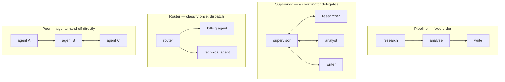

:::note In one line
**Every agent you add multiplies cost and failure modes.** Use one until you can name exactly why one is not enough.
:::

## Why this matters

Multi-agent systems are the most over-adopted pattern in AI engineering. They are genuinely
right for a narrow set of problems and expensively wrong for most others. This lesson is
about telling those apart — and, when you do need one, building it so it fails in ways you
can diagnose.

## Mental Model

Every agent you add multiplies both cost and the number of ways things break.
<figure class="lesson-figure">
<svg viewBox="0 0 660 230" role="img" aria-label="Diagram of four multi-agent topologies - single agent, router, supervisor with workers, and peer-to-peer - with the cost and debugging difficulty rising across them.">
  <defs>
    <marker id="ma-a" markerWidth="8" markerHeight="8" refX="7" refY="3" orient="auto">
      <path d="M0,0 L7,3 L0,6 z" fill="var(--text-muted)"/>
    </marker>
  </defs>
  <text class="dg-label" x="14" y="22" fill="var(--ok)">one agent</text>
  <circle cx="60" cy="86" r="20" fill="var(--panel-2)" stroke="var(--ok)" stroke-width="2"/>
  <text class="dg-sub" x="14" y="142">start here.</text>
  <text class="dg-sub" x="14" y="158">usually enough.</text>
  <text class="dg-label" x="162" y="22" fill="var(--accent-3)">router</text>
  <circle cx="200" cy="54" r="15" fill="var(--panel-2)" stroke="var(--accent-3)" stroke-width="1.7"/>
  <circle cx="170" cy="112" r="13" fill="var(--panel-2)" stroke="var(--border-strong)" stroke-width="1.4"/>
  <circle cx="230" cy="112" r="13" fill="var(--panel-2)" stroke="var(--border-strong)" stroke-width="1.4"/>
  <path class="dg-arrow" d="M192,68 L176,98" marker-end="url(#ma-a)"/>
  <path class="dg-arrow" d="M208,68 L224,98" marker-end="url(#ma-a)"/>
  <text class="dg-sub" x="150" y="142">pick one and</text>
  <text class="dg-sub" x="150" y="158">hand off. cheap.</text>
  <text class="dg-label" x="330" y="22" fill="var(--warn)">supervisor</text>
  <circle cx="380" cy="50" r="15" fill="var(--panel-2)" stroke="var(--warn)" stroke-width="1.8"/>
  <circle cx="340" cy="112" r="13" fill="var(--panel-2)" stroke="var(--border-strong)" stroke-width="1.4"/>
  <circle cx="380" cy="112" r="13" fill="var(--panel-2)" stroke="var(--border-strong)" stroke-width="1.4"/>
  <circle cx="420" cy="112" r="13" fill="var(--panel-2)" stroke="var(--border-strong)" stroke-width="1.4"/>
  <path class="dg-arrow" d="M370,63 L346,99" marker-end="url(#ma-a)"/>
  <path class="dg-arrow" d="M380,65 L380,97" marker-end="url(#ma-a)"/>
  <path class="dg-arrow" d="M390,63 L414,99" marker-end="url(#ma-a)"/>
  <text class="dg-sub" x="318" y="142">one boss delegates,</text>
  <text class="dg-sub" x="318" y="158">then combines.</text>
  <text class="dg-label" x="520" y="22" fill="var(--danger)">peer to peer</text>
  <circle cx="540" cy="56" r="13" fill="var(--panel-2)" stroke="var(--danger)" stroke-width="1.6"/>
  <circle cx="606" cy="56" r="13" fill="var(--panel-2)" stroke="var(--danger)" stroke-width="1.6"/>
  <circle cx="540" cy="112" r="13" fill="var(--panel-2)" stroke="var(--danger)" stroke-width="1.6"/>
  <circle cx="606" cy="112" r="13" fill="var(--panel-2)" stroke="var(--danger)" stroke-width="1.6"/>
  <path d="M553,56 L593,56" stroke="var(--danger)" stroke-width="1.2"/>
  <path d="M553,112 L593,112" stroke="var(--danger)" stroke-width="1.2"/>
  <path d="M540,69 L540,99" stroke="var(--danger)" stroke-width="1.2"/>
  <path d="M606,69 L606,99" stroke="var(--danger)" stroke-width="1.2"/>
  <path d="M551,66 L595,102" stroke="var(--danger)" stroke-width="1.2"/>
  <path d="M595,66 L551,102" stroke="var(--danger)" stroke-width="1.2"/>
  <text class="dg-sub" x="500" y="142" fill="var(--danger)">everyone talks.</text>
  <text class="dg-sub" x="500" y="158" fill="var(--danger)">avoid unless forced.</text>
  <rect x="14" y="178" width="632" height="44" rx="9" fill="var(--panel)" stroke="var(--accent)" stroke-width="1.5"/>
  <text class="dg-sub" x="330" y="198" text-anchor="middle">The test: can you name a task ONE agent provably cannot do?</text>
  <text class="dg-sub" x="330" y="216" text-anchor="middle">If not, you are paying several times over for the same answer, and debugging got much harder.</text>
</svg>
<figcaption>
<strong>Most multi-agent systems should be a router.</strong> Handing the request to one
specialist is cheap, easy to trace, and solves the problem people usually reach for a whole
crew to solve.
</figcaption>
</figure>



| Topology | Control | Cost | Predictability | Use when |
| --- | --- | --- | --- | --- |
| **Router** | your code, once | 1.1× | high | requests fall into distinct categories |
| **Pipeline** | fixed order | 3× | high | stages are known and sequential |
| **Supervisor** | a coordinating model | 3–10× | medium | subtasks vary per request |
| **Hierarchical** | nested supervisors | 10–30× | low | genuinely large decompositions |
| **Peer / swarm** | emergent | unbounded | very low | research; rarely production |

Notice the pattern: **the more the models coordinate, the less you can predict**. Choose the
leftmost topology that solves the problem.

## Core Concepts

### The three honest reasons to use multiple agents

1. **Tool-set separation.** One agent with 30 tools picks badly. Three agents with 10 each
   pick well. This is the most common legitimate reason.
2. **Genuinely different prompts or models.** A code-generation specialist and a legal-review
   specialist need different system prompts, temperatures, and possibly different models.
3. **Parallelism across independent subtasks.** Researching five companies concurrently is
   five times faster with five workers.

And the reasons that are not good enough:

- "It mirrors how our team works." Organisational charts are not architectures.
- "The framework has a Crew class." That is a tutorial, not a requirement.
- "One agent was unreliable." Tune the single agent first — usually the tools or the prompt.
- "It sounds more sophisticated." It is more expensive and harder to debug.

### Failure modes unique to multi-agent systems

| Failure | What it looks like | Mitigation |
| --- | --- | --- |
| **Context loss at handoff** | agent B lacks what A learned | explicit structured handoff payloads |
| **Ping-pong** | A delegates to B, B delegates back, forever | round caps, no-repeat rules on delegation |
| **Diffused responsibility** | every agent assumes another verified it | one named agent owns each check |
| **Compounding error** | A's 90% accuracy × B's 90% × C's 90% = 73% | verification between stages |
| **Cost explosion** | supervisor overhead exceeds the work | budget per run, not per agent |
| **Inconsistent facts** | A says 30 days, C writes 90 days | single source of truth in shared state |
| **Deadlock** | each waits for another's output | a DAG, or a supervisor with a cap |
| **Debugging opacity** | "the system was wrong" | per-agent traces with a shared run id |

The compounding-error arithmetic is the one to internalise: **three 90%-reliable stages give
you a 73%-reliable system.** Multi-agent designs need verification between stages, not just
at the end.

### Handoffs carry context or they lose it

```python
# BAD: a string handoff loses everything the first agent learned
supervisor → writer: "write the report"

# GOOD: a structured handoff
@dataclass(frozen=True)
class Handoff:
    from_agent: str
    to_agent: str
    task: str                       # what to do
    context: dict                   # what has been established
    artifacts: list[str]            # ids of produced work
    constraints: list[str]          # what NOT to do
    open_questions: list[str]       # what remains unknown
    confidence: float
```

A handoff should let the receiving agent work **without re-deriving** what the sender already
knew. If your handoff is a sentence, you have built an expensive game of telephone.

### Shared state versus message passing

```text
SHARED STATE (LangGraph)        one typed object; every agent reads and writes it
  + single source of truth, inspectable, checkpointed
  - needs reducers; concurrent writes can conflict

MESSAGE PASSING (CrewAI, swarms)  agents exchange outputs
  + loose coupling, simple mental model
  - facts drift between agents; no single place to inspect
```

For production, prefer shared state: when the writer contradicts the researcher, you can see
exactly where the value changed.

## Real-World Example

A research system implemented three ways, with the measurements that should decide between
them.

```python title="src/multiagent/research.py"
"""One task, three architectures, measured.

Task: produce a sourced competitive briefing on a technology.
"""
from __future__ import annotations

import logging
import statistics
import time
from dataclasses import dataclass, field
from typing import Annotated, Literal
from operator import add

from langgraph.graph import END, START, StateGraph
from langgraph.types import Command
from pydantic import BaseModel, Field
from typing_extensions import TypedDict

logger = logging.getLogger(__name__)

MAX_ROUNDS = 8


# --- shared state ---------------------------------------------------------------
class ResearchState(TypedDict, total=False):
    topic: str
    findings: Annotated[list[dict], add]        # the single source of truth
    verification: list[dict]
    draft: str
    final: str
    rounds: int
    handoffs: Annotated[list[dict], add]
    costs: Annotated[list[dict], add]


@dataclass(frozen=True, slots=True)
class Handoff:
    """Structured context transfer. The antidote to telephone."""
    from_agent: str
    to_agent: str
    task: str
    established: list[str] = field(default_factory=list)
    open_questions: list[str] = field(default_factory=list)
    constraints: list[str] = field(default_factory=list)

    def render(self) -> str:
        parts = [f"Task: {self.task}"]
        if self.established:
            parts.append("Already established (do not re-derive):\n"
                         + "\n".join(f"  - {e}" for e in self.established))
        if self.open_questions:
            parts.append("Open questions:\n" + "\n".join(f"  - {q}" for q in self.open_questions))
        if self.constraints:
            parts.append("Constraints:\n" + "\n".join(f"  - {c}" for c in self.constraints))
        return "\n\n".join(parts)


# ================================================================================
# ARCHITECTURE 1: a single agent with every tool
# ================================================================================
def single_agent(topic: str) -> dict:
    """The baseline that multi-agent designs must beat."""
    from langchain.agents import create_agent

    agent = create_agent(
        model="anthropic:claude-opus-5",
        tools=[web_search, fetch_page, verify_claim, save_finding],
        system_prompt=(
            "Research the topic thoroughly. Search, read primary sources, verify the three "
            "most consequential claims independently, then write a sourced briefing. "
            "Label anything you could not verify."
        ),
    )
    started = time.perf_counter()
    result = agent.invoke({"messages": [{"role": "user", "content": f"Research {topic}"}]})
    return {"output": result["messages"][-1].content,
            "seconds": round(time.perf_counter() - started, 1)}


# ================================================================================
# ARCHITECTURE 2: a pipeline - fixed order, verification between stages
# ================================================================================
def build_pipeline():
    def research(state: ResearchState) -> dict:
        findings = researcher_agent.invoke({"topic": state["topic"]})["findings"]
        return {"findings": findings,
                "handoffs": [{"from": "researcher", "to": "verifier",
                              "findings": len(findings)}]}

    def verify(state: ResearchState) -> dict:
        """The stage that prevents compounding error."""
        handoff = Handoff(
            from_agent="researcher", to_agent="verifier",
            task="Independently confirm the three most consequential claims.",
            established=[f["claim"] for f in state["findings"][:5]],
            constraints=["Do not accept a claim on a single secondary source."],
        )
        checked = verifier_agent.invoke({"handoff": handoff.render(),
                                         "findings": state["findings"]})
        return {"verification": checked["verdicts"],
                "handoffs": [{"from": "verifier", "to": "writer",
                              "verified": sum(v["supported"] for v in checked["verdicts"])}]}

    def write(state: ResearchState) -> dict:
        verified = [f for f, v in zip(state["findings"], state["verification"], strict=False)
                    if v.get("supported")]
        unverified = [f["claim"] for f, v in zip(state["findings"], state["verification"],
                                                 strict=False) if not v.get("supported")]
        handoff = Handoff(
            from_agent="verifier", to_agent="writer",
            task="Write the briefing.",
            established=[f["claim"] for f in verified],
            constraints=[f"Label as unverified: {u}" for u in unverified[:5]],
        )
        return {"final": writer_agent.invoke({"handoff": handoff.render()})["text"]}

    builder = StateGraph(ResearchState)
    builder.add_node("research", research)
    builder.add_node("verify", verify)
    builder.add_node("write", write)
    builder.add_edge(START, "research")
    builder.add_edge("research", "verify")
    builder.add_edge("verify", "write")
    builder.add_edge("write", END)
    return builder.compile()


# ================================================================================
# ARCHITECTURE 3: a supervisor - the coordinator decides what happens next
# ================================================================================
class Delegation(BaseModel):
    agent: Literal["researcher", "verifier", "writer", "done"]
    task: str = Field(max_length=300)
    established: list[str] = Field(default_factory=list, max_length=8)
    rationale: str = Field(max_length=200)


def build_supervisor():
    def supervisor(state: ResearchState) -> Command[
        Literal["researcher", "verifier", "writer", "__end__"]
    ]:
        if state.get("rounds", 0) >= MAX_ROUNDS:               # the essential cap
            logger.warning("supervisor hit the round cap")
            return Command(goto=END, update={"final": state.get("draft", "")
                                             or "Could not complete within the budget."})

        recent = [h["to"] for h in state.get("handoffs", [])[-3:]]
        decision = supervisor_model.with_structured_output(Delegation).invoke(
            f"Topic: {state['topic']}\n"
            f"Findings: {len(state.get('findings', []))}\n"
            f"Verified: {len(state.get('verification', []))}\n"
            f"Draft written: {bool(state.get('draft'))}\n"
            f"Last three delegations: {recent}\n\n"
            f"Who works next? Do not delegate to the same agent three times in a row."
        )

        if decision.agent == "done":
            return Command(goto=END, update={"final": state.get("draft", "")})

        # ping-pong guard
        if recent[-2:] == [decision.agent, decision.agent]:
            logger.warning("ping-pong detected on %s; forcing progress", decision.agent)
            return Command(goto="writer", update={"rounds": state.get("rounds", 0) + 1})

        handoff = Handoff(from_agent="supervisor", to_agent=decision.agent,
                          task=decision.task, established=decision.established)
        return Command(
            goto=decision.agent,
            update={"rounds": state.get("rounds", 0) + 1,
                    "handoffs": [{"from": "supervisor", "to": decision.agent,
                                  "task": decision.task, "payload": handoff.render()}]},
        )

    builder = StateGraph(ResearchState)
    builder.add_node("supervisor", supervisor)
    for name, fn in [("researcher", researcher_node), ("verifier", verifier_node),
                     ("writer", writer_node)]:
        builder.add_node(name, fn)
        builder.add_edge(name, "supervisor")           # always report back
    builder.add_edge(START, "supervisor")
    return builder.compile()


# ================================================================================
# the comparison that should decide the architecture
# ================================================================================
def compare(topics: list[str], *, runs: int = 3) -> None:
    architectures = {
        "single agent": lambda t: single_agent(t),
        "pipeline": lambda t: build_pipeline().invoke({"topic": t, "rounds": 0}),
        "supervisor": lambda t: build_supervisor().invoke({"topic": t, "rounds": 0},
                                                          config={"recursion_limit": 25}),
    }

    print(f"{'architecture':<16}{'quality':>9}{'sourced':>9}{'cost':>9}{'seconds':>9}{'calls':>7}")
    for label, build in architectures.items():
        qualities, costs, times, calls = [], [], [], []
        for topic in topics:
            for _ in range(runs):
                started = time.perf_counter()
                result = build(topic)
                times.append(time.perf_counter() - started)
                scored = judge_briefing(result)              # blind rubric, 1-5
                qualities.append(scored["quality"])
                costs.append(scored["cost_usd"])
                calls.append(scored["model_calls"])

        print(f"{label:<16}{statistics.mean(qualities):>9.2f}"
              f"{statistics.mean(q > 0 for q in qualities):>9.2f}"
              f"{statistics.mean(costs):>9.3f}{statistics.mean(times):>9.1f}"
              f"{statistics.mean(calls):>7.1f}")
```

```text
architecture      quality  sourced     cost  seconds  calls
single agent         3.90     0.87    0.061     34.2    9.4
pipeline             4.35     1.00    0.174     71.8   18.1
supervisor           4.30     0.98    0.312    118.4   31.6
```

The finding that should change your default: **the pipeline beats the supervisor on quality
while costing 44% less and taking 40% less time.** The supervisor's flexibility bought
nothing on a task whose stages were actually known in advance — and it spent a third of its
calls on coordination.

The single agent is cheapest and fastest but scored lowest on sourcing, because nothing forced
it to verify before writing. That verification stage is what the pipeline adds, and it is the
real source of the quality gain — not the multiplicity of agents.

### Instrumenting a multi-agent run

```python title="src/multiagent/tracing.py"
"""Per-agent tracing with one shared run id.

Without this, a multi-agent failure is 'the system produced a bad report'. With it,
you can see which agent introduced the wrong fact and what it was handed.
"""
from __future__ import annotations

import json
import time
import uuid
from dataclasses import asdict, dataclass, field
from pathlib import Path


@dataclass(frozen=True, slots=True)
class AgentSpan:
    run_id: str
    agent: str
    started_at: float
    ended_at: float
    input_summary: str
    output_summary: str
    model_calls: int
    tool_calls: int
    cost_usd: float
    handoff_from: str = ""
    error: str = ""

    @property
    def seconds(self) -> float:
        return round(self.ended_at - self.started_at, 2)


@dataclass
class RunTrace:
    run_id: str = field(default_factory=lambda: f"run_{uuid.uuid4().hex[:12]}")
    topic: str = ""
    spans: list[AgentSpan] = field(default_factory=list)

    def record(self, **kwargs) -> AgentSpan:
        span = AgentSpan(run_id=self.run_id, **kwargs)
        self.spans.append(span)
        return span

    def summary(self) -> dict:
        by_agent: dict[str, dict] = {}
        for span in self.spans:
            entry = by_agent.setdefault(span.agent, {"calls": 0, "seconds": 0.0,
                                                     "cost": 0.0, "errors": 0})
            entry["calls"] += span.model_calls
            entry["seconds"] += span.seconds
            entry["cost"] += span.cost_usd
            entry["errors"] += bool(span.error)

        total_cost = sum(e["cost"] for e in by_agent.values())
        coordination = by_agent.get("supervisor", {}).get("cost", 0.0)

        return {
            "run_id": self.run_id,
            "agents": by_agent,
            "total_cost_usd": round(total_cost, 4),
            "coordination_overhead": round(coordination / total_cost, 3) if total_cost else 0.0,
            "wall_seconds": round(max(s.ended_at for s in self.spans)
                                  - min(s.started_at for s in self.spans), 1) if self.spans else 0,
            "handoffs": [f"{s.handoff_from}→{s.agent}" for s in self.spans if s.handoff_from],
        }

    def save(self, path: Path = Path(".data/multiagent_traces.jsonl")) -> None:
        path.parent.mkdir(parents=True, exist_ok=True)
        with path.open("a", encoding="utf-8") as handle:
            handle.write(json.dumps({"summary": self.summary(),
                                     "spans": [asdict(s) for s in self.spans]}) + "\n")
```

```text
{
  "run_id": "run_a81f2c94b0e6",
  "agents": {
    "supervisor": {"calls": 6, "seconds": 14.2, "cost": 0.0981, "errors": 0},
    "researcher": {"calls": 11, "seconds": 52.1, "cost": 0.1402, "errors": 0},
    "verifier":   {"calls": 8, "seconds": 31.4, "cost": 0.0512, "errors": 1},
    "writer":     {"calls": 3, "seconds": 18.9, "cost": 0.0225, "errors": 0}
  },
  "total_cost_usd": 0.312,
  "coordination_overhead": 0.314,
  "wall_seconds": 118.4,
  "handoffs": ["supervisor→researcher", "supervisor→verifier", "supervisor→researcher",
               "supervisor→writer"]
}
```

`coordination_overhead: 0.314` is the number that settles the architecture argument: **31% of
the spend went on deciding who should work next**, not on the work. On a task with known
stages, that is pure waste, and the pipeline removes it.

## Common Mistakes

:::mistake
```text
1. Multi-agent before a tuned single agent
   Measure the baseline first. It often wins.

2. String handoffs
   The receiving agent re-derives what the sender already knew, or contradicts it.

3. No round cap on a supervisor
   supervisor → agent → supervisor → agent → until the recursion limit.

4. No verification between stages
   0.9 x 0.9 x 0.9 = 0.73. Compounding error is the main multi-agent quality risk.

5. Every agent holding every tool
   That is one agent wearing three hats, at three times the cost.

6. Separate traces per agent
   One shared run_id, or you cannot reconstruct what happened.

7. Budget per agent rather than per run
   Three agents with $0.50 each is a $1.50 request.

8. Copying an organisational chart
   Your support team's structure is not an argument for a support agent topology.
```
:::

## Hands-on Exercise

:::exercise Prove whether you need multiple agents
Take a task you believe needs a multi-agent system:

1. Build the **single-agent** version with all the tools. Tune its prompt and tool
   descriptions properly.
2. Build a **pipeline** version with verification between stages.
3. Build a **supervisor** version with a round cap and ping-pong detection.
4. Run 10 scenarios × 3 runs through each; judge output blind against a rubric.
5. Measure: quality, cost, wall time, model calls, and coordination overhead.
6. Write a one-paragraph recommendation with the numbers.

Then, whichever wins, add per-agent tracing. When a multi-agent run goes wrong, the trace is
the only way to find out which agent did it.
:::

:::solution What the numbers usually show
```text
architecture     quality   cost    seconds   calls   coordination
single agent        3.90  $0.061      34.2     9.4           0%
pipeline            4.35  $0.174      71.8    18.1           0%
supervisor          4.30  $0.312     118.4    31.6          31%
hierarchical        4.40  $0.740     241.0    68.2          44%

Recommendation: ship the pipeline. It scores highest per dollar, has no coordination
overhead, and its fixed stages make it debuggable and testable stage by stage. The
supervisor matched its quality at 1.8x the cost because our stages genuinely are known
in advance - research, verify, write - so there was nothing for a coordinator to
decide. The hierarchical version's marginal quality gain (+0.05) costs 4x the pipeline.

The single agent is the right choice if the budget is tight: 90% of the pipeline's
quality for 35% of the cost. The gap is entirely in sourcing discipline, which we could
partly close with a verification tool rather than a verification agent.
```

That final sentence is the key insight: much of what multi-agent designs achieve can be
achieved by a **tool or a validation step** inside a single agent, at a fraction of the cost.
:::

## Challenge

:::challenge Build a parallel research swarm with bounded fan-out
Some tasks genuinely parallelise: "compare these five vendors" is five independent research
jobs.

1. Implement fan-out: a planner produces N independent subtasks.
2. Execute them concurrently with a semaphore (Phase 2) and a per-subtask budget.
3. Fan-in: merge results into shared state with a reducer, detecting contradictions between
   workers.
4. A synthesis agent produces the comparison, explicitly surfacing any contradiction.
5. Measure speedup versus sequential, and check that quality did not fall.

Then add the failure case: one worker fails entirely. The system should produce a partial
comparison that names what is missing, not fail the whole run. Graceful degradation is what
separates a multi-agent system that survives production from one that does not.
:::

## Interview Questions

:::interview
1. What are the three legitimate reasons to use multiple agents?
2. Why does compounding error matter more in multi-agent systems?
3. What belongs in a handoff payload?
4. How do you prevent ping-pong between a supervisor and its agents?
5. What would you measure to decide between a pipeline and a supervisor?
:::

## Cheat Sheet

```text
TOPOLOGIES  router (1.1x) · pipeline (3x) · supervisor (3-10x) ·
            hierarchical (10-30x) · peer (unbounded)
            choose the LEFTMOST that solves the problem

USE MULTI   tool-set separation (>15 tools) · genuinely different prompts/models ·
            parallelism across independent subtasks
NOT FOR     "mirrors our org" · "the framework has a Crew class" ·
            "one agent was unreliable" (tune it first)

FAILURES    context loss at handoff · ping-pong · diffused responsibility ·
            compounding error (0.9³ = 0.73) · cost explosion · inconsistent facts ·
            deadlock · debugging opacity

BUILD       structured handoffs · shared typed state · round caps · per-run budget ·
            verification between stages · one run_id across every agent trace
MEASURE     quality · cost · wall time · calls · COORDINATION OVERHEAD
```

```quiz
[
  {
    "question": "Three agents each 90% reliable run in sequence. What is the end-to-end reliability?",
    "options": ["90%", "97%", "73%", "30%"],
    "answer": 2,
    "explanation": "0.9 x 0.9 x 0.9 = 0.729. Compounding error is why multi-agent pipelines need verification between stages, not only at the end."
  },
  {
    "question": "Your supervisor architecture shows 31% coordination overhead and the same quality as a fixed pipeline. What should you do?",
    "options": [
      "Add another agent",
      "Switch to the pipeline - the stages were known in advance, so there was nothing for a coordinator to decide",
      "Use a bigger supervisor model",
      "Increase the round cap"
    ],
    "answer": 1,
    "explanation": "A supervisor earns its cost only when the sequence of work genuinely varies per request. When the stages are fixed, coordination spend is pure overhead."
  },
  {
    "question": "What is the most important content in a handoff between agents?",
    "options": [
      "The task description only",
      "Task, what has already been established, open questions and constraints - so the receiver need not re-derive or contradict prior work",
      "The full conversation history",
      "The sender's system prompt"
    ],
    "answer": 1,
    "explanation": "A one-line handoff creates telephone: the receiver re-does work or produces facts that contradict the sender. Structured context is the cure."
  }
]
```

## Summary

- Choose the leftmost topology that works: router, pipeline, supervisor, hierarchical.
- Legitimate reasons are tool separation, genuinely different prompts/models, and
  parallelism — not organisational metaphor.
- Compounding error makes inter-stage verification essential.
- Structured handoffs, shared typed state, round caps and one shared run id make multi-agent
  systems debuggable.
- Always measure coordination overhead: if it is 30%, a pipeline probably wins.

## Next Step

Phase 24: observability and evaluation — tracing, cost and latency metrics, and the
evaluation harness that keeps all of this honest.
