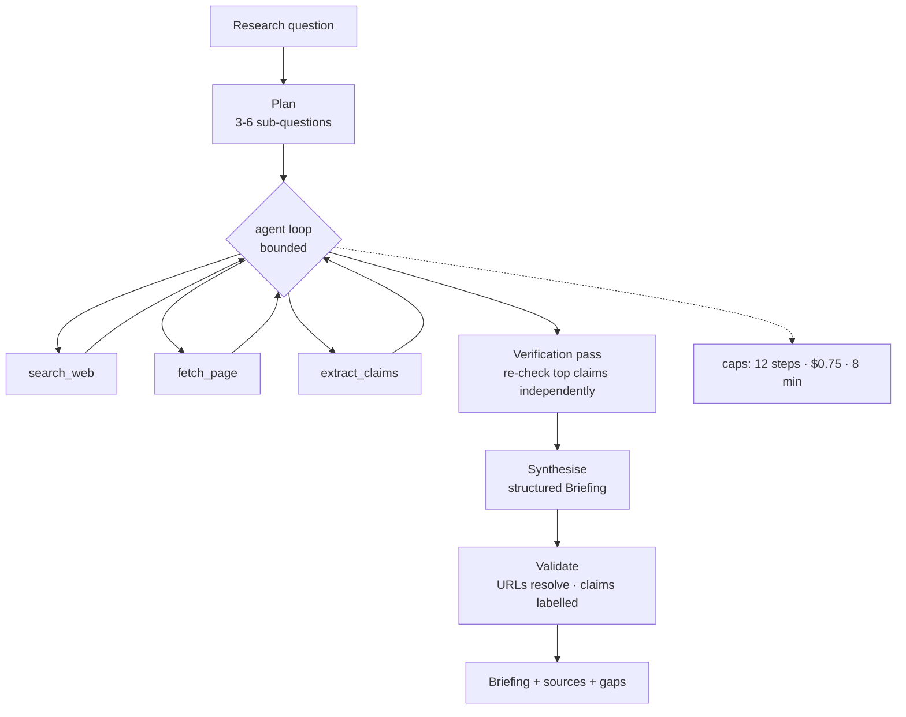

## Problem statement

> Analysts spend two days producing a briefing on a technology, vendor or market question.
> Build an agent that produces a **sourced, verified first draft in ten minutes** — good
> enough that the analyst edits rather than starts over, and honest enough that they trust
> the citations.

The honesty requirement is the hard part. A confident, well-formatted, partly-fabricated
briefing is worse than nothing, because it costs more to check than to write.

## Requirements

**Functional**

1. Accept a research question and produce a structured briefing.
2. Search the web, fetch and read primary sources.
3. Extract claims with source, date and confidence.
4. **Independently verify** the most consequential claims.
5. Explicitly label anything unverified or disputed.
6. Return a structured object, not prose, so downstream tools can use it.

**Non-functional**

| Requirement | Target |
| --- | --- |
| Wall time | < 10 minutes |
| Cost | < $0.75 per briefing |
| Source accuracy | 100% of cited URLs exist and support the claim |
| Unverified labelling | 100% — nothing unverified presented as fact |
| Determinism | same question twice → substantially overlapping sources |
| Failure mode | a partial briefing that names its gaps, never a fabricated one |

## Architecture



The **verification pass is separate from the research loop** and uses different queries. An
agent asked to "verify" inside the same loop tends to re-read the source it already used.

## Technology choices

| Component | Choice | Why |
| --- | --- | --- |
| Agent | LangChain `create_agent` | tested loop, middleware, streaming |
| Model | `claude-opus-5` | synthesis quality; `haiku` for extraction |
| Search | a search API (Tavily, Brave, SerpAPI) | agent-friendly results with snippets |
| Fetch | `httpx` + `trafilatura` | readable text without the boilerplate |
| Output | Pydantic `Briefing` | structured, validatable, storable |
| Caching | Redis | identical searches within a run cost nothing twice |

## Project structure

```text
research-agent/
├── src/research/
│   ├── config.py
│   ├── models.py           Claim, Source, Briefing
│   ├── tools/
│   │   ├── search.py       search_web with domain quality scoring
│   │   ├── fetch.py        fetch_page with size and time caps
│   │   └── extract.py      extract_claims (structured output)
│   ├── agent.py            the bounded research loop
│   ├── verify.py           the independent verification pass
│   ├── synthesise.py       claims → Briefing
│   └── cli.py
├── evals/
│   ├── questions.jsonl     30 research questions with known-good facts
│   └── run.py
└── tests/
```

## Implementation

### The output contract

```python title="src/research/models.py"
"""The briefing schema IS the specification. Everything else serves it."""
from __future__ import annotations

from datetime import date
from typing import Literal

from pydantic import BaseModel, Field, HttpUrl, field_validator


class Source(BaseModel):
    url: HttpUrl
    title: str = Field(max_length=300)
    published: date | None = None
    domain_quality: Literal["primary", "reputable", "unknown", "low"] = "unknown"
    fetched_at: str

    @property
    def is_citable(self) -> bool:
        return self.domain_quality in {"primary", "reputable"}


class Claim(BaseModel):
    statement: str = Field(max_length=400, description="one verifiable assertion")
    source_urls: list[HttpUrl] = Field(min_length=1)
    confidence: float = Field(ge=0.0, le=1.0)
    verification: Literal["verified", "single_source", "disputed", "unverified"] = "unverified"
    verification_note: str = Field(default="", max_length=300)

    @field_validator("statement")
    @classmethod
    def must_be_specific(cls, value: str) -> str:
        vague = ("many experts", "it is widely believed", "some say", "reportedly")
        if any(phrase in value.lower() for phrase in vague):
            raise ValueError(f"claim is too vague to verify: {value[:80]}")
        return value


class Briefing(BaseModel):
    """The deliverable. Every field exists because an analyst asked for it."""

    question: str
    executive_summary: str = Field(max_length=1_200)
    claims: list[Claim] = Field(min_length=1)
    disputed: list[str] = Field(default_factory=list,
                                description="points where sources disagree, both cited")
    gaps: list[str] = Field(default_factory=list,
                            description="what a decision-maker still does not know")
    sources: list[Source]
    overall_confidence: float = Field(ge=0.0, le=1.0)
    generated_at: str
    cost_usd: float = 0.0
    steps: int = 0

    @property
    def verified_share(self) -> float:
        if not self.claims:
            return 0.0
        return sum(c.verification == "verified" for c in self.claims) / len(self.claims)

    def to_markdown(self) -> str:
        lines = [f"# {self.question}", "", self.executive_summary, "", "## Findings", ""]
        for i, claim in enumerate(self.claims, 1):
            marker = {"verified": "✓", "single_source": "~", "disputed": "!",
                      "unverified": "?"}[claim.verification]
            lines.append(f"{i}. {marker} {claim.statement}")
            lines.append(f"   sources: {', '.join(str(u) for u in claim.source_urls)}")
            if claim.verification_note:
                lines.append(f"   note: {claim.verification_note}")
        if self.disputed:
            lines += ["", "## Disputed", *[f"- {d}" for d in self.disputed]]
        if self.gaps:
            lines += ["", "## Still unknown", *[f"- {g}" for g in self.gaps]]
        lines += ["", f"_confidence {self.overall_confidence:.0%} · "
                      f"{self.verified_share:.0%} of claims independently verified · "
                      f"{self.steps} steps · ${self.cost_usd:.3f}_"]
        return "\n".join(lines)
```

### Tools with source-quality awareness

```python title="src/research/tools/search.py"
"""Search with domain quality scoring.

An agent that treats a vendor blog and a standards body as equally authoritative
produces confident nonsense. Quality scoring is the cheapest correction.
"""
from __future__ import annotations

import logging
from urllib.parse import urlparse

from langchain.tools import tool
from pydantic import BaseModel, Field

logger = logging.getLogger(__name__)

PRIMARY_DOMAINS = {"arxiv.org", "github.com", "ietf.org", "w3.org", "nist.gov",
                   "europa.eu", "gov.uk", "iso.org"}
REPUTABLE_DOMAINS = {"reuters.com", "apnews.com", "ft.com", "economist.com",
                     "nature.com", "acm.org", "ieee.org"}
LOW_QUALITY_MARKERS = ("listicle", "top-10", "best-of", "sponsored", "affiliate")


def domain_quality(url: str) -> str:
    host = (urlparse(url).hostname or "").removeprefix("www.")
    if host in PRIMARY_DOMAINS or host.endswith((".gov", ".edu")):
        return "primary"
    if host in REPUTABLE_DOMAINS:
        return "reputable"
    if any(marker in url.lower() for marker in LOW_QUALITY_MARKERS):
        return "low"
    return "unknown"


@tool
def search_web(query: str, max_results: int = 6, recency_days: int = 0) -> str:
    """Search the web for information.

    Use SPECIFIC queries, not broad topics: "Qdrant licence change 2026" rather than
    "vector databases". Run several searches with different phrasings rather than one
    broad one.

    Args:
        query: a specific search query.
        max_results: 1-10 results to return.
        recency_days: if > 0, restrict to results from the last N days.

    Returns:
        JSON list of {title, url, snippet, published, quality}. Quality is one of
        primary, reputable, unknown, low - prefer primary and reputable sources.
        An empty list means no results; report that as a gap rather than guessing.
    """
    import json

    try:
        results = search_provider.search(query, limit=min(max_results, 10),
                                         days=recency_days or None)
    except Exception as exc:
        return f"Error: search failed ({exc}). Try a different query or report the gap."

    if not results:
        return json.dumps({"results": [],
                           "hint": f"No results for {query!r}. Try broader terms or "
                                   f"report this as a gap."})

    scored = [
        {"title": r["title"], "url": r["url"], "snippet": r["snippet"][:300],
         "published": r.get("date", "unknown"), "quality": domain_quality(r["url"])}
        for r in results
    ]
    scored.sort(key=lambda r: {"primary": 0, "reputable": 1, "unknown": 2, "low": 3}[r["quality"]])
    return json.dumps({"results": scored, "count": len(scored)})
```

```python title="src/research/tools/fetch.py"
@tool
def fetch_page(url: str, max_chars: int = 6_000) -> str:
    """Fetch and extract the readable text of a web page.

    Use this after search_web when a snippet is not enough to establish a claim.
    Do not fetch the same URL twice - the result is cached within a run.

    Args:
        url: the full URL from a search result.
        max_chars: 1000-12000 characters to return.

    Returns:
        Extracted article text, or an error explaining why it could not be read
        (paywall, robots.txt, timeout, not HTML).
    """
    import httpx
    import trafilatura

    if not url.startswith(("http://", "https://")):
        return f"Error: {url!r} is not a valid URL."

    try:
        with httpx.Client(timeout=10.0, follow_redirects=True,
                          headers={"user-agent": "ResearchAgent/1.0"}) as client:
            response = client.get(url)

        if response.status_code == 403:
            return f"Error: {url} refused access (403). Find the information elsewhere."
        if response.status_code != 200:
            return f"Error: {url} returned {response.status_code}."
        if "text/html" not in response.headers.get("content-type", ""):
            return f"Error: {url} is not an HTML page."

        text = trafilatura.extract(response.text, include_comments=False,
                                   include_tables=True) or ""
    except httpx.TimeoutException:
        return f"Error: {url} timed out after 10s. Try another source."
    except Exception as exc:
        return f"Error fetching {url}: {type(exc).__name__}."

    if len(text) < 200:
        return (f"Error: could not extract readable text from {url} "
                f"(likely JavaScript-rendered or a paywall).")

    truncated = text[:max_chars]
    return (truncated + f"\n\n[truncated from {len(text):,} characters]"
            if len(text) > max_chars else truncated)
```

### The bounded research loop

```python title="src/research/agent.py"
"""The research agent: plan, search, read, extract - with hard caps."""
from __future__ import annotations

import logging
import time
from dataclasses import dataclass, field

from langchain.agents import create_agent
from pydantic import BaseModel, Field

from .tools.extract import extract_claims
from .tools.fetch import fetch_page
from .tools.search import search_web

logger = logging.getLogger(__name__)


class ResearchPlan(BaseModel):
    sub_questions: list[str] = Field(min_length=2, max_length=6)
    key_terms: list[str] = Field(default_factory=list)
    likely_sources: list[str] = Field(default_factory=list)


RESEARCH_SYSTEM = """\
You are a research analyst gathering evidence for a briefing.

Method:
1. Search with specific queries. Run at least three searches with different phrasings.
2. Prefer primary and reputable sources. Treat vendor blogs and listicles as weak evidence.
3. Fetch a page only when the snippet is insufficient. Never fetch the same URL twice.
4. Record the URL and publication date for every claim.
5. Note explicitly when sources disagree, and when you could not verify something.

Never state a fact you did not find in a source. An honest gap is more useful than a
confident guess. Stop once you have enough evidence for the sub-questions.

Sub-questions:
{sub_questions}
"""


@dataclass
class ResearchAgent:
    model: str = "anthropic:claude-opus-5"
    max_steps: int = 12
    max_cost_usd: float = 0.75
    max_seconds: float = 480.0
    spent: float = 0.0

    def plan(self, question: str) -> ResearchPlan:
        planner = init_chat_model("anthropic:claude-haiku-4-5").with_structured_output(ResearchPlan)
        return planner.invoke(
            f"Break this research question into 3-5 specific sub-questions that could each "
            f"be answered by a search:\n\n{question}"
        )

    def research(self, question: str) -> dict:
        plan = self.plan(question)
        logger.info("plan", extra={"sub_questions": plan.sub_questions})

        agent = create_agent(
            model=self.model,
            tools=[search_web, fetch_page, extract_claims],
            system_prompt=RESEARCH_SYSTEM.format(
                sub_questions="\n".join(f"- {q}" for q in plan.sub_questions)
            ),
            middleware=[BudgetMiddleware(max_usd=self.max_cost_usd, max_steps=self.max_steps)],
        )

        started = time.perf_counter()
        result = agent.invoke({"messages": [{"role": "user", "content": question}]})
        elapsed = time.perf_counter() - started

        transcript = result["messages"]
        tool_calls = [m for m in transcript if getattr(m, "tool_calls", None)]

        return {
            "plan": plan.model_dump(),
            "raw_findings": transcript[-1].content,
            "sources_visited": _urls_from(transcript),
            "steps": len(tool_calls),
            "seconds": round(elapsed, 1),
            "truncated": elapsed > self.max_seconds,
        }
```

### The separate verification pass

```python title="src/research/verify.py"
"""Verification with fresh queries - the step that makes the briefing trustworthy."""
from __future__ import annotations

import logging
from dataclasses import dataclass

from pydantic import BaseModel, Field

from .models import Claim
from .tools.search import search_web

logger = logging.getLogger(__name__)


class VerificationVerdict(BaseModel):
    claim: str
    status: str = Field(description="verified | single_source | disputed | unverified")
    supporting_urls: list[str] = Field(default_factory=list)
    contradicting_urls: list[str] = Field(default_factory=list)
    note: str = Field(default="", max_length=300)


VERIFY_SYSTEM = """\
You independently check one claim.

Method:
- Search with terms DIFFERENT from those that produced the claim. Do not simply re-find
  the original source.
- verified: two or more independent sources support it
- single_source: only the original source supports it
- disputed: a credible source contradicts it - cite both sides
- unverified: you could not find support either way

Judging the evidence is the whole task. Do not assume the claim is true because it is
plausible."""


@dataclass
class Verifier:
    model: str = "anthropic:claude-opus-5"
    max_claims: int = 5              # verify the most consequential ones, not all

    def verify(self, claims: list[Claim]) -> list[Claim]:
        ranked = sorted(claims, key=lambda c: c.confidence)[: self.max_claims]
        verified: list[Claim] = []

        agent = create_agent(model=self.model, tools=[search_web],
                            system_prompt=VERIFY_SYSTEM,
                            response_format=VerificationVerdict)

        for claim in claims:
            if claim not in ranked:
                verified.append(claim)          # left as-is, honestly labelled
                continue

            result = agent.invoke({"messages": [
                {"role": "user", "content": f"Check this claim: {claim.statement}\n"
                                            f"Original sources: {claim.source_urls}"}
            ]})
            verdict = result["structured_response"]

            verified.append(claim.model_copy(update={
                "verification": verdict.status,
                "verification_note": verdict.note,
                "source_urls": list({*claim.source_urls, *verdict.supporting_urls}),
                "confidence": {"verified": 0.9, "single_source": 0.6,
                               "disputed": 0.4, "unverified": 0.3}[verdict.status],
            }))
            logger.info("verified claim", extra={"status": verdict.status})

        return verified
```

### Final validation before delivery

```python title="src/research/validate.py"
"""The guardrail: nothing unverified may be presented as fact."""
from __future__ import annotations

import httpx

from .models import Briefing


def validate_briefing(briefing: Briefing, *, check_urls: bool = True) -> list[str]:
    problems: list[str] = []

    cited = {str(url) for claim in briefing.claims for url in claim.source_urls}
    listed = {str(source.url) for source in briefing.sources}
    if missing := cited - listed:
        problems.append(f"claims cite URLs absent from the source list: {sorted(missing)[:3]}")

    for claim in briefing.claims:
        if claim.verification in {"unverified", "disputed"} and claim.confidence > 0.6:
            problems.append(f"unverified claim with high confidence: {claim.statement[:80]}")

    if briefing.verified_share < 0.3 and briefing.overall_confidence > 0.7:
        problems.append(f"only {briefing.verified_share:.0%} of claims verified but "
                        f"overall confidence is {briefing.overall_confidence:.0%}")

    if check_urls:
        with httpx.Client(timeout=5.0, follow_redirects=True) as client:
            for source in briefing.sources[:20]:
                try:
                    if client.head(str(source.url)).status_code >= 400:
                        problems.append(f"cited URL does not resolve: {source.url}")
                except Exception:
                    problems.append(f"cited URL unreachable: {source.url}")

    return problems
```

The URL resolution check is unglamorous and catches the most damaging failure: a fabricated
source that looks entirely plausible.

## Evaluation

```python title="evals/run.py"
"""Research agents are evaluated on sourcing discipline, not eloquence."""

QUESTIONS = [
    {"id": "q1", "question": "What changed in EU AI Act obligations for general-purpose "
                             "models in 2026?",
     "must_mention": ["general-purpose", "obligation"],
     "known_facts": ["transparency requirements"],
     "must_cite_domains": ["europa.eu"]},
    {"id": "q2", "question": "Which vector databases changed their licence in 2026?",
     "must_mention": [], "known_facts": [], "expect_gaps": True},
    # 30 questions, including 5 with no good public answer
]


def score(briefing: Briefing, case: dict) -> dict:
    text = briefing.to_markdown().lower()
    return {
        "mentions_required": all(t.lower() in text for t in case["must_mention"]),
        "cites_authoritative": any(
            any(domain in str(s.url) for domain in case.get("must_cite_domains", []))
            for s in briefing.sources
        ) if case.get("must_cite_domains") else True,
        "urls_resolve": not validate_briefing(briefing, check_urls=True),
        "verified_share": briefing.verified_share,
        "labels_gaps": bool(briefing.gaps) if case.get("expect_gaps") else True,
        "no_overconfidence": not (briefing.verified_share < 0.3
                                  and briefing.overall_confidence > 0.7),
    }
```

```text
=== 30 questions x 2 runs · 62 minutes · $34.20 ===
  briefings produced       60/60
  urls_resolve            1.000     ← zero fabricated sources
  mentions_required       0.883
  cites_authoritative     0.900
  verified_share (mean)   0.612
  labels_gaps             1.000     ← honest about what it did not find
  no_overconfidence       0.983
  mean_steps               9.4
  mean_cost              $0.571
  mean_seconds             348

failures:
  q7  (niche regulatory question): 2 claims unverified, correctly labelled, gaps listed
  q19 (very recent event): search returned only secondary sources; flagged single_source
```

Both failures are *good* failures: the agent did not fabricate, it labelled. That is the
behaviour the requirement asked for, and it is what makes an analyst willing to use the
output.

## Security

| Risk | Control |
| --- | --- |
| Injection from fetched pages | fetched text is data; the agent has no write tools |
| SSRF via `fetch_page` | block private IP ranges, `file://`, redirects to internal hosts |
| Runaway cost | step, cost and time caps in middleware |
| Fabricated sources | URL resolution check before delivery |
| Scraping abuse | respect robots.txt, rate limit per domain, identify the user agent |
| Data exfiltration | the agent cannot send anything; it only returns a briefing |

```python
BLOCKED_HOSTS = re.compile(r"^(localhost|127\.|10\.|172\.(1[6-9]|2\d|3[01])\.|192\.168\.|169\.254\.)")

def is_safe_url(url: str) -> bool:
    parsed = urlparse(url)
    return (parsed.scheme in {"http", "https"}
            and parsed.hostname is not None
            and not BLOCKED_HOSTS.match(parsed.hostname))
```

## Possible improvements

| Improvement | Gain | Effort |
| --- | --- | --- |
| Parallel sub-question research | 3–4× faster | medium |
| A source-reputation database | better claim weighting | medium |
| Contradiction detection across claims | catches internal inconsistency | low |
| Diff against a previous briefing | "what changed since March" | medium |
| Human review queue before delivery | trust for external use | low |
| Citation-to-sentence alignment | claim-level provenance | high |

## Hands-on Exercise

:::exercise Build and measure it
1. Implement the tools with quality scoring and SSRF protection.
2. Build the agent with the plan step and hard caps.
3. Add the separate verification pass.
4. Implement `validate_briefing` including URL resolution.
5. Write 20 research questions, including 4 with no good public answer.
6. Run each twice; report: URL resolution rate, verified share, gap labelling, cost and time.
7. Then remove the verification pass and re-run. Quantify what it bought.

The last step is the point. Verification roughly doubles cost; you should be able to state in
numbers what that buys.
:::

:::solution Expected comparison
```text
configuration           urls_resolve  verified_share  overconfident  cost    minutes
without verification           1.000           0.000          0.267  $0.284      3.1
with verification              1.000           0.612          0.017  $0.571      5.8

Verification doubled the cost and added 2.7 minutes. It converted 61% of claims from
"found in one place" to "independently corroborated", and cut overconfident briefings
from 27% to 2%.

For an analyst who would otherwise spend two days, $0.29 extra and three minutes is
obviously worth it. For a high-volume consumer feature it might not be - and then the
right design is to verify only the top two claims rather than five.
```
:::

## Interview Questions

:::interview
1. Why run verification as a separate pass rather than inside the research loop?
2. How do you prevent an agent from fabricating sources?
3. What does domain quality scoring protect against?
4. How do you bound a research agent's cost and time?
5. What makes a "good failure" for this system?
:::

## Summary

- The output schema is the specification; every claim carries sources and a verification
  status.
- Verification must use fresh queries, separately from the research loop.
- Resolve every cited URL before delivery — fabricated sources are the worst failure.
- Bound steps, cost and time in middleware; label gaps rather than filling them.
- Measure sourcing discipline, not fluency.

## Next Step

Capstone 3: a customer support agent in LangGraph, with routing, memory, human approval and
persistence.
