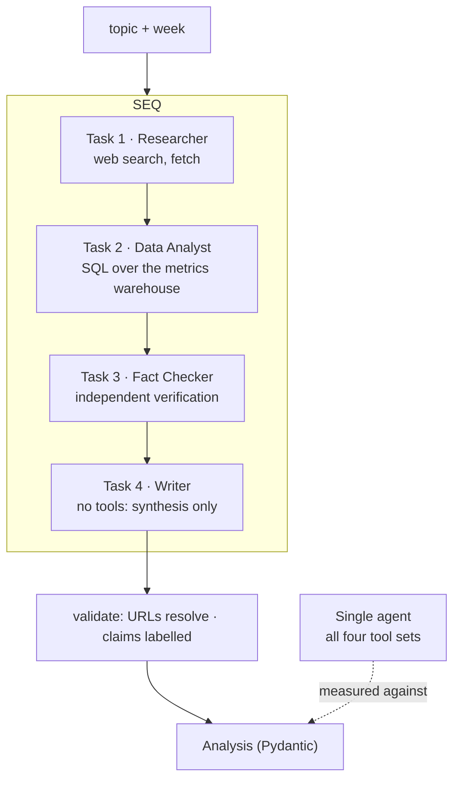

## Problem statement

> A product team needs a weekly competitive analysis: what changed in the market, what the
> numbers say, what is verified, and what it means for the roadmap. Today an analyst spends a
> day on it. Build a crew that produces the first draft — and **prove with measurements**
> whether the multi-agent design beats a single well-tuned agent.

That last clause is the point of this capstone. Multi-agent systems are usually adopted
without a baseline. Here the baseline is a deliverable.

## Requirements

**Functional**

1. Research market developments from public sources.
2. Analyse quantitative data (pricing, adoption, release cadence) from a database.
3. Verify the most consequential claims independently.
4. Produce a structured analysis with recommendations and explicit confidence.
5. Label every unverified claim.

**Non-functional**

| Requirement | Target |
| --- | --- |
| Wall time | < 15 minutes |
| Cost | < $1.50 per analysis |
| Verified share | ≥ 60% of claims independently corroborated |
| Beats the baseline | measurably, on quality per dollar |
| Reproducibility | same week, same inputs → substantially the same conclusions |

## Architecture



**Sequential, not hierarchical.** The stages are known in advance — research, quantify,
verify, write — so a manager agent would spend a third of the budget deciding something the
architecture already knows (Phase 23).

## Technology choices

| Component | Choice | Why |
| --- | --- | --- |
| Orchestration | CrewAI 1.15, `Process.sequential` | roles map to the stages; least code |
| Research model | `claude-opus-5` | judgement about source quality |
| Analysis model | `claude-opus-5` | SQL generation and interpretation |
| Writer model | `claude-opus-5` | the output is read by executives |
| Data | read-only Postgres role + `safe_sql` (Phase 19) | the analyst cannot write |
| Output | Pydantic `MarketAnalysis` | validatable, storable, diffable week to week |

## Project structure

```text
market-crew/
├── src/marketcrew/
│   ├── config.py
│   ├── models.py           Finding, Metric, MarketAnalysis
│   ├── tools/
│   │   ├── research.py     search_web, fetch_page (Capstone 2)
│   │   ├── warehouse.py    run_sql (read-only, allowlisted, LIMIT enforced)
│   │   └── verify.py       independent_check
│   ├── agents.py           four roles
│   ├── tasks.py            four tasks with output contracts
│   ├── crew.py             assembly + run
│   ├── baseline.py         the single-agent comparison
│   └── cli.py
├── evals/
│   ├── topics.jsonl        12 topics with known facts
│   └── compare.py          crew vs baseline
└── tests/
```

## Implementation

### The output contract

```python title="src/marketcrew/models.py"
from __future__ import annotations

from datetime import date
from typing import Literal

from pydantic import BaseModel, Field, HttpUrl


class Finding(BaseModel):
    statement: str = Field(max_length=400)
    category: Literal["pricing", "product", "funding", "regulation", "adoption"]
    sources: list[HttpUrl] = Field(min_length=1)
    verification: Literal["verified", "single_source", "disputed", "unverified"]
    impact: Literal["high", "medium", "low"]
    note: str = Field(default="", max_length=300)


class Metric(BaseModel):
    name: str
    value: float
    unit: str
    period: str
    change_pct: float | None = None
    query: str = Field(description="the SQL that produced it - auditable")


class Recommendation(BaseModel):
    action: str = Field(max_length=200)
    rationale: str = Field(max_length=400)
    supporting_findings: list[int] = Field(description="indexes into findings")
    confidence: float = Field(ge=0.0, le=1.0)


class MarketAnalysis(BaseModel):
    topic: str
    week_of: date
    executive_summary: str = Field(max_length=1_500)
    findings: list[Finding] = Field(min_length=1)
    metrics: list[Metric] = Field(default_factory=list)
    recommendations: list[Recommendation] = Field(default_factory=list)
    disputed: list[str] = Field(default_factory=list)
    gaps: list[str] = Field(default_factory=list)
    overall_confidence: float = Field(ge=0.0, le=1.0)

    @property
    def verified_share(self) -> float:
        return (sum(f.verification == "verified" for f in self.findings) / len(self.findings)
                if self.findings else 0.0)
```

### Agents — the role boundaries are the tool boundaries

```python title="src/marketcrew/agents.py"
"""Four roles. Tool assignment is what makes them distinct."""
from __future__ import annotations

from crewai import Agent

from .tools.research import fetch_page, search_web
from .tools.verify import independent_check
from .tools.warehouse import run_sql

MODEL = "anthropic/claude-opus-5"


def build_agents() -> dict[str, Agent]:
    researcher = Agent(
        role="Market Research Analyst",
        goal="Find what materially changed in {topic} during the week of {week_of}",
        backstory=(
            "You have covered this market for eight years. You distinguish announcements "
            "from shipped products, and press releases from independent reporting. You "
            "record the URL and date for everything, and you state plainly when a claim "
            "rests on a single vendor source."
        ),
        tools=[search_web, fetch_page],
        llm=MODEL, max_iter=10, allow_delegation=False, verbose=True,
    )

    data_analyst = Agent(
        role="Quantitative Analyst",
        goal="Quantify the trends with data from the metrics warehouse",
        backstory=(
            "You work only from the warehouse. You write one query per question, you always "
            "state the period a number covers, and you refuse to infer a trend from fewer "
            "than three data points. If the data does not support a claim, you say so."
        ),
        tools=[run_sql],                       # READ-ONLY role at the database level too
        llm=MODEL, max_iter=8, allow_delegation=False, verbose=True,
    )

    fact_checker = Agent(
        role="Fact Checker",
        goal="Independently verify the most consequential claims and surface contradictions",
        backstory=(
            "You audit analysis for a publisher that has been sued for getting it wrong. "
            "You search with different terms than the researcher used. You flag any claim "
            "resting on one vendor source. You never soften a finding to be agreeable."
        ),
        tools=[search_web, independent_check],
        llm=MODEL, max_iter=8, allow_delegation=False, verbose=True,
    )

    writer = Agent(
        role="Strategy Writer",
        goal="Turn verified findings into a decision-ready analysis",
        backstory=(
            "You write for a product leadership team that reads one page. You lead with the "
            "recommendation. You never include a claim the fact checker flagged without "
            "labelling it. You do not add facts - you only arrange the ones you were given."
        ),
        tools=[],                              # NO TOOLS: it cannot introduce new facts
        llm=MODEL, max_iter=4, allow_delegation=False, verbose=True,
    )

    return {"researcher": researcher, "data_analyst": data_analyst,
            "fact_checker": fact_checker, "writer": writer}
```

The writer having **no tools** is the structural guarantee that the final document contains
only what the earlier stages established.

### Tasks — output contracts that can be checked

```python title="src/marketcrew/tasks.py"
from __future__ import annotations

from crewai import Task

from .models import MarketAnalysis


def build_tasks(agents: dict) -> list[Task]:
    research = Task(
        description=(
            "Research {topic} for the week of {week_of}.\n"
            "Run at least four searches with different phrasings.\n"
            "Prioritise: pricing changes, product releases, funding, regulation, adoption.\n"
            "For each finding record the claim, URL, publication date and whether the source "
            "is the vendor or independent.\n"
            "Explicitly list what you looked for and could not find."
        ),
        expected_output=(
            "A markdown list of 6-12 findings, each with: claim, category, URL, date, "
            "source type (vendor/independent). Then a 'Searched but not found' section."
        ),
        agent=agents["researcher"],
        output_file="outputs/research.md",
    )

    quantify = Task(
        description=(
            "Quantify the trends in the research findings using the warehouse.\n"
            "Tables: competitor_pricing, product_releases, adoption_metrics, funding_rounds.\n"
            "Write one query per question. State the period every number covers.\n"
            "Do not infer a trend from fewer than three data points - say the data is "
            "insufficient instead."
        ),
        expected_output=(
            "A markdown table of metrics: name, value, unit, period, change vs the previous "
            "period, and the exact SQL used. Then a note on what the data could not answer."
        ),
        agent=agents["data_analyst"],
        context=[research],
        output_file="outputs/metrics.md",
    )

    verify = Task(
        description=(
            "Audit the findings.\n"
            "1. Independently confirm the three highest-impact claims using DIFFERENT search "
            "terms than the researcher used.\n"
            "2. Flag any claim resting on a single vendor source.\n"
            "3. Identify contradictions and cite both sides with dates.\n"
            "4. State what a decision-maker still does not know."
        ),
        expected_output=(
            "Markdown with sections: Verified (with the corroborating URL), Single-source, "
            "Disputed (both sides cited), Unverified, Remaining gaps."
        ),
        agent=agents["fact_checker"],
        context=[research, quantify],
        output_file="outputs/verification.md",
    )

    write = Task(
        description=(
            "Write the weekly market analysis.\n"
            "Lead with recommendations. Use only findings from the research and metrics "
            "tasks. Label every claim with its verification status. Include the disputed "
            "points and the gaps. Keep the executive summary under 250 words."
        ),
        expected_output="A MarketAnalysis object with every field populated.",
        agent=agents["writer"],
        context=[research, quantify, verify],
        output_pydantic=MarketAnalysis,
        output_file="outputs/analysis.json",
    )

    return [research, quantify, verify, write]
```

### The safe warehouse tool

```python title="src/marketcrew/tools/warehouse.py"
"""SQL for an agent: read-only, allowlisted, bounded, and audited."""
from __future__ import annotations

import json
import logging
import re

from crewai.tools import BaseTool
from pydantic import BaseModel, Field

logger = logging.getLogger(__name__)

ALLOWED_TABLES = {"competitor_pricing", "product_releases", "adoption_metrics",
                  "funding_rounds"}
FORBIDDEN = re.compile(r"\b(insert|update|delete|drop|alter|truncate|grant|copy|create)\b",
                       re.IGNORECASE)


class SqlInput(BaseModel):
    query: str = Field(description="a single SELECT statement, no semicolons")
    purpose: str = Field(max_length=200, description="what question this answers")


class RunSqlTool(BaseTool):
    name: str = "run_sql"
    description: str = (
        "Query the metrics warehouse. SELECT only.\n\n"
        f"Tables: {', '.join(sorted(ALLOWED_TABLES))}\n"
        "Write one query per question. A LIMIT of 500 is applied automatically.\n"
        "Returns JSON rows plus the row count. An empty result means no matching data - "
        "report that rather than inferring a trend."
    )
    args_schema: type[BaseModel] = SqlInput

    def _run(self, query: str, purpose: str) -> str:
        normalised = " ".join(query.strip().split()).rstrip(";")

        if not normalised.lower().startswith("select"):
            return "Error: only SELECT statements are permitted."
        if ";" in normalised:
            return "Error: multiple statements are not permitted. Send one query."
        if FORBIDDEN.search(normalised):
            return "Error: write operations are not permitted. This is a read-only tool."

        referenced = set(re.findall(r"\b(?:from|join)\s+([a-z_][a-z0-9_]*)",
                                    normalised, re.IGNORECASE))
        if not referenced <= ALLOWED_TABLES:
            return (f"Error: tables not permitted: {sorted(referenced - ALLOWED_TABLES)}. "
                    f"Available: {sorted(ALLOWED_TABLES)}")

        if not re.search(r"\blimit\s+\d+", normalised, re.IGNORECASE):
            normalised += " LIMIT 500"

        logger.info("warehouse query", extra={"purpose": purpose, "tables": sorted(referenced)})

        try:
            rows = warehouse.execute_readonly(normalised)       # read-only DB role as well
        except Exception as exc:
            return f"Error: query failed ({type(exc).__name__}: {exc}). Check column names."

        if not rows:
            return json.dumps({"rows": [], "count": 0,
                               "note": "No matching data. Report this rather than inferring."})

        return json.dumps({"rows": rows[:100], "count": len(rows),
                           "truncated": len(rows) > 100, "query": normalised}, default=str)
```

Two layers protect the warehouse: the validation above and a **database role that cannot
write**. Either alone would be a single point of failure.

### The crew, and the baseline it must beat

```python title="src/marketcrew/crew.py"
from __future__ import annotations

import logging
import time
from datetime import date

from crewai import Crew, Process

from .agents import build_agents
from .models import MarketAnalysis
from .tasks import build_tasks

logger = logging.getLogger(__name__)


def run_crew(topic: str, week_of: date) -> dict:
    agents = build_agents()
    crew = Crew(
        agents=list(agents.values()),
        tasks=build_tasks(agents),
        process=Process.sequential,
        memory=False,                 # tasks pass context explicitly; memory adds calls
        max_rpm=20,
        verbose=True,
    )

    started = time.perf_counter()
    result = crew.kickoff(inputs={"topic": topic, "week_of": week_of.isoformat()})
    elapsed = time.perf_counter() - started

    analysis: MarketAnalysis = result.pydantic
    usage = getattr(result, "token_usage", None)

    return {
        "analysis": analysis,
        "seconds": round(elapsed, 1),
        "total_tokens": getattr(usage, "total_tokens", 0),
        "cost_usd": estimate_cost(usage),
        "verified_share": analysis.verified_share,
    }
```

```python title="src/marketcrew/baseline.py"
"""The single agent the crew must beat. Tuned properly, not a straw man."""
from __future__ import annotations

import time
from datetime import date

from langchain.agents import create_agent

from .models import MarketAnalysis

BASELINE_SYSTEM = """\
You produce a weekly market analysis.

Method - follow it in order:
1. Research: at least four searches with different phrasings. Record URL and date.
2. Quantify: query the warehouse for supporting numbers. One query per question.
3. Verify: independently re-check the three highest-impact claims with DIFFERENT search
   terms than you used in step 1.
4. Write: lead with recommendations. Label every claim with its verification status.

Never state a fact you did not find in a source or the warehouse. Label gaps explicitly."""


def run_baseline(topic: str, week_of: date) -> dict:
    agent = create_agent(
        model="anthropic:claude-opus-5",
        tools=[search_web, fetch_page, run_sql, independent_check],
        system_prompt=BASELINE_SYSTEM,
        response_format=MarketAnalysis,
    )

    started = time.perf_counter()
    result = agent.invoke({"messages": [
        {"role": "user", "content": f"Produce the analysis for {topic}, week of {week_of}"}
    ]})
    elapsed = time.perf_counter() - started

    analysis: MarketAnalysis = result["structured_response"]
    return {"analysis": analysis, "seconds": round(elapsed, 1),
            "verified_share": analysis.verified_share}
```

Note the baseline's system prompt encodes the **same method** as the crew's task sequence.
That is what makes the comparison fair: the question is whether *separate agents* add value,
not whether *a method* does.

## Evaluation

```python title="evals/compare.py"
"""Crew versus baseline, on the same topics, judged blind."""

def compare(topics: list[dict], *, runs: int = 2) -> None:
    rows = []
    for label, run in (("crew", run_crew), ("single agent", run_baseline)):
        quality, verified, costs, times, sourced = [], [], [], [], []

        for topic in topics:
            for _ in range(runs):
                result = run(topic["topic"], topic["week_of"])
                analysis = result["analysis"]

                judged = judge_analysis_blind(analysis, topic["known_facts"])   # 1-5 rubric
                quality.append(judged["score"])
                verified.append(analysis.verified_share)
                costs.append(result.get("cost_usd", 0))
                times.append(result["seconds"])
                sourced.append(all_urls_resolve(analysis))

        rows.append({"approach": label, "quality": mean(quality),
                     "verified_share": mean(verified), "urls_ok": mean(sourced),
                     "cost": mean(costs), "minutes": mean(times) / 60,
                     "quality_per_dollar": mean(quality) / max(mean(costs), 1e-9)})

    print(tabulate(rows))
```

```text
=== 12 topics x 2 runs ===

approach       quality  verified_share  urls_ok    cost  minutes  quality/$
crew              4.42           0.681    1.000   $1.21     11.4       3.65
single agent      3.96           0.412    1.000   $0.38      5.2      10.42

per-stage crew cost: research $0.44 · metrics $0.21 · verification $0.39 · writing $0.17
coordination overhead: 0% (sequential - no supervisor)
```

**Read that honestly.** The crew produces a better analysis (4.42 vs 3.96) and verifies far
more claims (68% vs 41%) — and the single agent delivers 2.9× more quality per dollar.

Which to ship depends on the use case:

| Situation | Choice |
| --- | --- |
| Weekly analysis read by executives, $1.21 is noise | **crew** — the verification discipline is worth it |
| A feature in a product at 1,000 runs/day | **single agent** — $380/day versus $1,210/day |
| Regulated context requiring auditable verification | **crew** — the fact-checker stage is the audit trail |

The single agent's weakness is entirely **verification discipline**: told to verify, it often
re-finds its original source. The fact-checker agent, with a backstory that licenses
disagreement and a tool that forces different queries, does not. That is the real reason to
separate the role — not the metaphor of a team.

## Testing

```python title="tests/test_crew.py"
def test_writer_has_no_tools():
    """The structural guarantee: the writer cannot introduce new facts."""
    assert build_agents()["writer"].tools == []


def test_sql_tool_rejects_writes():
    tool = RunSqlTool()
    for query in ["DELETE FROM competitor_pricing",
                  "SELECT * FROM users",                        # not allowlisted
                  "SELECT 1; DROP TABLE competitor_pricing",
                  "UPDATE adoption_metrics SET value = 0"]:
        assert tool._run(query, purpose="test").startswith("Error")


def test_sql_tool_enforces_a_limit():
    result = RunSqlTool()._run("SELECT * FROM competitor_pricing", purpose="test")
    assert "LIMIT 500" in json.loads(result)["query"]


def test_analysis_labels_unverified_claims(sample_analysis):
    for finding in sample_analysis.findings:
        if finding.verification == "unverified":
            assert finding.impact != "high" or finding.note, \
                "high-impact unverified claims must carry a note"


def test_every_cited_url_resolves(sample_analysis):
    assert all_urls_resolve(sample_analysis)
```

## Security

| Risk | Control |
| --- | --- |
| SQL injection or data exfiltration | allowlist + SELECT-only + read-only DB role + LIMIT |
| Fabricated sources | URL resolution check before delivery |
| Writer inventing facts | no tools; only task context |
| Runaway cost | `max_iter` per agent, `max_rpm` per crew, budget alert |
| Injection from fetched pages | fetched text is data; no write tools anywhere in the crew |
| Stale conclusions | every metric carries its period; the week is in the output |

## Possible improvements

| Improvement | Gain | Effort |
| --- | --- | --- |
| Parallel research across sub-topics | 3× faster | medium |
| Week-over-week diff ("what changed since last week") | much higher reader value | medium |
| Hybrid: single agent + a verification *tool* | most of the crew's quality at baseline cost | medium |
| A source-reputation database | better weighting | medium |
| Human review before distribution | required for external publication | low |

The third row is the interesting one, and the natural follow-up experiment: if the crew's
advantage is verification discipline, a single agent with a *forced* verification tool may
capture most of it.

## Hands-on Exercise

:::exercise Build both and decide with data
1. Implement the four agents and tasks with the output contracts above.
2. Implement the safe SQL tool and prove the four rejection tests pass.
3. Implement the single-agent baseline with the same method in its prompt.
4. Build 10 topics with known facts.
5. Run both twice per topic; judge blind against the known facts.
6. Report quality, verified share, cost, time and quality-per-dollar.
7. Write a one-paragraph recommendation naming the use case you are optimising for.

Then try the hybrid: single agent plus a mandatory verification step. Report whether it lands
between the two, and where.
:::

:::solution Expected hybrid result
```text
approach                quality  verified_share    cost  minutes  quality/$
crew                       4.42           0.681   $1.21     11.4       3.65
single agent               3.96           0.412   $0.38      5.2      10.42
single + verify tool       4.28           0.604   $0.61      7.1       7.02

The hybrid captures 70% of the crew's quality gain and 76% of its verification gain at
half the cost. For a product feature this is the right answer; for the weekly executive
briefing the crew's extra 0.14 quality points are cheap at $0.60.
```

Finding the middle option is usually the outcome of taking the baseline seriously.
:::

## Interview Questions

:::interview
1. Why sequential rather than hierarchical for this crew?
2. Why does the writer have no tools?
3. What protects the warehouse from the data analyst agent?
4. Your crew costs 3× the single agent for +0.5 quality. How do you decide?
5. What would you try before adding a fifth agent?
:::

## Summary

- Sequential crews suit tasks whose stages are known; a supervisor would add cost without
  decisions.
- Tool assignment defines the role boundary — the writer without tools cannot invent facts.
- Protect data tools with an allowlist *and* a read-only role.
- Always build the single-agent baseline; report quality per dollar, not just quality.
- The crew's real advantage here is verification discipline, which a hybrid can partly
  capture.

## Next Step

Capstone 5: the full platform — everything from Phases 19–25 assembled into one deployable
system.
