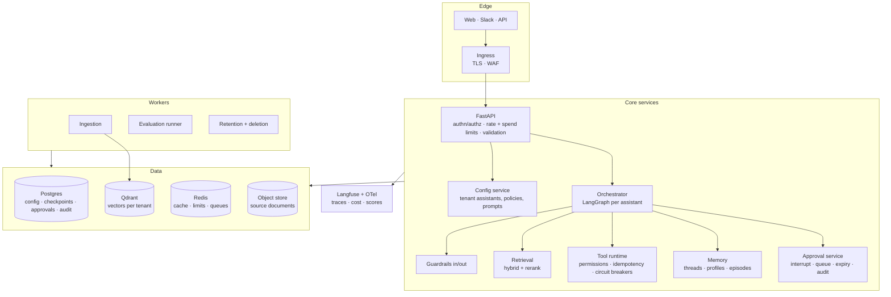

## Problem statement

> Four teams each want an AI assistant over their own documents and tools. Building four
> systems means four sets of guardrails, four evaluation suites and four on-call rotations.
> Build **one platform**: tenants configure an assistant (documents, tools, policies), and
> the platform provides retrieval, orchestration, safety, approvals, observability and
> evaluation.

This is the system the whole handbook has been building toward. Every component exists in an
earlier phase; this capstone is about **assembly, isolation and operability**.

## Requirements

| Area | Requirement |
| --- | --- |
| Multi-tenancy | complete data isolation; one tenant cannot observe another exists |
| Configurability | tenants define tools, policies, thresholds and prompts without a deploy |
| Safety | no irreversible action without an approval matching tenant policy |
| Durability | conversations and approvals survive restarts and deploys |
| Observability | every request traceable, with cost attributed per tenant and feature |
| Evaluation | per-tenant suites gate every config change |
| SLO | 99.5% availability, p95 < 4 s, cost < $0.05 per conversation |
| Compliance | data deletion on request, complete across every store |

## Architecture



## Database schema

```sql title="migrations/001_initial.sql"
-- Tenancy -------------------------------------------------------------------
CREATE TABLE tenants (
    id              TEXT PRIMARY KEY,
    name            TEXT NOT NULL,
    plan            TEXT NOT NULL DEFAULT 'standard',
    daily_budget_usd NUMERIC(10,2) NOT NULL DEFAULT 50.00,
    data_region     TEXT NOT NULL DEFAULT 'eu',
    created_at      TIMESTAMPTZ NOT NULL DEFAULT now(),
    deleted_at      TIMESTAMPTZ
);

CREATE TABLE principals (
    id           TEXT PRIMARY KEY,
    tenant_id    TEXT NOT NULL REFERENCES tenants(id),
    email_hash   TEXT NOT NULL,              -- hashed: never the raw address
    groups       TEXT[] NOT NULL DEFAULT '{}',
    clearance    SMALLINT NOT NULL DEFAULT 0,
    scopes       TEXT[] NOT NULL DEFAULT '{}',
    created_at   TIMESTAMPTZ NOT NULL DEFAULT now()
);
CREATE INDEX principals_tenant_idx ON principals (tenant_id);

-- Assistant configuration (versioned; changes are auditable and revertible) ---
CREATE TABLE assistants (
    id             TEXT PRIMARY KEY,
    tenant_id      TEXT NOT NULL REFERENCES tenants(id),
    name           TEXT NOT NULL,
    version        INTEGER NOT NULL DEFAULT 1,
    system_prompt  TEXT NOT NULL,
    model          TEXT NOT NULL DEFAULT 'anthropic:claude-opus-5',
    fallback_model TEXT DEFAULT 'anthropic:claude-sonnet-5',
    enabled_tools  TEXT[] NOT NULL DEFAULT '{}',
    policies       JSONB NOT NULL DEFAULT '{}'::jsonb,   -- limits, thresholds, approvals
    retrieval      JSONB NOT NULL DEFAULT '{}'::jsonb,   -- k, min_score, rerank
    is_active      BOOLEAN NOT NULL DEFAULT false,
    created_by     TEXT,
    created_at     TIMESTAMPTZ NOT NULL DEFAULT now(),
    UNIQUE (tenant_id, name, version)
);

-- Documents and chunks -------------------------------------------------------
CREATE TABLE documents (
    id             TEXT PRIMARY KEY,
    tenant_id      TEXT NOT NULL REFERENCES tenants(id),
    title          TEXT NOT NULL,
    source_uri     TEXT NOT NULL,
    content_hash   TEXT NOT NULL,
    page_count     INTEGER,
    visibility     TEXT[] NOT NULL DEFAULT '{}',
    clearance      SMALLINT NOT NULL DEFAULT 0,
    embedding_model TEXT NOT NULL,
    chunk_ids      TEXT[] NOT NULL DEFAULT '{}',    -- makes deletion exact
    ingested_at    TIMESTAMPTZ NOT NULL DEFAULT now(),
    superseded_by  TEXT REFERENCES documents(id)
);
CREATE INDEX documents_tenant_idx ON documents (tenant_id, ingested_at DESC);
CREATE UNIQUE INDEX documents_hash_idx ON documents (tenant_id, content_hash);

-- Conversations, approvals, audit ---------------------------------------------
CREATE TABLE conversations (
    thread_id     TEXT PRIMARY KEY,                 -- "{principal_id}:{conversation_id}"
    tenant_id     TEXT NOT NULL REFERENCES tenants(id),
    principal_id  TEXT NOT NULL REFERENCES principals(id),
    assistant_id  TEXT NOT NULL REFERENCES assistants(id),
    started_at    TIMESTAMPTZ NOT NULL DEFAULT now(),
    last_at       TIMESTAMPTZ NOT NULL DEFAULT now(),
    turns         INTEGER NOT NULL DEFAULT 0,
    resolved      BOOLEAN,
    escalated     BOOLEAN NOT NULL DEFAULT false,
    cost_usd      NUMERIC(10,6) NOT NULL DEFAULT 0
);
CREATE INDEX conversations_tenant_idx ON conversations (tenant_id, last_at DESC);

CREATE TABLE approvals (
    id             TEXT PRIMARY KEY,
    tenant_id      TEXT NOT NULL REFERENCES tenants(id),
    thread_id      TEXT NOT NULL,
    action         TEXT NOT NULL,
    payload        JSONB NOT NULL,
    evidence       JSONB NOT NULL DEFAULT '[]'::jsonb,
    risk           TEXT NOT NULL,
    status         TEXT NOT NULL DEFAULT 'pending',
    requested_at   TIMESTAMPTZ NOT NULL DEFAULT now(),
    expires_at     TIMESTAMPTZ NOT NULL,
    decided_by     TEXT,
    decided_at     TIMESTAMPTZ,
    decision_reason TEXT
);
CREATE INDEX approvals_pending_idx ON approvals (tenant_id, status, expires_at)
    WHERE status = 'pending';

CREATE TABLE audit_log (
    id          BIGSERIAL PRIMARY KEY,
    tenant_id   TEXT NOT NULL,
    principal_id TEXT,
    action      TEXT NOT NULL,
    resource    TEXT,
    outcome     TEXT NOT NULL,
    metadata    JSONB NOT NULL DEFAULT '{}'::jsonb,   -- metadata only, never content
    trace_id    TEXT,
    at          TIMESTAMPTZ NOT NULL DEFAULT now()
);
CREATE INDEX audit_tenant_time_idx ON audit_log (tenant_id, at DESC);

-- Evaluation ------------------------------------------------------------------
CREATE TABLE eval_runs (
    id            TEXT PRIMARY KEY,
    tenant_id     TEXT NOT NULL,
    assistant_id  TEXT NOT NULL,
    assistant_version INTEGER NOT NULL,
    metrics       JSONB NOT NULL,
    passed        BOOLEAN NOT NULL,
    ran_at        TIMESTAMPTZ NOT NULL DEFAULT now()
);

-- LangGraph checkpoints live in their own tables, created by PostgresSaver.setup()
```

Two schema decisions worth noting. `documents.chunk_ids` makes deletion exact — no orphaned
vectors. And `assistants` is **versioned**, so a config change is a new row: you can evaluate
version 4, promote it, and revert to version 3 without a deploy.

## Assistant configuration

```python title="src/platform/config/assistant.py"
"""Tenants configure assistants. Changes are versioned, evaluated and promoted."""
from __future__ import annotations

from typing import Literal

from pydantic import BaseModel, Field


class ApprovalPolicy(BaseModel):
    auto_approve_below: dict[str, float] = Field(default_factory=dict)
    always_review: list[str] = Field(default_factory=list)
    forbidden: list[str] = Field(default_factory=list)
    confidence_threshold: float = Field(default=0.7, ge=0.0, le=1.0)
    expiry_hours: int = Field(default=24, ge=1, le=168)


class RetrievalPolicy(BaseModel):
    k: int = Field(default=12, ge=1, le=50)
    top_n: int = Field(default=5, ge=1, le=20)
    min_score: float = Field(default=0.28, ge=0.0, le=1.0)
    hybrid: bool = True
    rerank: bool = True
    max_context_tokens: int = Field(default=4_000, ge=500, le=50_000)


class Limits(BaseModel):
    max_steps: int = Field(default=8, ge=1, le=30)
    max_cost_usd_per_conversation: float = Field(default=0.50, gt=0, le=10)
    max_seconds: float = Field(default=120.0, gt=0, le=600)
    daily_budget_usd: float = Field(default=50.0, gt=0)


class AssistantConfig(BaseModel):
    """The whole assistant, as data. No deploy needed to change behaviour."""

    id: str
    tenant_id: str
    name: str
    version: int = 1
    system_prompt: str = Field(min_length=20, max_length=8_000)
    model: str = "anthropic:claude-opus-5"
    fallback_model: str | None = "anthropic:claude-sonnet-5"
    enabled_tools: list[str] = Field(default_factory=list)
    approvals: ApprovalPolicy = Field(default_factory=ApprovalPolicy)
    retrieval: RetrievalPolicy = Field(default_factory=RetrievalPolicy)
    limits: Limits = Field(default_factory=Limits)
    escalation_channel: str = ""
    is_active: bool = False

    def validate_tools(self, available: set[str]) -> list[str]:
        """A tenant cannot enable a tool the platform does not provide."""
        return sorted(set(self.enabled_tools) - available)
```

```python title="src/platform/orchestrator/factory.py"
"""Build a graph from configuration, cached per (assistant, version)."""
from __future__ import annotations

import functools
import logging

from langgraph.checkpoint.postgres import PostgresSaver

logger = logging.getLogger(__name__)


@functools.lru_cache(maxsize=128)
def build_assistant_graph(assistant_id: str, version: int):
    """Cached: building a graph is not free, and configs change rarely."""
    config = config_store.get(assistant_id, version)

    missing = config.validate_tools(tool_runtime.available_names())
    if missing:
        raise ValueError(f"assistant {assistant_id} enables unknown tools: {missing}")

    graph = build_graph(
        system_prompt=config.system_prompt,
        model=config.model, fallback_model=config.fallback_model,
        tools=tool_runtime.subset(config.enabled_tools),
        retrieval=config.retrieval, approvals=config.approvals, limits=config.limits,
        checkpointer=PostgresSaver.from_conn_string(settings.database_url),
    )
    logger.info("built assistant graph", extra={"assistant": assistant_id, "version": version,
                                                "tools": len(config.enabled_tools)})
    return graph


def promote_version(assistant_id: str, version: int, *, actor: str) -> dict:
    """Promotion requires a passing evaluation run for THAT version."""
    run = eval_store.latest(assistant_id, version)
    if run is None:
        raise ValueError(f"no evaluation run for {assistant_id} v{version}")
    if not run["passed"]:
        raise ValueError(f"evaluation failed for v{version}: {run['metrics']}")

    config_store.set_active(assistant_id, version)
    build_assistant_graph.cache_clear()
    audit.record(action="promote_assistant", resource=f"{assistant_id}:v{version}",
                 principal_id=actor, outcome="ok", metadata=run["metrics"])
    return {"promoted": version, "metrics": run["metrics"]}
```

**Promotion requires a passing evaluation for that exact version.** That single rule is what
makes self-service configuration safe.

## The request path

```python title="src/platform/api/conversations.py"
from __future__ import annotations

import time
from typing import Annotated

from fastapi import APIRouter, Depends, HTTPException, Request
from pydantic import BaseModel, Field

router = APIRouter(prefix="/v1", tags=["conversations"])


class MessageRequest(BaseModel):
    assistant: str = Field(pattern=r"^[a-z0-9-]{1,64}$")
    message: str = Field(min_length=1, max_length=4_000)
    conversation_id: str | None = Field(default=None, pattern=r"^[a-zA-Z0-9_-]{1,64}$")


@router.post("/messages")
async def send_message(
    payload: MessageRequest,
    request: Request,
    principal: Annotated[Principal, Depends(require_principal)],
) -> dict:
    started = time.perf_counter()

    # 1. limits: requests and dollars are separate controls
    allowed, retry_after = await limiter.check(principal.id, plan=principal.plan)
    if not allowed:
        raise HTTPException(429, headers={"Retry-After": str(retry_after)})

    within_budget, spent = await limiter.check_tenant_budget(principal.tenant_id)
    if not within_budget:
        raise HTTPException(402, detail=f"daily budget reached (${spent:.2f})")

    # 2. the assistant must belong to this tenant - 404, not 403, to avoid leaking existence
    config = await config_store.get_active(payload.assistant, tenant_id=principal.tenant_id)
    if config is None:
        raise HTTPException(404, detail="assistant not found")

    graph = build_assistant_graph(config.id, config.version)
    conversation_id = payload.conversation_id or new_conversation_id()
    thread = f"{principal.id}:{conversation_id}"           # from authenticated identity

    with trace("message", user_id=principal.id, session_id=conversation_id,
               tenant=principal.tenant_id, assistant=config.id) as span:
        result = await graph.ainvoke(
            {"messages": [HumanMessage(payload.message)],
             "principal_id": principal.id, "tenant_id": principal.tenant_id,
             "groups": list(principal.groups), "clearance": principal.clearance},
            config={"configurable": {"thread_id": thread},
                    "recursion_limit": config.limits.max_steps * 3},
        )

    elapsed_ms = int((time.perf_counter() - started) * 1000)
    cost = sum(c.get("usd", 0) for c in result.get("costs", []))
    await limiter.record_spend(principal.tenant_id, cost)
    await conversations.upsert(thread, tenant_id=principal.tenant_id,
                               assistant_id=config.id, cost_usd=cost,
                               escalated=result.get("escalated", False))

    if "__interrupt__" in result:
        approval = await approvals.create_from_interrupt(
            result["__interrupt__"][0].value, thread_id=thread,
            tenant_id=principal.tenant_id, policy=config.approvals,
        )
        await notify_approvers(config.escalation_channel, approval)
        return {"status": "pending_approval", "approval_id": approval.id,
                "conversation_id": conversation_id,
                "reply": "I need a colleague to approve this. I will update you shortly.",
                "trace_id": span.trace_id}

    return {"status": "ok", "reply": result["reply"],
            "citations": result.get("citations", []),
            "conversation_id": conversation_id, "escalated": result.get("escalated", False),
            "latency_ms": elapsed_ms, "trace_id": span.trace_id}


@router.post("/approvals/{approval_id}/decide")
async def decide_approval(
    approval_id: str, decision: ApprovalDecision,
    principal: Annotated[Principal, Depends(require_principal)],
) -> dict:
    principal.require("approvals:decide")

    approval = await approvals.get(approval_id)
    if approval is None or approval.tenant_id != principal.tenant_id:
        raise HTTPException(404, detail="approval not found")

    decided = await approvals.decide(approval_id, approved=decision.approved,
                                     approver=principal.id, reason=decision.reason)
    graph = build_assistant_graph(*await config_store.active_ids(approval.thread_id))
    result = await approvals.resume(decided, graph=graph, revalidate=revalidate_action)

    await audit.record(action="decide_approval", resource=approval_id,
                       principal_id=principal.id,
                       outcome="approved" if decision.approved else "rejected")
    return {"status": "completed", "reply": result.get("reply", "")}
```

## Multi-tenancy: the four boundaries

```text
1. IDENTITY    tenant_id comes from the verified token; it is never a request parameter
2. DATA        every query filters by tenant_id; the filter is a REQUIRED argument
3. VECTORS     Qdrant payload filter on tenant_id, with a per-tenant collection option
                for tenants requiring physical separation
4. BUDGET      per-tenant daily spend cap, so one tenant cannot exhaust another's service

Plus: a 404 (not 403) for another tenant's resources, so existence does not leak.
```

```python title="tests/test_isolation.py"
"""The test suite a security review will ask to see."""
import pytest


@pytest.mark.parametrize("endpoint,method", [
    ("/v1/messages", "POST"), ("/v1/documents", "GET"),
    ("/v1/approvals/{id}/decide", "POST"), ("/v1/assistants/{id}", "GET"),
])
def test_cross_tenant_access_returns_404(client, tenant_a_token, tenant_b_resource,
                                         endpoint, method):
    """404, never 403: a 403 confirms the resource exists."""
    response = client.request(method, endpoint.format(id=tenant_b_resource.id),
                              headers={"Authorization": f"Bearer {tenant_a_token}"})
    assert response.status_code == 404
    assert tenant_b_resource.id not in response.text


def test_retrieval_never_crosses_tenants(store, embedder):
    """50,000 randomised queries, zero foreign chunks."""
    import random
    for _ in range(50_000):
        tenant = random.choice(["t_a", "t_b", "t_c"])
        access = AccessContext(tenant_id=tenant, groups=frozenset({"all"}), clearance=2)
        for hit in store.search(random_vector(), access=access, k=10):
            assert hit.payload["tenant_id"] == tenant


def test_budget_exhaustion_is_isolated(client, tenant_a_token, tenant_b_token):
    exhaust_budget("t_a")
    assert client.post("/v1/messages", json=msg,
                       headers=auth(tenant_a_token)).status_code == 402
    assert client.post("/v1/messages", json=msg,
                       headers=auth(tenant_b_token)).status_code == 200


def test_deletion_is_complete(platform, tenant_with_data):
    """Every store, including derived indexes."""
    result = platform.delete_tenant("t_x", requested_by="dpo@acme.com")

    assert platform.db.count("documents", tenant_id="t_x") == 0
    assert platform.db.count("conversations", tenant_id="t_x") == 0
    assert platform.vectors.count(where={"tenant_id": "t_x"}) == 0
    assert platform.cache.keys(f"*:t_x:*") == []
    assert platform.checkpoints.count(prefix="t_x:") == 0
    assert result["audit_retained"] is True          # audit log survives, by policy
```

## Operations

```yaml title="ops/slo.yml"
slos:
  availability:
    target: 99.5%
    window: 30d
    measured: successful_responses / total_requests

  latency:
    target: p95 < 4000ms
    excludes: [pending_approval]        # waiting for a human is not our latency

  quality:
    target: containment_rate > 0.70
    measured: conversations resolved without escalation

  safety:
    target: unapproved_actions == 0
    window: always
    action_on_breach: page immediately, disable write tools platform-wide

alerts:
  - name: p95_latency
    expr: p95_latency_ms > 4000 for 10m
    severity: warning
  - name: cost_spike
    expr: cost_per_1k_requests > 1.5 * baseline_7d
    severity: warning
    runbook: check the cache hit rate, then mean input tokens
  - name: citation_validity
    expr: citation_validity < 1.0
    severity: critical
    runbook: block the assistant version, investigate the prompt change
  - name: approval_queue_stale
    expr: oldest_pending_approval_age > 4h
    severity: warning
  - name: unapproved_action
    expr: unapproved_action_count > 0
    severity: critical
    runbook: disable write tools, audit the trace, notify the tenant
```

```text
ops/runbook.md (excerpt)

COST SPIKE
  1. dashboard → cost by tenant, assistant and outcome
  2. cache hit rate dropped?     → check for a timestamp in the system prompt
  3. mean input tokens rose?     → check conversation trimming and retrieval k
  4. one tenant?                 → check their config version and enabled tools
  5. mitigate: lower that tenant's daily budget; roll back the config version

CITATION VALIDITY BELOW 1.0
  This is a correctness breach, not a performance issue.
  1. identify the assistant version from the trace
  2. set is_active to the previous version (instant; no deploy)
  3. run the evaluation suite against the failing version
  4. do not promote again until the gate passes
```

## Deployment

```yaml title="k8s/deployment.yaml (excerpt)"
apiVersion: apps/v1
kind: Deployment
metadata: { name: ai-platform-api }
spec:
  replicas: 3
  strategy:
    rollingUpdate: { maxSurge: 1, maxUnavailable: 0 }
  template:
    spec:
      securityContext: { runAsNonRoot: true, runAsUser: 1000 }
      containers:
        - name: api
          image: registry/ai-platform:1.4.0        # pinned, never :latest
          ports: [{ containerPort: 8000 }]
          envFrom:
            - secretRef: { name: ai-platform-secrets }
          resources:
            requests: { cpu: "500m", memory: "1Gi" }
            limits:   { cpu: "2",    memory: "2Gi" }
          livenessProbe:
            httpGet: { path: /health/live, port: 8000 }
            periodSeconds: 30
          readinessProbe:
            httpGet: { path: /health/ready, port: 8000 }
            periodSeconds: 10
            failureThreshold: 3
          lifecycle:
            preStop: { exec: { command: ["sleep", "15"] } }   # drain in-flight requests
```

```text
release pipeline
  1. CI: lint · types · unit tests · deterministic evals          (every PR, ~2 min)
  2. CI: full evaluation suite per tenant                          (nightly + on label)
  3. build and scan the image                                      (fails on HIGH CVEs)
  4. migrations run as a separate job before the rollout
  5. deploy to staging; smoke tests; 10-minute soak
  6. canary 10% for 30 minutes; compare p95, cost, containment, citation validity
  7. promote to 100%, or auto-roll-back on any regression
  8. keep the previous image warm for one rollback window
```

## Cost model

```text
per conversation (measured, 30-day mean)
  retrieval (local embeddings + Qdrant)      $0.0000
  generation (opus, 2 turns, cached prefix)  $0.0284
  classification (haiku)                     $0.0004
  guardrails + verification (deterministic)  $0.0000
  ────────────────────────────────────────────────
  total                                      $0.0288   (target < $0.05)

platform monthly, 4 tenants, 120k conversations
  models                                     $3,456
  infrastructure (k8s, Postgres, Qdrant, Redis)  $820
  observability                                  $180
  ────────────────────────────────────────────────
  total                                      $4,456    ≈ $0.037 per conversation

levers already applied: prompt caching (61% hit), answer cache (22% hit),
haiku for classification, local embeddings and reranking
```

## What you have built

```text
Phase  1-2   Python that is testable, typed, async and packaged
Phase  3-5   data handling and the charts that diagnose it
Phase  6-7   classical ML, evaluated honestly, served behind an API
Phase  8-9   neural networks and PyTorch, to the depth an AI engineer needs
Phase 10-11  LLM API engineering, embeddings, vector stores
Phase 12-13  RAG with citations, hybrid retrieval, reranking, evaluation
Phase 14-15  agents from scratch, and the patterns worth their cost
Phase 16-18  LangChain, LangGraph and CrewAI - chosen on fit, not fashion
Phase 19-23  guardrails, human approval, memory, tools, multi-agent topologies
Phase 24-25  tracing, evaluation gates, and a service with an SLO
Phase 26     five systems that combine all of it
```

## Hands-on Exercise

:::exercise Ship the platform
Build it incrementally. Each milestone is independently useful:

1. **Week 1** — single-tenant assistant: API, RAG, guardrails, tracing. Ship it internally.
2. **Week 2** — multi-tenancy: identity, isolation, the 50,000-query isolation test, budgets.
3. **Week 3** — tools and approvals: tool runtime, approval service, the safety test suite.
4. **Week 4** — configuration: versioned assistants, the promotion gate, per-tenant evals.
5. **Week 5** — operations: SLOs, alerts, runbook, canary deploy, rollback rehearsal.

Deliverables at the end: the isolation test output, an evaluation gate blocking a bad config,
a cost dashboard by tenant, and a rehearsed rollback with its measured duration.

Then run it for a month with real users and write a post-mortem of what broke. That document
will teach you more than this handbook did.
:::

## Interview Questions

:::interview
1. How do you guarantee tenant isolation across four different data stores?
2. Why 404 rather than 403 for another tenant's resource?
3. How can a tenant change assistant behaviour without a deploy, safely?
4. What do you do when citation validity drops below 1.0 in production?
5. Walk me through your release pipeline for an AI system.
:::

## Summary

- A platform is the same components with isolation, configuration and operability added.
- Tenant identity comes from the token and is a required argument everywhere it matters.
- Versioned assistant configs plus an evaluation gate make self-service safe.
- SLOs, alerts and a runbook turn a system into an operable service.
- Every piece here was built in an earlier phase; the capstone is the assembly.

## Next Step

Phase 27: the reference section — roadmaps, dependency maps, interview preparation, the
production checklist and where to go next.
