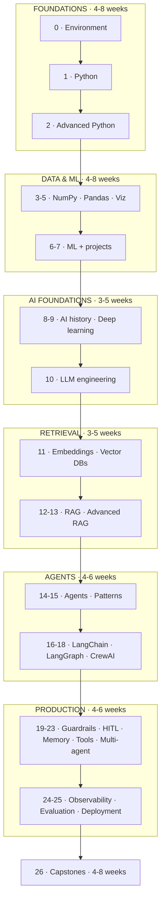
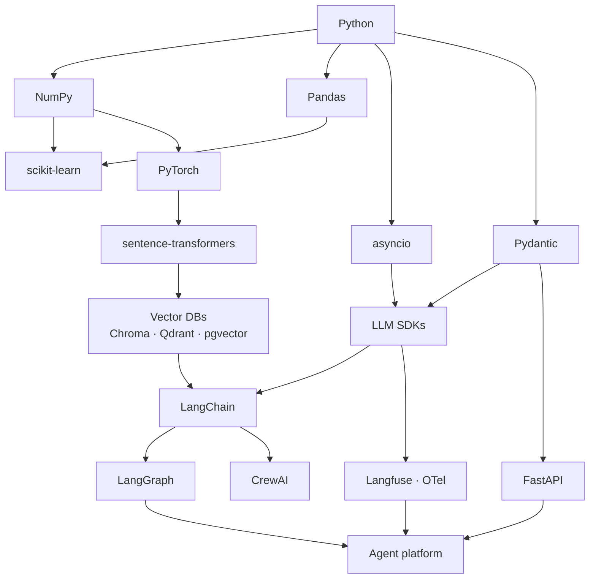

## 1. The learning roadmap



### Pacing

| Background | Realistic pace | Total |
| --- | --- | --- |
| No programming | 8–12 h/week | 9–12 months |
| Programmer, new to Python | 8–12 h/week | 5–7 months |
| Python developer, new to AI | 8–12 h/week | 3–5 months |
| Data scientist moving to AI engineering | 8–12 h/week | 2–3 months |
| Full-time study | 30–40 h/week | 8–14 weeks |

:::tip Build something at every stage
Reading this handbook end to end without writing code produces the illusion of competence.
Each phase has an exercise; the capstones exist because a system you have debugged teaches
more than a chapter you have read.
:::

### Where to shortcut, safely

| If you already… | You may skim | Never skip |
| --- | --- | --- |
| write production Python | Phases 1–2 | the testing lesson |
| use Pandas daily | Phases 3–5 | leakage and evaluation in Phase 6 |
| have shipped ML models | Phases 6–7 | Phase 7's serving lesson |
| know PyTorch | Phase 9 | Phase 10 |
| have built a RAG demo | Phase 12 | Phase 13's evaluation |
| have used LangChain | Phase 16 | Phase 14 (build the loop by hand) |

The "never skip" column is not sentiment. Each entry is a topic that people who skip it
reliably get wrong later.

## 2. Technology dependency map



### What actually depends on what

| To understand… | You need first |
| --- | --- |
| Pandas | NumPy (broadcasting, dtypes) |
| scikit-learn | NumPy, Pandas, the bias–variance idea |
| PyTorch | NumPy, gradient descent by hand |
| Embeddings | NumPy (cosine similarity), transformers conceptually |
| Vector DBs | embeddings, metadata filtering |
| RAG | embeddings, vector DBs, LLM APIs, prompting |
| Agents | LLM APIs, tool calling, control flow |
| LangGraph | agents, state machines, typing |
| Guardrails | Pydantic, the agent loop, prompt injection |
| Evaluation | ML metrics (precision, recall), statistics |
| The platform | all of the above plus FastAPI, Docker, Postgres |

Two dependencies people miss: **evaluation depends on classical ML metrics** (Phase 6 is why
Phase 24 makes sense), and **guardrails depend on Pydantic** (Phase 2 is why Phase 19 is
short).

## 3. Skill progression ladder

| Level | You can | Phases | Signal you are ready to move on |
| --- | --- | --- | --- |
| **1 · Beginner** | write Python scripts, read files, call APIs safely | 0–1 | your code has tests and no hard-coded keys |
| **2 · Developer** | classes, typing, async, packaging, pytest | 2 | you can be handed a legacy module and improve it |
| **3 · Data-literate** | NumPy, Pandas, charts that answer a question | 3–5 | you can profile an unfamiliar dataset in 20 minutes |
| **4 · ML-literate** | train, evaluate and serve a model without leakage | 6–7 | you can explain why a 94% accuracy is meaningless |
| **5 · LLM engineer** | structured output, tools, streaming, cost control | 8–10 | your calls have retries, budgets and token accounting |
| **6 · RAG engineer** | chunking, retrieval, citations, evaluation | 11–13 | you separate retrieval failures from generation failures with data |
| **7 · Agent engineer** | agent loops, patterns, frameworks | 14–18 | you can argue *against* using an agent, with numbers |
| **8 · Production engineer** | guardrails, HITL, memory, observability, deployment | 19–25 | you have a rehearsed rollback and an evaluation gate |
| **9 · Architect** | multi-tenant platforms, topologies, SLOs, cost models | 23, 26 | you design for the failure modes before the features |

### Self-assessment

```text
Can you, without looking anything up:
  [ ] explain why `if not value:` is a bug when 0 is valid              → level 1
  [ ] write a pytest fixture and a parametrised test                     → level 2
  [ ] say what axis=0 collapses, and when to use groupby vs transform    → level 3
  [ ] name three forms of data leakage and how each is prevented         → level 4
  [ ] list what comes back from an LLM call besides the text             → level 5
  [ ] state the metric that bounds RAG quality, and why                  → level 6
  [ ] describe the agent loop's five stop conditions                     → level 7
  [ ] say where a rule that must hold is enforced, and why not the prompt→ level 8
  [ ] describe four tenant-isolation boundaries in one system            → level 9
```

## 4. Project progression

Projects in the order they build on each other. Each is a portfolio artifact.

| # | Project | Phase | Teaches | Time |
| --- | --- | --- | --- | --- |
| 1 | Weather CLI with retries and tests | 0 | env vars, HTTP, error handling | 3 h |
| 2 | `ragkit` package with tests and CI | 1–2 | packaging, testing, tooling | 6 h |
| 3 | Retrieval log analysis | 3–5 | NumPy, Pandas, charts | 5 h |
| 4 | Escalation classifier | 7 | end-to-end ML, leakage, thresholds | 10 h |
| 5 | Latency regression + serving API | 7 | quantile loss, FastAPI, drift | 8 h |
| 6 | Digit classifier in PyTorch | 9 | training loops, checkpoints | 6 h |
| 7 | Production LLM client | 10 | structured output, retries, cost | 8 h |
| 8 | Chunking evaluation study | 11 | recall@k, empirical tuning | 6 h |
| 9 | RAG from scratch, no framework | 12 | the whole pipeline, by hand | 12 h |
| 10 | PDF ingestion with citations | 12 | extraction, provenance, incremental | 10 h |
| 11 | Hybrid retrieval + reranking ablation | 13 | measuring what helps | 8 h |
| 12 | RAG evaluation harness + CI gate | 13, 24 | faithfulness, regression gates | 10 h |
| 13 | Agent from scratch | 14 | the loop and every safeguard | 12 h |
| 14 | Agentic pattern comparison | 15 | measuring pattern value | 8 h |
| 15 | LangGraph RAG with self-correction | 17 | state machines, cycles | 10 h |
| 16 | Approval workflow with interrupts | 17, 20 | durable human gates | 8 h |
| 17 | **Capstone 1** — document intelligence | 26 | the complete RAG service | 30 h |
| 18 | **Capstone 2** — research agent | 26 | tools, verification, honesty | 25 h |
| 19 | **Capstone 3** — support agent | 26 | routing, memory, approval, state | 35 h |
| 20 | **Capstone 4** — multi-agent crew | 26 | topologies, baselines | 20 h |
| 21 | **Capstone 5** — agent platform | 26 | multi-tenancy, operations | 60 h |

**Total: roughly 300 hours of building.** That is the number that matters more than the
reading time.

### Portfolio advice

Three projects done well beat twenty tutorials. For each, publish:

- a README with the problem, the architecture diagram and the measured results;
- the evaluation table, including what did **not** work;
- one honest paragraph on the limitations.

That last item is what distinguishes an engineer's portfolio from a demo collection. Anyone
can show a working case; showing the measured failure rate and what you did about it is the
signal a hiring manager is looking for.

## Where each concept is taught

| Concept | Phase |
| --- | --- |
| Virtual environments, uv, pyproject | 0 |
| Mutable default arguments | 1 |
| Dependency injection, Protocols | 2 |
| Broadcasting, vectorisation | 3 |
| groupby, merge validation | 4 |
| Data leakage, train/val/test | 6 |
| Threshold selection by cost | 6–7 |
| Backpropagation, PyTorch loop | 9 |
| Attention, KV cache, prompt caching | 10 |
| Structured output, tool calling | 10 |
| Chunking strategy, recall@k | 11 |
| Citation verification | 12 |
| Hybrid search, RRF, reranking | 13 |
| Faithfulness, LLM-as-judge | 13, 24 |
| Agent loop, stop conditions | 14 |
| ReAct, reflection, routing | 15 |
| LCEL, `create_agent` | 16 |
| State, reducers, interrupts | 17 |
| Crews, roles, processes | 18 |
| Prompt injection, guardrails | 19 |
| Approval gates, confidence | 20 |
| Memory layers, retention | 21 |
| Tool schemas, idempotency | 22 |
| Topologies, coordination overhead | 23 |
| Tracing, cost attribution | 24 |
| FastAPI, Docker, degraded modes | 25 |

## Summary

- The path is linear by design: each phase's prerequisites are the previous phase's outputs.
- Shortcut where you have real experience, but never skip testing, leakage, the hand-built
  agent loop, or evaluation.
- Nine skill levels, each with a concrete self-assessment question.
- Twenty-one projects, roughly 300 hours of building — that is where the learning is.

## Next Step

Interview preparation: what gets asked at each level, and how to answer it.
