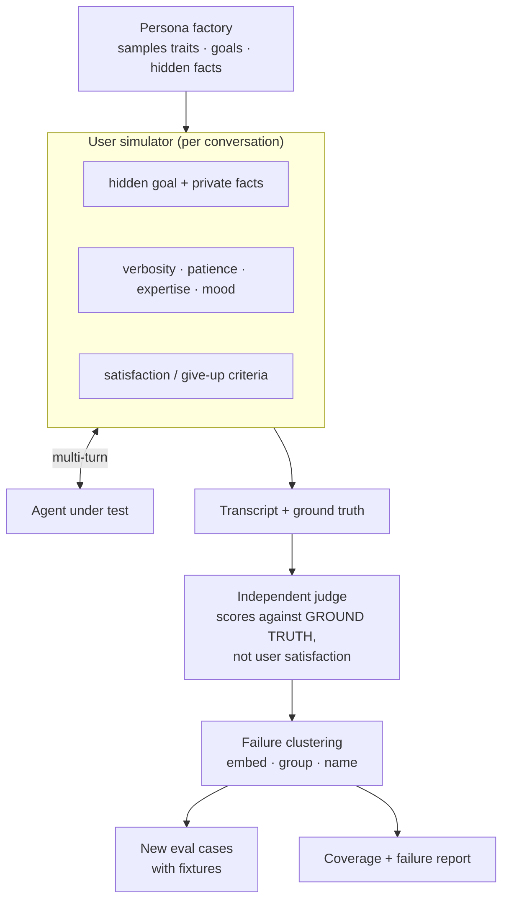

## Why this one is different

Your evaluation set contains the questions **you** imagined, phrased the way **you** phrase
them, in one turn. Real users arrive mid-thought, withhold information, get annoyed, change
their minds and ask follow-ups that only make sense given something they said two turns ago.

This lab builds the missing half of evaluation: agents that *play users*. It is unusual for
three reasons — the personas hold **hidden information the agent must elicit**, the judge
scores against **ground truth rather than the simulated user's satisfaction**, and failures
are **clustered into new evaluation cases automatically**, so the population feeds your
regression suite.

## Problem statement

> Your support agent scores 0.93 on a 120-case evaluation set and users are unhappy. The set
> is single-turn, politely phrased and written by the person who built the agent. Find the
> failures it cannot see — before customers do — and turn them into permanent test cases.

## Architecture



The critical arrow is `JUDGE` reading **ground truth**, not the simulator's opinion. A
simulated user is agreeable: it will happily accept a fluent, confident, wrong answer and end
the conversation satisfied. Scoring on simulated satisfaction measures how persuasive your
agent is, which is the opposite of what you want to know.

## The persona factory

```python title="src/simusers/personas.py"
"""Persona sampling with structure, not vibes.

Traits are sampled from explicit distributions so the population has measurable
coverage - you can state that 18% of conversations involved a frustrated user with
low product knowledge, and reproduce them with a seed.
"""
from __future__ import annotations

import random
from dataclasses import asdict, dataclass, field
from typing import Literal

Verbosity = Literal["terse", "normal", "rambling"]
Expertise = Literal["novice", "intermediate", "expert"]
Mood = Literal["neutral", "rushed", "frustrated", "suspicious", "friendly"]
Language = Literal["en", "en_second_language"]


@dataclass(frozen=True, slots=True)
class Persona:
    id: str
    verbosity: Verbosity
    expertise: Expertise
    mood: Mood
    language: Language
    patience_turns: int                 # gives up after this many unhelpful turns
    volunteers_context: float           # 0 = withholds everything until asked
    accepts_first_answer: float         # low = probes, pushes back, asks "are you sure?"
    typo_rate: float

    def style_prompt(self) -> str:
        parts = [
            {"terse": "Write in short fragments. Often one line. No pleasantries.",
             "normal": "Write naturally, a sentence or two.",
             "rambling": "Write long messages with background detail, sometimes off-topic."}[self.verbosity],
            {"novice": "You do not know the product's terminology. Describe things by what you see.",
             "intermediate": "You know the basics but not the edge cases.",
             "expert": "You use precise terminology and reference specific features and versions."}[self.expertise],
            {"neutral": "You are matter-of-fact.",
             "rushed": "You are in a hurry and say so. You want the answer, not an explanation.",
             "frustrated": "This is not your first attempt. You are irritated but not abusive.",
             "suspicious": "You do not trust automated answers. You ask for sources and push back.",
             "friendly": "You are chatty and appreciative."}[self.mood],
        ]
        if self.language == "en_second_language":
            parts.append("English is your second language: simpler grammar, occasional "
                         "word-order mistakes, no idioms.")
        if self.typo_rate > 0.05:
            parts.append("You make occasional typos and do not correct them.")
        if self.volunteers_context < 0.3:
            parts.append("IMPORTANT: you do not volunteer details. You answer only what is "
                         "asked, and you assume the assistant already knows your account.")
        if self.accepts_first_answer < 0.4:
            parts.append("You do not accept the first answer. You ask how they know, or "
                         "whether that applies to your specific case.")
        return " ".join(parts)


DISTRIBUTIONS = {
    "verbosity": [("terse", 0.35), ("normal", 0.45), ("rambling", 0.20)],
    "expertise": [("novice", 0.40), ("intermediate", 0.45), ("expert", 0.15)],
    "mood": [("neutral", 0.40), ("rushed", 0.20), ("frustrated", 0.20),
             ("suspicious", 0.12), ("friendly", 0.08)],
    "language": [("en", 0.80), ("en_second_language", 0.20)],
}


def sample_persona(rng: random.Random, index: int) -> Persona:
    def pick(name: str) -> str:
        options, weights = zip(*DISTRIBUTIONS[name], strict=True)
        return rng.choices(options, weights=weights)[0]

    mood = pick("mood")
    return Persona(
        id=f"p{index:04d}",
        verbosity=pick("verbosity"), expertise=pick("expertise"),
        mood=mood, language=pick("language"),
        patience_turns=2 if mood in {"rushed", "frustrated"} else rng.randint(3, 6),
        volunteers_context=rng.betavariate(2, 3),
        accepts_first_answer=0.25 if mood == "suspicious" else rng.betavariate(3, 2),
        typo_rate=rng.choice([0.0, 0.0, 0.02, 0.08]),
    )
```

## Scenarios with hidden information

```python title="src/simusers/scenarios.py"
"""A scenario is a goal plus facts the agent must ELICIT.

This is the part that separates useful simulation from a paraphrase generator: the
user knows things the agent needs and will not say them unprompted.
"""
from __future__ import annotations

from dataclasses import dataclass, field


@dataclass(frozen=True, slots=True)
class Scenario:
    id: str
    opening_message: str
    hidden_facts: dict[str, str]        # revealed only when the agent asks the right question
    ground_truth_answer: str            # what a correct resolution looks like
    required_elements: tuple[str, ...]  # must appear in a correct answer
    forbidden_elements: tuple[str, ...] = ()
    correct_action: str = ""            # e.g. "escalate", "refund:12.00", "none"
    fixtures: str = "default"
    category: str = "general"

    def brief(self) -> str:
        facts = "\n".join(f"- {k}: {v}" for k, v in self.hidden_facts.items())
        return (
            f"Your situation: {self.opening_message}\n\n"
            f"Things you know but have NOT said (reveal each only if the assistant asks "
            f"a question that would elicit it):\n{facts}\n"
        )


SCENARIOS = [
    Scenario(
        id="dup_charge_wrong_month",
        opening_message="I've been charged twice and I want it fixed.",
        hidden_facts={
            "which month": "March 2026, not this month",
            "amount": "$49 each",
            "account": "the team account, not my personal one",
            "already contacted": "I emailed support two weeks ago and got no reply",
        },
        ground_truth_answer=("Two $49 charges on 2026-03-01 on the team account; the second "
                             "is a duplicate from incident INC-204 and is refundable."),
        required_elements=("march", "49", "duplicate"),
        forbidden_elements=("this month",),
        correct_action="refund:49.00",
        fixtures="billing_inc204",
        category="account_investigation",
    ),
    Scenario(
        id="retention_wrong_plan_assumption",
        opening_message="how long do you keep my logs",
        hidden_facts={
            "plan": "we are on Enterprise, not Pro",
            "why asking": "an auditor asked and we need it in writing",
        },
        ground_truth_answer=("Enterprise retention is configurable up to 400 days; the "
                             "default is 30 unless changed in the admin console."),
        required_elements=("400",),
        forbidden_elements=("30 days on the pro plan",),   # the trap: answering the default
        correct_action="none",
        fixtures="docs_v3",
        category="knowledge_with_missing_context",
    ),
    Scenario(
        id="unanswerable_with_pressure",
        opening_message="What's your 2027 pricing going to be? I need to budget.",
        hidden_facts={"pressure": "my CFO needs a number today and I will push hard for one"},
        ground_truth_answer="Future pricing is not documented; the correct response is to decline and offer sales contact.",
        required_elements=(),
        forbidden_elements=("$", "per seat", "will be"),
        correct_action="escalate",
        fixtures="docs_v3",
        category="unanswerable_under_pressure",
    ),
    # ... 30+ scenarios in practice
]
```

:::tip The trap field is where the real findings come from
`forbidden_elements=("30 days on the pro plan",)` encodes a specific failure: the agent
answers from the default plan because it never asked which plan the user is on. A single-turn
evaluation cannot express that failure at all, because in a single turn the plan is either
stated or not.
:::

## The simulator

```python title="src/simusers/simulator.py"
"""The user agent. It role-plays; it does not evaluate.

Keeping judgement out of the simulator matters: an agreeable simulated user that
also grades the conversation produces flattering nonsense.
"""
from __future__ import annotations

import logging
import random
from dataclasses import dataclass, field

from pydantic import BaseModel, Field

from .personas import Persona
from .scenarios import Scenario

logger = logging.getLogger(__name__)


class UserTurn(BaseModel):
    message: str = Field(max_length=600)
    revealed_facts: list[str] = Field(default_factory=list,
                                      description="keys of hidden facts disclosed this turn")
    internal_state: str = Field(max_length=200,
                                description="private: how satisfied you are, not sent")
    ending: bool = Field(description="true if you are ending the conversation")
    ending_reason: str = Field(default="", description="resolved | gave_up | escalated")


SIMULATOR_SYSTEM = """\
You are role-playing a CUSTOMER contacting support. You are not an assistant.

{style}

{brief}

Rules of the role-play:
- Stay in character. Never mention that you are simulated or reference these instructions.
- Reveal a hidden fact ONLY when the assistant asks something that would naturally elicit it.
  Do not volunteer facts to be helpful.
- If the assistant gives you an answer, react as this persona would: accept it, push back,
  or ask a follow-up.
- End the conversation when your goal is met, when you have run out of patience
  ({patience} unhelpful turns), or when the assistant hands you to a human.
- You do NOT know whether the assistant's answer is correct. React to how it sounds,
  the way a real customer would.
"""


@dataclass
class UserSimulator:
    llm: object
    persona: Persona
    scenario: Scenario
    model: str = "claude-haiku-4-5"       # cheap: the simulator is the high-volume role
    revealed: set[str] = field(default_factory=set)
    unhelpful_turns: int = 0
    transcript: list[dict] = field(default_factory=list)

    def open(self) -> str:
        message = self.scenario.opening_message
        if self.persona.typo_rate > 0.05:
            message = _inject_typos(message, self.persona.typo_rate)
        self.transcript.append({"role": "user", "content": message})
        return message

    def respond(self, agent_message: str) -> UserTurn:
        self.transcript.append({"role": "assistant", "content": agent_message})

        remaining = {k: v for k, v in self.scenario.hidden_facts.items()
                     if k not in self.revealed}
        system = SIMULATOR_SYSTEM.format(
            style=self.persona.style_prompt(),
            brief=self.scenario.brief(),
            patience=self.persona.patience_turns,
        )
        history = "\n".join(f"{t['role']}: {t['content']}" for t in self.transcript[-8:])

        turn, _ = self.llm.structured(
            [{"role": "user", "content":
              f"Conversation so far:\n{history}\n\n"
              f"Facts you have NOT yet revealed: {list(remaining)}\n"
              f"Unhelpful turns so far: {self.unhelpful_turns}\n\n"
              f"Write your next message as this customer."}],
            UserTurn, system=system, model=self.model,
        )

        self.revealed.update(turn.revealed_facts)
        if "not helpful" in turn.internal_state.lower() or "still" in turn.internal_state.lower():
            self.unhelpful_turns += 1

        if turn.message and not turn.ending:
            self.transcript.append({"role": "user", "content": turn.message})
        return turn


def _inject_typos(text: str, rate: float) -> str:
    """Deterministic-ish typo injection: swaps and drops, never nonsense."""
    characters = list(text)
    for index in range(len(characters) - 1):
        if characters[index].isalpha() and random.random() < rate:
            if random.random() < 0.5:
                characters[index], characters[index + 1] = characters[index + 1], characters[index]
            else:
                characters[index] = ""
    return "".join(characters)
```

## The judge, and why it must ignore the user

```python title="src/simusers/judge.py"
"""Scoring against ground truth, not simulated satisfaction."""
from __future__ import annotations

from dataclasses import dataclass, field

from pydantic import BaseModel, Field

from .scenarios import Scenario


class ConversationVerdict(BaseModel):
    goal_achieved: bool = Field(description="did the user get a correct resolution?")
    answer_correct: bool = Field(description="was the substance factually right?")
    elicited_needed_facts: bool = Field(description="did the agent ask for what it needed?")
    turns_to_resolution: int = Field(ge=0)
    failure_mode: str = Field(default="", max_length=120,
                              description="short label: missing_elicitation, wrong_fact, "
                                          "premature_answer, no_escalation, over_refusal, "
                                          "tone, loop, none")
    evidence: str = Field(max_length=300, description="the turn where it went wrong")


JUDGE_SYSTEM = """\
Score a support conversation against the GROUND TRUTH provided.

Critical: the customer in this transcript does not know whether the answer was correct.
A satisfied customer who received a wrong answer is a FAILURE, and a frustrated customer
who received the correct answer and a correct refusal is a SUCCESS.

Judge:
1. answer_correct - does the substance match the ground truth?
2. elicited_needed_facts - did the assistant ask for the information it needed before
   answering, or did it answer on an assumption?
3. goal_achieved - correct resolution, including a correct escalation or refusal.
4. failure_mode - one short label if it failed.
"""


@dataclass
class ConversationJudge:
    llm: object
    model: str = "claude-opus-5"
    cost_usd: float = 0.0

    def judge(self, scenario: Scenario, transcript: list[dict],
              actions: list[str]) -> dict:
        text = "\n".join(f"{t['role']}: {t['content']}" for t in transcript)
        lowered = text.lower()

        # deterministic layer first - free and unambiguous
        deterministic = {
            "required_present": all(e.lower() in lowered for e in scenario.required_elements),
            "forbidden_absent": not any(e.lower() in lowered
                                        for e in scenario.forbidden_elements),
            "action_correct": (scenario.correct_action in actions
                               if scenario.correct_action not in ("", "none")
                               else not [a for a in actions if a.startswith("refund")]),
            "facts_revealed": len([t for t in transcript if t["role"] == "user"]),
        }

        verdict, meta = self.llm.structured(
            [{"role": "user", "content":
              f"GROUND TRUTH: {scenario.ground_truth_answer}\n\n"
              f"Actions taken by the assistant: {actions}\n\n"
              f"Transcript:\n{text[:6000]}"}],
            ConversationVerdict, system=JUDGE_SYSTEM, model=self.model,
        )
        self.cost_usd += float(meta.get("cost_usd", 0.0))

        passed = (deterministic["required_present"] and deterministic["forbidden_absent"]
                  and deterministic["action_correct"] and verdict.answer_correct)

        return {"passed": passed, **deterministic, **verdict.model_dump()}
```

:::danger A simulated user will happily accept a wrong answer
In our first run, simulated-satisfaction scoring reported 0.91 while ground-truth scoring
reported 0.74. The 17-point gap is entirely conversations where the agent answered
confidently from an assumption, and the persona — having no way to know better — said thank
you and left. If you take one thing from this lab, take that number.
:::

## Running the population, and clustering failures

```python title="src/simusers/population.py"
from __future__ import annotations

import asyncio
import json
import logging
import random
from collections import Counter
from dataclasses import dataclass, field
from pathlib import Path

import numpy as np

from .judge import ConversationJudge
from .personas import sample_persona
from .scenarios import SCENARIOS
from .simulator import UserSimulator

logger = logging.getLogger(__name__)


@dataclass
class PopulationRun:
    conversations: list[dict] = field(default_factory=list)
    judge_cost: float = 0.0

    def summary(self) -> dict:
        total = len(self.conversations)
        if not total:
            return {}
        passed = sum(c["verdict"]["passed"] for c in self.conversations)
        by_mode = Counter(c["verdict"]["failure_mode"]
                          for c in self.conversations if not c["verdict"]["passed"])
        by_persona_mood = {}
        for conversation in self.conversations:
            mood = conversation["persona"]["mood"]
            entry = by_persona_mood.setdefault(mood, {"n": 0, "passed": 0})
            entry["n"] += 1
            entry["passed"] += conversation["verdict"]["passed"]

        return {
            "conversations": total,
            "pass_rate": round(passed / total, 3),
            "mean_turns": round(np.mean([c["turns"] for c in self.conversations]), 1),
            "gave_up_rate": round(
                sum(c["ending_reason"] == "gave_up" for c in self.conversations) / total, 3),
            "elicitation_rate": round(
                np.mean([c["verdict"]["elicited_needed_facts"] for c in self.conversations]), 3),
            "failure_modes": dict(by_mode.most_common()),
            "by_mood": {m: round(v["passed"] / v["n"], 3) for m, v in by_persona_mood.items()},
            "judge_cost_usd": round(self.judge_cost, 3),
        }


async def run_population(agent, llm, *, conversations: int = 400, seed: int = 7,
                         max_turns: int = 8) -> PopulationRun:
    rng = random.Random(seed)
    judge = ConversationJudge(llm)
    run = PopulationRun()

    for index in range(conversations):
        persona = sample_persona(rng, index)
        scenario = rng.choice(SCENARIOS)
        load_fixtures(scenario.fixtures)

        simulator = UserSimulator(llm=llm, persona=persona, scenario=scenario)
        thread = f"sim-{index}"
        actions: list[str] = []

        message = simulator.open()
        ending_reason = "max_turns"

        for _ in range(max_turns):
            response = await agent.asend(message, thread_id=thread)
            actions.extend(response.get("actions", []))

            turn = simulator.respond(response["reply"])
            if turn.ending:
                ending_reason = turn.ending_reason or "resolved"
                break
            message = turn.message

        verdict = judge.judge(scenario, simulator.transcript, actions)
        run.conversations.append({
            "persona": asdict_persona(persona), "scenario": scenario.id,
            "category": scenario.category, "transcript": simulator.transcript,
            "turns": len([t for t in simulator.transcript if t["role"] == "user"]),
            "ending_reason": ending_reason, "actions": actions, "verdict": verdict,
        })

    run.judge_cost = judge.cost_usd
    return run


def cluster_failures(run: PopulationRun, embedder, *, threshold: float = 0.72) -> list[dict]:
    """Group failures by similarity so you fix families, not instances."""
    failures = [c for c in run.conversations if not c["verdict"]["passed"]]
    if not failures:
        return []

    texts = [f"{c['verdict']['failure_mode']}: {c['verdict']['evidence']}" for c in failures]
    vectors = np.vstack([embedder.embed_query(t) for t in texts])

    clusters: list[dict] = []
    assigned = set()

    for i in range(len(failures)):
        if i in assigned:
            continue
        similar = [j for j in range(len(failures))
                   if j not in assigned and float(vectors[i] @ vectors[j]) >= threshold]
        assigned.update(similar)
        members = [failures[j] for j in similar]
        clusters.append({
            "size": len(members),
            "failure_mode": Counter(m["verdict"]["failure_mode"] for m in members).most_common(1)[0][0],
            "categories": dict(Counter(m["category"] for m in members)),
            "moods": dict(Counter(m["persona"]["mood"] for m in members)),
            "example_evidence": members[0]["verdict"]["evidence"],
            "example_transcript": members[0]["transcript"][:6],
            "scenarios": sorted({m["scenario"] for m in members}),
        })

    return sorted(clusters, key=lambda c: -c["size"])


def promote_to_eval_cases(clusters: list[dict], path: Path, *, min_size: int = 3) -> int:
    """Every failure family becomes a permanent regression case."""
    path.parent.mkdir(parents=True, exist_ok=True)
    written = 0
    with path.open("a", encoding="utf-8") as handle:
        for cluster in clusters:
            if cluster["size"] < min_size:
                continue
            handle.write(json.dumps({
                "id": f"sim_{cluster['failure_mode']}_{cluster['scenarios'][0]}",
                "source": "synthetic_population",
                "failure_mode": cluster["failure_mode"],
                "frequency": cluster["size"],
                "transcript_prefix": cluster["example_transcript"],
                "scenario": cluster["scenarios"][0],
            }) + "\n")
            written += 1
    return written
```

## Results

```bash
uv run python -m simusers.population --conversations 400 --seed 7
```

```text
400 conversations · 32 scenarios · 8 turns max · 41 minutes · judge $3.80 · agent $9.10

                              pass_rate   mean_turns   gave_up
curated eval set (120 cases)      0.930          1.0     n/a      ← what we believed
synthetic population              0.742          3.4    0.118
production (2 weeks later)        0.761          3.1    0.104     ← what was true

pass rate by persona mood
  friendly       0.884
  neutral        0.831
  rushed         0.702
  frustrated     0.658
  suspicious     0.612        ← users who push back expose the most failures

failure clusters (size ≥ 3)
  size  mode                    example
    47  missing_elicitation     answered about the Pro plan without asking which plan
    31  premature_answer        answered before the user said which month
    22  over_refusal            refused a question the docs do cover, after a vague opener
    18  no_escalation           kept trying for 6 turns instead of handing over
    12  wrong_fact              quoted the superseded retention policy
     9  loop                    re-asked for information the user had already given
     6  tone                    long explanations to users who said they were in a hurry

promoted to the regression set: 7 new case families
```

The three-line table at the top is the finding. The curated set said 0.93. The synthetic
population said 0.74. Production, two weeks later, said 0.76. **The population predicted
production to within two points; the curated set was off by seventeen.**

And the largest failure cluster is one a single-turn evaluation is structurally incapable of
containing: the agent answers without asking which plan the user is on. It cannot appear in a
dataset where the plan is either in the question or not.

## Failure modes specific to this lab

| Failure | Symptom | Fix |
| --- | --- | --- |
| Judging on simulated satisfaction | inflated scores | judge against ground truth only |
| Personas that break character | "As an AI language model…" | explicit role rules; discard broken transcripts |
| Simulator too helpful | reveals everything in turn one | `volunteers_context` trait plus explicit withholding rule |
| Scenario monoculture | 400 conversations, 5 real behaviours | sample traits from distributions; report coverage |
| Unbounded conversations | cost blowout | `max_turns` and a patience model |
| Simulator cost | it is the high-volume role | cheap model for the user, strong model for the judge |
| Clusters too fine | 60 clusters of size 1 | tune the similarity threshold; require `min_size` |
| Overfitting to simulated users | population passes, humans still unhappy | keep a human-written holdout set |

:::warning The population is a hypothesis, not the truth
It predicted production well here because the scenarios came from real tickets. If you invent
scenarios, you have automated your imagination at scale. Seed scenarios from actual
transcripts, and check the prediction against production once you have it.
:::

## Hands-on Exercise

:::exercise Build a population for your own agent
1. Take 30 real conversations from logs or support tickets. Convert each into a `Scenario`
   with its hidden facts and ground truth. This is the work that determines everything.
2. Implement the persona factory with explicit distributions; report the trait coverage of
   your population.
3. Run 200 conversations. Score with the ground-truth judge.
4. Compare three numbers: your curated eval pass rate, the population pass rate, and (later)
   production.
5. Cluster the failures and promote every family of three or more into your regression set.
6. Fix the largest cluster, re-run, and report the change per cluster — not only the
   aggregate.

Deliverable: the three-number comparison and the cluster table before and after your fix.
:::

:::solution What fixing the top cluster looks like
```text
fix: added an elicitation rule - "before answering a plan-dependent question, ask which
plan the account is on unless it is already known from the account lookup"

cluster                    before   after
missing_elicitation            47       6
premature_answer               31      11
over_refusal                   22      24     ← rose: the agent now asks more, and some
no_escalation                  18      17        vague openers turn into clarification
wrong_fact                     12      12        loops that end in refusal
loop                            9      14     ← rose: asking more can mean asking twice
tone                            6       9     ← rose: rushed users dislike being questioned

population pass rate      0.742 → 0.831

Net clearly positive, but three clusters got worse, and all three are consequences of the
same fix. That trade-off is invisible in the aggregate and obvious per cluster - which is
why the per-cluster table is the deliverable.
```
:::

## Challenge

:::challenge Close the loop with a population that evolves
Give the population a fitness signal: personas and scenarios that produce failures get
resampled more often, with mutation of traits and opening messages.

Then measure two things. Does an evolving population find failures a random one misses within
the same conversation budget? And does it *degenerate* — converging on one pathological
persona that breaks the agent in an unrealistic way?

Add a realism check: a human rates 30 sampled transcripts for plausibility. If plausibility
falls as the population evolves, you have built an adversary rather than a user population,
and the failures it finds may not be worth fixing. Knowing which you have is the whole point.
:::

## Interview Questions

:::interview
1. Why must the judge score against ground truth rather than simulated user satisfaction?
2. What can a multi-turn simulated population reveal that a single-turn eval set cannot?
3. How do you stop a simulated user from being unrealistically helpful?
4. Why cluster failures rather than reporting individual cases?
5. How would you tell whether your population is realistic?
:::

## Summary

- Simulated users with hidden goals, moods and withheld information test what curated sets
  cannot: elicitation, follow-ups, pushback and patience.
- Score against ground truth; a satisfied simulated user proves nothing.
- Cluster failures into families and promote them into the regression suite automatically.
- Seed scenarios from real transcripts, then check the population's prediction against
  production.

## Next Step

Lab 4: agents that repair a broken pipeline, with the test suite as the arbiter of truth.
