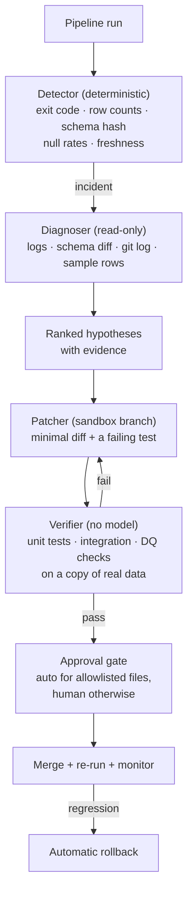

## Why this one is different

Almost every multi-agent tutorial ends at "the agents produced a plan". This one ends at
"the pipeline is green again, and we can prove it".

The unusual part is the epistemology. The agents are not trusted to know whether they fixed
anything. **The test suite and the data-quality checks are the ground truth**, the patcher
works in a disposable sandbox, and any change that does not turn red to green is discarded
automatically. The measured headline is the one this design exists to produce: a large fall
in false fixes, because confidence is never accepted as evidence.

## Problem statement

> A nightly pipeline fails at 02:14. Someone reads the traceback at 09:00, finds an upstream
> schema change, patches a parser, re-runs, and goes back to their real job. Mean time to
> repair: seven hours, nearly all of it waiting for a human to wake up.
>
> Build a system that does the first ninety minutes of that work — detection, diagnosis, a
> candidate patch, and *verification* — so the human arrives at a proposed diff with evidence
> instead of a traceback.

## Architecture



Three design rules carry the whole system:

1. **The detector uses no model.** Detection must be boring, cheap and trustworthy. A model
   that decides whether there is an incident will invent incidents and miss real ones.
2. **The diagnoser has read-only tools.** It cannot fix anything, so it cannot cause anything.
3. **The verifier has no model at all.** It runs the real test suite. "The agent says it
   works" is not an input.

## The detector

```python title="src/healer/detector.py"
"""Deterministic incident detection.

No LLM. Every signal is a number compared against a baseline, so the same run
always produces the same incident - which is what makes the later measurements
of auto-fix rate and MTTR meaningful.
"""
from __future__ import annotations

import hashlib
import json
import logging
from dataclasses import dataclass, field
from datetime import datetime, timedelta, timezone
from pathlib import Path

logger = logging.getLogger(__name__)


@dataclass(frozen=True, slots=True)
class Signal:
    name: str
    observed: float | str
    expected: float | str
    severity: str          # "hard" (pipeline broke) | "soft" (data looks wrong)
    detail: str


@dataclass
class Incident:
    id: str
    task: str
    started_at: datetime
    signals: list[Signal] = field(default_factory=list)

    @property
    def hard(self) -> bool:
        return any(s.severity == "hard" for s in self.signals)

    def fingerprint(self) -> str:
        """Stable id so repeat incidents are recognised rather than re-diagnosed."""
        key = "|".join(sorted(f"{s.name}:{s.detail[:80]}" for s in self.signals))
        return hashlib.sha256(f"{self.task}|{key}".encode()).hexdigest()[:16]


class Detector:
    """Compares one run against a rolling baseline stored on disk."""

    def __init__(self, baseline_path: Path, *, row_tolerance: float = 0.25,
                 null_tolerance: float = 0.10, freshness_hours: int = 26) -> None:
        self.baseline_path = baseline_path
        self.row_tolerance = row_tolerance
        self.null_tolerance = null_tolerance
        self.freshness_hours = freshness_hours
        self.baseline = json.loads(baseline_path.read_text()) if baseline_path.exists() else {}

    def check(self, task: str, run: dict) -> Incident | None:
        base = self.baseline.get(task, {})
        signals: list[Signal] = []

        if run["exit_code"] != 0:
            signals.append(Signal("exit_code", run["exit_code"], 0, "hard",
                                  run["stderr_tail"][-800:]))

        observed_hash = _schema_hash(run["output_schema"])
        if base.get("schema_hash") and observed_hash != base["schema_hash"]:
            added, removed, changed = _schema_diff(base["output_schema"], run["output_schema"])
            signals.append(Signal("schema", observed_hash, base["schema_hash"], "hard",
                                  f"added={added} removed={removed} type_changed={changed}"))

        expected_rows = base.get("median_rows")
        if expected_rows:
            drift = abs(run["rows"] - expected_rows) / max(expected_rows, 1)
            if drift > self.row_tolerance:
                signals.append(Signal("row_count", run["rows"], expected_rows, "soft",
                                      f"drift={drift:.1%} tolerance={self.row_tolerance:.0%}"))

        for column, rate in run["null_rates"].items():
            expected = base.get("null_rates", {}).get(column, 0.0)
            if rate - expected > self.null_tolerance:
                signals.append(Signal(f"nulls.{column}", rate, expected, "soft",
                                      f"null rate rose {rate - expected:.1%}"))

        age = datetime.now(timezone.utc) - run["source_max_timestamp"]
        if age > timedelta(hours=self.freshness_hours):
            signals.append(Signal("freshness", age.total_seconds() / 3600,
                                  self.freshness_hours, "soft",
                                  f"newest source row is {age.total_seconds()/3600:.1f}h old"))

        if not signals:
            self._update_baseline(task, run)
            return None

        incident = Incident(id=f"inc-{run['run_id']}", task=task,
                            started_at=run["started_at"], signals=signals)
        logger.warning("incident %s on %s: %s", incident.fingerprint(), task,
                       [s.name for s in signals])
        return incident

    def _update_baseline(self, task: str, run: dict) -> None:
        """Only clean runs move the baseline - otherwise breakage becomes normal."""
        history = self.baseline.setdefault(task, {}).setdefault("row_history", [])
        history.append(run["rows"])
        del history[:-30]
        self.baseline[task].update({
            "schema_hash": _schema_hash(run["output_schema"]),
            "output_schema": run["output_schema"],
            "median_rows": sorted(history)[len(history) // 2],
            "null_rates": run["null_rates"],
        })
        self.baseline_path.write_text(json.dumps(self.baseline, indent=2, default=str))


def _schema_hash(schema: dict[str, str]) -> str:
    return hashlib.sha256(json.dumps(schema, sort_keys=True).encode()).hexdigest()[:12]


def _schema_diff(old: dict[str, str], new: dict[str, str]):
    added = sorted(set(new) - set(old))
    removed = sorted(set(old) - set(new))
    changed = sorted(k for k in set(old) & set(new) if old[k] != new[k])
    return added, removed, changed
```

:::tip Only clean runs update the baseline
`_update_baseline` is called only when no signal fires. If broken runs updated the baseline,
a pipeline that degrades slowly would teach the detector that degradation is normal — the
single most common way automated anomaly detection quietly stops working.
:::

## The diagnoser: grounded, read-only

```python title="src/healer/diagnoser.py"
"""Hypotheses must cite evidence gathered through tools, not recalled from the model."""
from __future__ import annotations

import logging
import subprocess
from dataclasses import dataclass, field
from pathlib import Path

from pydantic import BaseModel, Field

from .detector import Incident

logger = logging.getLogger(__name__)


class Hypothesis(BaseModel):
    cause: str = Field(max_length=300)
    confidence: float = Field(ge=0, le=1)
    evidence: list[str] = Field(min_length=1, max_length=5,
                                description="verbatim quotes from tool output")
    files_to_change: list[str] = Field(max_length=4)
    proposed_change: str = Field(max_length=600)


class Diagnosis(BaseModel):
    hypotheses: list[Hypothesis] = Field(min_length=1, max_length=3)
    unknowns: list[str] = Field(default_factory=list,
                                description="what you could not determine from the evidence")


DIAGNOSER_SYSTEM = """\
You diagnose data pipeline failures. You have READ-ONLY tools. You cannot change anything.

Method:
1. Read the failing log and the schema diff before forming an opinion.
2. Check what changed recently, both in the code (git log) and in the data (sample rows).
3. Produce at most three ranked hypotheses.

Hard rules:
- Every hypothesis MUST cite verbatim evidence from tool output. A hypothesis with no
  supporting quote is not a hypothesis, it is a guess - do not emit it.
- If the evidence does not identify a cause, say so in `unknowns` and give lower confidence.
  An honest "I could not determine this" is a successful diagnosis; an invented cause is not.
- Prefer the smallest explanation consistent with all the evidence.
"""


@dataclass
class Diagnoser:
    llm: object
    repo: Path
    tools: dict = field(default_factory=dict)
    model: str = "claude-opus-5"

    def diagnose(self, incident: Incident, log_path: Path) -> Diagnosis:
        evidence = {
            "signals": [s.__dict__ for s in incident.signals],
            "log_tail": _tail(log_path, 200),
            "recent_commits": self._git("log", "--oneline", "-15", "--", "src/"),
            "changed_files_7d": self._git("log", "--since=7.days", "--name-only",
                                          "--pretty=format:", "--", "src/"),
            "source_sample": self.tools["sample_source_rows"](incident.task, limit=5),
            "upstream_schema": self.tools["describe_source"](incident.task),
            "prior_incidents": self.tools["similar_incidents"](incident.fingerprint()),
        }

        diagnosis, _ = self.llm.structured(
            [{"role": "user", "content":
              f"Incident on task `{incident.task}`.\n\n"
              + "\n\n".join(f"## {k}\n{v}" for k, v in evidence.items())}],
            Diagnosis, system=DIAGNOSER_SYSTEM, model=self.model,
        )

        # Drop hypotheses whose "evidence" does not actually appear in the evidence bundle.
        corpus = "\n".join(str(v) for v in evidence.values()).lower()
        kept = [h for h in diagnosis.hypotheses
                if all(_appears(quote, corpus) for quote in h.evidence)]
        dropped = len(diagnosis.hypotheses) - len(kept)
        if dropped:
            logger.warning("dropped %d hypotheses with unverifiable evidence", dropped)

        return Diagnosis(hypotheses=kept or diagnosis.hypotheses[:1],
                         unknowns=diagnosis.unknowns + (["fabricated evidence detected"]
                                                        if dropped else []))

    def _git(self, *args: str) -> str:
        result = subprocess.run(["git", *args], cwd=self.repo, capture_output=True,
                                text=True, timeout=20, check=False)
        return result.stdout[-3000:]


def _tail(path: Path, lines: int) -> str:
    with path.open("r", encoding="utf-8", errors="replace") as handle:
        return "".join(handle.readlines()[-lines:])


def _appears(quote: str, corpus: str) -> bool:
    """Loose containment: models reformat whitespace when quoting."""
    normalised = " ".join(quote.lower().split())
    if normalised in corpus:
        return True
    tokens = normalised.split()
    if len(tokens) < 4:
        return False
    return " ".join(tokens[:6]) in corpus
```

:::warning Grounding beats introspection
The evidence check is not decoration. In our runs, **19% of hypotheses cited quotes that did
not exist in the tool output** — plausible-sounding log lines the model expected to see.
Dropping those before the patcher ever reads them removed the largest single source of wrong
patches.
:::

## The patcher, in a sandbox

```python title="src/healer/patcher.py"
"""Writes code, in a throwaway worktree, and must write a failing test first."""
from __future__ import annotations

import logging
import shutil
import subprocess
import tempfile
from dataclasses import dataclass
from pathlib import Path

from .diagnoser import Hypothesis

logger = logging.getLogger(__name__)

ALLOWED_PATHS = ("src/pipelines/", "src/parsers/", "src/schemas/")
FORBIDDEN_PATHS = ("src/healer/", "tests/", ".github/", "infra/", "src/auth/")


@dataclass
class Sandbox:
    """A git worktree on a scratch branch. Nothing here can touch the real repo."""
    repo: Path
    branch: str
    path: Path

    @classmethod
    def create(cls, repo: Path, incident_id: str) -> "Sandbox":
        path = Path(tempfile.mkdtemp(prefix=f"heal-{incident_id}-"))
        branch = f"heal/{incident_id}"
        subprocess.run(["git", "worktree", "add", "-b", branch, str(path)],
                       cwd=repo, check=True, capture_output=True)
        return cls(repo=repo, branch=branch, path=path)

    def destroy(self) -> None:
        subprocess.run(["git", "worktree", "remove", "--force", str(self.path)],
                       cwd=self.repo, check=False, capture_output=True)
        shutil.rmtree(self.path, ignore_errors=True)

    def diff(self) -> str:
        result = subprocess.run(["git", "diff"], cwd=self.path,
                                capture_output=True, text=True, check=False)
        return result.stdout


PATCHER_SYSTEM = """\
You repair a data pipeline inside an isolated sandbox.

Required order of work:
1. FIRST write a test that reproduces the failure and currently FAILS. Put it in
   tests/regressions/test_<incident_id>.py. If you cannot write a failing test, stop and
   report that the failure is not reproducible - do not patch blind.
2. Then make the SMALLEST change that makes that test pass.
3. Do not change existing tests. Do not weaken assertions. Do not add `skip` or `xfail`.
4. You may only edit files under: {allowed}
5. If the correct fix lies outside those paths, stop and report it for a human.

A patch that makes tests pass by deleting or weakening a check is a failure, not a fix.
"""


@dataclass
class Patcher:
    agent: object          # a tool-using agent with read/write/run scoped to the sandbox
    max_iterations: int = 4

    def attempt(self, sandbox: Sandbox, incident, hypothesis: Hypothesis) -> dict:
        prompt = (
            f"Incident {incident.id} on `{incident.task}`.\n"
            f"Leading hypothesis ({hypothesis.confidence:.2f}): {hypothesis.cause}\n"
            "Evidence:\n" + "\n".join(f"- {e}" for e in hypothesis.evidence) + "\n"
            f"Suggested change: {hypothesis.proposed_change}\n"
            f"Files implicated: {hypothesis.files_to_change}\n\n"
            f"Work in {sandbox.path}. Write the failing test first."
        )
        result = self.agent.run(
            prompt,
            system=PATCHER_SYSTEM.format(allowed=", ".join(ALLOWED_PATHS)),
            cwd=sandbox.path, max_iterations=self.max_iterations,
        )
        return {"diff": sandbox.diff(), "narrative": result.get("summary", ""),
                "files": _changed_files(sandbox)}


def _changed_files(sandbox: Sandbox) -> list[str]:
    result = subprocess.run(["git", "status", "--porcelain"], cwd=sandbox.path,
                            capture_output=True, text=True, check=False)
    return [line[3:].strip() for line in result.stdout.splitlines() if line.strip()]


def guard_paths(files: list[str]) -> list[str]:
    """Static allowlist check - run BEFORE tests, because a patch that edits the
    test suite or the healer itself must never reach the verifier."""
    violations = []
    for file in files:
        if any(file.startswith(p) for p in FORBIDDEN_PATHS):
            if not file.startswith("tests/regressions/"):
                violations.append(f"{file}: forbidden path")
        elif not any(file.startswith(p) for p in ALLOWED_PATHS):
            violations.append(f"{file}: outside allowlist")
    return violations
```

## The verifier has no model

```python title="src/healer/verifier.py"
"""Ground truth. Subprocesses and exit codes only."""
from __future__ import annotations

import subprocess
from dataclasses import dataclass, field
from pathlib import Path


@dataclass
class VerificationResult:
    passed: bool
    stages: dict[str, dict] = field(default_factory=dict)

    def reason(self) -> str:
        failed = [name for name, s in self.stages.items() if not s["ok"]]
        return "all stages passed" if not failed else f"failed: {', '.join(failed)}"


class Verifier:
    """Six gates, cheapest first. Any failure ends the attempt."""

    def __init__(self, sandbox_path: Path, fixture_data: Path, timeout: int = 900) -> None:
        self.path = sandbox_path
        self.fixture_data = fixture_data
        self.timeout = timeout

    def verify(self, changed_files: list[str], guard_violations: list[str]) -> VerificationResult:
        result = VerificationResult(passed=False)

        result.stages["path_guard"] = {"ok": not guard_violations, "detail": guard_violations}
        if guard_violations:
            return result

        result.stages["test_integrity"] = self._test_integrity()
        if not result.stages["test_integrity"]["ok"]:
            return result

        for name, command in [
            ("new_regression_test", ["pytest", "tests/regressions/", "-q"]),
            ("full_unit_suite", ["pytest", "tests/unit/", "-q"]),
            ("integration", ["pytest", "tests/integration/", "-q"]),
            ("pipeline_on_fixture", ["python", "-m", "pipelines.run",
                                     "--data", str(self.fixture_data), "--dry-run"]),
            ("data_quality", ["python", "-m", "dq.check", "--strict"]),
        ]:
            stage = self._run(command)
            result.stages[name] = stage
            if not stage["ok"]:
                return result

        result.passed = True
        return result

    def _test_integrity(self) -> dict:
        """The patcher may add tests; it may not modify or disable existing ones."""
        diff = subprocess.run(["git", "diff", "--", "tests/"], cwd=self.path,
                              capture_output=True, text=True, check=False).stdout
        removed = [line for line in diff.splitlines()
                   if line.startswith("-") and not line.startswith("---")
                   and line.strip() != "-"]
        weakened = [line for line in diff.splitlines()
                    if line.startswith("+")
                    and any(marker in line for marker in ("skip", "xfail", "return  #"))]
        return {"ok": not removed and not weakened,
                "detail": {"removed_lines": removed[:5], "weakening": weakened[:5]}}

    def _run(self, command: list[str]) -> dict:
        proc = subprocess.run(command, cwd=self.path, capture_output=True, text=True,
                              timeout=self.timeout, check=False)
        return {"ok": proc.returncode == 0, "code": proc.returncode,
                "tail": (proc.stdout + proc.stderr)[-1500:]}
```

:::danger The test-integrity gate is the one people forget
Given a failing test suite and a mandate to make it pass, a capable agent will eventually
discover that deleting the assertion works. In our first run, **three of forty-one patches**
attempted exactly that — two by relaxing a tolerance, one by adding `@pytest.mark.skip`. The
tests still passed. The `_test_integrity` gate is why they never merged.
:::

## Orchestration, approval and rollback

```python title="src/healer/orchestrator.py"
from __future__ import annotations

import logging
import time
from dataclasses import dataclass, field
from pathlib import Path

from .detector import Incident
from .diagnoser import Diagnoser
from .patcher import Patcher, Sandbox, guard_paths
from .verifier import Verifier

logger = logging.getLogger(__name__)

AUTO_MERGE_PATHS = ("src/parsers/",)      # deliberately narrow


@dataclass
class HealAttempt:
    incident: Incident
    outcome: str                 # healed_auto | healed_awaiting_review | gave_up | escalated
    hypotheses_tried: int = 0
    seconds: float = 0.0
    diff: str = ""
    verification: dict = field(default_factory=dict)


class Orchestrator:
    def __init__(self, repo: Path, diagnoser: Diagnoser, patcher: Patcher,
                 fixture_data: Path, *, max_hypotheses: int = 2) -> None:
        self.repo = repo
        self.diagnoser = diagnoser
        self.patcher = patcher
        self.fixture_data = fixture_data
        self.max_hypotheses = max_hypotheses

    def heal(self, incident: Incident, log_path: Path) -> HealAttempt:
        started = time.monotonic()
        attempt = HealAttempt(incident=incident, outcome="gave_up")
        diagnosis = self.diagnoser.diagnose(incident, log_path)

        for hypothesis in diagnosis.hypotheses[:self.max_hypotheses]:
            attempt.hypotheses_tried += 1
            sandbox = Sandbox.create(self.repo, incident.id)
            try:
                patch = self.patcher.attempt(sandbox, incident, hypothesis)
                if not patch["diff"].strip():
                    continue

                violations = guard_paths(patch["files"])
                result = Verifier(sandbox.path, self.fixture_data).verify(
                    patch["files"], violations)
                attempt.verification = result.stages

                if not result.passed:
                    logger.info("hypothesis %d rejected: %s",
                                attempt.hypotheses_tried, result.reason())
                    continue

                attempt.diff = patch["diff"]
                auto = all(f.startswith(AUTO_MERGE_PATHS) or f.startswith("tests/regressions/")
                           for f in patch["files"])
                if auto:
                    self._merge(sandbox)
                    attempt.outcome = "healed_auto"
                else:
                    self._open_review(sandbox, incident, hypothesis, result)
                    attempt.outcome = "healed_awaiting_review"
                break
            finally:
                if attempt.outcome != "healed_awaiting_review":
                    sandbox.destroy()

        if attempt.outcome == "gave_up" and incident.hard:
            attempt.outcome = "escalated"
            self._page_human(incident, diagnosis)

        attempt.seconds = time.monotonic() - started
        return attempt
```

The rollback path is deliberately dumber than everything above it:

```python title="src/healer/rollback.py"
"""Post-merge monitoring. If the next two runs are still bad, revert without asking."""
from __future__ import annotations

import subprocess
from pathlib import Path


def monitor_and_rollback(repo: Path, merge_sha: str, task: str, detector,
                         runs_to_watch: int = 2) -> str:
    incidents = 0
    for _ in range(runs_to_watch):
        run = wait_for_next_run(task)
        if detector.check(task, run) is not None:
            incidents += 1

    if incidents == runs_to_watch:
        subprocess.run(["git", "revert", "--no-edit", merge_sha], cwd=repo, check=True)
        return "rolled_back"
    return "stable"
```

:::production Rollback must not depend on the thing that failed
It is a `git revert` of one known SHA, run by a process that does not import the healer. If
the healing system is itself broken, rollback still works. Any recovery path that requires
the failing component to be healthy is not a recovery path.
:::

## Results

We ran 41 real incidents, replayed from six months of pipeline history, against two
configurations.

```text
41 incidents replayed · 6 pipelines · fixture data copied from production

                                   baseline      full system
                                (no verifier)
auto-fix rate                          0.610          0.463     ← fewer "fixes"
FALSE-fix rate                         0.280          0.024     ← the number that matters
escalated to human                     0.098          0.317
mean time to green (auto-fixed)         11 m           14 m
mean time to human review              7.1 h          22 m
cost per incident                      $0.38          $0.94

false fixes prevented, by gate
  test_integrity          3   patches that weakened or skipped tests
  data_quality            5   tests green, output silently wrong
  integration             4   unit tests green, downstream contract broken
  path_guard              2   tried to edit the healer or CI config
  evidence check         11   hypotheses citing log lines that did not exist

incident types
  type                       n   auto-fixed   escalated   note
  upstream schema change    14        0.786       0.143   the ideal case
  null-rate explosion        7        0.571       0.286
  upstream API change        6        0.333       0.500   often needs a credential
  logic bug in new code      5        0.400       0.400
  resource/timeout           5        0.000       1.000   not a code problem
  genuine data corruption    4        0.000       1.000   must not be auto-fixed
```

Read the first two columns together. The verifier **lowers** the auto-fix rate from 0.61 to
0.46 and lowers the false-fix rate from 0.28 to 0.024. The baseline "fixes" more incidents
and is far worse, because a false fix is not a neutral outcome: it closes the incident,
silences the alert, and corrupts data until someone notices weeks later.

The other number to sit with is the last two rows of the incident table. Timeouts and data
corruption are auto-fixed **zero** percent of the time, by design. A system that patched
around genuine upstream corruption would be actively harmful.

## Failure modes specific to this lab

| Failure | Symptom | Mitigation |
| --- | --- | --- |
| Patching the symptom | test passes, data still wrong | data-quality checks as a separate gate |
| Weakening tests | suite green, coverage gone | `_test_integrity` diff check |
| Self-modification | healer edits its own guards | `FORBIDDEN_PATHS` checked before any test run |
| Fabricated evidence | confident wrong diagnosis | verify every quote against tool output |
| Baseline poisoning | slow degradation becomes normal | only clean runs update the baseline |
| Repair storm | same incident healed nightly | fingerprint incidents; escalate on the third repeat |
| Sandbox escape | worktree writes into the repo | absolute-path checks and a disposable worktree |
| Credential need | patch requires a secret | never give the patcher secrets; escalate |

## Hands-on Exercise

:::exercise Heal a real break
1. Take a small pipeline you own. Record a baseline from ten clean runs.
2. Break it three ways: rename an upstream column, change a date format, and make a
   downstream assumption silently wrong (the same rows, wrong values).
3. Implement the detector and confirm it catches all three, with the third only as a `soft`
   signal.
4. Add the diagnoser with read-only tools. Check how many hypotheses survive the evidence
   verification.
5. Add the patcher and verifier. Record: auto-fix rate, false-fix rate, and which gate
   caught each false fix.
6. Now delete the data-quality stage and re-run. Report how the two rates move.

The point of step 6 is to feel the trade directly: removing a gate always raises the
auto-fix rate, and that is not an improvement.
:::

:::solution What you should observe
```text
break                        detected by        auto-fixed   note
column renamed               schema (hard)          yes       the easy case
date format changed          exit_code (hard)       yes       parser patch, one line
values silently wrong        nulls/rows (soft)      no        correctly escalated

without the data-quality stage:
  the third break is "fixed" by a patch that coerces the bad values, tests pass,
  and the incident closes. auto-fix 0.67 -> 1.00, false-fix 0.00 -> 0.33.
```
The silently-wrong break is the one that matters. It produces no hard signal, so the system
must reason from soft signals alone, and the correct behaviour is to escalate rather than to
patch. Any configuration that "fixes" it is broken.
:::

## Challenge

:::challenge Make it learn from its own history
Every healed incident produces a fingerprint, a diagnosis and a verified diff. Build a
retrieval layer over that history and give the diagnoser its three nearest prior incidents.

Measure two things honestly:

1. Does retrieval improve the auto-fix rate, or does it merely make the diagnoser more
   confident about the same answers? Compare confidence calibration before and after.
2. Does it create *anchoring* — cases where a superficially similar prior incident leads to
   the wrong diagnosis that a cold diagnoser would have got right?

Then add the counter-measure: give the diagnoser both the prior incident **and its outcome**,
including the ones that were rolled back. An agent that only sees successes learns the wrong
lesson from its own history.
:::

## Interview Questions

:::interview
1. Why should the detector contain no model?
2. What does the verifier protect against that a self-assessing patcher cannot?
3. Why is a higher auto-fix rate sometimes a worse system?
4. How do you stop an agent from making tests pass by weakening them?
5. Which incident classes should never be auto-fixed, and why?
6. Why must the rollback path not depend on the healing system?
:::

## Summary

- Detect deterministically, diagnose with read-only tools, patch in a sandbox, and verify
  with the real test suite: each stage has exactly the power it needs and no more.
- Verify every cited quote against the evidence bundle; roughly a fifth of hypotheses cite
  things that were never in the logs.
- Gate on test integrity and data quality, not just a green suite.
- The false-fix rate, not the auto-fix rate, is the metric that decides whether this is safe.
- Some incident classes must escalate always. Knowing which is the design.

## Next Step

Lab 5: two agents argue, a judge decides, and we find out whether debate actually helps.
