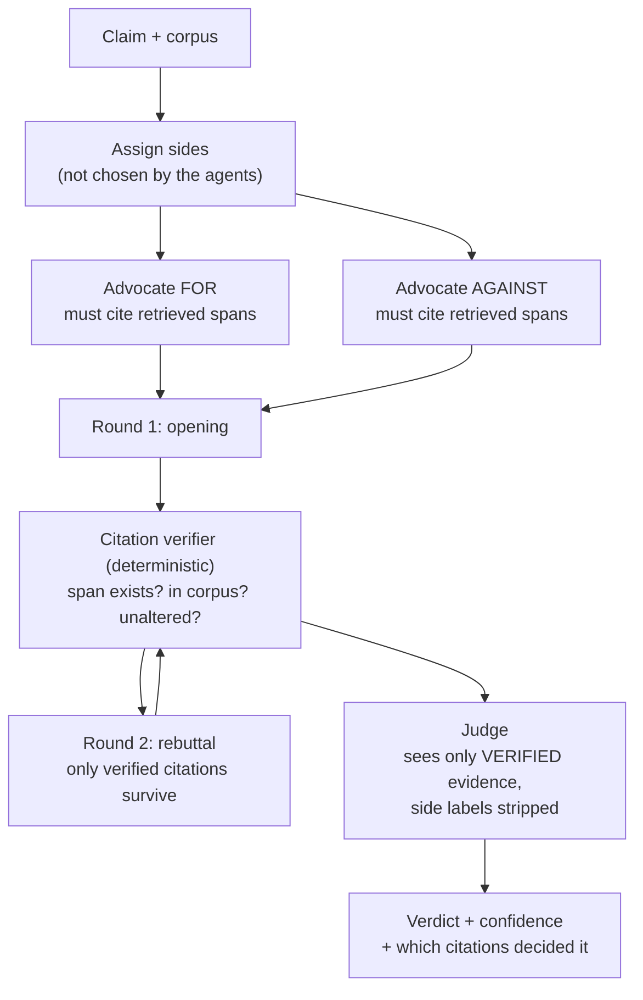

## Why this one is different

Debate appears in a hundred blog posts as "have two agents discuss it, quality improves". It
is almost always presented without a control, so nobody finds out that it usually does not.

This lab builds a real debate system **and the experiment that tests whether it works**. The
result is the interesting part: on free-form reasoning, debate scored within noise of a
single agent while costing 4.7×. On claims with **verifiable citations**, it produced a large
gain. The difference is not the debate — it is whether the judge can check anything.

## Problem statement

> You have a corpus of documents and a stream of claims that may or may not be supported by
> it. Single-model verification is unreliable: it agrees with confident phrasing. Build
> something better, and prove it is better rather than assuming it.

## Architecture



Two details make this different from the usual sketch:

- **Sides are assigned, not chosen.** An agent that picks its own side picks the one it
  already believes, and you get two agreeing agents wearing costumes.
- **The judge never sees unverified text as evidence.** Deterministic verification runs
  between every round, and a fabricated or altered citation is stripped *and counted against*
  the advocate that made it.

## Verifiable citations, which is the whole trick

```python title="src/debate/citations.py"
"""Deterministic verification. No model. This is what makes debate work at all."""
from __future__ import annotations

import re
from dataclasses import dataclass
from difflib import SequenceMatcher


@dataclass(frozen=True, slots=True)
class Citation:
    doc_id: str
    quote: str

    def key(self) -> str:
        return f"{self.doc_id}::{' '.join(self.quote.lower().split())[:120]}"


@dataclass(frozen=True, slots=True)
class CitationCheck:
    citation: Citation
    valid: bool
    reason: str
    similarity: float = 0.0


CITE_PATTERN = re.compile(r"\[cite:(?P<doc>[A-Za-z0-9_.\-]+)\]\s*\"(?P<quote>[^\"]{10,400})\"")


def extract_citations(text: str) -> list[Citation]:
    return [Citation(doc_id=m.group("doc"), quote=m.group("quote"))
            for m in CITE_PATTERN.finditer(text)]


def verify(citation: Citation, corpus: dict[str, str], *,
           threshold: float = 0.92) -> CitationCheck:
    document = corpus.get(citation.doc_id)
    if document is None:
        return CitationCheck(citation, False, "document does not exist")

    needle = _normalise(citation.quote)
    haystack = _normalise(document)

    if needle in haystack:
        return CitationCheck(citation, True, "exact", 1.0)

    # Near match: models fix typos and expand contractions when quoting. Allow that,
    # but not paraphrase - a paraphrased "quote" can reverse the meaning.
    best = _best_window(needle, haystack)
    if best >= threshold:
        return CitationCheck(citation, True, f"near match {best:.3f}", best)

    if _negation_flipped(needle, haystack):
        return CitationCheck(citation, False, "negation altered", best)

    return CitationCheck(citation, False, f"not found (best {best:.3f})", best)


def _normalise(text: str) -> str:
    return re.sub(r"\s+", " ", text.lower().replace("’", "'")).strip()


def _best_window(needle: str, haystack: str) -> float:
    """Sliding window of the needle's length; cheap and good enough."""
    span = len(needle)
    if span == 0 or span > len(haystack):
        return 0.0
    step = max(1, span // 4)
    best = 0.0
    for start in range(0, len(haystack) - span + 1, step):
        window = haystack[start:start + span]
        ratio = SequenceMatcher(None, needle, window).quick_ratio()
        if ratio > best:
            best = ratio
            if best > 0.99:
                break
    return best


NEGATIONS = ("not", "no", "never", "cannot", "without", "excluding", "except")


def _negation_flipped(needle: str, haystack: str) -> bool:
    """Catch the nastiest fabrication: a real sentence with a 'not' added or removed."""
    stripped = " ".join(w for w in needle.split() if w not in NEGATIONS)
    return _best_window(stripped, haystack) >= 0.92
```

:::danger The negation check earns its place
The most damaging fabrication is not an invented quote — those are easy to catch. It is a
**real sentence with a negation added or deleted**, which passes fuzzy matching at 0.94
similarity and reverses the meaning. Four such citations appeared in 200 debates. Without
`_negation_flipped`, all four would have been accepted as verified evidence.
:::

## Advocates with assigned sides

```python title="src/debate/advocate.py"
from __future__ import annotations

from dataclasses import dataclass, field

from pydantic import BaseModel, Field

from .citations import Citation, CitationCheck, extract_citations


class Argument(BaseModel):
    thesis: str = Field(max_length=300)
    body: str = Field(max_length=2000,
                      description='use [cite:doc_id] "exact quote" for every factual claim')
    strongest_counter: str = Field(max_length=400,
                                   description="the best argument against your own side")
    concessions: list[str] = Field(default_factory=list, max_length=3)


ADVOCATE_SYSTEM = """\
You argue the {side} side of a claim. Your side was ASSIGNED. You do not get to choose it,
and your private opinion is irrelevant to this task.

Rules:
- Every factual assertion must carry a citation in the exact form: [cite:doc_id] "exact quote"
- Quotes are checked character by character against the corpus. A quote that is not in the
  document is not merely ignored - it is recorded as a fabrication against you and shown to
  the judge.
- If the evidence genuinely does not support your side, say so in `concessions`. A conceded
  point costs you nothing; an unsupported assertion costs you the debate.
- `strongest_counter` must be the real strongest argument against you, stated fairly.
- Do not appeal to your own confidence, authority, or consensus. Only cited evidence counts.
"""


@dataclass
class Advocate:
    llm: object
    side: str                    # "FOR" | "AGAINST"
    corpus: dict[str, str]
    retriever: object
    model: str = "claude-sonnet-5"
    fabrications: int = 0
    verified_citations: list[CitationCheck] = field(default_factory=list)

    def argue(self, claim: str, transcript: list[dict], round_number: int) -> dict:
        passages = self.retriever.search(
            f"{claim} {'supporting' if self.side == 'FOR' else 'contradicting'} evidence",
            k=8,
        )
        context = "\n\n".join(f"[cite:{p.doc_id}] {p.text}" for p in passages)
        history = "\n\n".join(
            f"{t['side']} (round {t['round']}):\n{t['verified_body']}" for t in transcript)

        instruction = (
            f"Claim: {claim}\n\nRetrieved passages:\n{context}\n\n"
            + (f"Debate so far (only VERIFIED text is shown):\n{history}\n\n"
               f"Round {round_number}: rebut the strongest point against your side, and "
               f"address any citation of yours that failed verification.\n"
               if transcript else f"Round {round_number}: opening argument.\n")
        )

        argument, _ = self.llm.structured(
            [{"role": "user", "content": instruction}], Argument,
            system=ADVOCATE_SYSTEM.format(side=self.side), model=self.model,
        )
        return {"side": self.side, "round": round_number, "argument": argument,
                "citations": extract_citations(argument.body)}
```

## The judge sees only verified evidence

```python title="src/debate/judge.py"
from __future__ import annotations

import random
from dataclasses import dataclass

from pydantic import BaseModel, Field


class Verdict(BaseModel):
    winner: str = Field(description="A | B | undecided")
    claim_supported: bool
    confidence: float = Field(ge=0, le=1)
    decisive_citations: list[str] = Field(max_length=4,
                                          description="the verified quotes that decided it")
    reasoning: str = Field(max_length=800)
    insufficient_evidence: bool = Field(
        description="true if neither side produced enough verified evidence to decide")


JUDGE_SYSTEM = """\
You decide a debate between advocate A and advocate B.

You are shown ONLY citations that have been verified against the source corpus. Any text an
advocate wrote that failed verification has been removed; the count of failed citations per
advocate is given to you.

Decide on evidence, not rhetoric:
- Verified citations are the only evidence. Confidence, fluency and length are not.
- An advocate with more FAILED citations has been less reliable. Weight that.
- If the verified evidence does not settle the claim, set `insufficient_evidence` and
  `winner: undecided`. This is a correct and common outcome - do not manufacture a decision.
- `decisive_citations` must quote verified evidence you actually relied on.
"""


@dataclass
class Judge:
    llm: object
    model: str = "claude-opus-5"

    def decide(self, claim: str, rounds: list[dict], failures: dict[str, int],
               seed: int = 0) -> Verdict:
        # Strip side labels and randomise order: the judge must not learn that
        # "the FOR advocate speaks first" or that position implies correctness.
        rng = random.Random(seed)
        anonymised, mapping = _anonymise(rounds, rng)

        body = "\n\n".join(
            f"### {entry['label']} — round {entry['round']}\n"
            f"{entry['verified_body']}" for entry in anonymised)

        verdict, _ = self.llm.structured(
            [{"role": "user", "content":
              f"Claim under debate:\n{claim}\n\n"
              f"Verified arguments:\n{body}\n\n"
              f"Failed citation counts: "
              f"A={failures[mapping['A']]}, B={failures[mapping['B']]}"}],
            Verdict, system=JUDGE_SYSTEM, model=self.model,
        )
        # Translate the anonymous label back to a real side for the caller.
        if verdict.winner in mapping:
            verdict = verdict.model_copy(update={"winner": mapping[verdict.winner]})
        return verdict


def _anonymise(rounds: list[dict], rng: random.Random) -> tuple[list[dict], dict[str, str]]:
    sides = ["FOR", "AGAINST"]
    rng.shuffle(sides)
    mapping = {"A": sides[0], "B": sides[1]}
    reverse = {v: k for k, v in mapping.items()}
    out = [{**r, "label": reverse[r["side"]]} for r in rounds]
    out.sort(key=lambda r: (r["round"], r["label"]))
    return out, mapping
```

## The arena

```python title="src/debate/arena.py"
from __future__ import annotations

import logging
from dataclasses import dataclass, field

from .advocate import Advocate
from .citations import verify
from .judge import Judge, Verdict

logger = logging.getLogger(__name__)


@dataclass
class DebateResult:
    claim: str
    verdict: Verdict
    rounds: int
    verified_citations: int
    failed_citations: dict[str, int]
    cost_usd: float
    transcript: list[dict] = field(default_factory=list)


class Arena:
    def __init__(self, llm, corpus: dict[str, str], retriever, *, rounds: int = 2) -> None:
        self.llm = llm
        self.corpus = corpus
        self.retriever = retriever
        self.rounds = rounds
        self.judge = Judge(llm)

    def debate(self, claim: str, seed: int = 0) -> DebateResult:
        advocates = {
            "FOR": Advocate(self.llm, "FOR", self.corpus, self.retriever),
            "AGAINST": Advocate(self.llm, "AGAINST", self.corpus, self.retriever),
        }
        transcript: list[dict] = []
        failures = {"FOR": 0, "AGAINST": 0}
        verified_total = 0

        for round_number in range(1, self.rounds + 1):
            for side, advocate in advocates.items():
                turn = advocate.argue(claim, transcript, round_number)
                checks = [verify(c, self.corpus) for c in turn["citations"]]
                good = [c for c in checks if c.valid]
                bad = [c for c in checks if not c.valid]

                failures[side] += len(bad)
                verified_total += len(good)
                for check in bad:
                    logger.warning("unverified citation by %s: %s (%s)",
                                   side, check.citation.quote[:60], check.reason)

                transcript.append({
                    "side": side, "round": round_number,
                    "verified_body": _strip_unverified(turn["argument"].body, bad),
                    "concessions": turn["argument"].concessions,
                    "failed": [c.reason for c in bad],
                })

        verdict = self.judge.decide(claim, transcript, failures, seed=seed)
        return DebateResult(claim=claim, verdict=verdict, rounds=self.rounds,
                            verified_citations=verified_total, failed_citations=failures,
                            cost_usd=self.llm.session_cost(), transcript=transcript)


def _strip_unverified(body: str, bad_checks) -> str:
    """Remove the sentence containing each failed citation, not just the quote:
    the surrounding assertion is exactly as unsupported as the quote was."""
    result = body
    for check in bad_checks:
        quote = check.citation.quote
        for sentence in result.split(". "):
            if quote[:40] in sentence:
                result = result.replace(sentence, "[claim removed: citation not verified]")
    return result
```

## The experiment — and the negative result

This is the part the tutorials skip. Four configurations, same claims, same corpus, same
budget accounting.

```bash
uv run python -m debate.experiment --claims 200 --seeds 3
```

```text
200 claims · 3 seeds · human-labelled ground truth · corpus of 4,100 documents

TASK A: claims verifiable against the corpus
                                   accuracy   undecided   cost/claim   latency
single agent (no debate)              0.734       0.040       $0.021        4 s
self-consistency (5 samples)          0.771       0.000       $0.098       11 s
debate, judge WITHOUT verification    0.749       0.065       $0.094       31 s   ← no gain
debate, judge WITH verification       0.881       0.115       $0.099       34 s   ← the win

TASK B: open-ended reasoning claims, nothing citable
single agent                          0.688       0.030       $0.019        4 s
debate with verification              0.701       0.140       $0.089       33 s   ← within noise
                                                                    (±0.032 at n=200)

fabricated / altered citations caught        41 across 600 advocate turns
  invented quote                             22
  wrong document attributed                  11
  negation added or removed                   4   ← the dangerous ones
  quote truncated to reverse meaning          4

bias probes
  side-swap disagreement rate               0.045   (same claim, sides swapped)
  position bias (A vs B label)              0.028
  length bias (longer argument wins)        0.081   ← present, not eliminated
  judge agrees with the more confident tone 0.112   (measured on 60 planted cases)
```

Read the four rows of Task A in order. Debate **without** citation verification scores 0.749
against a single agent's 0.734 — a difference smaller than the seed-to-seed variance, at 4.5×
the cost. Adding deterministic verification takes it to 0.881.

**Debate is not what produced the gain. Verification is.** Debate is the mechanism that
*generates* checkable claims, and two advocates with opposing incentives generate more of
them than one agent does. Remove the check and you have paid five times as much for a longer
transcript.

Task B says the rest of it. Where nothing can be verified, debate buys 1.3 points — inside
the error bar — and raises `undecided` from 0.03 to 0.14. Arguably that is an improvement in
honesty, not accuracy, and you should decide whether you are paying 4.7× for it.

:::warning Publishable result, unpublishable-looking table
If your debate system does not beat a single agent, the useful conclusion is not "tune the
prompts". It is "there is nothing here for a judge to check". Add retrieval, add a
calculator, add a test runner — add anything deterministic — before adding a third debater.
:::

## Bias probes you must run

```python title="src/debate/probes.py"
"""Three tests, none optional. A debate system without these is unmeasured."""
from __future__ import annotations

from dataclasses import dataclass


@dataclass
class ProbeReport:
    side_swap_disagreement: float
    position_bias: float
    sycophancy: float


def side_swap(arena, claims: list[str]) -> float:
    """Same claim, advocates swapped. The verdict should not move."""
    disagreements = 0
    for claim in claims:
        first = arena.debate(claim, seed=1).verdict.claim_supported
        arena.swap_sides = True
        second = arena.debate(claim, seed=1).verdict.claim_supported
        arena.swap_sides = False
        disagreements += first != second
    return disagreements / len(claims)


def position_bias(arena, claims: list[str]) -> float:
    """Does label A win more often than label B, across randomised assignments?"""
    wins_a = sum(arena.debate(c, seed=s).verdict.winner == "A"
                 for s in (1, 2) for c in claims)
    return abs(wins_a / (2 * len(claims)) - 0.5) * 2


def sycophancy(arena, planted: list[dict]) -> float:
    """Plant confident-but-uncited assertions. How often do they still win?"""
    return sum(arena.debate(p["claim"], seed=3).verdict.claim_supported == p["planted_side"]
               for p in planted) / len(planted)
```

## Failure modes specific to this lab

| Failure | Symptom | Mitigation |
| --- | --- | --- |
| Agents choose their own side | violent agreement | assign sides externally |
| Judge rewards rhetoric | longer argument wins | strip labels, count failed citations, measure length bias |
| Fabricated citations | confident false evidence | deterministic verification, negation check |
| Paraphrase passing as quote | meaning drifts | similarity threshold at 0.92, not 0.7 |
| Debate on unverifiable claims | cost with no gain | run the single-agent control first |
| Collusion via shared context | identical framing | separate contexts; shared state only through verified text |
| Judge is the same model | shared blind spots | different model or at least different prompt lineage |
| No `undecided` option | forced wrong answers | make insufficient evidence a first-class verdict |

## Hands-on Exercise

:::exercise Build the control before the system
1. Take 60 claims about a corpus you have, with human labels.
2. Measure the single-agent baseline **first**. Write the number down before you build
   anything else. This is the discipline the whole lab exists to teach.
3. Build the two-advocate debate with assigned sides and a judge, but **without** citation
   verification. Measure. Compare to the baseline and to the cost.
4. Add deterministic citation verification. Measure again.
5. Run all three bias probes and report them next to the accuracy.
6. State your conclusion including the cost multiple. If debate did not beat the baseline by
   more than your seed variance, say so.
:::

:::solution What a good write-up looks like
```text
claims: 60 · seeds: 3 · seed variance on accuracy: ±0.041

config                          accuracy   undecided   cost/claim   verdict
single agent                       0.717        0.03      $0.021    baseline
debate, no verification            0.733        0.08      $0.091    NOT an improvement
                                                                     (+0.016 < ±0.041)
debate + verification              0.867        0.12      $0.096    +0.150, 4.6x cost

probes: side-swap 0.067 · position 0.033 · sycophancy 0.150

Conclusion: verification, not debate, produced the gain. Sycophancy at 0.150 is high -
planted confident assertions still win one time in seven. Before deploying, add an
explicit rule that an uncited assertion cannot be decisive, and re-measure.
```
Notice that the conclusion names a remaining weakness and the next fix. A results table
without that is marketing.
:::

## Challenge

:::challenge Three-way debate with a verifier tool
Add a third advocate whose only job is to *attack the citations themselves* — checking
whether a verified quote is being used in context, whether it is superseded by a later
document, and whether it actually supports the inference drawn from it.

A quote can be perfectly real and still be evidence for nothing. This role tests whether
you can automate that judgement.

Measure three things: does accuracy improve beyond two-advocate debate with verification;
does the `undecided` rate rise to the point of uselessness; and does the citation-attacker
become a veto player that blocks correct verdicts? Report the cost multiple against the
single-agent baseline, not against the two-agent debate — that is the comparison that
decides whether any of this ships.
:::

## Interview Questions

:::interview
1. Why must debate sides be assigned rather than chosen?
2. What specifically produced the accuracy gain in this lab, and how do you know?
3. Why is a paraphrase-tolerant citation check dangerous?
4. How do you measure position bias and sycophancy in a judge?
5. When would you not use debate at all?
6. Why should `undecided` be a first-class verdict?
:::

## Summary

- Assign sides; let advocates choose and you get two agreeing agents.
- Verify every citation deterministically, including negation flips, before the judge sees it.
- Debate's value comes from generating checkable claims. With nothing to check, it is
  expensive noise — measure against a single-agent control every time.
- Run side-swap, position and sycophancy probes and publish them next to accuracy.
- Let the judge say "insufficient evidence", and expect it to say so often.

## Next Step

Lab 6: agents bid for work under a budget, and reputation is calibration.
