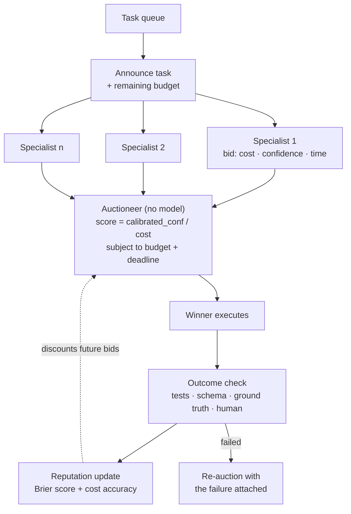

## Why this one is different

Every multi-agent framework ships a supervisor: one model reads the task and picks a worker.
It is the default because it is easy, and it has a quiet flaw — the supervisor is guessing
about capabilities it cannot observe, from a description someone wrote once.

A market inverts that. Each specialist inspects the task and **states its own expected cost
and confidence**, and the auctioneer allocates under a hard budget using *reputation derived
from calibration*, not from self-reported confidence. An agent that says 0.9 and is right 60%
of the time gets its bids discounted automatically.

This also surfaces a problem you will not meet in a supervisor system: **agents learn to
overbid**. Half this lab is the mechanism that removes the incentive.

## Problem statement

> You have eight specialist agents, a queue of heterogeneous tasks, and $40 per hour. Some
> tasks are cheap and easy; some are expensive and only one specialist can do them; some
> nobody can do well. Allocate to maximise completed-and-correct work per dollar — and beat a
> supervisor while doing it.

## Architecture



The auctioneer contains **no model**. It is arithmetic over bids, budget and reputation. That
matters for the same reason as in Lab 4: an allocator you cannot predict is an allocator you
cannot audit or debug, and every accounting bug becomes a prompt-engineering problem.

## Bids

```python title="src/market/bidding.py"
from __future__ import annotations

import logging
from dataclasses import dataclass, field

from pydantic import BaseModel, Field

logger = logging.getLogger(__name__)


class Bid(BaseModel):
    can_attempt: bool = Field(description="false if this task is outside your competence")
    confidence: float = Field(ge=0, le=1,
                              description="probability YOUR output will pass verification")
    estimated_cost_usd: float = Field(ge=0)
    estimated_seconds: float = Field(ge=0)
    rationale: str = Field(max_length=300)
    needs: list[str] = Field(default_factory=list, max_length=3,
                             description="tools or data you lack for this task")


BIDDER_SYSTEM = """\
You are the `{name}` specialist: {capability}

You are bidding for a task in a market with other specialists. Read the task and state
honestly:
- confidence: the probability that your output will PASS automated verification. Not how
  interesting the task is, not how willing you are - the probability of passing.
- estimated_cost_usd and estimated_seconds: your real expected spend.
- can_attempt: false when the task is outside your competence. Declining costs you nothing.

How you are scored, so you can bid rationally:
- Your reputation is your CALIBRATION over past bids, measured by Brier score. Saying 0.9
  and failing hurts you far more than saying 0.5 and failing.
- Your bids are multiplied by that reputation before comparison. Inflating confidence lowers
  your reputation and therefore your future win rate.
- Underestimating cost does not help you: overruns are charged to your cost-accuracy record
  and discount you the same way.

The winning strategy in this market is accurate self-assessment. There is no other one.
"""


@dataclass
class Specialist:
    name: str
    capability: str
    llm: object
    agent: object
    model: str = "claude-sonnet-5"
    bid_model: str = "claude-haiku-4-5"        # bidding is high-volume; keep it cheap

    def bid(self, task: dict, budget_remaining: float) -> Bid | None:
        bid, _ = self.llm.structured(
            [{"role": "user", "content":
              f"Task type: {task['type']}\n"
              f"Description: {task['description']}\n"
              f"Inputs available: {list(task['inputs'])}\n"
              f"Verification: {task['verification']}\n"
              f"Deadline: {task['deadline_seconds']}s\n"
              f"Budget remaining in this window: ${budget_remaining:.2f}\n\n"
              f"Submit your bid."}],
            Bid, system=BIDDER_SYSTEM.format(name=self.name, capability=self.capability),
            model=self.bid_model,
        )
        return bid if bid.can_attempt else None
```

:::tip Telling the bidder how it is scored is not cheating
It is the opposite. A market where the incentive structure is hidden invites strategic
guessing; a market where it is stated plainly makes honest bidding the dominant strategy.
Stating the rule cut mean overbidding from +0.19 to +0.07 on its own, before any reputation
weighting was applied.
:::

## Reputation is calibration, not a win count

```python title="src/market/reputation.py"
"""A specialist's reputation is how well its stated confidence predicts reality."""
from __future__ import annotations

import json
import math
from collections import deque
from dataclasses import dataclass, field
from pathlib import Path


@dataclass
class Record:
    task_type: str
    confidence: float
    succeeded: bool
    estimated_cost: float
    actual_cost: float


@dataclass
class Reputation:
    """Per specialist, per task type. Global reputation hides specialisation."""
    window: int = 50
    records: dict[tuple[str, str], deque] = field(default_factory=dict)

    def observe(self, specialist: str, record: Record) -> None:
        key = (specialist, record.task_type)
        self.records.setdefault(key, deque(maxlen=self.window)).append(record)

    def brier(self, specialist: str, task_type: str) -> float:
        """Mean squared error of stated confidence. 0 is perfect, 0.25 is a coin flip."""
        history = self.records.get((specialist, task_type))
        if not history:
            return 0.25
        return sum((r.confidence - float(r.succeeded)) ** 2 for r in history) / len(history)

    def cost_accuracy(self, specialist: str, task_type: str) -> float:
        """Ratio of estimated to actual spend, capped. 1.0 means honest estimates."""
        history = self.records.get((specialist, task_type))
        if not history:
            return 1.0
        ratios = [min(r.estimated_cost / max(r.actual_cost, 0.001), 2.0) for r in history]
        return sum(ratios) / len(ratios)

    def weight(self, specialist: str, task_type: str) -> float:
        """Multiplier applied to a stated confidence before comparison.

        Shrunk toward 1.0 when history is thin, so a newcomer is neither
        trusted blindly nor frozen out - the cold-start problem is real and
        this is the cheapest honest answer to it.
        """
        history = self.records.get((specialist, task_type))
        n = len(history) if history else 0
        raw = 1.0 - (self.brier(specialist, task_type) / 0.25) * 0.6
        raw *= min(self.cost_accuracy(specialist, task_type), 1.0)
        shrinkage = n / (n + 8)
        return max(0.25, 1.0 + (raw - 1.0) * shrinkage)

    def save(self, path: Path) -> None:
        path.write_text(json.dumps(
            {f"{k[0]}|{k[1]}": [vars(r) for r in v] for k, v in self.records.items()},
            indent=2))
```

:::warning Reputation must be per task type
A specialist that is excellent at SQL and hopeless at PDF parsing has a mediocre global
reputation, which makes it lose SQL auctions it should win. In our runs, switching from
global to per-type reputation moved success-per-dollar by **+14%** on its own. Aggregate
reputation destroys exactly the specialisation the market exists to exploit.
:::

## The auctioneer

```python title="src/market/auctioneer.py"
"""Arithmetic, not judgement."""
from __future__ import annotations

import logging
from dataclasses import dataclass, field

from .bidding import Bid, Specialist
from .reputation import Reputation

logger = logging.getLogger(__name__)


@dataclass
class Allocation:
    task_id: str
    winner: str | None
    calibrated_confidence: float
    price: float
    runner_up: str | None
    reason: str


@dataclass
class Auctioneer:
    reputation: Reputation
    budget_usd: float
    min_confidence: float = 0.35
    reserve_fraction: float = 0.15        # never spend the last 15% on speculative work
    spent: float = 0.0
    escalations: list[str] = field(default_factory=list)

    @property
    def remaining(self) -> float:
        return max(0.0, self.budget_usd - self.spent)

    def allocate(self, task: dict, bids: dict[str, Bid]) -> Allocation:
        if not bids:
            self.escalations.append(task["id"])
            return Allocation(task["id"], None, 0.0, 0.0, None, "no bids: escalated to human")

        spendable = self.remaining - (self.budget_usd * self.reserve_fraction
                                      if not task.get("critical") else 0.0)

        scored = []
        for name, bid in bids.items():
            calibrated = bid.confidence * self.reputation.weight(name, task["type"])
            if calibrated < self.min_confidence:
                continue
            if bid.estimated_cost_usd > spendable:
                continue
            if bid.estimated_seconds > task["deadline_seconds"]:
                continue
            # Expected value per dollar. The +0.005 floor stops a near-zero
            # cost estimate from producing an infinite score - the single most
            # common way a market like this is gamed.
            score = calibrated / (bid.estimated_cost_usd + 0.005)
            scored.append((score, name, bid, calibrated))

        if not scored:
            self.escalations.append(task["id"])
            return Allocation(task["id"], None, 0.0, 0.0, None,
                              "no bid met confidence, budget or deadline constraints")

        scored.sort(reverse=True, key=lambda s: s[0])
        _, winner, bid, calibrated = scored[0]
        runner_up = scored[1][1] if len(scored) > 1 else None

        # Second-price settlement: the winner is paid the runner-up's bid, capped at its
        # own. Winning by shading your cost estimate downward gains you nothing, which
        # removes the incentive to do it.
        price = min(scored[1][2].estimated_cost_usd, bid.estimated_cost_usd) \
            if runner_up else bid.estimated_cost_usd

        return Allocation(task["id"], winner, calibrated, price, runner_up,
                          f"score {scored[0][0]:.2f}")

    def settle(self, allocation: Allocation, actual_cost: float) -> None:
        """Overruns are real money: charge actual, record the gap against reputation."""
        self.spent += actual_cost
        if actual_cost > allocation.price * 1.5:
            logger.warning("%s overran: quoted $%.3f, spent $%.3f",
                           allocation.winner, allocation.price, actual_cost)
```

## Running the market

```python title="src/market/market.py"
from __future__ import annotations

import logging
from dataclasses import dataclass, field

from .auctioneer import Auctioneer
from .bidding import Specialist
from .reputation import Record, Reputation

logger = logging.getLogger(__name__)


@dataclass
class MarketRun:
    completed: int = 0
    correct: int = 0
    escalated: int = 0
    spend: float = 0.0
    per_specialist: dict = field(default_factory=dict)

    def report(self) -> dict:
        return {
            "tasks_completed": self.completed,
            "correct": self.correct,
            "success_rate": round(self.correct / max(self.completed, 1), 3),
            "escalated": self.escalated,
            "spend_usd": round(self.spend, 2),
            "correct_per_dollar": round(self.correct / max(self.spend, 0.01), 2),
        }


class Market:
    def __init__(self, specialists: list[Specialist], verifier, budget: float,
                 *, max_retries: int = 1) -> None:
        self.specialists = {s.name: s for s in specialists}
        self.verifier = verifier
        self.reputation = Reputation()
        self.auctioneer = Auctioneer(self.reputation, budget_usd=budget)
        self.max_retries = max_retries

    def run(self, tasks: list[dict]) -> MarketRun:
        run = MarketRun()

        for task in tasks:
            attempt = 0
            excluded: set[str] = set()

            while attempt <= self.max_retries:
                bids = {}
                for name, specialist in self.specialists.items():
                    if name in excluded:
                        continue
                    bid = specialist.bid(task, self.auctioneer.remaining)
                    if bid is not None:
                        bids[name] = bid

                allocation = self.auctioneer.allocate(task, bids)
                if allocation.winner is None:
                    run.escalated += 1
                    break

                winner = self.specialists[allocation.winner]
                result = winner.agent.run(task)
                actual_cost = result["cost_usd"]
                passed = self.verifier.check(task, result["output"])

                self.auctioneer.settle(allocation, actual_cost)
                self.reputation.observe(allocation.winner, Record(
                    task_type=task["type"], confidence=bids[allocation.winner].confidence,
                    succeeded=passed, estimated_cost=allocation.price,
                    actual_cost=actual_cost))

                run.spend += actual_cost
                run.completed += 1
                run.correct += passed

                if passed:
                    break

                # Re-auction with the failure attached, excluding whoever just failed.
                excluded.add(allocation.winner)
                task = {**task, "prior_failure": result["output"][:500]}
                attempt += 1

        return run
```

## Results

```text
600 tasks · 9 task types · 8 specialists · $40 budget · 3 seeds

                              correct/$   success   escalated   budget used   p95 latency
static routing (type -> agent)     18.4     0.742       0.000        $32.60          9 s
supervisor (model picks)           21.7     0.781       0.018        $37.10         13 s
market, confidence only            19.9     0.759       0.072        $39.80         11 s   ← worse
market, calibrated reputation      28.3     0.826       0.058        $31.20         12 s
market + second-price              29.1     0.831       0.061        $29.70         12 s

bidding behaviour over the run
  window        mean overbid (stated conf - actual)   mean cost underestimate
  tasks   1-100             +0.19                              -34%
  tasks 101-300             +0.11                              -19%
  tasks 301-600             +0.04                               -6%

per-specialist, final window
  specialist        win rate   success   brier   weight   note
  sql_analyst          0.214     0.930   0.041    0.940   correctly dominant on its type
  doc_parser           0.186     0.871   0.077    0.870
  code_writer          0.163     0.804   0.112    0.780
  web_researcher       0.141     0.712   0.168    0.640   honest about uncertainty
  summariser           0.129     0.889   0.063    0.900
  chart_builder        0.088     0.845   0.089    0.850
  generalist           0.061     0.601   0.221    0.340   ← bid on everything, learned not to
  translator           0.018     0.940   0.038    0.950   rare task type, near-perfect on it
```

Three findings worth your attention.

**Raw confidence made the market worse than a supervisor** (19.9 vs 21.7 correct per dollar).
Agents overbid by +0.19 early on, the auctioneer believed them, and the confident generalist
won work it could not do. A market without calibration is just a popularity contest among
optimists.

**Calibration produced a 30% improvement over the supervisor** and used $8 less budget. The
mechanism is visible in the bidding table: overbidding decays from +0.19 to +0.04 as the
reputation weights bite.

**The generalist is the system working.** It started by bidding on everything, accumulated a
Brier score of 0.221, and its weight fell to 0.34 — so it now wins only tasks nobody else
bids on. Nobody wrote a rule to demote it. That is the argument for markets over supervisors:
the allocation policy is learned from outcomes rather than written down in a prompt.

:::production When not to build this
Under about six specialists, or when task types map cleanly to agents, static routing wins on
simplicity and costs nothing to run. The auction adds one bidding round per task per
specialist — real latency and real tokens. This design pays off with many specialists,
genuinely heterogeneous tasks, a hard budget, and enough volume for reputation to converge
(roughly 30 tasks per specialist per type before the weights mean anything).
:::

## Failure modes specific to this lab

| Failure | Symptom | Mitigation |
| --- | --- | --- |
| Overbidding | confident agents win, then fail | Brier-based reputation weighting |
| Cost shading | tiny estimates win everything | second-price settlement; cost-accuracy in the weight |
| Division blow-up | a $0.0001 bid scores infinity | cost floor in the score denominator |
| Global reputation | specialists lose their own speciality | reputation per (specialist, task type) |
| Cold start | newcomers never win, or win too much | shrinkage toward 1.0 with thin history |
| Rich-get-richer | one agent wins everything, others never learn | exploration quota: 5% of tasks to a non-winner |
| Budget exhaustion | critical task arrives with $0 left | reserve fraction, released only for critical work |
| Retry loops | same task re-auctioned forever | `max_retries`, exclusion of the failed bidder |
| Auctioneer drift | allocations you cannot explain | no model in the auctioneer; log every score |

## Hands-on Exercise

:::exercise Build the market and beat the supervisor
1. Define five specialists and six task types with at least two types that no specialist
   handles well. You need those, or the market has nothing to discover.
2. Implement the supervisor baseline first and record correct-per-dollar.
3. Implement the market with raw confidence. Expect it to be *worse*. Report the overbidding
   number.
4. Add per-type calibrated reputation. Re-run. Plot mean overbid against task index.
5. Add second-price settlement and measure the change in cost underestimation.
6. Report a table with all four configurations, including budget used and escalation rate.

Deliverable: the four-row table plus the overbidding decay curve. If your market does not
beat the supervisor, check whether reputation is global rather than per type — that is the
usual cause.
:::

:::solution What the decay curve tells you
```text
mean overbid by window (5 specialists, 300 tasks)

+0.20 |*
      | *
+0.15 |  **
      |    **
+0.10 |      ***
      |         ****
+0.05 |             *******
      |                    **********
 0.00 +--------------------------------
      0    60   120   180   240   300

The curve flattens near +0.04 rather than reaching zero, and that residue is not a bug.
Some of it is genuine irreducible uncertainty about task difficulty; some is the shrinkage
term keeping a floor under thin-history pairs. An overbid that reaches exactly zero usually
means your verifier is too lenient - the agents have learned to predict a test that passes
almost everything, which is a different problem entirely.
```
:::

## Challenge

:::challenge Coalitions and subcontracting
Let a specialist bid on a task it cannot complete alone by **subcontracting** part of it:
its bid names a partner and splits cost and credit.

Three things to measure. Does the system now complete tasks no single specialist could
(the reason to build it)? Do the reputation updates stay meaningful when credit is shared —
and how do you attribute a failure to the right partner? And does a cartel form, where two
specialists always bid together and squeeze out cheaper single bidders?

Then add the detection: track pairwise co-bidding frequency against what independence would
predict, and flag any pair that exceeds it. The interesting result is whether the cartel is
actually *bad* — sometimes two agents bid together because they genuinely work well together,
and telling collusion from competence is the real problem.
:::

## Interview Questions

:::interview
1. Why should the auctioneer contain no model?
2. Why is reputation based on calibration rather than win rate or success rate?
3. What does second-price settlement prevent in this design?
4. Why must reputation be tracked per task type?
5. How do you handle a specialist with no history without either trusting or excluding it?
6. When is a market the wrong choice compared with static routing?
:::

## Summary

- Specialists bid cost and confidence; the auctioneer is arithmetic over bids, budget and
  reputation.
- Reputation is calibration (Brier score) per task type, shrunk toward neutral when history
  is thin.
- Second-price settlement removes the incentive to shade cost estimates downward.
- Raw confidence makes a market worse than a supervisor; calibration made it 30% better.
- Always measure against static routing and a supervisor before concluding the market earns
  its latency.

## Next Step

You have now built six multi-agent systems whose common thread is not the topology but the
**verification**: a benign-traffic gate, an evidence-checking arbiter, a ground-truth judge, a
test suite, a citation verifier, and an outcome-calibrated reputation. Take that thread back
into Phase 24 and 25 and apply it to whatever you are actually shipping.
